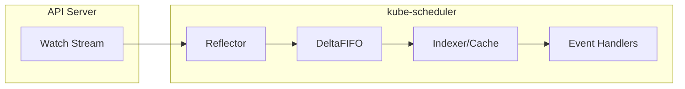
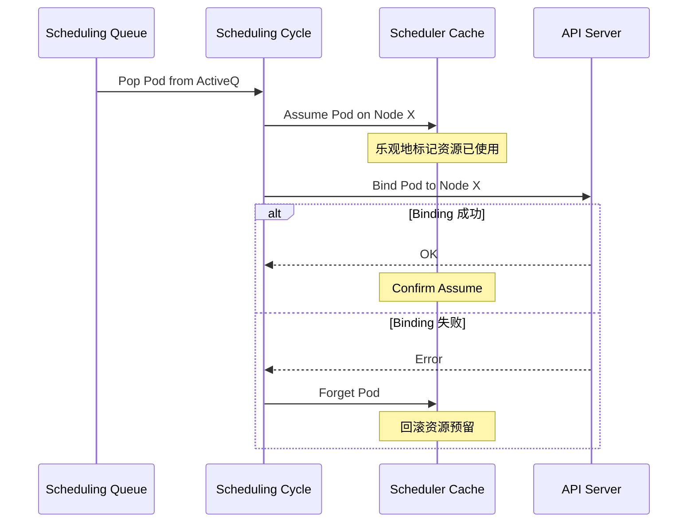
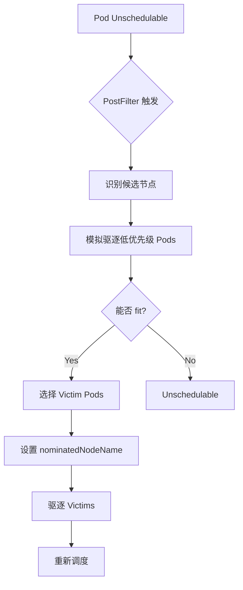
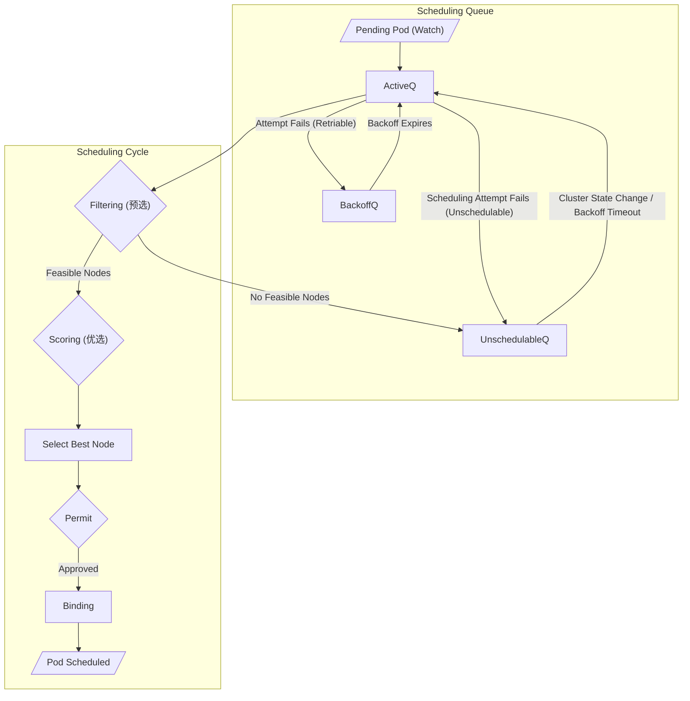
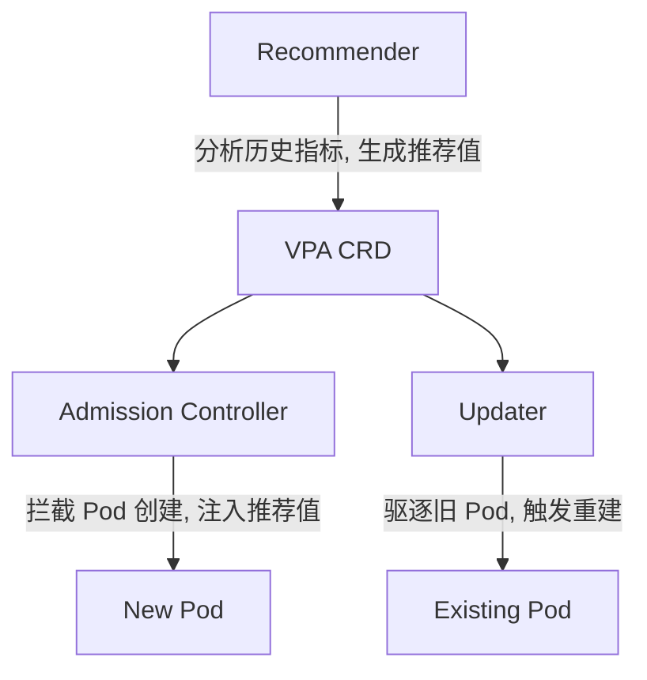

## 1. 本周核心目标

在 Week 01 完成集群初始化, Week 02 构建流量治理体系后, 本周将深入 Kubernetes 的 **资源管理与调度内核**. 理解这些机制是实现稳定, 高效, 可预测集群行为的关键.

### 1.1 本周任务清单
1.  **资源隔离**: 理解 QoS 分类逻辑及其内核实现 (Cgroups).
2.  **调度深潜**: 掌握 kube-scheduler 的 Filtering/Scoring 插件架构与调度框架扩展点.
3.  **弹性伸缩**: 深入 HPA 算法, VPA 组件架构与 Cluster Autoscaler 的节点扩缩逻辑.
4.  **实战演练**: 配置 PDB, 自定义 HPA 指标, 模拟 Descheduler 重调度.

---

## 2. Scheduler Informer Cache 架构

kube-scheduler 不直接查询 API Server 获取节点和 Pod 信息, 而是使用 **Informer Cache** 维护本地副本.

### 2.1 SharedInformer 工作原理



*   **Reflector**: 建立 Watch 连接, 接收事件流.
*   **DeltaFIFO**: 事件去重与排序, 确保顺序一致性.
*   **Indexer**: 支持多索引的本地缓存 (如按 Node, Namespace 索引).
*   **Watch 多路复用**: 多个 Informer 共享同一 Watch 连接, 减少 API Server 压力.

### 2.2 Scheduler Cache 与乐观并发



*   **Assume 机制**: 调度决策后立即更新缓存, 不等待 Binding 完成.
*   **Forget 机制**: Binding 失败时回滚缓存, 重新调度.
*   **优势**: 提高调度吞吐量, 支持高并发调度.

---

## 3. Priority 与 Preemption 内核机制

### 3.1 PriorityClass 定义

```yaml
apiVersion: scheduling.k8s.io/v1
kind: PriorityClass
metadata:
  name: high-priority
value: 1000000
globalDefault: false
preemptionPolicy: PreemptLowerPriority  # 或 Never
description: "用于关键业务工作负载"
```

*   **value**: 优先级数值, 值越大优先级越高.
*   **preemptionPolicy**: `PreemptLowerPriority` (允许抢占) 或 `Never` (禁止抢占).
*   **系统保留**: `system-cluster-critical` (2000000000), `system-node-critical` (2000001000).

### 3.2 抢占算法流程



*   **Victim 选择**: 驱逐最少数量的最低优先级 Pod.
*   **PDB 尊重**: 抢占会检查 PodDisruptionBudget, 尽量不违反.
*   **Nominated Node**: 被抢占节点会被标记, 优先接收抢占 Pod.

### 3.3 优先级与调度的交互

| 场景 | 行为 |
| :--- | :--- |
| 高优先级 Pod Pending | 触发 Preemption, 驱逐低优先级 Pod |
| 资源充足 | 按优先级排序调度, 高优先级先处理 |
| Cluster Autoscaler | 高优先级 Pod 立即触发扩容, 低优先级可能等待 |

---

## 4. 内存管理深度剖析

### 4.1 Kubernetes 内存类型

| 类型 | 描述 | Cgroup 控制 |
| :--- | :--- | :--- |
| **RSS** | 进程实际占用的物理内存 | `memory.current` |
| **Page Cache** | 文件缓存, 可回收 | 包含在 `memory.current` |
| **Swap** | 交换空间 | `memory.swap.max` (V2) |
| **Kernel Memory** | 内核数据结构 | V2 统一计入 `memory.current` |

### 4.2 Memory QoS (Cgroups V2)

```bash
# 查看内存 QoS 配置
cat /sys/fs/cgroup/kubepods/pod<uid>/memory.low   # 软保护下限
cat /sys/fs/cgroup/kubepods/pod<uid>/memory.high  # 限流阈值
cat /sys/fs/cgroup/kubepods/pod<uid>/memory.max   # 硬上限 (OOM)
```

*   **memory.low**: 当系统内存紧张时, 优先保留此值以下的内存.
*   **memory.high**: 触及此值时开始回收, 进程可能变慢但不会被 killed.
*   **memory.max**: 硬上限, 超过触发 OOM Killer.

### 4.3 OOM Killer 行为分析

```bash
# 查看 OOM Score
cat /proc/<pid>/oom_score       # 当前得分
cat /proc/<pid>/oom_score_adj   # 调整值 (-1000 到 1000)

# Kubelet 设置的 oom_score_adj
# Guaranteed: -997
# Burstable: -500 到 -997 (按比例)
# BestEffort: 1000
```

*   **OOM 选择**: 选择 oom_score 最高的进程 kill.
*   **容器行为**: 容器内 OOM 默认杀死容器主进程, 触发 Pod 重启.

---

## 5. 资源隔离的基石: QoS 与 Cgroups 深度剖析

Kubernetes 对计算资源的管控建立在 Linux 内核 **Cgroups (Control Groups)** 之上. 抽象层面, 它表现为 **QoS (Quality of Service)** 等级.

### 2.1 QoS 分类逻辑与内核映射

Kubelet 根据 Pod Spec 中的 `requests` 和 `limits` 自动计算 QoS 等级:

| QoS 等级 | 判定条件 | OOM Score Adjust | 内核行为 |
| :--- | :--- | :--- | :--- |
| **Guaranteed** | 所有容器的 `requests == limits` (CPU 和 Memory) | -997 | 资源严格预留, OOM 优先级最低 |
| **Burstable** | 至少一个容器设置了 `requests < limits` | -500~-997 (按比例) | 允许突发, 资源紧张时可能被压缩 |
| **BestEffort** | 所有容器均未设置任何 `requests` 或 `limits` | +1000 | 无资源保障, OOM Killer 首选目标 |

*   **OOM Score Adjust**: Linux 内核的 OOM Killer 根据进程的 `oom_score_adj` 值决定杀死顺序. 值越高, 越容易被杀死. Kubelet 通过调整此值实现 QoS 优先级.
*   **路径**: `/proc/<pid>/oom_score_adj`

### 2.2 CPU 限制: CFS Bandwidth Controller

Linux **CFS (Completely Fair Scheduler)** 通过一个周期性的 "令牌桶" 机制实现 CPU 限流.

*   **核心参数**:
    *   `cpu.cfs_period_us`: 周期长度 (默认 100000us = 100ms).
    *   `cpu.cfs_quota_us`: 周期内允许使用的 CPU 时间片. 例如, `limits.cpu: 500m` 对应 `quota = 50000us`.

*   **Throttling 原理**:
    当容器在一个周期内消耗完所有配额后, 即使宿主机 CPU 闲置, CFS 也会将该容器的所有线程置于 "Throttled" 状态, 直到下一周期开始. 这会导致请求延迟 (Latency) 飙升.

*   **诊断命令**:
    ```bash
    # 定位 Pod 对应的 Cgroup 路径 (Cgroup V2)
    CGROUP_PATH=$(crictl inspect <container_id> | jq -r '.info.runtimeSpec.linux.cgroupsPath')
    
    # 查看 Throttle 统计
    cat /sys/fs/cgroup/$CGROUP_PATH/cpu.stat
    # 关注: nr_throttled (被限流的次数), throttled_usec (总限流时长)
    ```

*   **缓解策略**:
    1.  **增大 `limits.cpu`**: 最直接的方法, 但可能导致资源浪费.
    2.  **仅设置 `requests` (不设 `limits`)**: 允许容器无上限突发. 适用于批处理任务, 但在密集调度场景可能引发 Noisy Neighbor 问题.
    3.  **调整 `cfs_period`**: 缩短周期 (如 5ms) 可减少单次 Throttle 的时长, 但会增加调度开销. 需在 Kubelet 层面配置.

### 2.3 Memory 限制: OOM Killer 与 Memory Pressure

*   **硬限制 (`memory.max` in Cgroup V2)**: 当容器内存使用触及此值, 内核直接触发 OOM Killer 杀死容器内进程.
*   **软限制 (`memory.high`)**: 触及此值时, 内核会尝试回收内存 (Page Cache), 并可能触发 Memory Pressure 事件.

*   **Kubelet Eviction**:
    当节点整体内存紧张时 (触及 `memory.available < eviction-hard` 阈值), Kubelet 会根据 Pod 的 QoS 等级和实际内存使用量进行驱逐 (Eviction). BestEffort 首当其冲.

---

## 3. 调度引擎深度解析: kube-scheduler

kube-scheduler 是一个独立的控制面组件, 负责将 `Pending` 状态的 Pod 绑定到合适的 Node.

### 3.1 调度核心流程



1.  **调度队列 (Scheduling Queue)**:
    *   **ActiveQ**: 待调度 Pod 的主队列.
    *   **BackoffQ**: 调度尝试失败后, 需要退避等待的 Pod.
    *   **UnschedulableQ**: 当前集群状态下无法调度的 Pod (如资源不足).

2.  **调度周期 (Scheduling Cycle)**:
    *   **Filtering (预选)**: 过滤不满足条件的节点 (硬约束). 例如: 节点资源不足, Taint 不匹配.
    *   **Scoring (优选)**: 对剩余节点打分, 选择最优 (软偏好). 例如: 镜像已存在, 节点负载较低.

### 3.2 调度框架 (Scheduling Framework) 扩展点

Kubernetes 1.15+ 引入了 **Scheduling Framework**, 将调度逻辑拆分为多个可插拔的扩展点:

| Extension Point | 阶段 | 作用 |
| :--- | :--- | :--- |
| **PreFilter** | Filtering 前 | 预处理 Pod 信息, 检查是否可调度 |
| **Filter** | Filtering | 检查节点是否满足 Pod 的硬约束 |
| **PostFilter** | Filtering 后 | Filtering 全部失败后尝试抢占 (Preemption) |
| **PreScore** | Scoring 前 | 预处理 Scoring 阶段所需数据 |
| **Score** | Scoring | 为节点打分 |
| **NormalizeScore** | Scoring 后 | 归一化分数 |
| **Reserve** | Binding 前 | 预留资源 (乐观锁) |
| **Permit** | Binding 前 | 批准/拒绝/等待绑定 |
| **PreBind** | Binding | 绑定前预处理 (如挂载 PV) |
| **Bind** | Binding | 执行绑定 |
| **PostBind** | Binding 后 | 清理或通知 |

### 3.3 核心调度插件

| 插件名称 | 扩展点 | 功能 |
| :--- | :--- | :--- |
| **NodeResourcesFit** | Filter, Score | 检查节点 CPU/Memory 是否满足 Pod requests |
| **NodeAffinity** | Filter, Score | 处理 `nodeSelector` 和 `nodeAffinity` |
| **PodTopologySpread** | Filter, Score | 实现 `topologySpreadConstraints` (跨 AZ 分布) |
| **TaintToleration** | Filter, Score | 处理 Taints 和 Tolerations |
| **ImageLocality** | Score | 优先选择已下载 Pod 所需镜像的节点 |
| **InterPodAffinity** | Filter, Score | 处理 Pod 亲和性/反亲和性 |

### 3.4 生产级调度策略

#### 1. 节点亲和性 (Node Affinity)
处理 Pod 与节点硬件拓扑 (GPU, SSD) 的物理绑定:
```yaml
affinity:
  nodeAffinity:
    requiredDuringSchedulingIgnoredDuringExecution:
      nodeSelectorTerms:
      - matchExpressions:
        - key: node.kubernetes.io/instance-type
          operator: In
          values:
          - gpu-a100
```

#### 2. Pod 拓扑分布 (Topology Spread Constraints)
实现跨可用区 (AZ) 的高可用均匀分布:
```yaml
topologySpreadConstraints:
- maxSkew: 1
  topologyKey: topology.kubernetes.io/zone
  whenUnsatisfiable: DoNotSchedule
  labelSelector:
    matchLabels:
      app: web-frontend
```
*   `maxSkew`: 允许的最大不均衡度.
*   `topologyKey`: 定义拓扑域 (节点上的 Label Key).

#### 3. Descheduler (重调度)

静态调度器无法感知运行后的集群变化 (如节点负载不均). **Descheduler** 作为后台进程, 周期性扫描并驱逐 "放置不当" 的 Pod, 触发其重新调度.

*   **典型策略**:
    *   `RemoveDuplicates`: 同一节点上运行同一 RS 的多个 Pod 时, 驱逐多余副本.
    *   `LowNodeUtilization`: 驱逐高负载节点上的 Pod, 期望其被调度到低负载节点.
    *   `RemovePodsViolatingTopologySpreadConstraint`: 修正拓扑分布约束违规.

*   **安装 (Helm)**:
    ```bash
    helm repo add descheduler https://kubernetes-sigs.github.io/descheduler/
    helm install descheduler descheduler/descheduler --namespace kube-system
    ```

---

## 4. 弹性伸缩: 从 HPA 到 Cluster Autoscaler

### 4.1 HPA (Horizontal Pod Autoscaler) 算法内核

HPA 周期性 (默认 15s) 从 Metrics API 获取指标, 并按以下公式计算期望副本数:

```
desiredReplicas = ceil( currentReplicas × (currentMetricValue / desiredMetricValue) )
```

*   **滞后与抖动 (Flapping)**:
    为防止频繁扩缩容, HPA v2 引入了 `behavior` API:
    ```yaml
    behavior:
      scaleDown:
        stabilizationWindowSeconds: 300 # 缩容稳定窗口
        policies:
        - type: Percent
          value: 10
          periodSeconds: 60 # 每分钟最多缩容 10%
      scaleUp:
        stabilizationWindowSeconds: 0
        policies:
        - type: Pods
          value: 4
          periodSeconds: 60 # 每分钟最多扩容 4 个 Pod
    ```

*   **自定义指标 (Custom Metrics)**:
    默认 HPA 仅支持 CPU/Memory. 通过部署 **Prometheus Adapter**, 可将任意 Prometheus 指标暴露为 `custom.metrics.k8s.io` API:
    ```bash
    # Prometheus Adapter 典型配置片段
    rules:
    - seriesQuery: 'http_requests_total{namespace!="",pod!=""}'
      resources:
        overrides:
          namespace: {resource: "namespace"}
          pod: {resource: "pod"}
      name:
        matches: "^(.*)_total$"
        as: "${1}_per_second"
      metricsQuery: 'sum(rate(<<.Series>>{<<.LabelMatchers>>}[2m])) by (<<.GroupBy>>)'
    ```

### 4.2 VPA (Vertical Pod Autoscaler) 组件架构

VPA 不改变副本数, 而是调整单个 Pod 的 `requests` 和 `limits`.



*   **Recommender**: 基于历史 CPU/Memory 使用量计算推荐的 `requests`.
*   **Updater**: 驱逐资源配置过时的 Pod, 触发 Controller 重建.
*   **Admission Controller**: 在 Pod 创建时, 将 VPA 推荐值注入到 Spec 中.

*   **模式 (`updateMode`)**:
    *   `Off`: 仅生成推荐, 不执行任何操作.
    *   `Initial`: 仅在 Pod 创建时应用推荐值.
    *   `Recreate`: 驱逐现有 Pod 以应用新推荐值.
    *   `Auto`: 由 VPA 决定最佳策略.

### 4.3 Cluster Autoscaler (CA) 节点扩缩逻辑

当 Pod 因资源不足而无法调度 (Pending) 时, CA 触发节点扩容.

*   **扩容逻辑**:
    1.  CA 检测到 Unschedulable Pods.
    2.  模拟调度, 判断哪个 NodeGroup 扩容后能满足需求.
    3.  调用云厂商 API 增加节点.

*   **缩容逻辑**:
    1.  节点利用率低于阈值 (默认 50%) 持续一段时间 (默认 10min).
    2.  CA 检查节点上的 Pod 是否可驱逐 (非 DaemonSet, 无 Local PV, 无 PDB 阻止).
    3.  执行 `cordon` + `drain` + `terminate`.

*   **与 Pod Priority 的交互**:
    高优先级 Pod (如 `PriorityClassName: system-cluster-critical`) 的 Pending 会立刻触发扩容, 而低优先级 Pod 可能被抢占而非触发扩容.

### 4.4 KEDA: 事件驱动伸缩

**KEDA (Kubernetes Event-Driven Autoscaling)** 扩展了 HPA, 支持基于外部事件源 (Kafka Lag, SQS 队列深度, Cron 定时) 进行伸缩.

*   **架构**:
    *   **Scaler**: 连接外部事件源 (Kafka, RabbitMQ, Prometheus...).
    *   **Metrics Adapter**: 将事件源指标暴露给 HPA.
    *   **Controller**: 管理 ScaledObject CRD, 可将副本数缩至 0.

*   **示例 ScaledObject (Kafka)**:
    ```yaml
    apiVersion: keda.sh/v1alpha1
    kind: ScaledObject
    metadata:
      name: kafka-consumer-scaler
    spec:
      scaleTargetRef:
        name: kafka-consumer-deployment
      minReplicaCount: 0 # 允许缩至零
      maxReplicaCount: 100
      triggers:
      - type: kafka
        metadata:
          bootstrapServers: kafka-broker:9092
          consumerGroup: my-consumer-group
          topic: my-topic
          lagThreshold: "100" # 当 Lag > 100 时扩容
    ```

---

## 5. 实战演练

### 5.1 Lab 1: 配置 Pod Disruption Budget (PDB)

**目标**: 确保在节点维护 (drain) 期间, 至少保持一定数量的 Pod 可用.

```yaml
# pdb-web.yaml
apiVersion: policy/v1
kind: PodDisruptionBudget
metadata:
  name: web-pdb
spec:
  minAvailable: 2 # 或使用 maxUnavailable: 1
  selector:
    matchLabels:
      app: web-frontend
```

**验证**:
```bash
kubectl apply -f pdb-web.yaml
# 尝试 drain 节点, 观察 Pod 驱逐行为
kubectl drain <node-name> --ignore-daemonsets --delete-emptydir-data
# 当 Pod 数量低于 minAvailable 时, drain 会阻塞
```

### 5.2 Lab 2: 基于 Prometheus 自定义指标的 HPA

**目标**: 根据 `http_requests_per_second` 指标自动伸缩.

1.  **部署 Prometheus Adapter** (假设 Prometheus 已就绪).
2.  **配置 HPA**:
    ```yaml
    apiVersion: autoscaling/v2
    kind: HorizontalPodAutoscaler
    metadata:
      name: web-hpa
    spec:
      scaleTargetRef:
        apiVersion: apps/v1
        kind: Deployment
        name: web-frontend
      minReplicas: 2
      maxReplicas: 10
      metrics:
      - type: Pods
        pods:
          metric:
            name: http_requests_per_second
          target:
            type: AverageValue
            averageValue: 100
    ```

3.  **验证**:
    ```bash
    kubectl get hpa web-hpa -w
    # 使用压测工具 (如 hey, k6) 增加请求, 观察 Replicas 变化
    ```

### 5.3 Lab 3: 模拟节点压力与 Descheduler 重调度

**目标**: 观察 Descheduler 如何平衡节点负载.

1.  **创建不均衡负载**:
    ```bash
    # 将所有 Pod 调度到 node1
    kubectl taint nodes node2 node3 dedicated=maintenance:NoSchedule
    kubectl scale deployment web-frontend --replicas=10
    ```

2.  **安装 Descheduler** (启用 `LowNodeUtilization` 策略).

3.  **移除 Taint, 观察 Pod 迁移**:
    ```bash
    kubectl taint nodes node2 node3 dedicated-
    # Descheduler 会驱逐 node1 上的部分 Pod, 触发其调度到 node2/node3
    ```

---

## 6. 本周核心要点回顾

| 领域 | 核心概念 | 生产建议 |
| :--- | :--- | :--- |
| **资源隔离** | QoS (Guaranteed/Burstable/BestEffort), CFS Throttling | 生产环境强制设置 `requests`, 关注 `nr_throttled` |
| **调度引擎** | Scheduling Framework, Filter/Score Plugins | 利用 `TopologySpreadConstraints` 保障跨 AZ 高可用 |
| **弹性伸缩** | HPA `behavior` API, VPA Recommender, CA 扩缩逻辑 | 配置 PDB 防止维护期服务中断 |
| **事件驱动** | KEDA ScaledObject | 适用于消息队列消费者等非 HTTP 负载 |

> 资源管理不仅仅是设置 CPU/Memory, 它涉及到对内核调度周期与业务 P99 延迟之间平衡的艺术. 掌握本周内容, 你将具备在生产环境精细化调优工作负载的能力.
