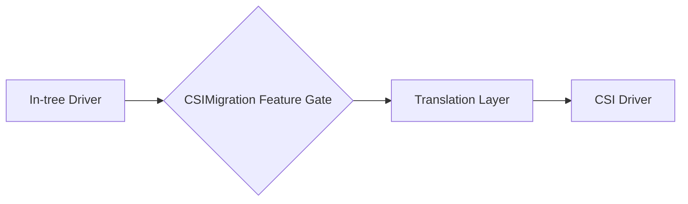
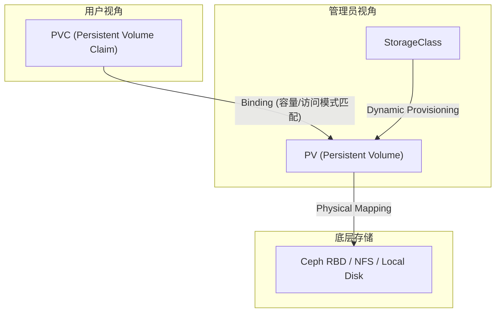
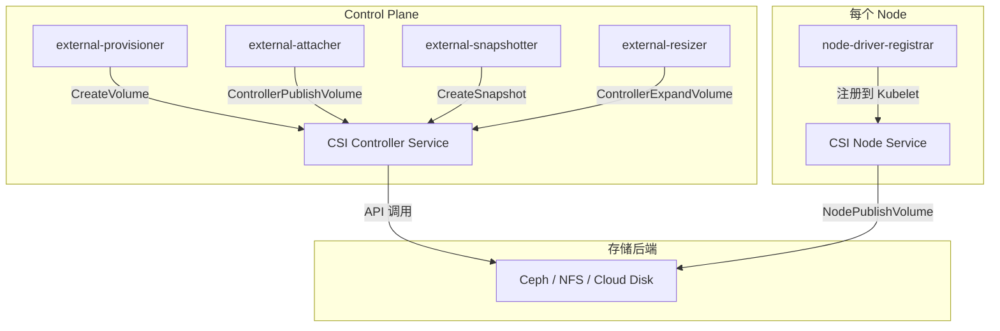
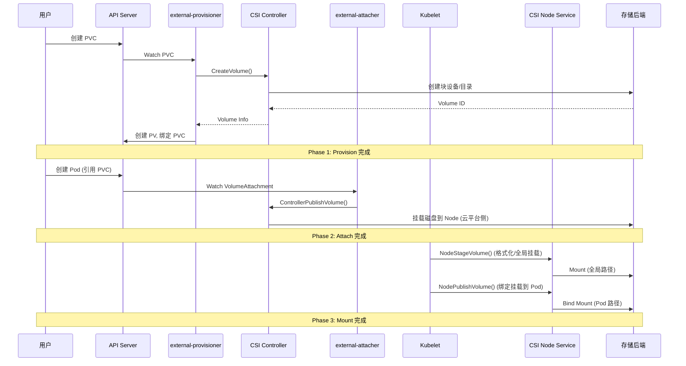
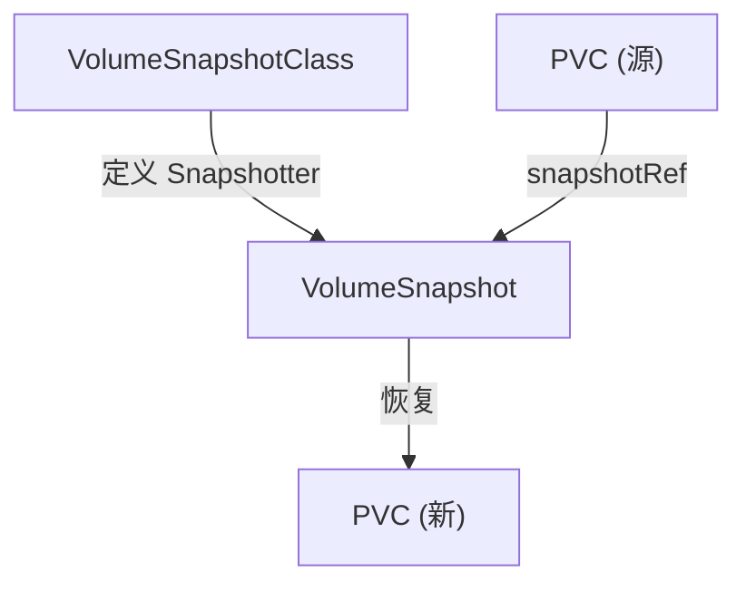
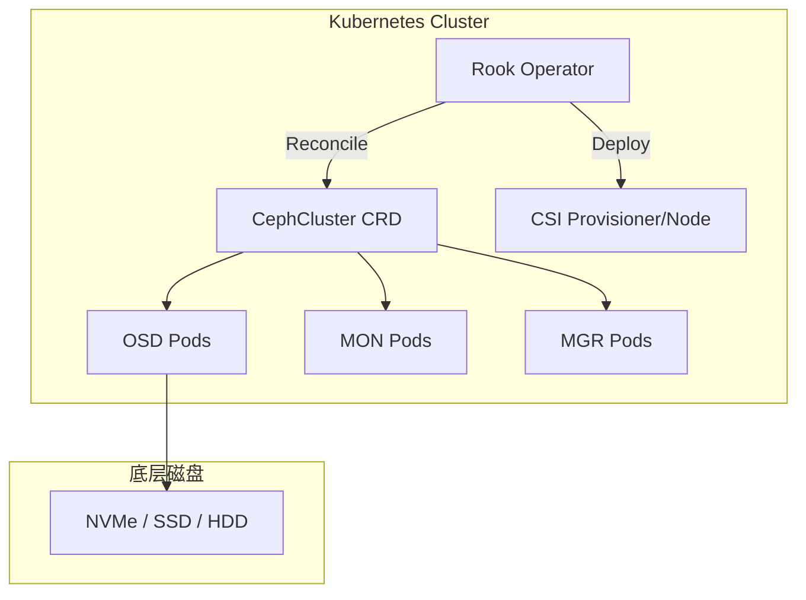

## 1. 本周核心目标

Week 01-03 完成了容器运行时, 流量治理与资源调度的深度学习. 本周聚焦于 Kubernetes 存储层, 理解 **CSI (Container Storage Interface)** 规范, 存储卷生命周期以及分布式存储系统的集成实践.

### 1.1 本周任务清单
1.  **存储原语**: 深入理解 PV, PVC, StorageClass 的设计哲学与绑定逻辑.
2.  **CSI 架构**: 掌握 CSI Controller, Node, Identity 三大服务的职责边界.
3.  **生命周期**: 理解存储卷从 Provision 到 Mount 的完整状态机.
4.  **分布式存储**: 实践 Rook/Ceph 或 Longhorn 的生产级部署.
5.  **故障排查**: 掌握存储 I/O 挂起, 卷无法挂载等常见问题的内核级诊断方法.

---

## 2. CSI In-tree 到 Out-of-tree 迁移

### 2.1 迁移背景

Kubernetes 早期将存储驱动 (如 AWS EBS, GCE PD, Cinder) 内置于 kube-controller-manager 和 kubelet 中 (In-tree). 这导致:

*   **耦合问题**: 存储驱动更新需要升级整个 K8s.
*   **维护负担**: 核心团队需维护大量厂商代码.
*   **扩展性差**: 新存储方案需等待 K8s 版本发布.

CSI 将驱动逻辑解耦为独立的 Pod, 实现 Out-of-tree 部署.

### 2.2 迁移机制



*   **CSIMigration**: Feature Gate 控制迁移行为.
*   **Translation Layer**: 将 In-tree 卷规格转换为 CSI 规格.
*   **透明性**: 现有 PV/PVC 无需修改, 自动路由到 CSI 驱动.

### 2.3 各云厂商迁移状态 (v1.30+)

| 驱动 | Feature Gate | 状态 |
| :--- | :--- | :--- |
| AWS EBS | `CSIMigrationAWS` | GA (默认开启) |
| GCE PD | `CSIMigrationGCE` | GA (默认开启) |
| Azure Disk | `CSIMigrationAzureDisk` | GA (默认开启) |
| vSphere | `CSIMigrationvSphere` | GA (默认开启) |
| OpenStack Cinder | `CSIMigrationOpenStack` | Beta |

### 2.4 迁移注意事项

*   **确保 CSI 驱动已部署**: 开启迁移前必须安装对应的 CSI 驱动.
*   **回滚风险**: 迁移后回滚需要谨慎, 可能导致卷访问失败.
*   **监控**: 关注 `csi_operations_seconds` 等 CSI 指标.

---

## 3. CSI Driver 实现细节

### 3.1 CSI 服务接口

每个 CSI Driver 必须实现以下 gRPC 服务:

| 服务 | 运行位置 | 关键 RPC |
| :--- | :--- | :--- |
| **Identity** | Controller + Node | `GetPluginInfo`, `GetPluginCapabilities`, `Probe` |
| **Controller** | 集中式 Deployment | `CreateVolume`, `DeleteVolume`, `ControllerPublishVolume`, `CreateSnapshot` |
| **Node** | DaemonSet (每节点) | `NodeStageVolume`, `NodePublishVolume`, `NodeGetCapabilities` |

### 3.2 CSI Socket 与注册

```bash
# Controller Service Socket
/var/lib/kubelet/plugins/<driver-name>/csi-controller.sock

# Node Service Socket
/var/lib/kubelet/plugins/<driver-name>/csi.sock

# Kubelet 插件目录
/var/lib/kubelet/plugins_registry/
```

*   **node-driver-registrar**: Sidecar, 将 CSI Node Service 注册到 Kubelet.
*   **CSINode 对象**: 记录每个节点上可用的 CSI 驱动及其 Topology.

### 3.3 Topology Awareness

对于跨可用区的存储, CSI 支持 Topology 感知:

```yaml
# CSINode 示例
apiVersion: storage.k8s.io/v1
kind: CSINode
metadata:
  name: node-1
spec:
  drivers:
  - name: ebs.csi.aws.com
    nodeID: i-1234567890abcdef0
    topologyKeys:
    - topology.ebs.csi.aws.com/zone
```

*   **WaitForFirstConsumer**: 延迟绑定直到 Pod 调度, 确保卷创建在正确的 Zone.
*   **AllowedTopologies**: StorageClass 中可限制卷创建的区域.

---

## 4. 存储性能分析

### 4.1 性能指标

| 指标 | 描述 | 典型工具 |
| :--- | :--- | :--- |
| **IOPS** | 每秒 I/O 操作数 | fio, iostat |
| **Throughput** | 每秒传输字节数 (MB/s) | fio, dd |
| **Latency** | 单次 I/O 延迟 | fio, blktrace |
| **Queue Depth** | I/O 队列深度 | iostat -x |

### 4.2 fio 基准测试

```bash
# 随机读测试 (数据库场景)
fio --name=randread --ioengine=libaio --rw=randread --bs=4k \
    --numjobs=4 --size=1G --runtime=60 --time_based \
    --direct=1 --filename=/mnt/data/test

# 顺序写测试 (日志场景)
fio --name=seqwrite --ioengine=libaio --rw=write --bs=1M \
    --numjobs=1 --size=10G --runtime=60 --time_based \
    --direct=1 --filename=/mnt/data/test
```

### 4.3 性能调优参数

| 参数 | 位置 | 影响 |
| :--- | :--- | :--- |
| `nr_requests` | `/sys/block/<dev>/queue/` | I/O 队列深度 |
| `scheduler` | `/sys/block/<dev>/queue/scheduler` | I/O 调度算法 (none, mq-deadline, kyber) |
| `read_ahead_kb` | `/sys/block/<dev>/queue/` | 预读缓冲区大小 |

---

## 5. 存储层抽象: PV, PVC 与 StorageClass

Kubernetes 通过三层抽象将存储管理与业务逻辑解耦:



### 2.1 PersistentVolume (PV)

PV 是集群级别的存储资源抽象, 由管理员预先创建 (静态供应) 或由 StorageClass 动态创建.

*   **核心字段**:
    | 字段 | 描述 |
    | :--- | :--- |
    | `capacity.storage` | 存储容量 (如 `10Gi`) |
    | `accessModes` | 访问模式: `ReadWriteOnce`, `ReadOnlyMany`, `ReadWriteMany` |
    | `persistentVolumeReclaimPolicy` | 回收策略: `Retain`, `Delete`, `Recycle` (已废弃) |
    | `storageClassName` | 关联的 StorageClass 名称 |
    | `volumeMode` | `Filesystem` (默认) 或 `Block` |

*   **访问模式详解**:
    *   `ReadWriteOnce (RWO)`: 单节点读写. 适用于大多数块存储 (如 AWS EBS, GCE PD).
    *   `ReadOnlyMany (ROX)`: 多节点只读. 适用于共享配置或静态资源.
    *   `ReadWriteMany (RWX)`: 多节点读写. 需要网络文件系统支持 (NFS, CephFS, GlusterFS).

### 2.2 PersistentVolumeClaim (PVC)

PVC 是用户对存储资源的 "申请书", Kubernetes 会自动寻找满足条件的 PV 进行绑定.

*   **绑定逻辑**:
    1.  匹配 `storageClassName` (如果未指定, 使用默认 StorageClass).
    2.  匹配 `accessModes`.
    3.  容量满足 (`capacity >= request`).
    4.  Label Selector 匹配 (可选).

*   **状态机**:
    | 状态 | 描述 |
    | :--- | :--- |
    | `Pending` | 等待绑定 (无匹配 PV 或 Provisioner 创建中) |
    | `Bound` | 已绑定到 PV |
    | `Lost` | PV 被删除, 但 PVC 仍存在 |

### 2.3 StorageClass

StorageClass 定义了动态供应的 "模板", 包括使用的 Provisioner 和参数.

```yaml
apiVersion: storage.k8s.io/v1
kind: StorageClass
metadata:
  name: ceph-rbd-ssd
provisioner: rbd.csi.ceph.com
parameters:
  clusterID: ceph-cluster-id
  pool: k8s-rbd-pool
  imageFormat: "2"
  imageFeatures: layering
reclaimPolicy: Delete
allowVolumeExpansion: true # 允许在线扩容
volumeBindingMode: WaitForFirstConsumer # 延迟绑定, 直到 Pod 调度
```

*   **`volumeBindingMode`**:
    *   `Immediate`: PVC 创建后立即绑定 PV (默认).
    *   `WaitForFirstConsumer`: 等待 Pod 调度后再绑定, 确保 PV 创建在 Pod 所在的拓扑域 (AZ).

---

## 3. 核心架构: CSI (Container Storage Interface)

CSI 是 CNCF 制定的容器存储接口标准, 允许第三方厂商开发插件而无需修改 Kubernetes 核心代码.

### 3.1 CSI 插件架构



*   **CSI Sidecar 容器** (由 Kubernetes SIG-Storage 维护):
    | Sidecar | 职责 |
    | :--- | :--- |
    | `external-provisioner` | 监听 PVC, 调用 `CreateVolume` |
    | `external-attacher` | 监听 VolumeAttachment, 调用 `ControllerPublishVolume` |
    | `external-snapshotter` | 监听 VolumeSnapshot, 调用 `CreateSnapshot` |
    | `external-resizer` | 监听 PVC 扩容请求, 调用 `ControllerExpandVolume` |
    | `node-driver-registrar` | 将 CSI Node Service 注册到 Kubelet |
    | `livenessprobe` | 健康检查 CSI 插件 |

*   **CSI 服务接口**:
    | 服务 | 方法 | 描述 |
    | :--- | :--- | :--- |
    | **Identity** | `GetPluginInfo`, `Probe`, `GetPluginCapabilities` | 插件元数据 |
    | **Controller** | `CreateVolume`, `DeleteVolume`, `ControllerPublishVolume`, `ControllerUnpublishVolume`, `CreateSnapshot`, `DeleteSnapshot`, `ControllerExpandVolume` | 控制面卷管理 |
    | **Node** | `NodeStageVolume`, `NodeUnstageVolume`, `NodePublishVolume`, `NodeUnpublishVolume`, `NodeExpandVolume`, `NodeGetVolumeStats` | 节点级挂载 |

### 3.2 存储卷挂载三阶段

当 Pod 请求使用 PVC 时, 存储卷会经历三个关键阶段:



1.  **Provision (供应)**:
    *   Provisioner 调用 `CreateVolume` 在存储后端创建卷.
    *   创建 PV 对象并绑定到 PVC.

2.  **Attach (挂载到节点)**:
    *   Attacher 调用 `ControllerPublishVolume` 将卷挂载到 Pod 所在 Node.
    *   对于云平台, 这意味着调用 API 将磁盘 attach 到虚拟机实例.
    *   对于本地存储或 NFS, 此阶段可能为空操作.

3.  **Mount (挂载到容器)**:
    *   Kubelet 调用 `NodeStageVolume` 进行全局挂载 (如格式化、挂载到 `/var/lib/kubelet/plugins/...`).
    *   Kubelet 调用 `NodePublishVolume` 进行绑定挂载 (bind mount 到 Pod 的 `/var/lib/kubelet/pods/.../volumes/...`).

### 3.3 存储模式: Block vs Filesystem

*   **Filesystem 模式 (默认)**:
    *   CSI 驱动负责格式化块设备为文件系统 (ext4, xfs).
    *   Pod 看到的是一个目录挂载点.
    *   兼容性最广, 适用于大多数应用.

*   **Block 模式 (Raw Block)**:
    *   Pod 直接访问原始块设备 (`/dev/xvda`).
    *   应用自行管理文件系统或直接操作块.
    *   适用于高性能数据库 (如 Oracle RAC) 或虚拟化负载.

```yaml
# Block 模式 PVC 示例
apiVersion: v1
kind: PersistentVolumeClaim
metadata:
  name: raw-block-pvc
spec:
  accessModes:
    - ReadWriteOnce
  volumeMode: Block # 关键字段
  resources:
    requests:
      storage: 100Gi
  storageClassName: ceph-rbd
---
# Pod 中引用
spec:
  containers:
  - name: db
    volumeDevices: # 注意: 不是 volumeMounts
    - name: data
      devicePath: /dev/xvda
  volumes:
  - name: data
    persistentVolumeClaim:
      claimName: raw-block-pvc
```

---

## 4. 高级功能: 快照与克隆

### 4.1 VolumeSnapshot

VolumeSnapshot 提供了时间点副本的能力, 用于备份和快速恢复.



*   **VolumeSnapshotClass**:
    ```yaml
    apiVersion: snapshot.storage.k8s.io/v1
    kind: VolumeSnapshotClass
    metadata:
      name: ceph-snapshot
    driver: rbd.csi.ceph.com
    deletionPolicy: Delete
    ```

*   **创建快照**:
    ```yaml
    apiVersion: snapshot.storage.k8s.io/v1
    kind: VolumeSnapshot
    metadata:
      name: db-snapshot
    spec:
      volumeSnapshotClassName: ceph-snapshot
      source:
        persistentVolumeClaimName: db-pvc
    ```

*   **从快照恢复**:
    ```yaml
    apiVersion: v1
    kind: PersistentVolumeClaim
    metadata:
      name: db-pvc-restored
    spec:
      storageClassName: ceph-rbd-ssd
      dataSource:
        name: db-snapshot
        kind: VolumeSnapshot
        apiGroup: snapshot.storage.k8s.io
      accessModes:
        - ReadWriteOnce
      resources:
        requests:
          storage: 100Gi
    ```

### 4.2 Volume Cloning

卷克隆允许从现有 PVC 直接创建副本, 无需经过快照步骤:

```yaml
apiVersion: v1
kind: PersistentVolumeClaim
metadata:
  name: db-pvc-clone
spec:
  storageClassName: ceph-rbd-ssd
  dataSource:
    name: db-pvc # 源 PVC
    kind: PersistentVolumeClaim
  accessModes:
    - ReadWriteOnce
  resources:
    requests:
      storage: 100Gi
```

---

## 5. 分布式存储实践: Rook/Ceph

Rook 是 CNCF 毕业项目, 提供 Kubernetes 原生的存储编排, 支持 Ceph, NFS, EdgeFS 等后端.

### 5.1 Rook 架构



*   **核心组件**:
    | 组件 | 职责 |
    | :--- | :--- |
    | **Rook Operator** | 监听 CRD, 编排 Ceph 集群 |
    | **MON (Monitor)** | 维护集群 Map, 仲裁 |
    | **OSD (Object Storage Daemon)** | 管理数据存储 (每个磁盘一个) |
    | **MGR (Manager)** | 提供监控、Dashboard |
    | **MDS (Metadata Server)** | CephFS 元数据管理 |

### 5.2 部署示例

```bash
# 1. 部署 Rook Operator
kubectl apply -f https://raw.githubusercontent.com/rook/rook/release-1.14/deploy/examples/crds.yaml
kubectl apply -f https://raw.githubusercontent.com/rook/rook/release-1.14/deploy/examples/common.yaml
kubectl apply -f https://raw.githubusercontent.com/rook/rook/release-1.14/deploy/examples/operator.yaml

# 2. 创建 Ceph 集群
kubectl apply -f https://raw.githubusercontent.com/rook/rook/release-1.14/deploy/examples/cluster.yaml

# 3. 验证状态
kubectl -n rook-ceph get cephcluster
kubectl -n rook-ceph get pods
```

### 5.3 StorageClass 集成

```yaml
apiVersion: storage.k8s.io/v1
kind: StorageClass
metadata:
  name: rook-ceph-block
provisioner: rook-ceph.rbd.csi.ceph.com
parameters:
  clusterID: rook-ceph
  pool: replicapool
  imageFormat: "2"
  imageFeatures: layering
  csi.storage.k8s.io/provisioner-secret-name: rook-csi-rbd-provisioner
  csi.storage.k8s.io/provisioner-secret-namespace: rook-ceph
  csi.storage.k8s.io/controller-expand-secret-name: rook-csi-rbd-provisioner
  csi.storage.k8s.io/controller-expand-secret-namespace: rook-ceph
  csi.storage.k8s.io/node-stage-secret-name: rook-csi-rbd-node
  csi.storage.k8s.io/node-stage-secret-namespace: rook-ceph
reclaimPolicy: Delete
allowVolumeExpansion: true
```

---

## 6. 本地存储: Local Persistent Volume

对于需要极致 I/O 性能的场景 (如 Kafka, Elasticsearch), 使用本地 NVMe/SSD 是常见选择.

### 6.1 Local PV 特性与限制

*   **优势**: 无网络开销, I/O 延迟极低.
*   **限制**:
    *   **节点亲和性**: Pod 必须调度到 PV 所在节点.
    *   **无高可用**: 节点故障导致数据不可访问.
    *   **无动态供应**: 需要手动或使用 sig-storage-local-static-provisioner.

### 6.2 手动创建 Local PV

```yaml
apiVersion: v1
kind: PersistentVolume
metadata:
  name: local-pv-node1
spec:
  capacity:
    storage: 500Gi
  volumeMode: Filesystem
  accessModes:
    - ReadWriteOnce
  persistentVolumeReclaimPolicy: Retain
  storageClassName: local-storage
  local:
    path: /mnt/disks/ssd1 # 预先挂载的本地目录
  nodeAffinity:
    required:
      nodeSelectorTerms:
      - matchExpressions:
        - key: kubernetes.io/hostname
          operator: In
          values:
          - node1
```

### 6.3 使用 local-static-provisioner 自动化

```bash
# 部署 provisioner
helm repo add sig-storage-local-static-provisioner https://kubernetes-sigs.github.io/sig-storage-local-static-provisioner
helm install local-static-provisioner sig-storage-local-static-provisioner/local-static-provisioner \
  --namespace kube-system \
  --set classes[0].name=local-storage \
  --set classes[0].hostDir=/mnt/disks \
  --set classes[0].volumeMode=Filesystem
```

---

## 7. 故障排查: 存储 I/O 问题诊断

### 7.1 常见问题与诊断路径

| 现象 | 可能原因 | 诊断命令 |
| :--- | :--- | :--- |
| PVC 长期 Pending | 无匹配 PV / Provisioner 异常 | `kubectl describe pvc <name>` |
| Pod 挂载超时 | Attach 失败 / Node CSI 异常 | `kubectl describe pod <name>`, `journalctl -u kubelet` |
| I/O 挂起 (D 状态进程) | 存储后端故障 / 网络分区 | `dmesg`, `iostat -x 1`, `cat /proc/<pid>/wchan` |
| 读写性能下降 | 磁盘饱和 / 网络拥塞 | `iostat -x`, `sar -n DEV 1` |

### 7.2 深度诊断工具

*   **blktrace**: 块设备层 I/O 追踪
    ```bash
    blktrace -d /dev/sda -o trace
    blkparse trace.blktrace.* > trace.txt
    ```

*   **fio**: 存储性能基准测试
    ```bash
    fio --name=test --ioengine=libaio --rw=randread --bs=4k --numjobs=4 \
        --size=1G --runtime=60 --time_based --direct=1 --filename=/mnt/data/test
    ```

*   **CSI 日志**:
    ```bash
    # Controller 日志
    kubectl logs -n rook-ceph deploy/csi-rbdplugin-provisioner -c csi-rbdplugin
    
    # Node 日志
    kubectl logs -n rook-ceph ds/csi-rbdplugin -c csi-rbdplugin
    ```

### 7.3 强制解除挂载 (紧急场景)

当 Node 意外宕机, 导致 Pod 无法在新节点创建 (VolumeAttachment 残留) 时:

```bash
# 1. 找到残留的 VolumeAttachment
kubectl get volumeattachment

# 2. 强制删除 (危险操作, 可能导致数据损坏)
kubectl delete volumeattachment <name> --force --grace-period=0

# 3. 清理 Finalizer (如果 delete 卡住)
kubectl patch volumeattachment <name> -p '{"metadata":{"finalizers":null}}' --type=merge
```

---

## 8. 实战演练

### 8.1 Lab 1: 模拟节点故障与卷迁移

**目标**: 观察存储卷从故障节点解挂并重新调度的完整过程.

1.  创建一个带有 PVC 的 StatefulSet (副本数 1).
2.  使用 `kubectl cordon` + `kubectl drain` 模拟节点下线.
3.  观察 Pod 在新节点启动, 记录卷 Detach/Attach 的耗时.
4.  检查数据完整性.

### 8.2 Lab 2: VolumeSnapshot 备份与恢复

**目标**: 完成一次有状态应用的数据备份与恢复.

1.  部署 PostgreSQL 并写入测试数据.
2.  创建 VolumeSnapshot.
3.  从快照恢复到新 PVC.
4.  启动新 PostgreSQL 实例, 验证数据一致性.

### 8.3 Lab 3: 存储加密 (Encryption at Rest)

**目标**: 在 PVC 层实现数据加密.

1.  使用支持加密的 StorageClass (如 AWS EBS 加密).
2.  或使用 LUKS 在本地磁盘层加密.
3.  验证加密状态: `cryptsetup status`.

---

## 9. 本周核心要点回顾

| 领域 | 核心概念 | 关键配置 |
| :--- | :--- | :--- |
| **存储原语** | PV, PVC, StorageClass | `volumeBindingMode: WaitForFirstConsumer` |
| **CSI 架构** | Controller/Node/Identity 服务 | Sidecar 容器协同 |
| **挂载阶段** | Provision -> Attach -> Mount | `NodeStageVolume`, `NodePublishVolume` |
| **快照克隆** | VolumeSnapshot, dataSource | `snapshot.storage.k8s.io/v1` |
| **分布式存储** | Rook/Ceph, Local PV | `reclaimPolicy`, `nodeAffinity` |

> 存储是 Kubernetes 集群中最脆弱的部分. 任何存储层的故障都可能导致有状态应用数据丢失. 掌握 CSI 的完整链路和故障诊断方法, 是保障生产环境数据安全的关键能力.
