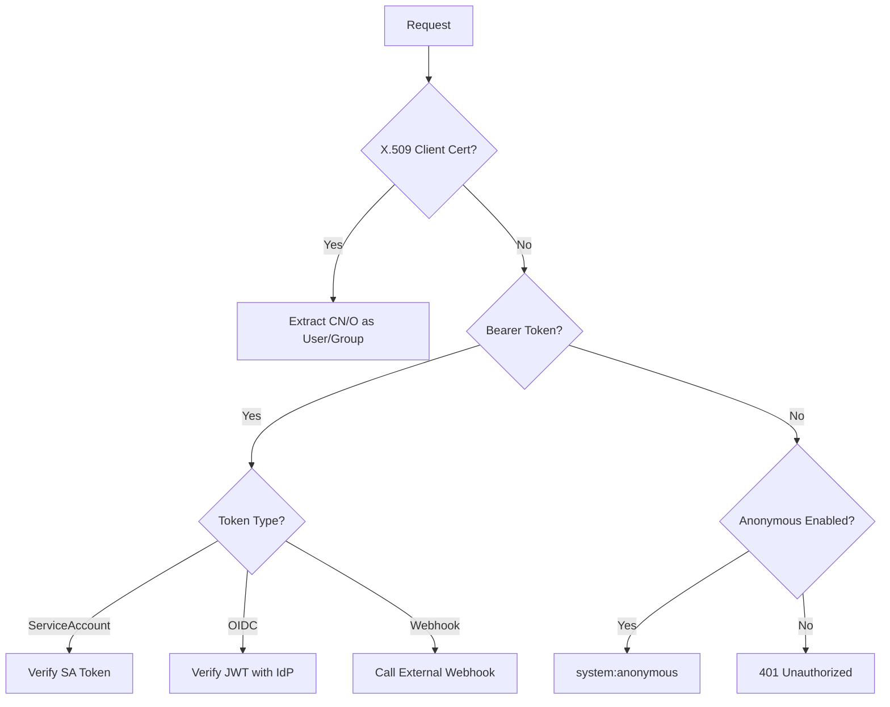
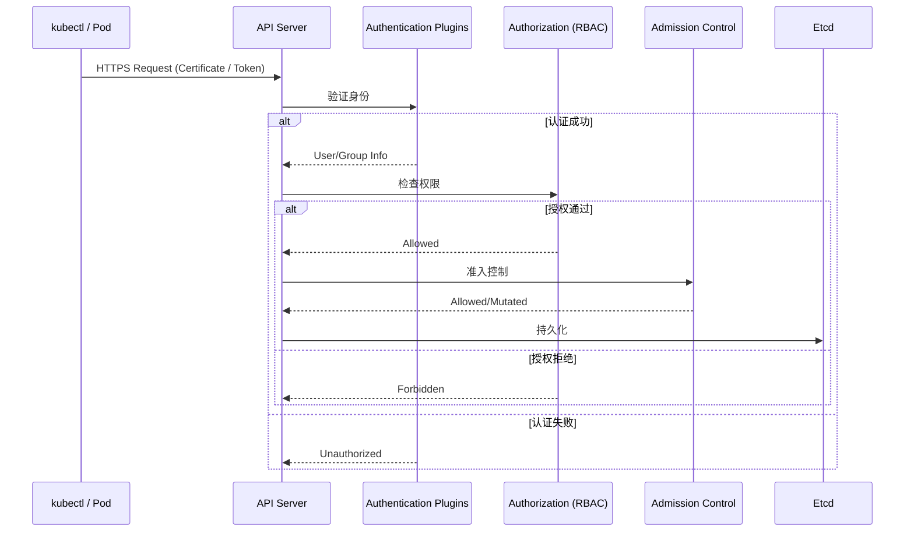
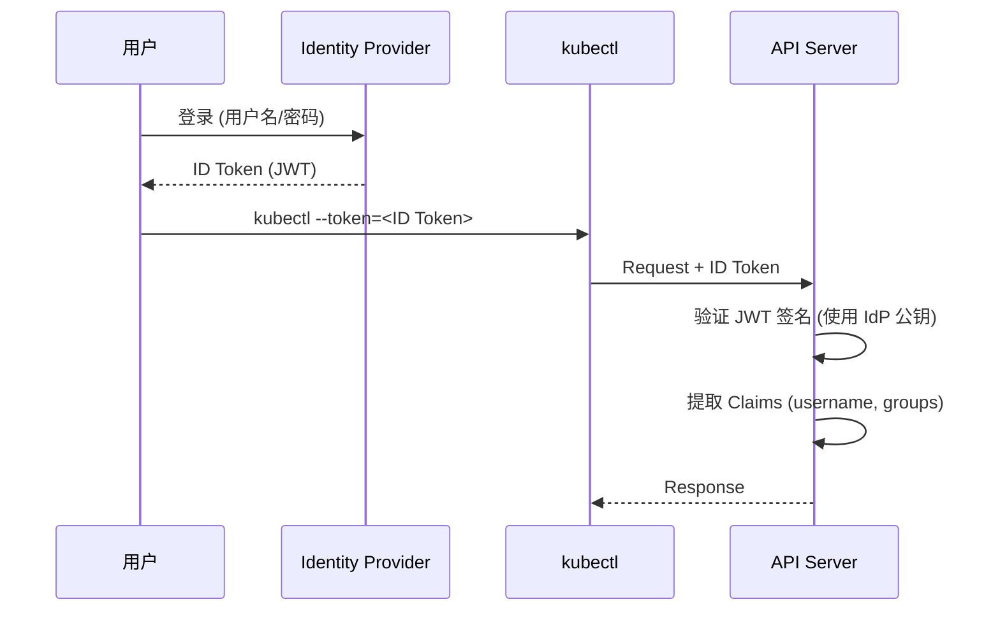
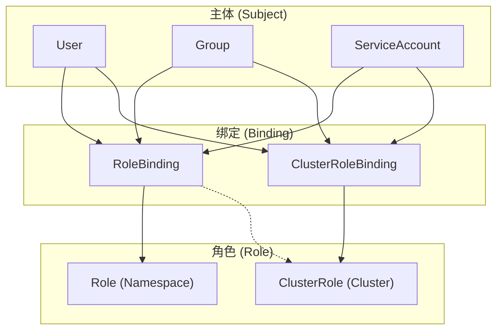

## 1. 本周核心目标

Week 04 完成了存储层的深度学习. 本周聚焦于 Kubernetes **身份认证 (Authentication)** 与 **授权 (Authorization)** 体系, 理解 API Server 如何验证请求来源并决定是否放行.

### 1.1 本周任务清单
1.  **认证机制**: 理解 X.509 证书, ServiceAccount Token, OIDC 的工作原理.
2.  **授权模型**: 掌握 RBAC 的核心概念与最小权限原则.
3.  **审计日志**: 配置 API Server 审计日志, 追踪敏感操作.
4.  **多租户隔离**: 实现基于 Namespace 的资源与权限隔离.

---

## 2. API Server 认证链详解

### 2.1 认证器执行顺序

API Server 按顺序尝试各认证器, **第一个成功的认证器决定身份**:



### 2.2 认证器优先级

| 优先级 | 认证器 | 描述 |
| :--- | :--- | :--- |
| 1 | X.509 Client Certificates | mTLS 客户端证书 |
| 2 | Bearer Token (Static) | 静态 Token 文件 |
| 3 | Bearer Token (ServiceAccount) | Bound SA Token |
| 4 | Bearer Token (OIDC) | 外部 IdP 签发的 JWT |
| 5 | Bearer Token (Webhook) | 外部认证服务 |
| 6 | Anonymous | 匿名访问 (如果启用) |

### 2.3 Impersonation (身份模拟)

高权限用户可以模拟其他身份执行操作:

```bash
# 以 developer 用户身份执行
kubectl get pods --as=developer --as-group=dev-team

# API 请求头
# Impersonate-User: developer
# Impersonate-Group: dev-team
```

*   **RBAC 控制**: 需要 `impersonate` verb 权限.
*   **审计**: 审计日志会记录原始用户和被模拟用户.

---

## 3. ServiceAccount Token 内部机制

### 3.1 Bound Token 结构 (JWT)

```json
{
  "aud": ["https://kubernetes.default.svc"],
  "exp": 1706000000,
  "iat": 1705996400,
  "iss": "https://kubernetes.default.svc",
  "kubernetes.io": {
    "namespace": "default",
    "pod": {"name": "my-pod", "uid": "xxx"},
    "serviceaccount": {"name": "my-sa", "uid": "yyy"}
  },
  "nbf": 1705996400,
  "sub": "system:serviceaccount:default:my-sa"
}
```

*   **aud (Audience)**: Token 适用的受众.
*   **exp/nbf**: 过期时间和生效时间.
*   **sub (Subject)**: 完整的 ServiceAccount 身份.

### 3.2 TokenRequest API

程序化获取短期 Token:

```bash
# 使用 kubectl 创建 Token
kubectl create token my-sa --duration=1h --audience=my-service

# API 调用
POST /api/v1/namespaces/default/serviceaccounts/my-sa/token
{
  "apiVersion": "authentication.k8s.io/v1",
  "kind": "TokenRequest",
  "spec": {
    "audiences": ["my-service"],
    "expirationSeconds": 3600
  }
}
```

### 3.3 Token 自动轮转

Kubelet 自动刷新 Projected Token:

*   **刷新触发**: Token 剩余有效期 < 80% 或 < 24h.
*   **原子写入**: 新 Token 通过 atomic rename 替换旧文件.
*   **应用感知**: 应用需监听文件变化或定期重新读取.

---

## 4. RBAC 授权决策流程

### 4.1 SubjectAccessReview API

测试用户是否有特定权限:

```bash
# 命令行测试
kubectl auth can-i create pods --as=developer -n default

# API 调用
POST /apis/authorization.k8s.io/v1/subjectaccessreviews
{
  "apiVersion": "authorization.k8s.io/v1",
  "kind": "SubjectAccessReview",
  "spec": {
    "user": "developer",
    "groups": ["dev-team"],
    "resourceAttributes": {
      "namespace": "default",
      "verb": "create",
      "resource": "pods"
    }
  }
}
```

### 4.2 Non-Resource URL 授权

部分 API 不是资源操作:

```yaml
rules:
- nonResourceURLs:
  - /healthz
  - /metrics
  - /api*
  verbs: ["get"]
```

*   **/healthz**: 健康检查
*   **/metrics**: Prometheus 指标
*   **/api, /apis**: API 发现

### 4.3 Wildcard 使用与风险

```yaml
rules:
- apiGroups: ["*"]
  resources: ["*"]
  verbs: ["*"]
```

*   **风险**: 等同于 cluster-admin, 应避免使用.
*   **审计**: 使用 `kubectl-who-can` 扫描过度权限.

---

## 5. 集群身份验证体系 (Authentication)

API Server 是集群的唯一入口. 任何请求都必须首先通过身份验证, 确定 "你是谁".

### 5.1 认证链路架构



### 5.2 核心认证插件

API Server 支持多种认证方式, 可同时启用:

| 插件类型 | 适用场景 | 配置参数 |
| :--- | :--- | :--- |
| **X.509 Client Certificates** | 组件间通信 (Kubelet, Scheduler) | `--client-ca-file` |
| **Static Token File** | 紧急访问 / 测试 | `--token-auth-file` |
| **Bootstrap Token** | 节点加入集群 | `--enable-bootstrap-token-auth` |
| **ServiceAccount Token** | Pod 内访问 API | 自动启用 |
| **OIDC** | 外部身份供应商集成 | `--oidc-*` 系列参数 |
| **Webhook Token** | 自定义认证逻辑 | `--authentication-token-webhook-config-file` |

### 5.3 X.509 客户端证书

Kubernetes 内部组件 (Kubelet, Controller Manager, Scheduler) 使用客户端证书与 API Server 双向 TLS 通信.

*   **证书结构**:
    ```
    Subject: O=system:nodes, CN=system:node:node1
    ```
    *   `CN (Common Name)`: 用户名 (如 `system:node:node1`)
    *   `O (Organization)`: 用户组 (如 `system:nodes`)

*   **证书签发流程**:
    ```bash
    # 1. 生成私钥
    openssl genrsa -out user.key 2048
    
    # 2. 创建 CSR
    openssl req -new -key user.key -out user.csr -subj "/CN=developer/O=dev-team"
    
    # 3. 使用集群 CA 签署
    openssl x509 -req -in user.csr -CA /etc/kubernetes/pki/ca.crt \
        -CAkey /etc/kubernetes/pki/ca.key -CAcreateserial \
        -out user.crt -days 365
    
    # 4. 生成 kubeconfig
    kubectl config set-credentials developer --client-certificate=user.crt --client-key=user.key
    kubectl config set-context dev-context --cluster=kubernetes --user=developer
    ```

### 5.4 ServiceAccount Token

每个 Namespace 自动创建 `default` ServiceAccount. Pod 默认使用该 SA 并自动挂载 Token.

*   **Token 挂载路径**:
    ```
    /var/run/secrets/kubernetes.io/serviceaccount/
    ├── ca.crt      # 集群 CA 证书
    ├── namespace   # Pod 所在 Namespace
    └── token       # JWT Token
    ```

*   **Token 类型演进**:
    | 类型 | 版本 | 特性 |
    | :--- | :--- | :--- |
    | **Legacy Token** | v1.20 前 | 永不过期, 存储在 Secret |
    | **Bound Token** | v1.21+ (默认) | 时间绑定, 受众绑定, 自动轮转 |

*   **Bound Token 配置**:
    ```yaml
    apiVersion: v1
    kind: Pod
    spec:
      serviceAccountName: my-sa
      containers:
      - name: app
        volumeMounts:
        - name: token
          mountPath: /var/run/secrets/tokens
          readOnly: true
      volumes:
      - name: token
        projected:
          sources:
          - serviceAccountToken:
              path: token
              expirationSeconds: 3600 # 1 小时过期
              audience: api # 受众
    ```

### 5.5 OIDC (OpenID Connect) 集成

生产环境中, 推荐使用 OIDC 与企业身份系统 (LDAP, AD, Okta, Dex) 集成.



*   **API Server 配置**:
    ```bash
    kube-apiserver \
      --oidc-issuer-url=https://dex.example.com \
      --oidc-client-id=kubernetes \
      --oidc-username-claim=email \
      --oidc-groups-claim=groups \
      --oidc-ca-file=/etc/kubernetes/pki/oidc-ca.crt
    ```

*   **常用 OIDC 提供者**:
    | 提供者 | 特点 |
    | :--- | :--- |
    | **Dex** | 轻量, 支持多种后端 (LDAP, GitHub, SAML) |
    | **Keycloak** | 功能全面, 适合企业级 |
    | **Okta / Auth0** | SaaS 方案, 开箱即用 |

---

## 6. 授权决策框架 (Authorization)

身份验证通过后, API Server 需要决定 "你能做什么". Kubernetes 支持多种授权模式, **RBAC** 是生产环境标准.

### 6.1 授权模式

| 模式 | 描述 | 配置 |
| :--- | :--- | :--- |
| **RBAC** | 基于角色的访问控制 (推荐) | `--authorization-mode=RBAC` |
| **ABAC** | 基于属性的访问控制 (已废弃) | `--authorization-mode=ABAC` |
| **Webhook** | 外部授权服务 | `--authorization-mode=Webhook` |
| **Node** | Kubelet 专用授权 | `--authorization-mode=Node` |

*   **默认配置**: `--authorization-mode=Node,RBAC`

### 6.2 RBAC 核心概念



*   **核心对象**:
    | 对象 | 作用域 | 描述 |
    | :--- | :--- | :--- |
    | **Role** | Namespace | 定义 Namespace 内资源的权限 |
    | **ClusterRole** | Cluster | 定义集群级资源或跨 Namespace 资源的权限 |
    | **RoleBinding** | Namespace | 将 Role/ClusterRole 绑定到主体 |
    | **ClusterRoleBinding** | Cluster | 将 ClusterRole 绑定到主体 (全局生效) |

### 6.3 Role 与 ClusterRole 定义

```yaml
# Role: 仅限 default namespace
apiVersion: rbac.authorization.k8s.io/v1
kind: Role
metadata:
  namespace: default
  name: pod-reader
rules:
- apiGroups: [""] # core API group
  resources: ["pods"]
  verbs: ["get", "list", "watch"]
---
# ClusterRole: 集群级别
apiVersion: rbac.authorization.k8s.io/v1
kind: ClusterRole
metadata:
  name: node-reader
rules:
- apiGroups: [""]
  resources: ["nodes"]
  verbs: ["get", "list", "watch"]
- apiGroups: ["metrics.k8s.io"]
  resources: ["nodes"]
  verbs: ["get", "list"]
```

*   **常用 Verbs**:
    | Verb | HTTP 方法 | 描述 |
    | :--- | :--- | :--- |
    | `get` | GET | 读取单个资源 |
    | `list` | GET (collection) | 列出资源 |
    | `watch` | GET (watch) | 监听变更 |
    | `create` | POST | 创建资源 |
    | `update` | PUT | 更新整个资源 |
    | `patch` | PATCH | 部分更新 |
    | `delete` | DELETE | 删除单个资源 |
    | `deletecollection` | DELETE (collection) | 批量删除 |

### 6.4 RoleBinding 与 ClusterRoleBinding

```yaml
# RoleBinding: 绑定到 Namespace
apiVersion: rbac.authorization.k8s.io/v1
kind: RoleBinding
metadata:
  name: read-pods
  namespace: default
subjects:
- kind: User
  name: developer
  apiGroup: rbac.authorization.k8s.io
- kind: ServiceAccount
  name: my-sa
  namespace: default
roleRef:
  kind: Role
  name: pod-reader
  apiGroup: rbac.authorization.k8s.io
---
# ClusterRoleBinding: 全局生效
apiVersion: rbac.authorization.k8s.io/v1
kind: ClusterRoleBinding
metadata:
  name: read-nodes-global
subjects:
- kind: Group
  name: developers
  apiGroup: rbac.authorization.k8s.io
roleRef:
  kind: ClusterRole
  name: node-reader
  apiGroup: rbac.authorization.k8s.io
```

### 6.5 ClusterRole 聚合

通过 `aggregationRule`, 可以自动将多个 ClusterRole 合并:

```yaml
apiVersion: rbac.authorization.k8s.io/v1
kind: ClusterRole
metadata:
  name: monitoring-view
  labels:
    rbac.example.com/aggregate-to-monitoring: "true"
rules:
- apiGroups: [""]
  resources: ["pods", "services"]
  verbs: ["get", "list", "watch"]
---
apiVersion: rbac.authorization.k8s.io/v1
kind: ClusterRole
metadata:
  name: monitoring
aggregationRule:
  clusterRoleSelectors:
  - matchLabels:
      rbac.example.com/aggregate-to-monitoring: "true"
rules: [] # 自动填充
```

---

## 7. 审计日志 (Audit Logging)

审计日志记录所有 API 请求, 是安全合规和事故调查的关键数据源.

### 7.1 审计策略级别

| 级别 | 描述 |
| :--- | :--- |
| `None` | 不记录 |
| `Metadata` | 记录请求元数据 (用户, 时间, 资源) |
| `Request` | 记录请求体 (不含响应) |
| `RequestResponse` | 记录请求和响应体 |

### 7.2 审计策略配置

```yaml
# /etc/kubernetes/audit-policy.yaml
apiVersion: audit.k8s.io/v1
kind: Policy
rules:
# 不记录健康检查
- level: None
  users: ["system:kube-proxy"]
  verbs: ["watch"]
  resources:
  - group: ""
    resources: ["endpoints", "services"]

# 记录 Secret 访问 (敏感)
- level: RequestResponse
  resources:
  - group: ""
    resources: ["secrets"]

# 记录所有其他请求的元数据
- level: Metadata
  resources:
  - group: ""
    resources: ["*"]
```

### 7.3 API Server 配置

```bash
kube-apiserver \
  --audit-policy-file=/etc/kubernetes/audit-policy.yaml \
  --audit-log-path=/var/log/kubernetes/audit.log \
  --audit-log-maxage=30 \
  --audit-log-maxbackup=10 \
  --audit-log-maxsize=100
```

### 7.4 审计日志分析

```bash
# 查找所有 Secret 读取操作
jq 'select(.objectRef.resource == "secrets" and .verb == "get")' /var/log/kubernetes/audit.log

# 查找特定用户的操作
jq 'select(.user.username == "developer")' /var/log/kubernetes/audit.log
```

---

## 8. 多租户隔离模式

### 8.1 Namespace 级隔离

Namespace 是 Kubernetes 的逻辑隔离单元, 结合 RBAC 可实现多租户.

*   **隔离维度**:
    | 维度 | 实现方式 |
    | :--- | :--- |
    | **权限隔离** | RBAC (Role/RoleBinding) |
    | **资源配额** | ResourceQuota |
    | **默认限制** | LimitRange |
    | **网络隔离** | NetworkPolicy |

### 8.2 ResourceQuota

限制 Namespace 内的资源总量:

```yaml
apiVersion: v1
kind: ResourceQuota
metadata:
  name: tenant-quota
  namespace: tenant-a
spec:
  hard:
    requests.cpu: "10"
    requests.memory: 20Gi
    limits.cpu: "20"
    limits.memory: 40Gi
    pods: "50"
    persistentvolumeclaims: "10"
    services.loadbalancers: "2"
```

### 8.3 LimitRange

为 Namespace 内的容器设置默认值和上下限:

```yaml
apiVersion: v1
kind: LimitRange
metadata:
  name: default-limits
  namespace: tenant-a
spec:
  limits:
  - type: Container
    default:
      cpu: 500m
      memory: 512Mi
    defaultRequest:
      cpu: 100m
      memory: 128Mi
    max:
      cpu: "2"
      memory: 4Gi
    min:
      cpu: 50m
      memory: 64Mi
```

---

## 9. 实战演练

### 9.1 Lab 1: 凭证解析

**目标**: 理解 ServiceAccount Token 的结构与权限.

```bash
# 1. 创建测试 Pod
kubectl run test-pod --image=busybox --command -- sleep 3600

# 2. 进入 Pod 查看 Token
kubectl exec -it test-pod -- sh
cat /var/run/secrets/kubernetes.io/serviceaccount/token

# 3. 解码 JWT (Base64)
# 在 https://jwt.io 解析 Token, 查看 claims
```

### 9.2 Lab 2: OIDC 集成 (Dex)

**目标**: 使用个人身份登录 kubectl.

1.  部署 Dex:
    ```bash
    helm repo add dex https://charts.dexidp.io
    helm install dex dex/dex --namespace dex-system --create-namespace
    ```

2.  配置 API Server OIDC 参数.

3.  使用 `kubelogin` 插件进行 OIDC 登录.

### 9.3 Lab 3: 权限审计

**目标**: 扫描集群高危权限.

```bash
# 安装 kubectl-who-can
kubectl krew install who-can

# 查找可以创建 Pod 的用户
kubectl who-can create pods

# 查找可以读取 Secret 的用户
kubectl who-can get secrets -n kube-system
```

---

## 10. 本周核心要点回顾

| 领域 | 核心概念 | 关键配置 |
| :--- | :--- | :--- |
| **认证** | X.509, ServiceAccount, OIDC | `--oidc-issuer-url`, Bound Token |
| **授权** | RBAC (Role, ClusterRole, Binding) | 最小权限原则 |
| **审计** | Audit Policy (None/Metadata/Request/RequestResponse) | `--audit-policy-file` |
| **多租户** | Namespace, ResourceQuota, LimitRange | 配额 + 默认限制 |

> 权限配置不当是 80% 内部安全事件的根源. RBAC 的核心原则是 "最小权限" - 只授予完成任务所需的最低权限. 定期审计是持续合规的关键.
