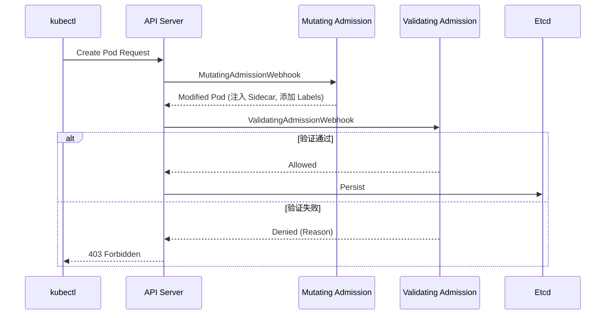
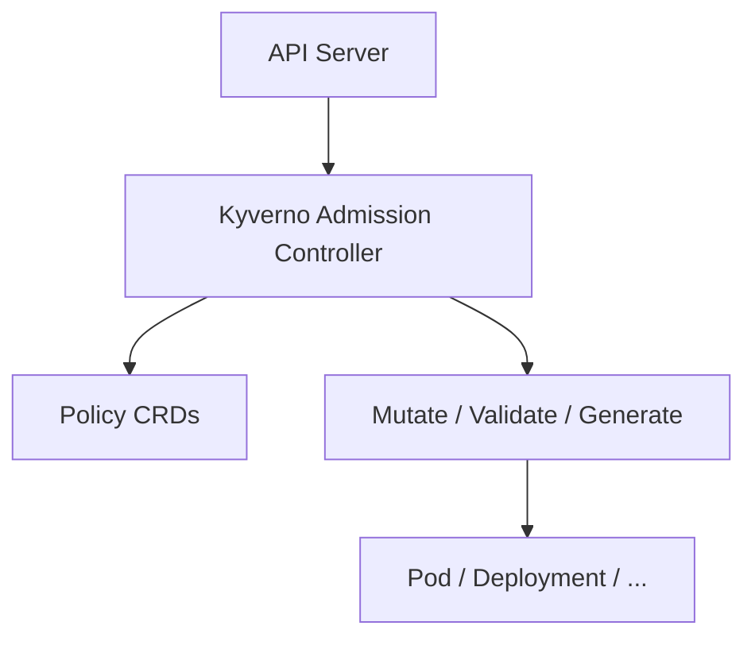

## 1. 本周核心目标

Week 05 完成了身份认证与授权的深度学习. 本周聚焦于 Kubernetes **安全加固 (Hardening)** 与 **策略治理 (Policy Governance)**, 从内核层到应用层构建纵深防御体系.

### 1.1 本周任务清单
1.  **Pod 安全标准**: 理解 Privileged/Baseline/Restricted 三级安全基线.
2.  **内核加固**: 掌握 Seccomp, AppArmor, SELinux 在容器层的落地.
3.  **准入控制**: 深入 Mutating/Validating Admission Webhook 工作流.
4.  **策略即代码**: 使用 Kyverno 或 Gatekeeper 实现自动化策略审计.
5.  **供应链安全**: 镜像签名与漏洞扫描集成.

---

## 2. Linux Capabilities 深度剖析

### 2.1 Capability 集合

Linux 将 root 权限拆分为多个独立的 Capabilities:

| 集合 | 描述 |
| :--- | :--- |
| **Effective** | 当前生效的权限 |
| **Permitted** | 可以被激活的权限上限 |
| **Inheritable** | 跨 exec() 保留的权限 |
| **Bounding** | 权限上限, 即使 setuid 也不能超越 |
| **Ambient** | 非 setuid 程序可继承的权限 |

### 2.2 容器默认 Capabilities

Docker/Containerd 默认授予容器以下 Capabilities:

```bash
# 默认授予
CAP_CHOWN, CAP_DAC_OVERRIDE, CAP_FSETID, CAP_FOWNER, CAP_MKNOD,
CAP_NET_RAW, CAP_SETGID, CAP_SETUID, CAP_SETFCAP, CAP_SETPCAP,
CAP_NET_BIND_SERVICE, CAP_SYS_CHROOT, CAP_KILL, CAP_AUDIT_WRITE
```

### 2.3 危险 Capabilities

| Capability | 风险 | 常见滥用 |
| :--- | :--- | :--- |
| `CAP_SYS_ADMIN` | 等同于 root | 容器逃逸 |
| `CAP_NET_ADMIN` | 网络配置 | 劫持流量, 修改路由 |
| `CAP_SYS_PTRACE` | 进程追踪 | 读取其他进程内存 |
| `CAP_DAC_READ_SEARCH` | 跳过文件权限 | 读取任意文件 |

### 2.4 Capability 降权策略

```yaml
securityContext:
  capabilities:
    drop:
    - ALL        # 先删除所有
    add:
    - NET_BIND_SERVICE  # 只添加必需的
```

*   **原则**: Drop ALL + Add 必需的.
*   **验证**: `capsh --print` 或 `getpcaps <pid>`.

---

## 3. Container Runtime 安全选项

### 3.1 Rootless Containers

容器在非 root 用户的 User Namespace 中运行:

```bash
# containerd rootless 模式
containerd-rootless-setuptool.sh install
rootlesskit --net=slirp4netns containerd
```

*   **优势**: 即使容器逃逸, 攻击者只获得普通用户权限.
*   **限制**: 部分功能不可用 (如某些网络配置).

### 3.2 运行时沙箱

| 运行时 | 隔离方式 | 性能 | 适用场景 |
| :--- | :--- | :--- | :--- |
| **runc** | Namespace + Cgroups | 最高 | 普通工作负载 |
| **gVisor** | 用户态内核 (Sentry) | 中等 | 不可信代码 |
| **Kata Containers** | 轻量级 VM (QEMU) | 较低 | 强隔离需求 |

### 3.3 RuntimeClass 选择

```yaml
apiVersion: node.k8s.io/v1
kind: RuntimeClass
metadata:
  name: gvisor
handler: runsc
---
apiVersion: v1
kind: Pod
spec:
  runtimeClassName: gvisor
  containers:
  - name: app
    image: myapp
```

---

## 4. Network Policy 深度解析

### 4.1 默认行为

*   **无 NetworkPolicy**: 所有 Pod 允许所有流量.
*   **有 NetworkPolicy**: 未被选中的 Pod 仍允许所有流量.
*   **被选中的 Pod**: 默认拒绝未明确允许的流量.

### 4.2 Ingress vs Egress

```yaml
apiVersion: networking.k8s.io/v1
kind: NetworkPolicy
metadata:
  name: api-policy
  namespace: production
spec:
  podSelector:
    matchLabels:
      app: api
  policyTypes:
  - Ingress
  - Egress
  ingress:
  - from:
    - namespaceSelector:
        matchLabels:
          environment: production
    - podSelector:
        matchLabels:
          role: frontend
    ports:
    - protocol: TCP
      port: 8080
  egress:
  - to:
    - namespaceSelector:
        matchLabels:
          name: database
    ports:
    - protocol: TCP
      port: 5432
```

### 4.3 CNI 特定行为

| CNI | 特点 |
| :--- | :--- |
| **Cilium** | 支持 L7 策略, DNS-based egress |
| **Calico** | 支持 GlobalNetworkPolicy |
| **Antrea** | 支持 ClusterNetworkPolicy |

---

## 5. Pod 安全标准 (Pod Security Standards)

Kubernetes 1.25+ 移除了 PodSecurityPolicy (PSP), 以 **Pod Security Standards (PSS)** 取代.

### 2.1 三级安全基线

| 级别 | 描述 | 适用场景 |
| :--- | :--- | :--- |
| **Privileged** | 无限制, 允许所有特权操作 | 系统组件 (kube-system) |
| **Baseline** | 阻止已知特权提升, 允许常见配置 | 普通应用 |
| **Restricted** | 严格限制, 遵循 Pod 安全最佳实践 | 高安全要求应用 |

### 2.2 PSS 实施方式

通过 Namespace Label 启用 Pod Security Admission:

```yaml
apiVersion: v1
kind: Namespace
metadata:
  name: production
  labels:
    # 强制模式: 违反策略的 Pod 被拒绝
    pod-security.kubernetes.io/enforce: restricted
    pod-security.kubernetes.io/enforce-version: latest
    # 警告模式: 记录警告但允许创建
    pod-security.kubernetes.io/warn: restricted
    pod-security.kubernetes.io/warn-version: latest
    # 审计模式: 记录到审计日志
    pod-security.kubernetes.io/audit: restricted
    pod-security.kubernetes.io/audit-version: latest
```

### 2.3 Restricted 级别核心限制

| 限制项 | 要求 |
| :--- | :--- |
| `hostNetwork` | 禁止 |
| `hostPID` | 禁止 |
| `hostIPC` | 禁止 |
| `privileged` | 禁止 |
| `allowPrivilegeEscalation` | 必须为 `false` |
| `runAsNonRoot` | 必须为 `true` |
| `capabilities` | 只允许 `NET_BIND_SERVICE` |
| `seccompProfile.type` | 必须为 `RuntimeDefault` 或 `Localhost` |

### 2.4 符合 Restricted 级别的 Pod 示例

```yaml
apiVersion: v1
kind: Pod
metadata:
  name: secure-app
spec:
  securityContext:
    runAsNonRoot: true
    runAsUser: 1000
    runAsGroup: 1000
    fsGroup: 1000
    seccompProfile:
      type: RuntimeDefault
  containers:
  - name: app
    image: myapp:latest
    securityContext:
      allowPrivilegeEscalation: false
      readOnlyRootFilesystem: true
      capabilities:
        drop:
        - ALL
    resources:
      limits:
        cpu: 500m
        memory: 512Mi
      requests:
        cpu: 100m
        memory: 128Mi
```

---

## 3. 内核级容器加固

容器与宿主机共享内核, 因此内核层面的安全边界至关重要.

### 3.1 Seccomp (Secure Computing Mode)

Seccomp 限制容器可以发起的系统调用 (syscall), 是容器逃逸防御的第一道防线.

*   **工作原理**:
    ```mermaid
    graph TD
        A["Container Process"] --> B["syscall"]
        B --> C{"Seccomp Filter"}
        C -- "Allowed" --> D["Kernel"]
        C -- "Denied" --> E["SIGKILL / EPERM"]
    ```

*   **Profile 类型**:
    | 类型 | 描述 |
    | :--- | :--- |
    | `Unconfined` | 不限制 (默认, 不推荐) |
    | `RuntimeDefault` | 使用容器运行时默认 Profile |
    | `Localhost` | 使用节点本地 Profile 文件 |

*   **RuntimeDefault 配置**:
    ```yaml
    securityContext:
      seccompProfile:
        type: RuntimeDefault
    ```

*   **自定义 Profile**:
    ```json
    // /var/lib/kubelet/seccomp/my-profile.json
    {
      "defaultAction": "SCMP_ACT_ERRNO",
      "architectures": ["SCMP_ARCH_X86_64"],
      "syscalls": [
        {
          "names": ["read", "write", "exit", "sigreturn", "brk", "mmap"],
          "action": "SCMP_ACT_ALLOW"
        }
      ]
    }
    ```

*   **引用自定义 Profile**:
    ```yaml
    securityContext:
      seccompProfile:
        type: Localhost
        localhostProfile: my-profile.json
    ```

### 3.2 AppArmor

AppArmor 是 Linux 内核模块, 基于路径的强制访问控制 (MAC).

*   **加载 Profile**:
    ```bash
    # 查看已加载的 Profile
    sudo aa-status
    
    # 加载新 Profile
    sudo apparmor_parser -r /etc/apparmor.d/my-profile
    ```

*   **Profile 示例**:
    ```
    #include <tunables/global>
    
    profile my-container-profile flags=(attach_disconnected) {
      #include <abstractions/base>
      
      # 允许读取
      /app/** r,
      
      # 禁止写入 /etc
      deny /etc/** w,
      
      # 允许网络
      network,
    }
    ```

*   **Pod 中引用**:
    ```yaml
    metadata:
      annotations:
        container.apparmor.security.beta.kubernetes.io/app: localhost/my-container-profile
    ```

### 3.3 SELinux

SELinux 提供基于类型 (Type Enforcement) 的强制访问控制, 在 RHEL/Rocky Linux 上广泛使用.

*   **容器上下文**:
    ```yaml
    securityContext:
      seLinuxOptions:
        level: "s0:c123,c456"
        type: "container_t"
    ```

*   **常见问题**: 挂载卷时权限拒绝
    ```bash
    # 检查 SELinux 上下文
    ls -Z /path/to/volume
    
    # 修复上下文
    chcon -Rt svirt_sandbox_file_t /path/to/volume
    ```

---

## 4. 准入控制 (Admission Control)

Admission Controller 是 API Server 的守门员, 在对象持久化到 Etcd 之前进行拦截和处理.

### 4.1 准入控制流程



### 4.2 内置准入控制器

| 控制器 | 类型 | 功能 |
| :--- | :--- | :--- |
| `NamespaceLifecycle` | Validating | 阻止在终止中的 Namespace 创建资源 |
| `LimitRanger` | Mutating | 应用 LimitRange 默认值 |
| `ServiceAccount` | Mutating | 自动挂载 SA Token |
| `PodSecurity` | Validating | 实施 Pod Security Standards |
| `ResourceQuota` | Validating | 检查 ResourceQuota 限制 |
| `MutatingAdmissionWebhook` | Mutating | 调用外部 Webhook |
| `ValidatingAdmissionWebhook` | Validating | 调用外部 Webhook |

### 4.3 自定义 Webhook 配置

```yaml
apiVersion: admissionregistration.k8s.io/v1
kind: ValidatingWebhookConfiguration
metadata:
  name: image-policy
webhooks:
- name: image-policy.example.com
  clientConfig:
    service:
      name: image-policy-webhook
      namespace: security
      path: /validate
    caBundle: <base64-encoded-ca>
  rules:
  - apiGroups: [""]
    apiVersions: ["v1"]
    operations: ["CREATE", "UPDATE"]
    resources: ["pods"]
  admissionReviewVersions: ["v1"]
  sideEffects: None
  failurePolicy: Fail # 失败则拒绝
  timeoutSeconds: 5
```

---

## 5. 策略即代码: Kyverno

Kyverno 是 Kubernetes 原生的策略引擎, 使用 YAML 定义策略, 无需学习额外语言.

### 5.1 Kyverno 架构



### 5.2 安装 Kyverno

```bash
helm repo add kyverno https://kyverno.github.io/kyverno/
helm repo update
helm install kyverno kyverno/kyverno --namespace kyverno --create-namespace
```

### 5.3 策略类型

| 类型 | 描述 |
| :--- | :--- |
| **Validate** | 检查资源是否符合规则, 不符合则拒绝 |
| **Mutate** | 修改资源 (如添加 Label, 注入 Sidecar) |
| **Generate** | 自动创建关联资源 (如 NetworkPolicy) |
| **VerifyImages** | 验证镜像签名 |

### 5.4 策略示例

#### 1. 强制要求资源限制

```yaml
apiVersion: kyverno.io/v1
kind: ClusterPolicy
metadata:
  name: require-limits
spec:
  validationFailureAction: Enforce
  rules:
  - name: require-cpu-memory-limits
    match:
      any:
      - resources:
          kinds:
          - Pod
    validate:
      message: "CPU and memory limits are required."
      pattern:
        spec:
          containers:
          - resources:
              limits:
                cpu: "?*"
                memory: "?*"
```

#### 2. 禁止 latest 标签

```yaml
apiVersion: kyverno.io/v1
kind: ClusterPolicy
metadata:
  name: disallow-latest-tag
spec:
  validationFailureAction: Enforce
  rules:
  - name: validate-image-tag
    match:
      any:
      - resources:
          kinds:
          - Pod
    validate:
      message: "Image tag 'latest' is not allowed."
      pattern:
        spec:
          containers:
          - image: "!*:latest"
```

#### 3. 自动添加 Label

```yaml
apiVersion: kyverno.io/v1
kind: ClusterPolicy
metadata:
  name: add-default-labels
spec:
  rules:
  - name: add-team-label
    match:
      any:
      - resources:
          kinds:
          - Deployment
    mutate:
      patchStrategicMerge:
        metadata:
          labels:
            team: "{{request.namespace}}"
```

### 5.5 Kyverno vs Gatekeeper (OPA)

| 维度 | Kyverno | Gatekeeper |
| :--- | :--- | :--- |
| **策略语言** | YAML (Kubernetes 原生) | Rego (需学习) |
| **学习曲线** | 低 | 高 |
| **灵活性** | 适中 | 极高 |
| **社区** | 快速成长 | 成熟 |
| **镜像验证** | 原生支持 | 需额外配置 |

---

## 6. 供应链安全

### 6.1 镜像漏洞扫描

在 CI/CD 阶段集成 Trivy 进行扫描:

```bash
# 扫描镜像
trivy image myregistry/myapp:v1.0

# 仅显示高危漏洞
trivy image --severity HIGH,CRITICAL myregistry/myapp:v1.0

# 输出 JSON
trivy image -f json -o report.json myregistry/myapp:v1.0
```

### 6.2 镜像签名与验证 (Cosign)

```bash
# 生成密钥对
cosign generate-key-pair

# 签名镜像
cosign sign --key cosign.key myregistry/myapp:v1.0

# 验证签名
cosign verify --key cosign.pub myregistry/myapp:v1.0
```

### 6.3 Kyverno 镜像验证策略

```yaml
apiVersion: kyverno.io/v1
kind: ClusterPolicy
metadata:
  name: verify-image-signature
spec:
  validationFailureAction: Enforce
  rules:
  - name: verify-cosign-signature
    match:
      any:
      - resources:
          kinds:
          - Pod
    verifyImages:
    - imageReferences:
      - "myregistry/*"
      attestors:
      - entries:
        - keys:
            publicKeys: |-
              -----BEGIN PUBLIC KEY-----
              MFkwEwYHKoZIzj0CAQYIKoZIzj0DAQcDQgAE...
              -----END PUBLIC KEY-----
```

---

## 7. 实战演练

### 7.1 Lab 1: 配置 Pod Security Standards

**目标**: 在测试 Namespace 启用 Restricted 级别.

```bash
# 创建 Namespace 并启用 PSS
kubectl create namespace secure-ns
kubectl label namespace secure-ns \
  pod-security.kubernetes.io/enforce=restricted \
  pod-security.kubernetes.io/warn=restricted

# 尝试创建特权 Pod (应该失败)
kubectl run priv-pod --image=nginx --privileged -n secure-ns
```

### 7.2 Lab 2: 编写 Kyverno 策略

**目标**: 强制所有 Deployment 必须定义 CPU/Memory Limits.

1.  部署 Kyverno.
2.  应用上述 `require-limits` 策略.
3.  尝试创建无 Limits 的 Deployment, 观察被拒绝.

### 7.3 Lab 3: 编写 AppArmor Profile

**目标**: 限制容器写入 /etc 目录.

1.  编写 AppArmor Profile.
2.  加载到节点.
3.  在 Pod 中引用.
4.  验证写入 /etc 被拒绝.

---

## 8. 本周核心要点回顾

| 领域 | 核心概念 | 关键配置 |
| :--- | :--- | :--- |
| **Pod 安全** | PSS (Privileged/Baseline/Restricted) | Namespace Label |
| **内核加固** | Seccomp, AppArmor, SELinux | `seccompProfile`, annotations |
| **准入控制** | Mutating/Validating Webhook | `AdmissionWebhookConfiguration` |
| **策略即代码** | Kyverno (Validate/Mutate/Generate) | `ClusterPolicy` CRD |
| **供应链安全** | Trivy 扫描, Cosign 签名 | CI/CD 集成 |

> 安全不是一次性的配置, 而是贯穿于从镜像构建到内核运行全过程的动态治理. 策略即代码 (Policy as Code) 确保了安全基线的可审计、可版本化和自动化实施.
