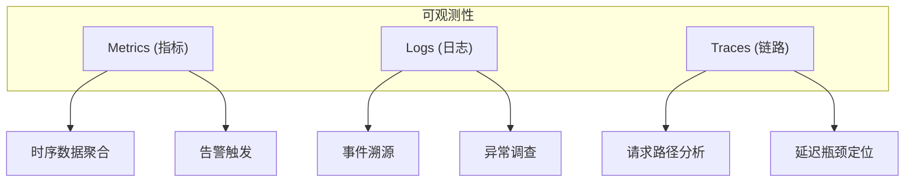
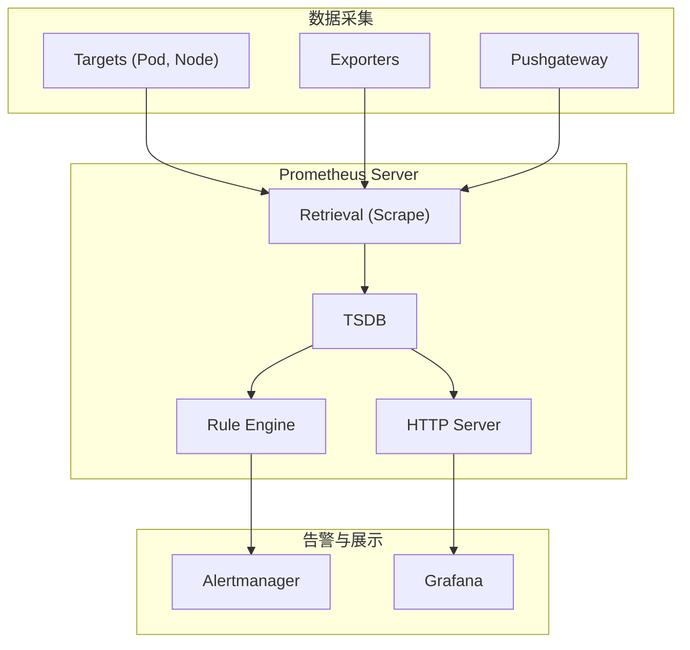
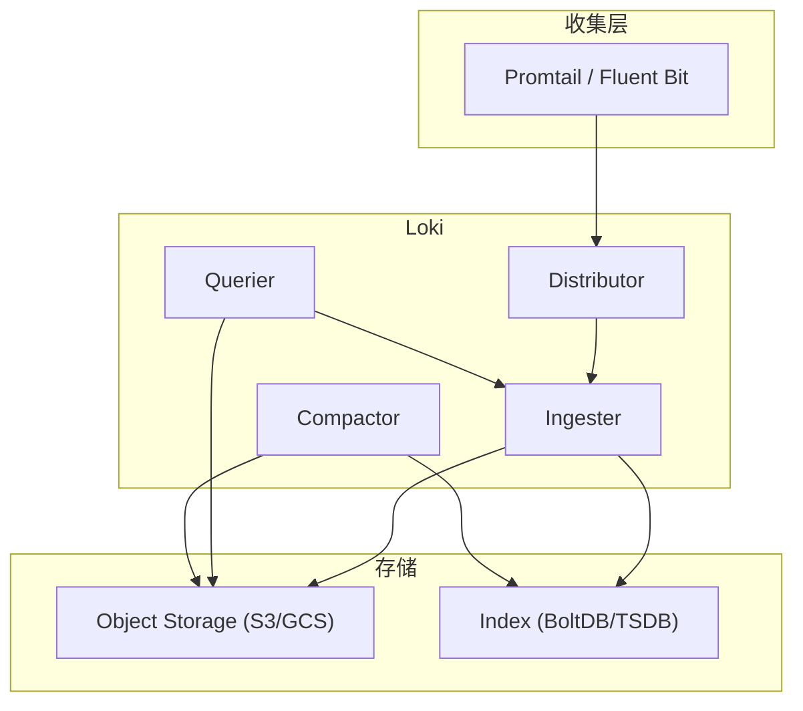
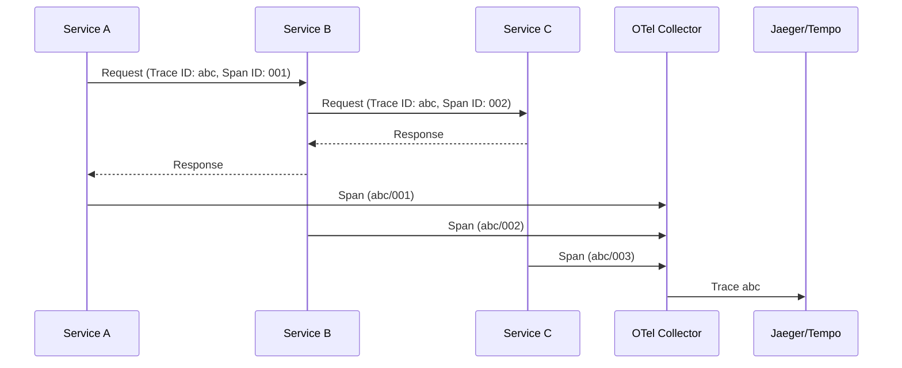
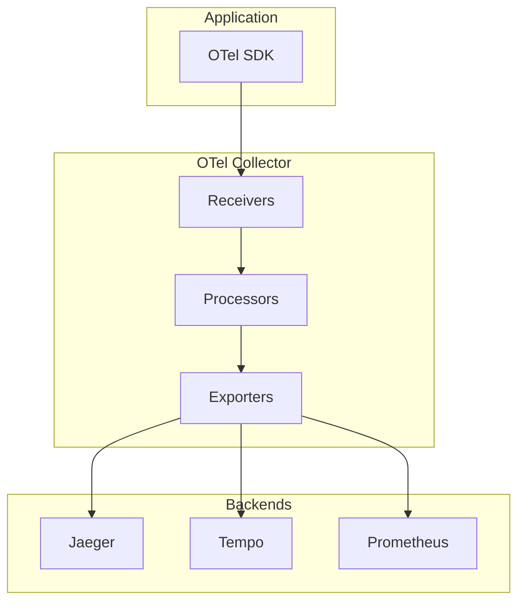

## 1. 本周核心目标

Week 06 完成了安全加固与策略治理的深度学习. 本周聚焦于 **可观测性 (Observability)** 三大支柱: **指标 (Metrics)**, **日志 (Logs)**, **链路追踪 (Traces)**, 构建完整的故障诊断与性能优化能力.

### 1.1 本周任务清单
1.  **指标体系**: 理解 Prometheus 数据模型, TSDB 存储原理与 PromQL 查询.
2.  **日志系统**: 掌握 Loki 架构与日志收集模式 (Sidecar vs DaemonSet).
3.  **链路追踪**: 理解分布式追踪原理与 OpenTelemetry 标准.
4.  **告警治理**: 配置告警规则, 路由与静默抑制.
5.  **黄金信号**: 实践 SRE 四大黄金信号监控模型.

---

## 2. Prometheus Service Discovery 机制

### 2.1 Kubernetes SD 角色

Prometheus 通过 Kubernetes API 自动发现监控目标:

| Role | 发现目标 | 典型用途 |
| :--- | :--- | :--- |
| `node` | 集群节点 | node_exporter |
| `pod` | 所有 Pod | 应用指标 |
| `service` | Service 对象 | 通过 Service 访问 |
| `endpoints` | Endpoints 对象 | 直接访问 Pod IP |
| `ingress` | Ingress 对象 | 黑盒探测 |

### 2.2 Relabeling 管道

```yaml
scrape_configs:
- job_name: 'kubernetes-pods'
  kubernetes_sd_configs:
  - role: pod
  relabel_configs:
  # 只抓取有 prometheus.io/scrape 注解的 Pod
  - source_labels: [__meta_kubernetes_pod_annotation_prometheus_io_scrape]
    action: keep
    regex: true
  # 使用自定义端口
  - source_labels: [__meta_kubernetes_pod_annotation_prometheus_io_port]
    action: replace
    target_label: __address__
    regex: (.+)
    replacement: ${1}
  # 添加 namespace 标签
  - source_labels: [__meta_kubernetes_namespace]
    target_label: namespace
  # 添加 pod 标签
  - source_labels: [__meta_kubernetes_pod_name]
    target_label: pod
```

### 2.3 metric_relabel_configs

在抓取后但存储前修改指标:

```yaml
metric_relabel_configs:
# 删除高 Cardinality 标签
- source_labels: [url]
  action: labeldrop
# 重命名指标
- source_labels: [__name__]
  regex: 'http_requests_total'
  replacement: 'http_requests'
  target_label: __name__
# 删除不需要的指标
- source_labels: [__name__]
  regex: 'go_.*'
  action: drop
```

---

## 3. SLO-based Alerting

### 3.1 Error Budget 告警

基于 SLO 的告警比阈值告警更有效:

```yaml
# 30 天 99.9% 可用性 SLO
# Error Budget = 30 * 24 * 60 * 0.001 = 43.2 分钟

groups:
- name: slo-alerts
  rules:
  # 快速燃烧 (5% budget in 1h)
  - alert: HighErrorBudgetBurn
    expr: |
      (
        sum(rate(http_requests_total{status=~"5.."}[1h]))
        /
        sum(rate(http_requests_total[1h]))
      ) > 14.4 * 0.001
    for: 5m
    labels:
      severity: critical
    annotations:
      summary: "Error budget burning too fast"

  # 慢速燃烧 (10% budget in 6h)
  - alert: ErrorBudgetBurn
    expr: |
      (
        sum(rate(http_requests_total{status=~"5.."}[6h]))
        /
        sum(rate(http_requests_total[6h]))
      ) > 2.4 * 0.001
    for: 30m
    labels:
      severity: warning
```

### 3.2 Multi-window, Multi-burn-rate

结合多个时间窗口减少误报:

```yaml
# 短窗口 (快速检测) + 长窗口 (确认趋势)
- alert: HighErrorRate
  expr: |
    (
      sum(rate(http_requests_total{status=~"5.."}[5m])) / sum(rate(http_requests_total[5m])) > 0.01
    ) and (
      sum(rate(http_requests_total{status=~"5.."}[1h])) / sum(rate(http_requests_total[1h])) > 0.01
    )
```

---

## 4. Kubernetes 组件关键指标

### 4.1 API Server

| 指标 | 描述 | 告警阈值 |
| :--- | :--- | :--- |
| `apiserver_request_total` | 请求总数 (按 verb, resource, code) | 5xx 比例 > 1% |
| `apiserver_request_duration_seconds` | 请求延迟 | p99 > 1s |
| `apiserver_current_inflight_requests` | 并发请求数 | 接近限制 |
| `etcd_request_duration_seconds` | Etcd 请求延迟 | p99 > 100ms |

### 4.2 Scheduler

| 指标 | 描述 |
| :--- | :--- |
| `scheduler_schedule_attempts_total` | 调度尝试次数 (按结果) |
| `scheduler_pod_scheduling_duration_seconds` | 调度延迟 |
| `scheduler_pending_pods` | 等待调度的 Pod 数 |
| `scheduler_preemption_attempts_total` | 抢占尝试次数 |

### 4.3 Kubelet

| 指标 | 描述 |
| :--- | :--- |
| `kubelet_running_pods` | 运行中的 Pod 数 |
| `kubelet_pleg_relist_duration_seconds` | PLEG relist 耗时 |
| `kubelet_pod_start_duration_seconds` | Pod 启动延迟 |
| `kubelet_volume_stats_*` | 卷使用统计 |

### 4.4 Etcd

| 指标 | 描述 | 告警阈值 |
| :--- | :--- | :--- |
| `etcd_mvcc_db_total_size_in_bytes` | 数据库大小 | > 6GB 需压缩 |
| `etcd_disk_wal_fsync_duration_seconds` | WAL fsync 延迟 | p99 > 10ms |
| `etcd_server_leader_changes_seen_total` | Leader 切换次数 | 频繁切换 |
| `etcd_network_peer_round_trip_time_seconds` | 节点间 RTT | > 50ms |

---

## 5. 可观测性三大支柱



| 支柱 | 特点 | 适用场景 |
| :--- | :--- | :--- |
| **Metrics** | 聚合的时序数值, 低存储成本 | 趋势监控, 容量规划, 告警 |
| **Logs** | 结构化/非结构化事件记录 | 事故调查, 调试, 审计 |
| **Traces** | 请求在服务间的传播路径 | 分布式系统延迟分析 |

---

## 3. 指标体系: Prometheus 深度剖析

### 3.1 Prometheus 架构



*   **核心组件**:
    | 组件 | 职责 |
    | :--- | :--- |
    | **Prometheus Server** | 采集、存储、查询指标 |
    | **TSDB** | 时序数据库, 高效压缩存储 |
    | **Alertmanager** | 告警路由、去重、静默 |
    | **Pushgateway** | 短生命周期任务的指标推送 |
    | **Exporters** | 暴露应用/系统指标 (如 node_exporter) |

### 3.2 数据模型

Prometheus 使用 **多维度时序数据模型**:

```
<metric_name>{<label_name>=<label_value>, ...} <value> [<timestamp>]
```

*   **示例**:
    ```
    http_requests_total{method="GET", handler="/api", status="200"} 1234
    ```

*   **指标类型**:
    | 类型 | 描述 | 示例 |
    | :--- | :--- | :--- |
    | **Counter** | 单调递增 | `http_requests_total` |
    | **Gauge** | 可增可减 | `temperature`, `memory_usage` |
    | **Histogram** | 分布统计 (桶) | `request_duration_seconds` |
    | **Summary** | 分布统计 (分位数) | `request_duration_seconds` |

### 3.3 TSDB 存储原理

*   **写入路径**:
    1.  数据首先写入内存中的 **Head Block**.
    2.  每 2 小时压缩为磁盘上的 **Block**.
    3.  旧 Block 定期合并 (Compaction).

*   **压缩算法**:
    *   **时间戳**: Delta-of-Delta 编码, 相邻样本的时间差通常固定.
    *   **值**: XOR 编码, 相邻浮点数通常相似.
    *   **压缩率**: 每个样本平均约 1-2 bytes.

*   **存储目录结构**:
    ```
    /prometheus/data/
    ├── 01BKGV7JBM69T2G1BGBGNNGxxxx/   # Block
    │   ├── meta.json
    │   ├── chunks/
    │   ├── index
    │   └── tombstones
    ├── wal/                            # Write-Ahead Log
    └── queries.active
    ```

### 3.4 PromQL 核心查询

*   **即时向量 (Instant Vector)**:
    ```text
    http_requests_total{job="api-server"}
    ```

*   **范围向量 (Range Vector)**:
    ```text
    http_requests_total{job="api-server"}[5m]
    ```

*   **常用函数**:
    | 函数 | 描述 |
    | :--- | :--- |
    | `rate()` | Counter 的每秒变化率 |
    | `increase()` | 范围内的增量 |
    | `histogram_quantile()` | 计算分位数 |
    | `sum()`, `avg()`, `max()` | 聚合函数 |
    | `by()`, `without()` | 标签分组 |

*   **P99 响应延迟**:
    ```text
    histogram_quantile(0.99, 
      sum(rate(http_request_duration_seconds_bucket[5m])) by (le, handler)
    )
    ```

### 3.5 Cardinality 问题

*   **定义**: 唯一时间序列的数量. 由 `metric_name × label_combinations` 决定.
*   **问题**: 高 Cardinality 导致内存爆炸.
*   **常见原因**: Label 中包含 PID, URL 参数, Trace ID.
*   **检测**:
    ```text
    topk(10, count by (__name__)({__name__=~".+"}))
    ```
*   **缓解**: 使用 Recording Rules 预聚合, 减少标签维度.

---

## 4. 告警系统

### 4.1 Recording Rules

预先计算并存储查询结果, 减少实时查询开销:

```yaml
# /etc/prometheus/rules/recording.yml
groups:
- name: recording_rules
  rules:
  - record: job:http_requests_total:rate5m
    expr: sum(rate(http_requests_total[5m])) by (job)
```

### 4.2 Alerting Rules

```yaml
# /etc/prometheus/rules/alerting.yml
groups:
- name: api_alerts
  rules:
  - alert: HighErrorRate
    expr: |
      sum(rate(http_requests_total{status=~"5.."}[5m])) by (job)
      /
      sum(rate(http_requests_total[5m])) by (job)
      > 0.05
    for: 5m
    labels:
      severity: critical
    annotations:
      summary: "High 5xx error rate on {{ $labels.job }}"
      description: "Error rate is {{ $value | humanizePercentage }}"
```

### 4.3 Alertmanager 路由

```yaml
# /etc/alertmanager/alertmanager.yml
route:
  receiver: default
  group_by: [alertname, job]
  group_wait: 30s
  group_interval: 5m
  repeat_interval: 4h
  routes:
  - match:
      severity: critical
    receiver: pagerduty
  - match:
      severity: warning
    receiver: slack

receivers:
- name: default
  email_configs:
  - to: ops@example.com
- name: pagerduty
  pagerduty_configs:
  - service_key: <key>
- name: slack
  slack_configs:
  - channel: '#alerts'
    api_url: https://hooks.slack.com/...
```

### 4.4 静默 (Silences)

在计划维护期间静默告警:

```bash
amtool silence add alertname="HighErrorRate" --duration=2h --comment="Planned maintenance"
```

---

## 5. 日志系统: Loki

### 5.1 Loki 架构



*   **核心设计**: 只索引 **标签 (Labels)**, 不索引日志内容. 查询时流式扫描.
*   **优势**: 存储成本极低, 适合高吞吐场景.
*   **劣势**: 全文搜索性能低于 Elasticsearch.

### 5.2 日志收集模式

| 模式 | 架构 | 优势 | 劣势 |
| :--- | :--- | :--- | :--- |
| **DaemonSet** | 每个节点一个 Agent | 资源共享, 配置统一 | 无法定制化处理 |
| **Sidecar** | 每个 Pod 一个 Agent | 隔离性强, 可定制 | 资源消耗大 |

### 5.3 Promtail 配置

```yaml
# promtail-config.yaml
server:
  http_listen_port: 9080

positions:
  filename: /tmp/positions.yaml

clients:
  - url: http://loki:3100/loki/api/v1/push

scrape_configs:
  - job_name: kubernetes-pods
    kubernetes_sd_configs:
      - role: pod
    relabel_configs:
      - source_labels: [__meta_kubernetes_pod_label_app]
        target_label: app
      - source_labels: [__meta_kubernetes_namespace]
        target_label: namespace
    pipeline_stages:
      - json:
          expressions:
            level: level
            msg: msg
      - labels:
          level:
```

### 5.4 LogQL 查询

*   **日志流选择**:
    ```text
    {namespace="production", app="api-server"}
    ```

*   **过滤**:
    ```text
    {app="api-server"} |= "error" | json | level="error"
    ```

*   **聚合**:
    ```text
    sum(rate({app="api-server"} |= "error" [5m])) by (level)
    ```

---

## 6. 链路追踪: OpenTelemetry

### 6.1 分布式追踪原理



*   **核心概念**:
    | 概念 | 描述 |
    | :--- | :--- |
    | **Trace** | 一个完整请求的生命周期 |
    | **Span** | Trace 中的一个操作单元 |
    | **Trace ID** | 全局唯一标识, 跨服务传播 |
    | **Span ID** | 单个 Span 的标识 |
    | **Parent Span ID** | 父 Span 的引用 |

### 6.2 OpenTelemetry 架构



### 6.3 自动注入 (Kubernetes Operator)

```bash
helm repo add open-telemetry https://open-telemetry.github.io/opentelemetry-helm-charts
helm install opentelemetry-operator open-telemetry/opentelemetry-operator
```

```yaml
apiVersion: opentelemetry.io/v1alpha1
kind: Instrumentation
metadata:
  name: auto-instrumentation
spec:
  exporter:
    endpoint: http://otel-collector:4317
  propagators:
    - tracecontext
    - baggage
  sampler:
    type: parentbased_traceidratio
    argument: "0.25" # 采样率 25%
  java:
    image: ghcr.io/open-telemetry/opentelemetry-operator/autoinstrumentation-java:latest
  python:
    image: ghcr.io/open-telemetry/opentelemetry-operator/autoinstrumentation-python:latest
```

```yaml
# Pod 注解自动注入
metadata:
  annotations:
    instrumentation.opentelemetry.io/inject-java: "true"
```

---

## 7. SRE 黄金信号

Google SRE 提出的四大黄金信号是监控的核心:

| 信号 | 描述 | 示例指标 |
| :--- | :--- | :--- |
| **Latency** | 请求响应时间 | `histogram_quantile(0.99, ...)` |
| **Traffic** | 请求吞吐量 | `sum(rate(http_requests_total[5m]))` |
| **Errors** | 错误率 | `sum(rate(http_requests_total{status=~"5.."}[5m])) / sum(rate(http_requests_total[5m]))` |
| **Saturation** | 资源饱和度 | `1 - avg(rate(node_cpu_seconds_total{mode="idle"}[5m]))` |

### 7.1 RED Method (请求驱动服务)

适用于 Request-Driven Services:

*   **R**ate: 请求速率
*   **E**rrors: 错误率
*   **D**uration: 响应延迟

### 7.2 USE Method (资源)

适用于资源监控:

*   **U**tilization: 使用率
*   **S**aturation: 饱和度 (队列深度)
*   **E**rrors: 错误数

---

## 8. 实战演练

### 8.1 Lab 1: 配置黄金信号 Dashboard

**目标**: 在 Grafana 中创建包含四大黄金信号的 Dashboard.

1.  部署 kube-prometheus-stack.
2.  导入或创建 Dashboard, 包含:
    *   P50/P90/P99 响应延迟
    *   请求速率 (QPS)
    *   错误率
    *   CPU/Memory 饱和度

### 8.2 Lab 2: 日志告警集成

**目标**: 当错误日志超过阈值时触发告警.

```yaml
# Loki Ruler 配置
groups:
- name: log_alerts
  rules:
  - alert: HighErrorLogRate
    expr: sum(rate({app="api-server"} |= "ERROR" [5m])) > 10
    for: 5m
    labels:
      severity: warning
    annotations:
      summary: "High error log rate"
```

### 8.3 Lab 3: 链路追踪分析

**目标**: 定位分布式请求的延迟瓶颈.

1.  部署 Jaeger 或 Grafana Tempo.
2.  为测试应用注入 OpenTelemetry SDK.
3.  模拟高延迟场景.
4.  使用 Trace 视图分析调用链.

---

## 9. 本周核心要点回顾

| 领域 | 核心概念 | 关键配置 |
| :--- | :--- | :--- |
| **Metrics** | Prometheus TSDB, PromQL, Cardinality | Recording Rules, Alerting Rules |
| **Logs** | Loki (只索引 Labels), LogQL | Promtail, Pipeline Stages |
| **Traces** | OpenTelemetry, Trace/Span 模型 | Auto-instrumentation, Sampling |
| **告警** | Alertmanager 路由, 静默 | `group_by`, `inhibit_rules` |
| **黄金信号** | Latency, Traffic, Errors, Saturation | RED/USE Method |

> 可观测性的目标不是为了告警, 而是为了在故障发生时快速定位根因, 在故障发生前预测容量瓶颈. 一个好的监控系统应该能讲述出系统整体的健康状况, 而不是淹没在无意义的告警风暴中.
