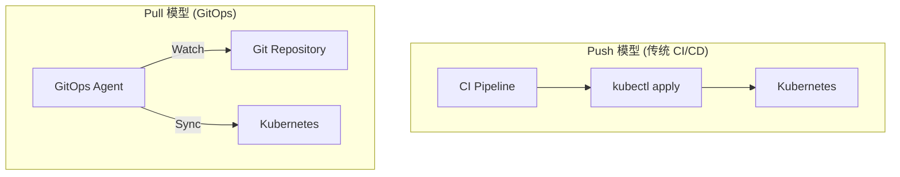
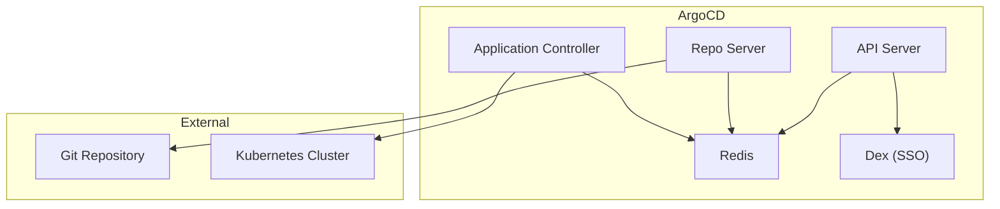
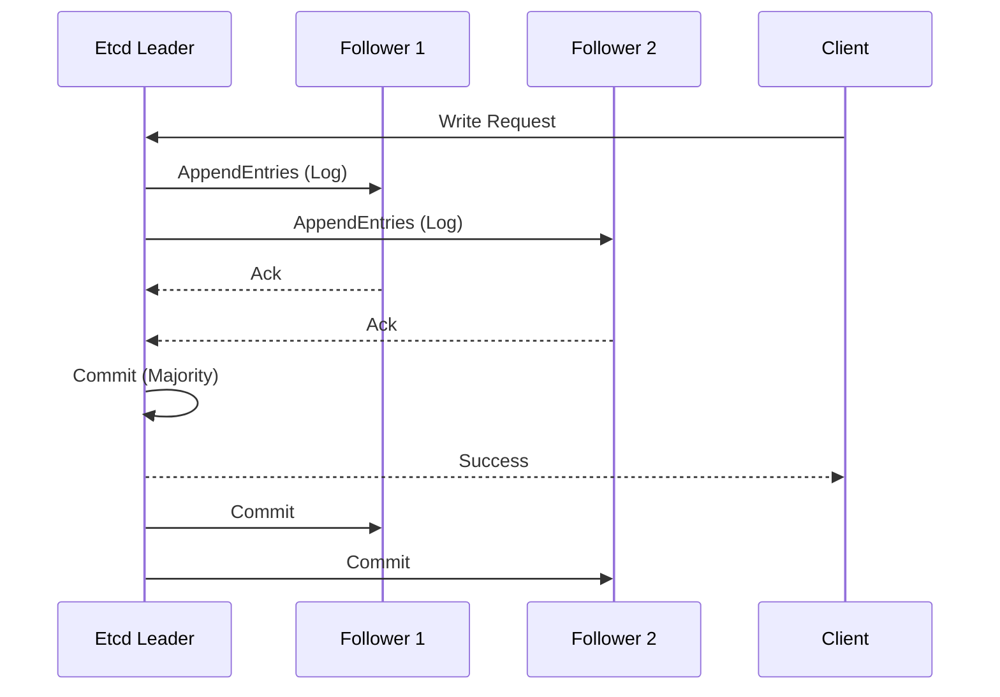
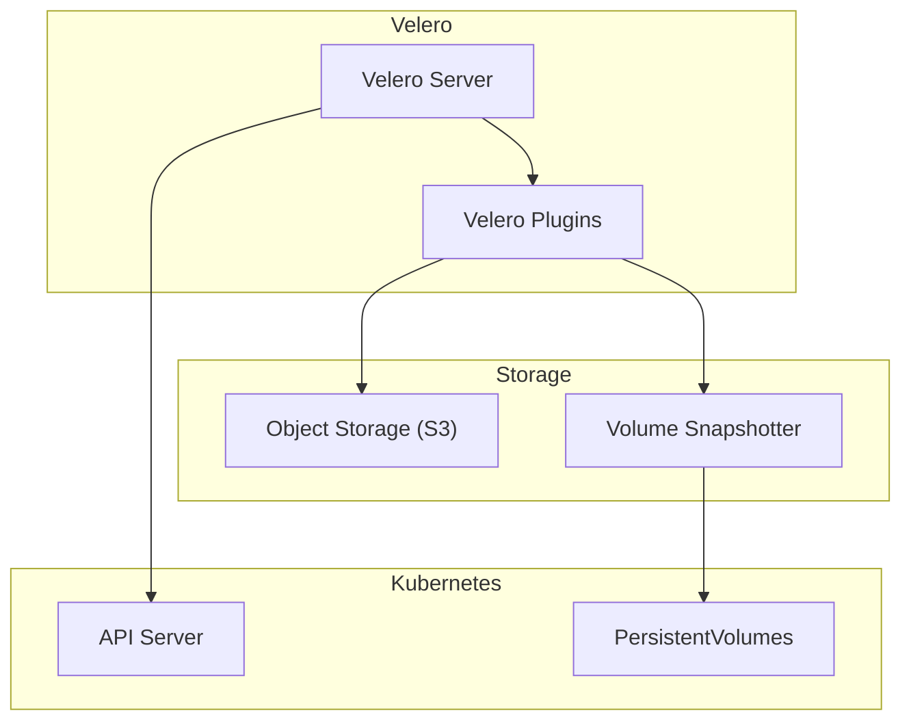
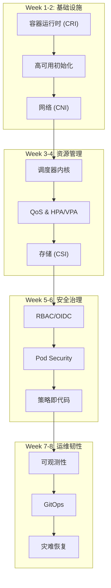

## 1. 本周核心目标

Week 07 完成了可观测性三大支柱的深度学习. 本周作为学习计划的终章, 聚焦于 **GitOps 持续交付** 与 **灾难恢复 (Disaster Recovery)**, 构建自动化, 可审计, 可恢复的生产级运维体系.

### 1.1 本周任务清单
1.  **GitOps 原理**: 理解声明式配置, 状态同步与漂移检测.
2.  **ArgoCD 实践**: 掌握 Application CRD, Sync Waves 与 Hook.
3.  **Etcd 备份恢复**: 理解 Raft 一致性与快照恢复流程.
4.  **Velero 灾备**: 实践 Kubernetes 资源与 PV 数据的备份恢复.
5.  **混沌工程**: 使用 Chaos Mesh 验证系统韧性.

---

## 2. ArgoCD Sync Engine 内部机制

### 2.1 资源追踪方式

ArgoCD 通过以下方式追踪托管资源:

| 方式 | 机制 | 优劣 |
| :--- | :--- | :--- |
| **Label** | `app.kubernetes.io/instance` | 与 Helm 兼容, 但可能冲突 |
| **Annotation** | `argocd.argoproj.io/tracking-id` | 更精确, 默认方式 |

### 2.2 Diff 归一化

ArgoCD 比较 Git 定义与集群实际状态时, 会执行归一化:

*   **字段忽略**: `status`, `metadata.managedFields`, 动态生成的字段.
*   **默认值**: 忽略 K8s 自动添加的默认值.
*   **Helm 模板**: 渲染后再比较.

```yaml
# 自定义差异忽略
spec:
  ignoreDifferences:
  - group: apps
    kind: Deployment
    jsonPointers:
    - /spec/replicas  # 忽略 HPA 管理的副本数
```

### 2.3 Server-Side Apply vs Client-Side Apply

| 模式 | 特点 |
| :--- | :--- |
| **Client-Side** | 三路合并, 可能覆盖其他控制器的修改 |
| **Server-Side** | 字段级所有权, 多控制器协作友好 |

```yaml
# 启用 Server-Side Apply
spec:
  syncPolicy:
    syncOptions:
    - ServerSideApply=true
```

---

## 3. Etcd 运维深度剖析

### 3.1 空间配额与压缩

```bash
# 查看数据库大小
etcdctl endpoint status --write-out=table
# +----------------+---------+---------+---------+-----------+
# |    ENDPOINT    |   ID    | VERSION | DB SIZE | IS LEADER |
# +----------------+---------+---------+---------+-----------+
# | localhost:2379 | 1234abc |  3.5.12 |  2.1 GB |      true |

# 手动压缩历史版本
ETCDCTL_API=3 etcdctl compact $(etcdctl endpoint status --write-out=json | jq -r '.[0].Status.header.revision')

# 碎片整理 (回收磁盘空间)
etcdctl defrag --endpoints=https://127.0.0.1:2379
```

*   **默认配额**: 2GB (可通过 `--quota-backend-bytes` 调整, 生产环境建议 8GB).
*   **超过配额**: Etcd 进入只读模式, 无法写入.

### 3.2 成员健康与 Quorum

```bash
# 查看成员状态
etcdctl member list --write-out=table

# 健康检查
etcdctl endpoint health --endpoints=https://node1:2379,https://node2:2379,https://node3:2379

# Quorum 计算
# 3 节点: 需要 2 个健康 (容忍 1 故障)
# 5 节点: 需要 3 个健康 (容忍 2 故障)
```

### 3.3 性能调优

| 参数 | 描述 | 推荐值 |
| :--- | :--- | :--- |
| `--heartbeat-interval` | 心跳间隔 | 100-500ms |
| `--election-timeout` | 选举超时 | 1000-5000ms (心跳的 5-10 倍) |
| `--snapshot-count` | 触发快照的事务数 | 10000 |
| `--auto-compaction-retention` | 自动压缩保留时长 | 1h |

### 3.4 Learner 节点

新成员作为 Learner 加入, 不参与投票:

```bash
# 添加 Learner
etcdctl member add new-node --learner --peer-urls=https://new-node:2380

# 提升为 Voting 成员 (同步完成后)
etcdctl member promote <member-id>
```

*   **优势**: 避免新成员加入时的短暂不可用.
*   **自动提升**: 等待 Learner 追上 Leader 后手动提升.

---

## 4. 灾难恢复规划

### 4.1 RTO/RPO 定义

| 指标 | 定义 | 典型目标 |
| :--- | :--- | :--- |
| **RPO** (Recovery Point Objective) | 可接受的数据丢失时长 | 1h (每小时备份) |
| **RTO** (Recovery Time Objective) | 可接受的恢复时长 | 4h (关键业务), 24h (非关键) |

### 4.2 DR 架构层级

| 层级 | 描述 | 成本 | RTO |
| :--- | :--- | :--- | :--- |
| **Backup/Restore** | 定期备份, 需要时恢复 | 低 | 小时级 |
| **Pilot Light** | 核心组件就绪, 按需扩展 | 中 | 30分钟 - 1小时 |
| **Warm Standby** | 缩减版生产环境持续运行 | 中高 | 分钟级 |
| **Hot Standby** | 完整镜像环境, 实时同步 | 高 | 秒级 |

### 4.3 DR Runbook 要素

*   **触发条件**: 何时启动 DR 流程.
*   **通知流程**: 谁需要被通知.
*   **恢复步骤**: 详细的操作步骤.
*   **验证检查**: 恢复后的验证清单.
*   **回滚方案**: 恢复失败时的处理.

---

## 5. 混沌工程方法论

### 5.1 假设制定

每个混沌实验需要明确的假设:

```
给定: 系统正常运行, 3 副本 Deployment
当: 随机杀死 1 个 Pod
则: 
  - 服务持续可用 (HTTP 200 > 99%)
  - 新 Pod 在 30s 内启动
  - 告警在 1 分钟内触发
```

### 5.2 Blast Radius 控制

```yaml
# 限制影响范围
spec:
  selector:
    namespaces:
    - production
    labelSelectors:
      app: api-server
  mode: one           # 只影响一个目标
  # mode: percent     # 或按百分比
  # value: "30"
```

### 5.3 自动回滚

```yaml
apiVersion: chaos-mesh.org/v1alpha1
kind: Schedule
metadata:
  name: pod-chaos-schedule
spec:
  schedule: "@every 1h"
  historyLimit: 1      # 保留历史
  concurrencyPolicy: Forbid
  type: PodChaos
  podChaos:
    action: pod-kill
    mode: one
    duration: "30s"    # 自动恢复
```

---

## 6. GitOps: 云原生交付的终极形态

### 6.1 GitOps 核心原则

GitOps 是 Infrastructure as Code (IaC) 在 Kubernetes 领域的演进:

| 原则 | 描述 |
| :--- | :--- |
| **声明式** | 系统期望状态以声明式配置存储在 Git |
| **版本化** | Git 提供完整的变更历史与回滚能力 |
| **自动拉取** | Agent 自动拉取 Git 变更并应用到集群 |
| **持续调谐** | 自动检测并修复实际状态与期望状态的偏差 |

### 6.2 Push vs Pull 模型



| 模型 | 优势 | 劣势 |
| :--- | :--- | :--- |
| **Push** | 简单直接 | 需要集群凭证外泄, 无漂移检测 |
| **Pull** | 安全 (无需外部凭证), 漂移检测 | 架构复杂度略高 |

### 6.3 常用工具对比

| 特性 | ArgoCD | FluxCD |
| :--- | :--- | :--- |
| **架构** | 集中式 Server | 分布式 Controller |
| **UI** | 功能丰富的 Web UI | 无原生 UI (需 Weave GitOps) |
| **多集群** | ApplicationSet | Kustomize Controller |
| **Hook** | Sync Hooks (PreSync, PostSync) | 无原生 Hook |
| **SSO** | 原生支持 OIDC/LDAP | 需额外配置 |

---

## 7. ArgoCD 深度实践

### 7.1 ArgoCD 架构



*   **API Server**: 提供 Web UI, CLI, API 接口.
*   **Repo Server**: 克隆 Git 仓库, 渲染 manifests (Helm, Kustomize).
*   **Application Controller**: 监控 Application CRD, 执行同步.
*   **Redis**: 缓存 Git 仓库状态.

### 7.2 安装 ArgoCD

```bash
kubectl create namespace argocd
kubectl apply -n argocd -f https://raw.githubusercontent.com/argoproj/argo-cd/stable/manifests/install.yaml

# 获取初始密码
kubectl -n argocd get secret argocd-initial-admin-secret -o jsonpath="{.data.password}" | base64 -d

# 暴露 UI
kubectl port-forward svc/argocd-server -n argocd 8080:443
```

### 7.3 Application CRD

```yaml
apiVersion: argoproj.io/v1alpha1
kind: Application
metadata:
  name: guestbook
  namespace: argocd
spec:
  project: default
  source:
    repoURL: https://github.com/argoproj/argocd-example-apps.git
    targetRevision: HEAD
    path: guestbook
  destination:
    server: https://kubernetes.default.svc
    namespace: guestbook
  syncPolicy:
    automated:
      prune: true      # 删除不在 Git 中的资源
      selfHeal: true   # 自动修复漂移
    syncOptions:
    - CreateNamespace=true
```

### 7.4 Sync Waves 与 Hooks

控制资源部署顺序:

```yaml
# 先部署 ConfigMap (wave -1)
apiVersion: v1
kind: ConfigMap
metadata:
  name: app-config
  annotations:
    argocd.argoproj.io/sync-wave: "-1"
---
# 再部署 Deployment (wave 0, 默认)
apiVersion: apps/v1
kind: Deployment
metadata:
  name: app
  annotations:
    argocd.argoproj.io/sync-wave: "0"
```

*   **Sync Hooks**:
    | Hook | 时机 |
    | :--- | :--- |
    | `PreSync` | Sync 开始前 (如数据库迁移) |
    | `Sync` | 正常 Sync 阶段 |
    | `PostSync` | Sync 完成后 (如通知) |
    | `SyncFail` | Sync 失败时 |

```yaml
apiVersion: batch/v1
kind: Job
metadata:
  name: db-migrate
  annotations:
    argocd.argoproj.io/hook: PreSync
    argocd.argoproj.io/hook-delete-policy: HookSucceeded
spec:
  template:
    spec:
      containers:
      - name: migrate
        image: myapp:latest
        command: ["./migrate.sh"]
      restartPolicy: Never
```

### 7.5 ApplicationSet (多集群/多环境)

```yaml
apiVersion: argoproj.io/v1alpha1
kind: ApplicationSet
metadata:
  name: guestbook
  namespace: argocd
spec:
  generators:
  - list:
      elements:
      - cluster: staging
        url: https://staging.k8s.example.com
      - cluster: production
        url: https://prod.k8s.example.com
  template:
    metadata:
      name: '{{cluster}}-guestbook'
    spec:
      project: default
      source:
        repoURL: https://github.com/example/guestbook.git
        targetRevision: HEAD
        path: 'overlays/{{cluster}}'
      destination:
        server: '{{url}}'
        namespace: guestbook
```

---

## 8. Etcd 备份与恢复

Etcd 是 Kubernetes 的 "大脑", 存储所有集群状态. 备份 Etcd 是灾难恢复的核心.

### 8.1 Etcd Raft 一致性



*   **Quorum**: 多数派同意才能提交 (3 节点容忍 1 故障, 5 节点容忍 2 故障).
*   **WAL (Write-Ahead Log)**: 所有写操作先写 WAL, 再应用到状态机.
*   **Snapshot**: 定期将状态机压缩为快照, 减少 WAL 大小.

### 8.2 备份命令

```bash
# 使用 etcdctl 创建快照
ETCDCTL_API=3 etcdctl snapshot save /backup/etcd-snapshot.db \
  --endpoints=https://127.0.0.1:2379 \
  --cacert=/etc/kubernetes/pki/etcd/ca.crt \
  --cert=/etc/kubernetes/pki/etcd/server.crt \
  --key=/etc/kubernetes/pki/etcd/server.key

# 验证快照
ETCDCTL_API=3 etcdctl snapshot status /backup/etcd-snapshot.db --write-out=table
```

### 8.3 恢复流程

```bash
# 1. 停止所有 etcd 和 kube-apiserver
systemctl stop etcd

# 2. 移除旧数据
mv /var/lib/etcd /var/lib/etcd.old

# 3. 恢复快照
ETCDCTL_API=3 etcdctl snapshot restore /backup/etcd-snapshot.db \
  --data-dir=/var/lib/etcd \
  --name=etcd-node1 \
  --initial-cluster=etcd-node1=https://192.168.1.101:2380 \
  --initial-advertise-peer-urls=https://192.168.1.101:2380

# 4. 修复权限
chown -R etcd:etcd /var/lib/etcd

# 5. 启动 etcd
systemctl start etcd
```

### 8.4 自动化备份 (CronJob)

```yaml
apiVersion: batch/v1
kind: CronJob
metadata:
  name: etcd-backup
  namespace: kube-system
spec:
  schedule: "0 */6 * * *" # 每 6 小时
  jobTemplate:
    spec:
      template:
        spec:
          containers:
          - name: backup
            image: bitnami/etcd:latest
            command:
            - /bin/sh
            - -c
            - |
              etcdctl snapshot save /backup/etcd-$(date +%Y%m%d-%H%M%S).db \
                --endpoints=$ETCD_ENDPOINT \
                --cacert=/certs/ca.crt \
                --cert=/certs/server.crt \
                --key=/certs/server.key
            volumeMounts:
            - name: backup
              mountPath: /backup
            - name: certs
              mountPath: /certs
          restartPolicy: OnFailure
          volumes:
          - name: backup
            persistentVolumeClaim:
              claimName: etcd-backup-pvc
          - name: certs
            secret:
              secretName: etcd-certs
```

---

## 9. Velero: Kubernetes 资源与数据备份

Velero 提供 Kubernetes 资源和 PersistentVolume 的备份与恢复.

### 9.1 Velero 架构



### 9.2 安装 Velero

```bash
velero install \
  --provider aws \
  --plugins velero/velero-plugin-for-aws:v1.8.0 \
  --bucket velero-backups \
  --secret-file ./credentials-velero \
  --backup-location-config region=us-east-1 \
  --snapshot-location-config region=us-east-1 \
  --use-volume-snapshots=true
```

### 9.3 备份操作

```bash
# 备份整个集群
velero backup create cluster-backup

# 备份特定 Namespace
velero backup create prod-backup --include-namespaces=production

# 备份带 Label 的资源
velero backup create app-backup --selector app=myapp

# 定时备份
velero schedule create daily-backup --schedule="0 2 * * *" --include-namespaces=production
```

### 9.4 恢复操作

```bash
# 列出备份
velero backup get

# 恢复到原 Namespace
velero restore create --from-backup prod-backup

# 恢复到新 Namespace
velero restore create --from-backup prod-backup --namespace-mappings production:production-restored
```

### 9.5 备份策略建议

| 备份类型 | 频率 | 保留期 | 范围 |
| :--- | :--- | :--- | :--- |
| **Etcd 快照** | 每 6 小时 | 7 天 | 全量 |
| **Velero 全量** | 每日 | 30 天 | 关键 Namespace |
| **Velero 增量** | 每小时 | 7 天 | 有状态应用 |

---

## 10. 混沌工程: Chaos Mesh

Chaos Mesh 是 CNCF 孵化项目, 用于在 Kubernetes 中注入故障, 验证系统韧性.

### 10.1 故障类型

| 类型 | 描述 |
| :--- | :--- |
| **PodChaos** | 杀死 Pod, 容器故障 |
| **NetworkChaos** | 网络延迟, 丢包, 分区 |
| **StressChaos** | CPU/Memory 压力 |
| **IOChaos** | I/O 延迟, 错误 |
| **TimeChaos** | 时钟偏移 |
| **DNSChaos** | DNS 故障 |

### 10.2 安装 Chaos Mesh

```bash
helm repo add chaos-mesh https://charts.chaos-mesh.org
helm install chaos-mesh chaos-mesh/chaos-mesh --namespace=chaos-testing --create-namespace
```

### 10.3 示例: Pod 故障注入

```yaml
apiVersion: chaos-mesh.org/v1alpha1
kind: PodChaos
metadata:
  name: pod-kill-example
  namespace: chaos-testing
spec:
  action: pod-kill
  mode: one  # 随机杀死一个 Pod
  selector:
    namespaces:
    - production
    labelSelectors:
      app: api-server
  scheduler:
    cron: "@every 10m"  # 每 10 分钟执行一次
```

### 10.4 示例: 网络延迟注入

```yaml
apiVersion: chaos-mesh.org/v1alpha1
kind: NetworkChaos
metadata:
  name: network-delay-example
  namespace: chaos-testing
spec:
  action: delay
  mode: all
  selector:
    namespaces:
    - production
    labelSelectors:
      app: database
  delay:
    latency: "100ms"
    jitter: "10ms"
    correlation: "50"
  duration: "5m"
```

### 10.5 混沌工程最佳实践

1.  **从小开始**: 先在测试环境验证.
2.  **定义稳态假设**: 明确 "正常" 行为的指标.
3.  **可观测性**: 确保监控和告警就绪.
4.  **自动化**: 集成到 CI/CD 流程.
5.  **Blast Radius**: 限制影响范围.

---

## 11. 实战演练

### 11.1 Lab 1: ArgoCD 托管应用

**目标**: 将应用通过 GitOps 管理, 观察自愈能力.

1.  部署 ArgoCD.
2.  创建 Application CRD 指向 Git 仓库.
3.  手动 `kubectl delete` 一个资源, 观察 ArgoCD 自动恢复.

### 11.2 Lab 2: Etcd 灾难恢复演练

**目标**: 模拟 Etcd 数据丢失并从快照恢复.

1.  创建 Etcd 快照.
2.  删除测试 Namespace (模拟数据丢失).
3.  恢复 Etcd 快照.
4.  验证 Namespace 恢复.

### 11.3 Lab 3: 混沌工程验收

**目标**: 验证应用在 Pod 故障时的可用性.

1.  部署多副本应用.
2.  使用 Chaos Mesh 注入 Pod Kill.
3.  观察服务是否持续可用.
4.  检查监控告警是否触发.

---

## 12. 本周核心要点回顾

| 领域 | 核心概念 | 关键配置 |
| :--- | :--- | :--- |
| **GitOps** | 声明式, Pull 模型, 漂移检测 | ArgoCD Application, Sync Waves |
| **Etcd 备份** | Raft Quorum, WAL, Snapshot | `etcdctl snapshot save/restore` |
| **Velero** | 资源 + PV 备份 | Schedule, BackupStorageLocation |
| **混沌工程** | Pod/Network/IO Chaos | Chaos Mesh CRDs |

> SRE 终极使命: 通过完善的自动化与自愈能力, 让集群即便在没有人值守的情况下也能健壮地抗击意外风险. GitOps + 自动化备份 + 混沌工程构成了现代云原生运维的三大支柱.

---

## 13. 学习计划总结

恭喜完成 8 周的 Kubernetes 进阶学习! 以下是全计划知识图谱:



> 掌握这些内容后, 你将具备在生产环境中设计、部署、维护和排障大规模 Kubernetes 集群的核心能力.
