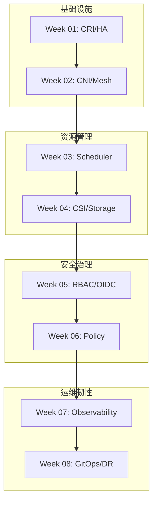

本学习计划专为具备系统运维基础的高级工程师设计, 侧重于从 SRE (Site Reliability Engineering) 维度深入剖析 Kubernetes 的底层逻辑、集群稳定性治理及生产级安全架构.

## 核心学习模块大纲

### 第一阶段: 容器基础设施与集群引导 (Week 1-2)

*   **Week 01: 容器运行时深度剖析与高可用初始化**
    *   **底层原理**: Cgroups V2 (CFS/Memory), Namespaces (PID/NET/MNT), OCI Runtime (runc).
    *   **架构核心**: CRI 标准, Containerd Ansiballz 封包, Kubelet 交互全链路.
    *   **实战目标**: 离线环境 kubeadm HA 集群引导, PKI 证书体系, 外部 LB 配置.

*   **Week 02: 软件定义网络 (SDN) 与流量治理**
    *   **底层原理**: NetNS, Veth-pair, Bridge, eBPF 内核转发路径.
    *   **架构核心**: Cilium KPR (Kube-Proxy Replacement), Gateway API, Istio Ambient Mesh.
    *   **实战目标**: L2 Announcement VIP 暴露, HTTPRoute 路由, mTLS 零信任加密.

---

### 第二阶段: 资源调度与持久化存储 (Week 3-4)

*   **Week 03: 高级负载编排与调度算法内核**
    *   **底层原理**: CFS Bandwidth Controller (Throttling), OOM Score Adjust, Scheduling Framework.
    *   **架构核心**: Filtering/Scoring 插件, Topology Spread Constraints, Descheduler.
    *   **实战目标**: HPA `behavior` API 调优, VPA 组件部署, PDB 配置.

*   **Week 04: CSI 规范与分布式存储集成**
    *   **底层原理**: CSI 挂载三阶段 (Provision, Attach, Mount), VolumeMode Block vs Filesystem.
    *   **架构核心**: CSI Controller/Node 服务, VolumeSnapshot & Clone, Rook/Ceph Operator.
    *   **实战目标**: Local PV 静态供应, 卷扩容, I/O 故障诊断 (blktrace).

---

### 第三阶段: 集群安全韧性与策略治理 (Week 5-6)

*   **Week 05: 身份认证与精细化访问控制 (RBAC/OIDC)**
    *   **底层原理**: X.509 证书认证链, Bound ServiceAccount Token, API Server 审计日志.
    *   **架构核心**: RBAC 聚合 (aggregationRule), OIDC 集成 (Dex/Keycloak), 多租户 ResourceQuota.
    *   **实战目标**: 最小权限 Role 设计, Audit Policy 配置, kubectl-who-can 扫描.

*   **Week 06: 云原生安全加固与策略自动化**
    *   **底层原理**: Seccomp Profile (syscall 限制), AppArmor/SELinux MAC, Admission Webhook 流程.
    *   **架构核心**: Pod Security Standards (Restricted), Kyverno 策略 (Validate/Mutate/Generate).
    *   **实战目标**: 镜像签名验证 (Cosign), Trivy 漏洞扫描 CI/CD 集成.

---

### 第四阶段: 全栈可观测性与 GitOps 交付 (Week 7-8)

*   **Week 07: 监控、日志与链路追踪 (Three Pillars)**
    *   **底层原理**: Prometheus TSDB 压缩算法, Loki 只索引 Labels, OpenTelemetry Trace/Span.
    *   **架构核心**: PromQL 聚合, Recording/Alerting Rules, Alertmanager 路由与静默.
    *   **实战目标**: 黄金信号 Dashboard (Latency/Traffic/Errors/Saturation), 告警抑制逻辑.

*   **Week 08: 持续交付 (GitOps) 与灾难恢复 (DR)**
    *   **底层原理**: Etcd Raft 一致性 (Quorum, WAL, Snapshot), ArgoCD 同步机制.
    *   **架构核心**: Application CRD, Sync Waves & Hooks, Velero 资源/PV 备份, Chaos Mesh.
    *   **实战目标**: Etcd 快照恢复演练, ArgoCD 漂移自愈验证, Pod Chaos 韧性测试.

---

## 学习路径知识图谱

---

> 通过本计划, 你将不仅掌握 Kubernetes 的操作命令, 更能从内核视角和架构思维去理解系统为何如此设计, 从而在生产环境中具备对复杂故障的深度排障能力.