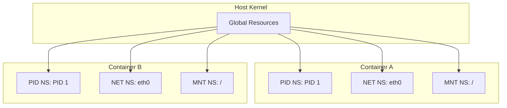
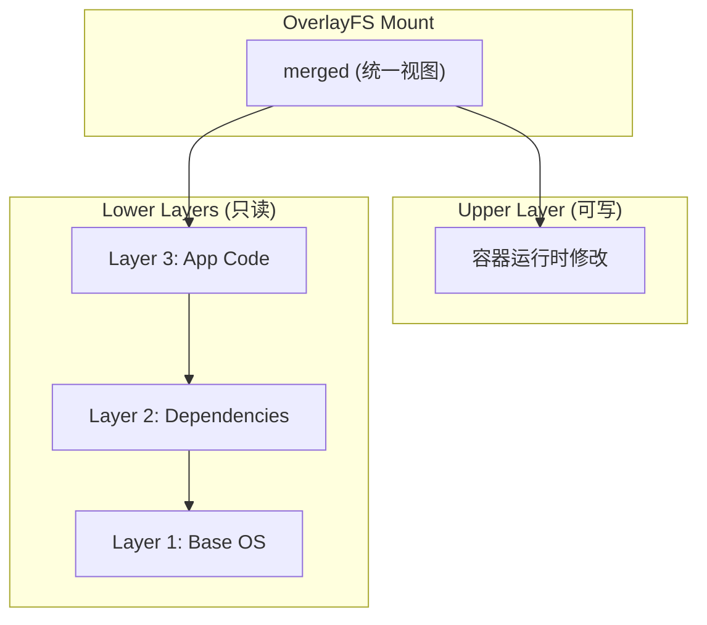
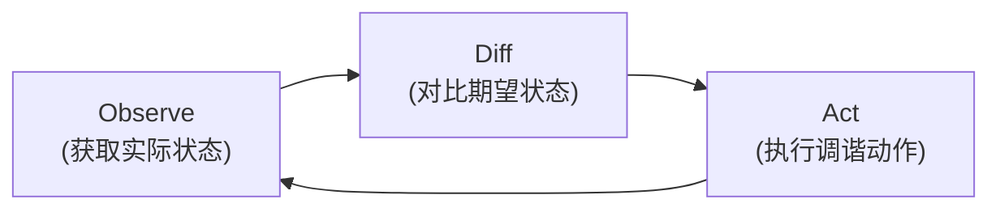
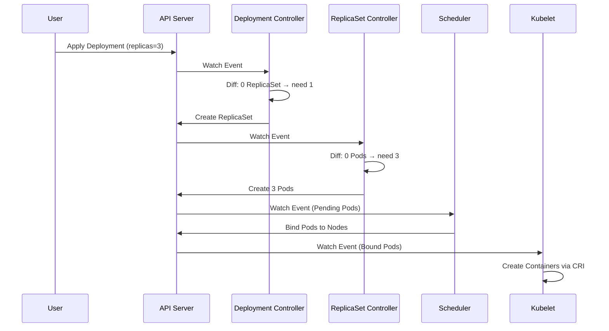
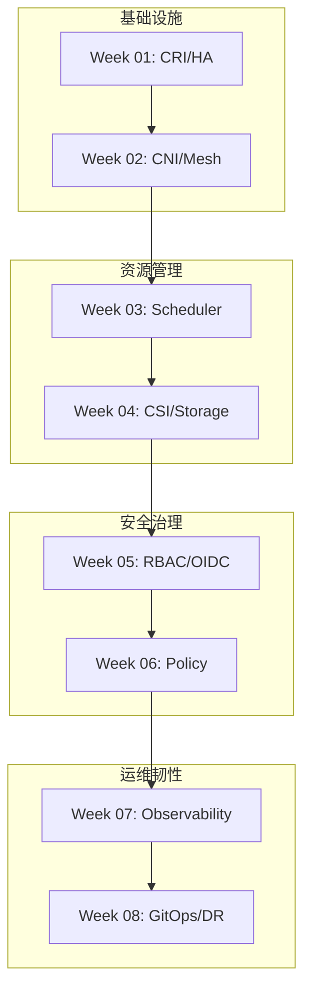

本学习计划专为具备系统运维基础的高级工程师设计, 侧重于从 SRE (Site Reliability Engineering) 维度深入剖析 Kubernetes 的底层逻辑、集群稳定性治理及生产级安全架构.

---

## 云原生的四大基石

Kubernetes 的成功并非凭空而来, 它建立在 Linux 内核的成熟隔离机制与分布式系统理论之上. 理解这些基石是深入掌握容器编排的前提.

### 1. Linux Namespace: 进程级资源隔离

Namespace 为进程提供了一个**独立的系统资源视图**, 使其仿佛运行在独立的操作系统中.



| Namespace | 隔离内容 | 内核 Flag | 容器中的体现 |
| :--- | :--- | :--- | :--- |
| **PID** | 进程 ID 编号空间 | `CLONE_NEWPID` | 容器内 PID 1 实际映射到宿主机某个 PID |
| **NET** | 网络设备、协议栈、端口 | `CLONE_NEWNET` | 独立的 `eth0`, 独立的 iptables 规则 |
| **MNT** | 文件系统挂载点 | `CLONE_NEWNS` | 容器根目录 `/` 与宿主机完全隔离 |
| **UTS** | 主机名、域名 | `CLONE_NEWUTS` | 容器可设置独立的 hostname |
| **IPC** | 信号量、消息队列、共享内存 | `CLONE_NEWIPC` | 进程间通信资源隔离 |
| **User** | UID/GID 映射 | `CLONE_NEWUSER` | 容器内 root 映射为宿主机非特权用户 |
| **Cgroup** | Cgroup 根目录视图 | `CLONE_NEWCGROUP` | 容器只能看到自己的 Cgroup 层级 |

*   **关键系统调用**: `clone(2)` 创建新进程并放入新 Namespace, `setns(2)` 加入已存在的 Namespace, `unshare(2)` 将当前进程移入新 Namespace.
*   **持久化**: Namespace 的生命周期由引用计数管理, 可通过 bind mount `/proc/<pid>/ns/*` 文件实现持久化.

### 2. Cgroups: 资源配额与限制

Cgroups (Control Groups) 提供了**资源限制、优先级分配、审计与控制**的能力, 是容器 "受控运行" 的保障.

**Cgroup V2 统一层级架构:**

```
/sys/fs/cgroup/
├── cgroup.controllers        # 可用控制器列表
├── cgroup.subtree_control    # 子树激活的控制器
├── kubepods.slice/
│   ├── cpu.max               # CPU 带宽限制
│   ├── memory.max            # 内存硬限制
│   ├── memory.high           # 内存软限制 (触发回收)
│   └── io.max                # I/O 带宽限制
```

| 控制器 | 功能 | 关键文件 | Kubernetes 映射 |
| :--- | :--- | :--- | :--- |
| **cpu** | CFS 带宽限制 | `cpu.max` (quota period) | `resources.limits.cpu` |
| **memory** | 内存使用上限 | `memory.max`, `memory.high` | `resources.limits.memory` |
| **io** | 块设备 I/O 限速 | `io.max` | 尚未原生支持, 需 CSI 配合 |
| **pids** | 进程数量限制 | `pids.max` | `--pod-max-pids` Kubelet 参数 |

**CFS 带宽控制器原理:**

```
周期 (period) = 100ms
配额 (quota)  = 50ms
→ 容器每 100ms 最多使用 50ms CPU 时间 (等效 0.5 核)
→ 超出配额触发 Throttling, 进程进入不可调度状态
```

*   **OOM Score**: Kubelet 通过 `/proc/<pid>/oom_score_adj` 调整进程的 OOM 优先级, QoS 等级越低 (BestEffort), 值越高, 越容易被杀死.

### 3. OverlayFS: 分层镜像与写时复制

OverlayFS 是容器镜像 **分层存储** 的内核基础, 实现了镜像复用与容器隔离的平衡.

**工作原理:**



| 层级 | 特性 | 示例 |
| :--- | :--- | :--- |
| **lowerdir** | 只读, 可堆叠多层 | 镜像各层 (共享, 不可修改) |
| **upperdir** | 可写, 容器运行时变更 | 容器内创建/修改的文件 |
| **merged** | 联合挂载呈现的统一视图 | 容器进程看到的根文件系统 |
| **workdir** | OverlayFS 内部使用 | 原子操作的临时目录 |

**写时复制 (Copy-on-Write):**

1.  **读取**: 优先从 upperdir 查找, 未找到则遍历 lowerdir 层级.
2.  **写入**: 如果文件在 lowerdir, 先复制到 upperdir, 再修改 (copy-up).
3.  **删除**: 在 upperdir 创建 `whiteout` 文件遮蔽 lowerdir 中的原文件.

*   **性能考量**: 首次写入大文件时触发 copy-up, 可能导致延迟峰值. 对于写密集型应用, 建议使用 Volume 挂载绕过 OverlayFS.

### 4. 声明式 API 与调谐循环: 分布式系统的核心范式

Kubernetes 的设计哲学是 **声明式 (Declarative)** 而非命令式. 用户描述期望状态 (Desired State), 系统自动驱动实际状态 (Actual State) 向期望状态收敛.

**声明式 vs 命令式:**

| 范式 | 描述 | 示例 | 特点 |
| :--- | :--- | :--- | :--- |
| **命令式** | 告诉系统 "做什么" | `kubectl run nginx` | 一次性操作, 无法自愈 |
| **声明式** | 告诉系统 "要什么" | `kubectl apply -f deployment.yaml` | 可重复, 可审计, 可自愈 |

**调谐循环 (Reconciliation Loop):**

Kubernetes Controller 的核心是一个无限循环, 持续对比期望状态与实际状态, 并采取行动消除差异:



**Controller 工作流程 (以 Deployment 为例):**



**关键设计原则:**

*   **Level-triggered (电平触发)**: Controller 基于当前状态做决策, 而非事件历史. 即使错过事件, 下次调谐仍能正确处理.
*   **Idempotent (幂等性)**: 同一调谐动作可重复执行, 结果一致. 这是 `kubectl apply` 可重复执行的基础.
*   **Optimistic Concurrency**: 通过 `resourceVersion` 实现乐观锁, 避免并发冲突.
*   **Watch + Informer Cache**: Controller 不直接查询 API Server, 而是通过本地缓存 (Informer) 获取状态, 减少 API Server 压力.

**自愈能力的来源:**

当实际状态偏离期望状态 (如 Pod 被意外删除), Controller 的调谐循环会**自动检测差异并创建新 Pod**, 无需人工干预. 这是 Kubernetes "自愈" 能力的本质.

### 基石总结

| 基石 | 层级 | 核心能力 | Kubernetes 依赖 |
| :--- | :--- | :--- | :--- |
| **Namespace** | Linux 内核 | 进程隔离, 资源视图隔离 | Pod 隔离, 网络隔离, 文件系统隔离 |
| **Cgroups** | Linux 内核 | 资源限制, 优先级, 审计 | QoS 分类, CPU/Memory Limits, OOM 处理 |
| **OverlayFS** | Linux 内核 | 分层存储, 写时复制 | 镜像复用, 容器可写层, 快速启动 |
| **声明式 API + 调谐循环** | 分布式系统理论 | 期望状态描述, 状态收敛, 自愈 | Controller 架构, GitOps, 最终一致性 |

> 这四大基石共同构成了容器编排的技术根基: **Namespace 提供隔离**, **Cgroups 提供限制**, **OverlayFS 提供存储**, **声明式 API 与调谐循环提供自愈**. 理解它们, 才能真正理解 Kubernetes 为何如此设计.

---

## 核心学习模块大纲

### 第一阶段: 容器基础设施与集群引导 (Week 1-2)

*   **Week 01: 容器运行时深度剖析与高可用初始化**
    *   **底层原理**: Cgroups V2 (CFS/Memory), Namespaces (PID/NET/MNT), OCI Runtime (runc).
    *   **架构核心**: CRI 标准, Containerd Ansiballz 封包, Kubelet 交互全链路.
    *   **实战目标**: 离线环境 kubeadm HA 集群引导, PKI 证书体系, 外部 LB 配置.

*   **Week 02: 软件定义网络 (SDN) 与流量治理**
    *   **底层原理**: NetNS, Veth-pair, Bridge, eBPF 内核转发路径.
    *   **架构核心**: Cilium KPR (Kube-Proxy Replacement), Gateway API, Istio Ambient Mesh.
    *   **实战目标**: L2 Announcement VIP 暴露, HTTPRoute 路由, mTLS 零信任加密.

---

### 第二阶段: 资源调度与持久化存储 (Week 3-4)

*   **Week 03: 高级负载编排与调度算法内核**
    *   **底层原理**: CFS Bandwidth Controller (Throttling), OOM Score Adjust, Scheduling Framework.
    *   **架构核心**: Filtering/Scoring 插件, Topology Spread Constraints, Descheduler.
    *   **实战目标**: HPA `behavior` API 调优, VPA 组件部署, PDB 配置.

*   **Week 04: CSI 规范与分布式存储集成**
    *   **底层原理**: CSI 挂载三阶段 (Provision, Attach, Mount), VolumeMode Block vs Filesystem.
    *   **架构核心**: CSI Controller/Node 服务, VolumeSnapshot & Clone, Rook/Ceph Operator.
    *   **实战目标**: Local PV 静态供应, 卷扩容, I/O 故障诊断 (blktrace).

---

### 第三阶段: 集群安全韧性与策略治理 (Week 5-6)

*   **Week 05: 身份认证与精细化访问控制 (RBAC/OIDC)**
    *   **底层原理**: X.509 证书认证链, Bound ServiceAccount Token, API Server 审计日志.
    *   **架构核心**: RBAC 聚合 (aggregationRule), OIDC 集成 (Dex/Keycloak), 多租户 ResourceQuota.
    *   **实战目标**: 最小权限 Role 设计, Audit Policy 配置, kubectl-who-can 扫描.

*   **Week 06: 云原生安全加固与策略自动化**
    *   **底层原理**: Seccomp Profile (syscall 限制), AppArmor/SELinux MAC, Admission Webhook 流程.
    *   **架构核心**: Pod Security Standards (Restricted), Kyverno 策略 (Validate/Mutate/Generate).
    *   **实战目标**: 镜像签名验证 (Cosign), Trivy 漏洞扫描 CI/CD 集成.

---

### 第四阶段: 全栈可观测性与 GitOps 交付 (Week 7-8)

*   **Week 07: 监控、日志与链路追踪 (Three Pillars)**
    *   **底层原理**: Prometheus TSDB 压缩算法, Loki 只索引 Labels, OpenTelemetry Trace/Span.
    *   **架构核心**: PromQL 聚合, Recording/Alerting Rules, Alertmanager 路由与静默.
    *   **实战目标**: 黄金信号 Dashboard (Latency/Traffic/Errors/Saturation), 告警抑制逻辑.

*   **Week 08: 持续交付 (GitOps) 与灾难恢复 (DR)**
    *   **底层原理**: Etcd Raft 一致性 (Quorum, WAL, Snapshot), ArgoCD 同步机制.
    *   **架构核心**: Application CRD, Sync Waves & Hooks, Velero 资源/PV 备份, Chaos Mesh.
    *   **实战目标**: Etcd 快照恢复演练, ArgoCD 漂移自愈验证, Pod Chaos 韧性测试.

---

## 学习路径知识图谱



---

> 通过本计划, 你将不仅掌握 Kubernetes 的操作命令, 更能从内核视角和架构思维去理解系统为何如此设计, 从而在生产环境中具备对复杂故障的深度排障能力.