## 概述

操作系统 (Operating System, OS) 是计算机系统中最核心的系统软件, 位于硬件与应用程序之间, 承担资源管理与环境抽象的双重职责. 本模块从操作系统的本质出发, 深入 CPU 特权级机制, 内核架构设计与系统启动流程.

---

## 关键概念速查

| 概念 | 英文 | 定义 | 关联内核源码 |
| :--- | :--- | :--- | :--- |
| 操作系统 | Operating System | 管理硬件资源, 提供程序运行环境的系统软件 | - |
| 内核 | Kernel | OS 核心, 运行在最高特权级 | `init/main.c` |
| 用户态 | User Mode | 受限执行模式, 无法直接访问硬件 | - |
| 内核态 | Kernel Mode | 完全特权模式, 可执行所有指令 | - |
| 特权级 | Privilege Level | CPU 硬件保护机制 (x86 Ring 0-3) | `arch/x86/include/asm/desc.h` |
| GDT | Global Descriptor Table | 段描述符表, 定义内存段属性 | `arch/x86/kernel/cpu/common.c` |
| TSS | Task State Segment | 存储特权级切换所需栈指针 | `arch/x86/include/asm/processor.h` |
| LKM | Loadable Kernel Module | 可动态加载的内核扩展 | `kernel/module/main.c` |
| Namespace | 命名空间 | 容器隔离机制 | `include/linux/nsproxy.h` |
| Cgroups | Control Groups | 资源限制机制 | `kernel/cgroup/` |

---

## 模块知识结构

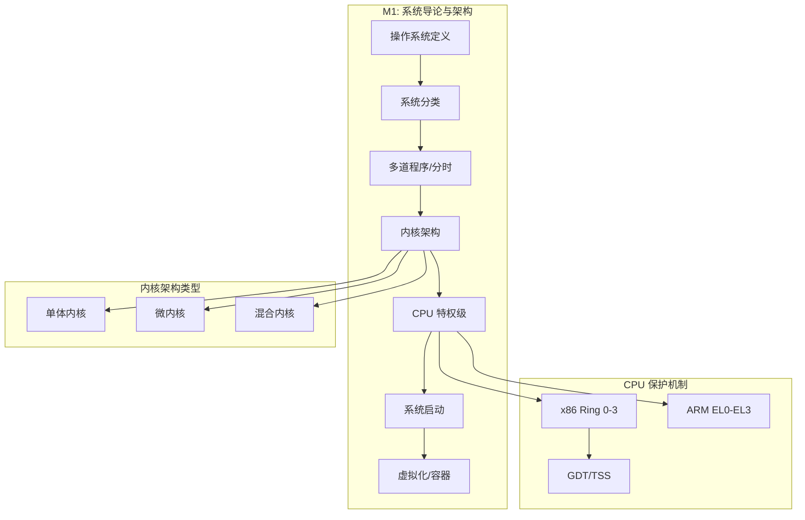

---

## 1. 操作系统的本质

### 1.1 两种经典视角

| 视角 | 英文 | 核心职责 |
| :--- | :--- | :--- |
| 资源管理器 | Resource Manager | 管理 CPU, 内存, I/O 设备, 在竞争者间分配资源 |
| 扩展机器 | Extended Machine | 向上层提供简洁抽象 (进程, 文件, 套接字), 屏蔽硬件复杂性 |

### 1.2 OSTEP 三大抽象

*Operating Systems: Three Easy Pieces* 将操作系统核心职能归纳为:

| 抽象 | 英文 | 实现手段 |
| :--- | :--- | :--- |
| 虚拟化 | Virtualization | 每个进程拥有独立 CPU 和地址空间的假象 |
| 并发 | Concurrency | 多执行流协调, 锁/信号量/条件变量 |
| 持久化 | Persistence | 文件系统, 数据可靠存储 |

### 1.3 操作系统的四大特征

| 特征 | 英文 | 描述 | 底层深度解析 |
| :--- | :--- | :--- | :--- |
| **并发** | Concurrency | 两个或多个事件在同一时间间隔内发生 | 与并行 (Parallel) 不同, 并发侧重逻辑上的重叠与资源竞争管理. |
| **共享** | Sharing | 系统中的资源可供多个执行流共同使用 | 分为互斥共享 (如打印机) 与同时访问 (如磁盘文件). |
| **虚拟** | Virtualization | 通过物理实体映射为多个逻辑对应物 | 核心在于 "假象" (Illusion), 如每个进程都认为自己拥有 CPU 和内存. |
| **异步** | Asynchrony | 进程以不可预知的速度向前推进 | OS 必须通过同步原语确保在异步执行环境下的结果确定性. |

### 1.4 操作系统的定义 (多视角)

| 定义角度 | 描述 |
| :--- | :--- |
| **控制程序** | 控制用户程序执行, 防止错误 and 不当使用计算机 |
| **资源管理器** | 在冲突的资源请求之间做出裁决 |
| **内核** | 系统中始终运行的程序 (狭义定义) |

### 1.5 操作系统工作举例

**示例 1: 用户双击打开一个 Word 文档**
- 鼠标中断 -> 窗口管理 -> 文件系统 -> 进程创建 -> 内存分配 -> 加载程序.

**示例 2: Web 服务器处理 HTTP 请求**
- 网卡硬中断 -> 软中断 (NAPI) -> 协议栈 -> 唤醒服务器进程.

### 1.6 操作系统发展史与里程碑

#### 发展阶段总览

| 阶段 | 年代 | 核心特征 | 代表性突破 |
| :--- | :--- | :--- | :--- |
| **第一代** | 1945-1955 | 真空管, 手工操作 | 无操作系统, 人工控制 |
| **第二代** | 1955-1965 | 晶体管, 批处理 | 作业调度, 监控程序 |
| **第三代** | 1965-1980 | 集成电路, 多道程序 | 分时, 虚拟内存, UNIX |
| **第四代** | 1980-2010 | VLSI, 个人计算机 | GUI, 网络, 硬件虚拟化 |
| **第五代** | 2010-now | 云原生, 异构计算 | 容器, eBPF, Rust 内核, ARM 桌面 |

#### 里程碑时间线

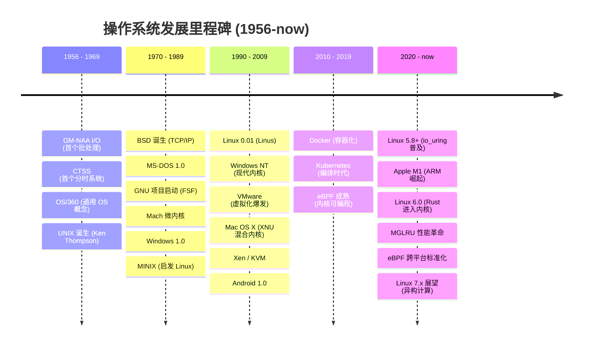

#### UNIX 家族演化树 (1969-now)

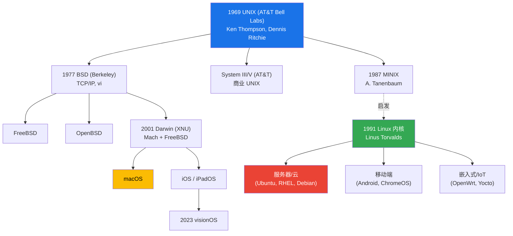

#### 现状摘要

Linux 已不仅是桌面或服务器系统, 而是构建现代基础设施的基石:
*   **服务器/云**: 90%+ 公有云运行 Linux, 支撑容器化 (containerd/CRI-O) 生态.
*   **移动端**: Android 拥有 30 亿+ 设备.
*   **高性能计算**: Top500 超算 100% 运行 Linux.
*   **特殊用途**: 特斯拉, Waymo 等自动驾驶系统的核心均为深度定制的 Linux 内核.
*   **边缘 AI**: NVIDIA Jetson, Qualcomm RB 系列

---

## 2. 操作系统分类

### 2.1 按处理方式分类

| 类型 | 英文 | 特点 | 典型系统 |
| :--- | :--- | :--- | :--- |
| 批处理系统 | Batch System | 作业排队, 无交互, 追求吞吐量 | IBM OS/360 |
| 分时系统 | Time-sharing System | 时间片轮转, 多用户交互 | UNIX, Linux |
| 实时系统 | Real-time System | 严格时限, 确定性响应 | VxWorks, QNX |
| 分布式系统 | Distributed System | 多机协作, 透明性 | Plan 9 |

### 2.2 实时系统细分

| 类型 | 英文 | 约束 | 示例 |
|------|------|------|------|
| 硬实时 | Hard Real-time | 错过截止时间导致灾难性后果 | 航空电子, 核电站控制 |
| 软实时 | Soft Real-time | 偶尔错过可容忍, 性能下降但不致命 | 视频播放, VoIP |

---

## 3. 多道程序与分时技术

### 3.1 多道程序设计 (Multiprogramming)

**核心思想**: 内存中同时驻留多道程序, 当一道程序等待 I/O 时, CPU 切换执行另一道.

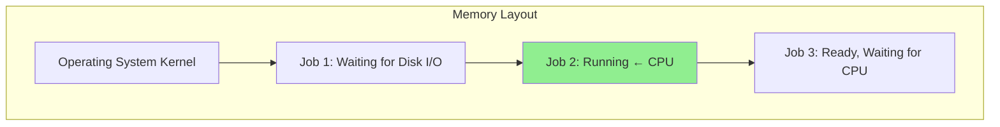

**CPU 利用率模型**:

设单个程序 I/O 等待时间占比为 p, 内存中有 n 道程序:

```
CPU 利用率 = 1 - p^n

示例: p = 0.8 (80% 时间等待 I/O)
n = 1: 利用率 = 20%
n = 3: 利用率 = 1 - 0.8³ = 48.8%
n = 5: 利用率 = 1 - 0.8⁵ = 67.2%
```

### 3.2 分时技术 (Time-sharing)

**核心机制**: 将 CPU 时间划分为固定长度的时间片 (Time Slice / Quantum), 轮流分配给各用户进程.

| 参数 | 典型值 | 影响 |
|------|--------|------|
| 时间片过长 | `>100ms` | 退化为批处理, 交互响应慢 |
| 时间片过短 | `<1ms` | 上下文切换开销占比过高 |
| Linux CFS | 动态 (约 1-10ms) | 根据进程数动态调整 |

### 3.3 Spooling 假脱机技术

**Spooling (Simultaneous Peripheral Operations On-Line)**: 利用磁盘作为缓冲区, 将慢速 I/O 设备与高速 CPU 解耦.

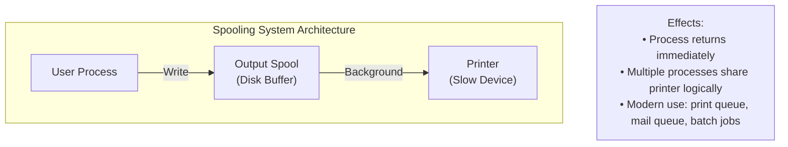

---

## 4. 操作系统内核结构

### 4.1 架构演进

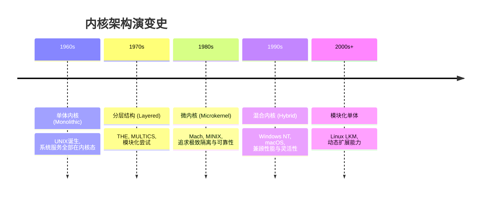

### 4.2 典型架构对比

| 架构类型 | 核心描述 | 代表系统 | 底层深度解析 |
| :--- | :--- | :--- | :--- |
| **单体内核 (Monolithic)** | 系统服务均运行于 Ring 0 空间 | Linux, FreeBSD | **性能极致**, 内部调用开销小; 但一个驱动崩溃可能导致全盘崩溃. |
| **微内核 (Microkernel)** | 仅保留 IPC,基础调度等于内核 | Mach, L4, Minix | **高度可靠,安全**, 但由于频繁的跨层 IPC, **性能损耗明显**. |
| **层级结构 (Layered)** | 严格划分 L0 (硬件) 到 Ln (应用) | THE 系统 | 逻辑严密, 易于验证; 但调用链条过长导致效率下降. |
| **混合内核 (Hybrid)** | 单体性能基础上引入微内核模块化 | Windows NT, macOS | 兼顾性能与开发灵活性, 是现代商业系统的首选. |
| **外核 (Exokernel)** | 仅负责资源保护, 抽象交给应用级库 | MIT Aegis | 减少了不必要的内核抽象开销, 适合极致性能定制. |
| **Unikernel** | 应用与内核组件编译为单一镜像 | MirageOS | 容器化时代的轻量化方案, 攻击面极小, 无需传统权限隔离. |

### 4.3 Linux 内核架构

Linux 采用单体内核核心 + 可加载内核模块 (Loadable Kernel Module, LKM) 的架构, 在保持高性能的同时获得了极佳的扩展性:

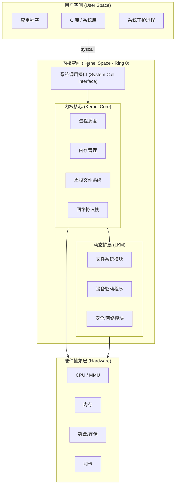

**LKM 操作命令**:

```bash
# 查看已加载模块
lsmod

# 加载模块
modprobe <module_name>

# 查看模块信息
modinfo <module_name>

# 卸载模块
rmmod <module_name>
```

---

## 5. CPU 特权级与保护机制

### 5.1 双模式运行

现代处理器至少支持两种运行模式 (有些支持更多):

| 模式 | 英文 | 权限 | 典型代码 |
|------|------|------|----------|
| 用户态 | User Mode | 受限, 不可执行特权指令 | 用户应用程序 |
| 内核态 | Kernel Mode | 完全权限, 可访问所有硬件 | 内核代码,驱动程序 |

### 5.2 特权指令与非特权指令

**指令分类**:

| 类型 | 英文 | 说明 | 举例 |
|------|------|------|----------|
| 特权指令 | Privileged Instructions | 仅在内核态可执行 | `hlt`, `lgdt`, `lidt`, `mov crX`, `in/out` |
| 非特权指令 | Non-privileged Instructions | 任意模式可执行 | `add`, `sub`, `mov`, `jmp`, `call` |

**x86 典型特权指令**:

| 指令 | 功能 | 为何需要特权 |
|------|------|--------------|
| `hlt` | 停止 CPU | 恶意停机 |
| `lgdt` / `lidt` | 加载 GDT/IDT 寄存器 | 控制内存保护和中断 |
| `ltr` | 加载任务寄存器 | 控制任务切换 |
| `mov crX` | 访问控制寄存器 | 控制分页,保护模式 |
| `in` / `out` | I/O 端口访问 | 控制硬件设备 |
| `cli` / `sti` | 关闭/开启中断 | 影响系统响应性 |
| `wrmsr` | 写 MSR 寄存器 | 控制 CPU 特性 |
| `invlpg` | 刷新 TLB 条目 | 影响地址转换 |

**非特权指令在用户态执行特权操作会怎样?**

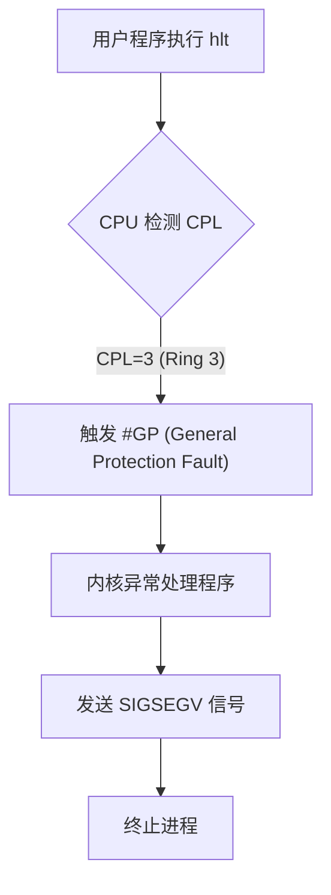

### 5.3 CPU 状态及状态转换

**CPU 状态标识 (x86)**:

CS (Code Segment) 寄存器的低 2 位存储 CPL (Current Privilege Level):

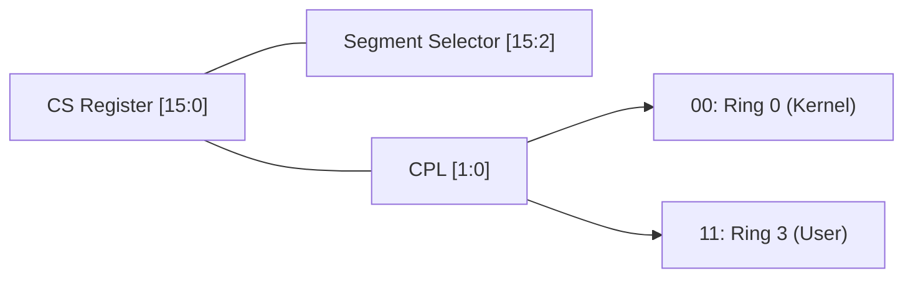

**用户态到内核态的转换途径**:

| 途径 | 英文 | 触发条件 | 示例 |
|------|------|----------|------|
| 系统调用 | System Call | 用户程序请求内核服务 | `read()`, `write()`, `fork()` |
| 异常 | Exception | 程序执行错误 | 除零, 缺页, 非法指令 |
| 中断 | Interrupt | 外部设备事件 | 键盘, 网卡, 定时器 |

**状态转换交互**:

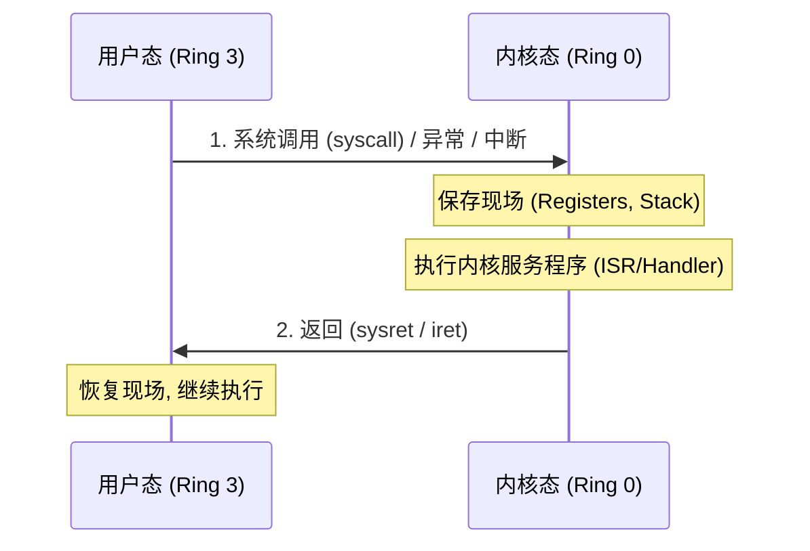

**CPU 状态切换时的硬件保存操作**:

```
Ring 3 → Ring 0 切换时 (如系统调用):

1. 从 TSS 读取 Ring 0 栈指针 (rsp0)
2. 切换到内核栈
3. 在内核栈上保存:
   ┌─────────────────┐
   │  用户态 SS      │
   ├─────────────────┤
   │  用户态 RSP     │
   ├─────────────────┤
   │  RFLAGS        │
   ├─────────────────┤
   │  用户态 CS      │
   ├─────────────────┤
   │  用户态 RIP     │
   └─────────────────┘
4. 加载内核态 CS:RIP (从 IDT 或 MSR)
5. 更新 CPL 为 0
```

### 5.2 x86/x64 特权级 (Ring)

Intel x86 架构定义 4 个特权级 (Ring 0-3), 现代操作系统通常仅使用 Ring 0 (最高特权) 和 Ring 3 (应用层).

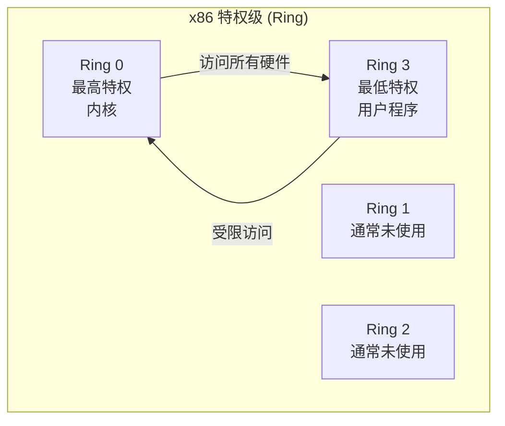

### 5.3 x86 保护模式核心结构

#### 5.3.1 全局描述符表 (GDT)

GDT (Global Descriptor Table) 定义内存段的属性:

```c
// 段描述符结构 (8 字节)
struct segment_descriptor {
    uint16_t limit_low;      // 段限长 [15:0]
    uint16_t base_low;       // 基地址 [15:0]
    uint8_t  base_mid;       // 基地址 [23:16]
    uint8_t  access;         // 访问权限 (P, DPL, S, Type)
    uint8_t  limit_high_flags; // 限长[19:16] + 标志(G, D/B, L, AVL)
    uint8_t  base_high;      // 基地址 [31:24]
};
```

**GDT 典型布局**:

| 索引 | 描述符 | 用途 |
|------|--------|------|
| 0 | Null | 必须为空 |
| 1 | 内核代码段 | Ring 0, 可执行 |
| 2 | 内核数据段 | Ring 0, 可读写 |
| 3 | 用户代码段 | Ring 3, 可执行 |
| 4 | 用户数据段 | Ring 3, 可读写 |
| 5 | TSS | 任务状态段 |

#### 5.3.2 任务状态段 (TSS)

TSS (Task State Segment) 存储特权级切换时需要的栈指针:

```c
struct tss_struct {
    uint32_t reserved0;
    uint64_t rsp0;      // Ring 0 栈指针 (进入内核态时使用)
    uint64_t rsp1;      // Ring 1 栈指针
    uint64_t rsp2;      // Ring 2 栈指针
    // ... 其他字段
    uint64_t ist[7];    // 中断栈表 (IST)
    // ...
};
```

### 5.4 ARM 异常级别 (Exception Levels)

ARM 架构使用 EL0-EL3 四级异常级别:

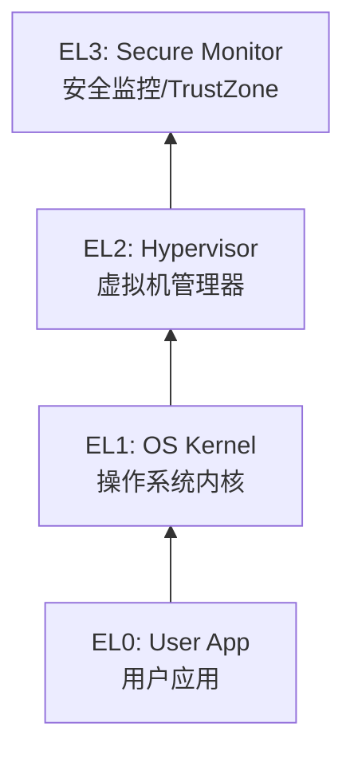

| 级别 | 名称 | 典型运行代码 |
|------|------|--------------|
| EL0 | User | 用户态应用程序 |
| EL1 | OS Kernel | 操作系统内核 |
| EL2 | Hypervisor | 虚拟机管理器 (KVM, Xen) |
| EL3 | Secure Monitor | ARM TrustZone 安全监控 |

### 5.5 RISC-V 特权模式

RISC-V 采用模块化设计, 定义三种基本特权模式:

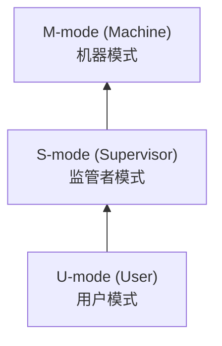

| 模式 | 编码 | 功能 | 典型运行代码 |
|------|------|------|--------------|
| **U-mode** | 00 | 用户态, 受限访问 | 用户应用程序 |
| **S-mode** | 01 | 管理虚拟内存, 中断 | OS 内核 (Linux) |
| **M-mode** | 11 | 最高特权, 直接访问硬件 | Bootloader, SBI |

**关键 CSR (Control and Status Registers)**:

| 寄存器 | 功能 | 模式 |
|--------|------|------|
| `mstatus` | 全局状态 (中断使能, 特权级) | M |
| `mepc` | 异常返回地址 | M |
| `mcause` | 异常/中断原因 | M |
| `stvec` | S-mode 陷阱向量基址 | S |
| `satp` | 页表基址 (类似 CR3) | S |

**RISC-V vs x86 vs ARM 对比**:

| 特性 | x86 (Ring) | ARM (EL) | RISC-V |
|------|------------|----------|--------|
| **层数** | 4 (常用 2) | 4 | 3 |
| **虚拟化层** | Ring 0 + VMX | EL2 | H-extension |
| **安全层** | SGX (飞地) | EL3/TZ | M-mode |
| **页表控制** | CR3 | TTBR | satp |
| **进入高特权** | syscall/int | svc/hvc/smc | ecall |

### 5.6 特权指令

仅在内核态 (Ring 0 / EL1+) 可执行:

| 类别 | x86 示例 | 说明 |
|------|----------|------|
| I/O 操作 | `IN`, `OUT` | 直接端口访问 |
| 中断控制 | `CLI`, `STI` | 关闭/开启中断 |
| 内存管理 | `MOV CR3, ...` | 修改页表基址 |
| 模式切换 | `SYSRET`, `IRET` | 返回用户态 |
| 缓存控制 | `WBINVD` | 写回并无效化缓存 |
| MSR 访问 | `WRMSR`, `RDMSR` | 读写模型特定寄存器 |

### 5.7 安全执行环境 (TEE)

随着物理攻击和旁路攻击的增加, 现代 CPU 提供了硬件级的安全隔离环境:

| 技术 | 厂商 | 核心机制 | 安全边界 |
|------|------|----------|----------|
| **TrustZone** | ARM | 世界切换 (Normal vs Secure World) | 物理上完全隔离的两个运行环境 |
| **SGX** | Intel | 飞地 (Enclave) | 加密内存区域, 即便内核也无法访问其内容 |
| **SEV** | AMD | 内存加密 (Secure Encrypted Virtualization) | 为每个虚拟机提供独立的加密密钥 |

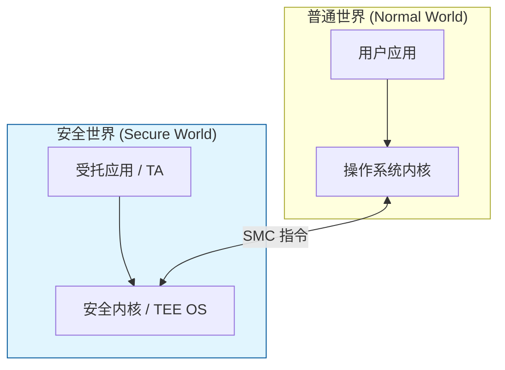

### 5.8 模式切换

| 触发方式 | 方向 | 机制 |
|----------|------|------|
| 系统调用 | User → Kernel | `syscall` / `sysenter` / `int 0x80` |
| 中断 | User → Kernel | 硬件自动陷入 |
| 异常 | User → Kernel | 错误触发 (如缺页) |
| 返回指令 | Kernel → User | `sysret` / `sysexit` / `iret` |

---

## 6. 系统启动流程

### 6.1 x86 启动流程全景分析

从硬件加电到内核接管之间存在复杂的 "自举" (Bootstrapping) 过程. 该过程跨越了多种 CPU 工作模式与特权级的跃迁:

```mermaid
graph TD
    %% 1. Power On & Firmware
    subgraph Phase1 ["I. 硬件与固件阶段 (16-bit Real Mode)"]
        direction TB
        Power([电源开启]) --> Reset["CPU Reset Vector<br/>CS:IP = F000:FFF0 (0xFFFFFFF0)"]
        Reset --> BIOS["UEFI/BIOS 初始化<br/>(POST / 硬件遍历 / 设备初始化)"]
        BIOS --> BootSelect["读取启动项 (Boot Priority)<br/>读取 MBR (512B) 或 EFI 启动分区"]
    end

    %% 2. Bootloader
    subgraph Phase2 ["II. 引导加载阶段 (Real -> Protected Mode)"]
        direction TB
        BootSelect --> GRUB1["GRUB Stage 1<br/>(MBR 代码 / 446 字节)"]
        GRUB1 --> GRUB2["GRUB Stage 2 / UEFI Loader<br/>(内核自解压镜像 vmlinuz 加载)"]
        GRUB2 --> JumpKernel["跳转至内核入口 (entry_64 / bootsect)"]
    end

    %% 3. Kernel Setup
    subgraph Phase3 ["III. 内核设置阶段 (32-bit Protected Mode)"]
        direction TB
        JumpKernel --> SetupBin["执行 setup.bin<br/>(开启 A20 / 初始化临时 GDT/IDT)"]
        SetupBin --> SwitchPE["设置 CR0.PE 位<br/>(切换至 32 位保护模式)"]
        SwitchPE --> Decompress["解压内核映像 (vmlinux)"]
    end

    %% 4. Kernel Architecture
    subgraph Phase4 ["IV. 内核核心初始化阶段 (64-bit Long Mode)"]
        direction TB
        Decompress --> Paging["开启 4/5 级页表<br/>(设置 CR0.PG 开启分页)"]
        Paging --> StartKernel["start_kernel()<br/>(mm/sched/vfs 全组件初始化)"]
        StartKernel --> InitRD["挂载 initramfs<br/>(加载内核模块/驱动)"]
        InitRD --> PivotRoot["pivot_root<br/>(切换至真实根文件系统)"]
    end

    %% 5. User Space initiation
    subgraph Phase5 ["V. 用户空间初始化 (Ring 3)"]
        direction TB
        PivotRoot --> PID1["执行 /sbin/init (systemd)<br/>(内核态 -> 用户态切换)"]
        PID1 --> Target["启动 Systemd Target / Multi-user"]
        Target --> Login(["用户登录界面 / GUI"])
    end

    Phase1 --> Phase2
    Phase2 --> Phase3
    Phase3 --> Phase4
    Phase4 --> Phase5

    %% Styling for Expert Look
    style Phase1 fill:#fff9c4,stroke:#fbc02d,color:#000
    style Phase3 fill:#e1f5fe,stroke:#03a9f4,color:#000
    style Phase4 fill:#e8f5e9,stroke:#4caf50,color:#000
    style Phase5 fill:#f3e5f5,stroke:#9c27b0,color:#000
```

### 6.2 关键数据结构 (MBR/UEFI)

**MBR (Master Boot Record)**:
位于磁盘首扇区 (512字节).

| 偏移 | 大小 | 内容 |
|------|------|------|
| 0x000 | 446 字节 | 引导程序代码 (Bootstrap Code) |
| 0x1BE | 64 字节 | 分区表 (4 个主分区, 每个 16 字节) |
| 0x1FE | 2 字节 | 魔数 0x55AA (启动签名) |

**UEFI vs Legacy BIOS**:

| 对比项 | Legacy BIOS | UEFI |
|--------|-------------|------|
| 启动模式 | 16-bit 实模式 | 32/64-bit 保护模式 |
| 磁盘分区 | MBR (最大 2TB) | GPT (最大 9.4 ZB) |
| 启动程序 | 固定 446 字节 | EFI 应用程序, 无大小限制 |
| 安全启动 | 不支持 | Secure Boot |

### 6.3 从 BIOS 到保护模式

```
实模式 (16-bit)                    保护模式 (32/64-bit)
    │                                     │
    │ 1. 加载 GDT                          │
    │ 2. 开启 A20 地址线                   │
    │ 3. 设置 CR0.PE = 1                   │
    │ 4. 远跳转刷新流水线                   │
    │                                     │
    └──────── ljmp ────────────────────────┘
```

### 6.4 Linux 内核启动关键函数

```c
// init/main.c - 内核入口点
asmlinkage __visible void __init start_kernel(void)
{
    // 1. 基础初始化
    setup_arch(&command_line);        // 架构相关初始化
    mm_init();                        // 内存管理初始化
    sched_init();                     // 调度器初始化
    
    // 2. 设备初始化
    early_irq_init();                 // 中断初始化
    init_timers();                    // 定时器初始化
    
    // 3. 子系统初始化
    vfs_caches_init();                // VFS 缓存初始化
    signals_init();                   // 信号初始化
    
    // 4. 启动用户空间
    rest_init();                      // 创建 init 进程
}
```

### 6.5 initramfs 与根文件系统切换

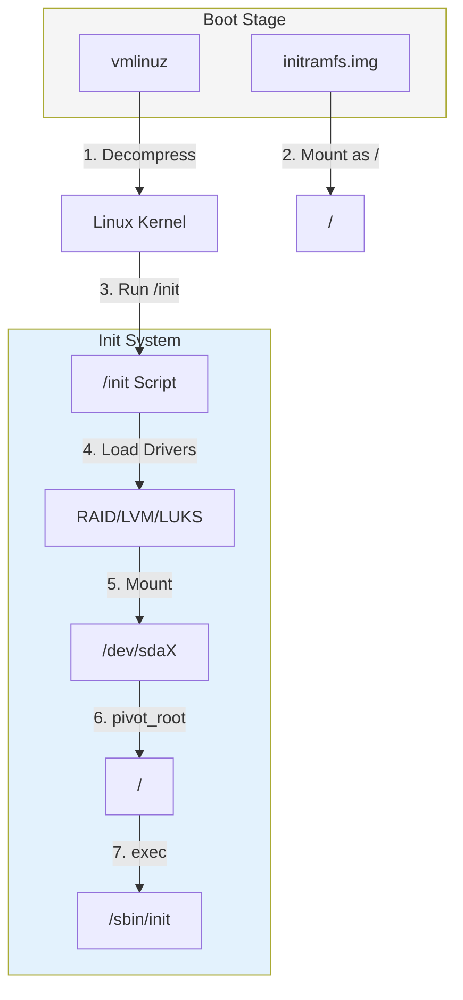

---

## 7. 虚拟化扩展

### 7.1 CPU 虚拟化支持

| 技术 | 厂商 | 功能 |
|------|------|------|
| VT-x | Intel | VMX root/non-root 模式 |
| AMD-V | AMD | SVM (Secure Virtual Machine) |
| VT-d | Intel | I/O 虚拟化 (IOMMU) |

### 7.2 虚拟化模式 (Intel VT-x)

硬件辅助虚拟化引入了非根模式 (Non-root mode), 使得 Guest OS 的 Ring 0 不再真正拥有物理硬件的控制权:

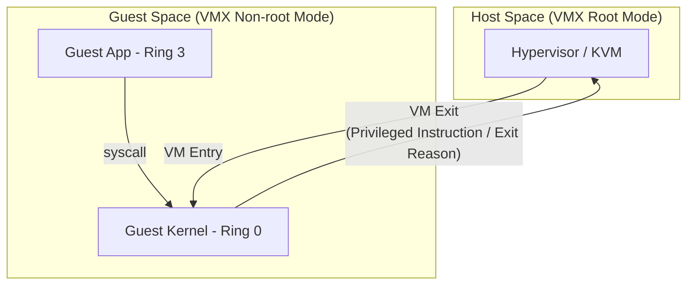

---

## 8. 容器与命名空间

### 8.1 容器 vs 虚拟机

| 特性 | 虚拟机 | 容器 |
|------|--------|------|
| 隔离层级 | 硬件级 (Hypervisor) | 内核级 (Namespace + Cgroups) |
| 资源开销 | 高 (完整 OS) | 低 (共享内核) |
| 启动速度 | 分钟级 | 秒级 |
| 安全边界 | 强 | 较弱 |

### 8.2 Linux 命名空间 (Namespace)

| 命名空间 | 隔离内容 | 标志 |
|----------|----------|------|
| Mount | 文件系统挂载点 | `CLONE_NEWNS` |
| UTS | 主机名,域名 | `CLONE_NEWUTS` |
| IPC | 进程间通信 | `CLONE_NEWIPC` |
| PID | 进程 ID | `CLONE_NEWPID` |
| Network | 网络栈 | `CLONE_NEWNET` |
| User | 用户/组 ID | `CLONE_NEWUSER` |
| Cgroup | Cgroup 根 | `CLONE_NEWCGROUP` |

---


## 9. VFS: 虚拟文件系统

Linux 通过 **VFS (Virtual File System)** 层实现了对底层不同文件系统的统一抽象.

### 9.1 VFS 核心数据结构

| 结构 | 英文 | 作用 | 关联内核源码 |
|------|------|------|--------------|
| super_block | Superblock | 描述整个文件系统的元数据 (挂载点, 块大小) | `include/linux/fs.h` |
| inode | Index Node | 文件元属性 (所有者, 权限, 大小, **不含文件名**) | `include/linux/fs.h` |
| dentry | Directory Entry | 将文件名与 inode 关联, 建立目录树 | `include/linux/dcache.h` |
| file | File Object | 进程打开的文件实例 (偏移量, 访问模式) | `include/linux/fs.h` |

### 9.2 VFS 架构

VFS 允许应用程序以统一的系统调用 (如 `read`, `write`) 访问不同类型的文件系统, 无论它们是本地磁盘, 网络共享还是伪文件系统:

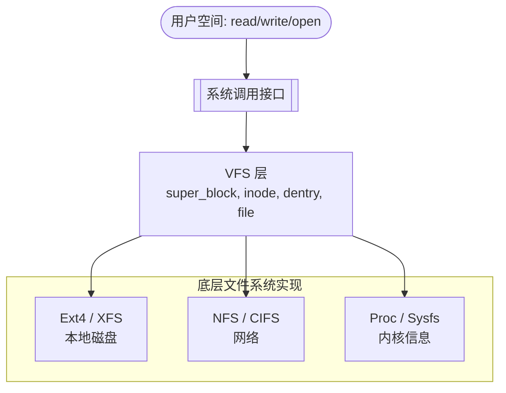

### 9.3 打开文件的内核过程

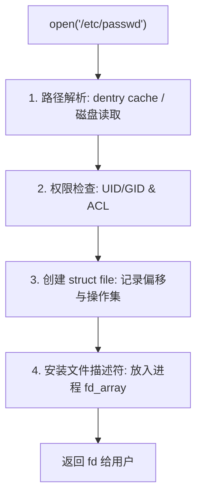

### 9.4 文件名不存储在 inode 中的原因

| 设计考量 | 说明 |
|----------|------|
| **硬链接** | 一个文件可以有多个名字 (多个 dentry 指向同一 inode) |
| **效率** | inode 大小固定, 存储可变长度文件名会增加复杂性 |
| **一致性** | 重命名只需修改 dentry, 无需修改 inode |

---

## 10. 架构级可观测性演进: eBPF

### 10.1 从 "黑盒" 到 "可编程平台"

传统的 Linux 内核是一个高度优化的 "黑盒", 内部逻辑难以动态观测或修改. **eBPF (Extended Berkeley Packet Filter)** 的出现将内核转变为一个可编程平台:

| 特性 | 传统方式 (LKM) | eBPF 方式 |
|------|----------------|-----------|
| **安全性** | 崩溃风险高 (Ring 0) | 经过验证码检查, 保证不挂起,不非法访问内存 |
| **动态性** | 需要重新编译/加载 | 热插拔, 无需重启, 即时生效 |
| **性能** | 高 (直接调用) | 极高 (JIT 编译为本地机器码) |

### 10.2 核心技术支柱

1. **等候室 (Verifier)**: 在 eBPF 程序运行前检查其逻辑, 确保其不会死循环, 不会非法读写内核内存.
2. **JIT 编译器**: 将字节码实时转化为 CPU 对应的指令集, 确保零开销执行.
3. **BPF Maps**: 用户态与内核态之间,不同 BPF 程序之间共享数据的键值存储.

### 10.3 关键应用场景

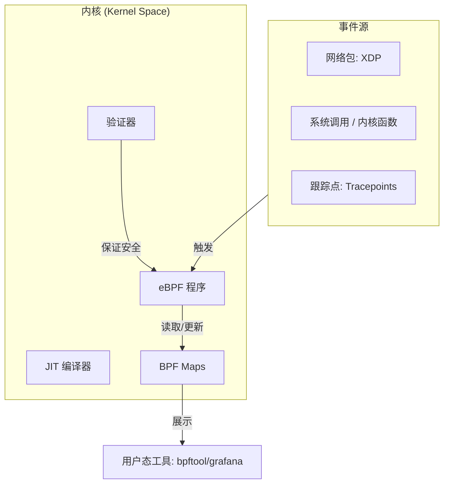

---

## 11. 系统性能分析与调优方法论

内核调优不是 "试错法" 修改参数, 而是基于系统工程的科学实践. 核心目标是平衡 **Throughput (吞吐量)** 与 **Latency (延迟)**.

### 11.1 USE 方法 (Utilization, Saturation, Errors)

由性能专家 Brendan Gregg 提出, 适用于在没有明确方向时快速定位瓶颈:
*   **Utilization (利用率)**: 资源在设定时间内忙于工作的比例 (如 CPU 90% busy).
*   **Saturation (饱和度)**: 资源排队的程度 (如 Load Average > CPU Count).
*   **Errors (错误)**: 资源本身或其驱动是否报错 (如 OOM, device error).

### 11.2 观测层级金字塔

从宏观指标下钻至微观事件:

1.  **Level 1: 宏观概览** (`top`, `uptime`, `dstat`) -> 快速判断是 CPU, 内存还是 I/O 瓶颈.
2.  **Level 2: 资源深度视角**
    *   **CPU**: `mpstat -P ALL`, `pidstat -u`, `perf top`
    *   **Memory**: `free -m`, `vmstat`, `slabtop`
    *   **I/O**: `iostat -x`, `iotop`, `blktrace`
    *   **Network**: `sar -n DEV`, `ss -s`, `tcpdump`
3.  **Level 3: 内核事件追踪** (`ebpf`, `perf record`) -> 生成火焰图 (Flame Graph), 分析具体的函数调用栈延迟.

---

## 参考教材

| 主题 | 推荐阅读 |
|------|----------|
| OS 定义与历史 | *OSTEP* Ch1-2, *Tanenbaum* Ch1 |
| 系统结构 | *Tanenbaum* Ch1.4, *恐龙书* Ch2 |
| x86 保护模式 | Intel SDM Vol.3 Ch2-3 |
| ARM 架构 | ARM Architecture Reference Manual |
| Linux 启动 | *LKD* Ch3, Kernel Documentation |

---

## 内核源码引用

| 主题 | 源码路径 | 关键函数/结构 |
|------|----------|---------------|
| 内核入口 | `init/main.c` | `start_kernel()` |
| GDT 初始化 | `arch/x86/kernel/cpu/common.c` | `cpu_init()`, `gdt_page` |
| TSS 定义 | `arch/x86/include/asm/processor.h` | `struct tss_struct` |
| 段描述符 | `arch/x86/include/asm/desc.h` | `struct desc_struct` |
| 模块加载 | `kernel/module/main.c` | `load_module()` |
| 命名空间 | `include/linux/nsproxy.h` | `struct nsproxy` |
| 命名空间创建 | `kernel/nsproxy.c` | `create_new_namespaces()` |
| Cgroups 核心 | `kernel/cgroup/cgroup.c` | `cgroup_init()` |
| eBPF 验证器 | `kernel/bpf/verifier.c` | `bpf_check()` |

**在线源码浏览**: [Bootlin Elixir](https://elixir.bootlin.com/linux/latest/source)

---

## 思考题

1. 为什么 x86 定义了 4 个特权级, 但多数操作系统只使用 2 个?
2. TSS 中的 `rsp0` 字段在什么时候被使用?
3. 微内核相比单体内核的 IPC 开销从何而来? 有什么优化方案?
4. UEFI 相比传统 BIOS 有哪些优势?
5. 容器逃逸攻击的本质是什么? 如何防护?
