## 概述

中断 (Interrupt) 与异常 (Exception) 是 CPU 响应外部事件和内部错误的核心机制, 使操作系统能够及时处理硬件请求,程序错误和用户请求. 系统调用 (System Call) 则是用户程序进入内核态请求服务的标准接口.

---

## 关键概念速查

| 概念 | 英文 | 定义 | 关联内核源码 |
|------|------|------|--------------|
| 中断 | Interrupt | 外部异步事件通知机制 | `arch/x86/kernel/irq.c` |
| 异常 | Exception | CPU 内部同步事件 (指令触发) | `arch/x86/kernel/traps.c` |
| IDT | Interrupt Descriptor Table | 中断向量到处理程序的映射表 | `arch/x86/kernel/idt.c` |
| APIC | Advanced PIC | 现代多处理器中断控制器 | `arch/x86/kernel/apic/` |
| 系统调用 | System Call | 用户态进入内核态的受控接口 | `arch/x86/entry/entry_64.S` |
| syscall | - | x86-64 快速系统调用指令 | `arch/x86/entry/entry_64.S` |
| softirq | Soft Interrupt | 可延迟执行的内核下半部机制 | `kernel/softirq.c` |
| tasklet | - | 基于 softirq 的简化下半部 | `include/linux/interrupt.h` |
| VDSO | Virtual DSO | 内核映射到用户空间的快速调用 | `arch/x86/entry/vdso/` |
| seccomp | Secure Computing | 系统调用过滤安全机制 | `kernel/seccomp.c` |

---

## 模块知识结构

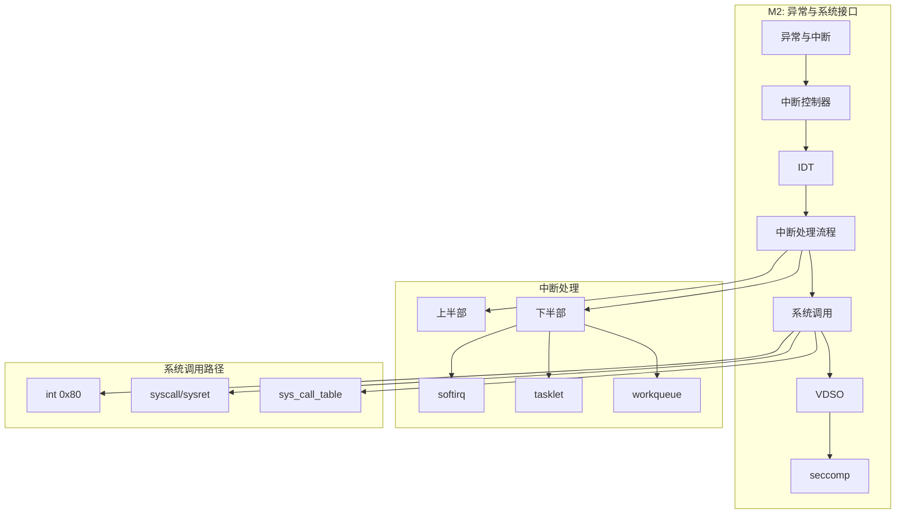

---


## 1. 异常与中断基础

### 1.1 中断系统的作用

中断系统是现代计算机最重要的硬件机制之一, 其核心作用包括:

| 作用 | 说明 | 示例 |
|------|------|------|
| **设备服务** | 响应外设的数据就绪或完成信号 | 磁盘读取完成,网卡收到数据包 |
| **时间管理** | 定时器中断驱动时间片轮转 | 进程调度,系统时钟更新 |
| **异常处理** | 处理程序错误和特殊情况 | 缺页异常,除零错误 |
| **系统调用** | 提供用户态进入内核的受控入口 | `read()`, `write()`, `fork()` |
| **实时响应** | 保证对紧急事件的快速响应 | 硬实时系统的截止时间保证 |

**没有中断会怎样?**

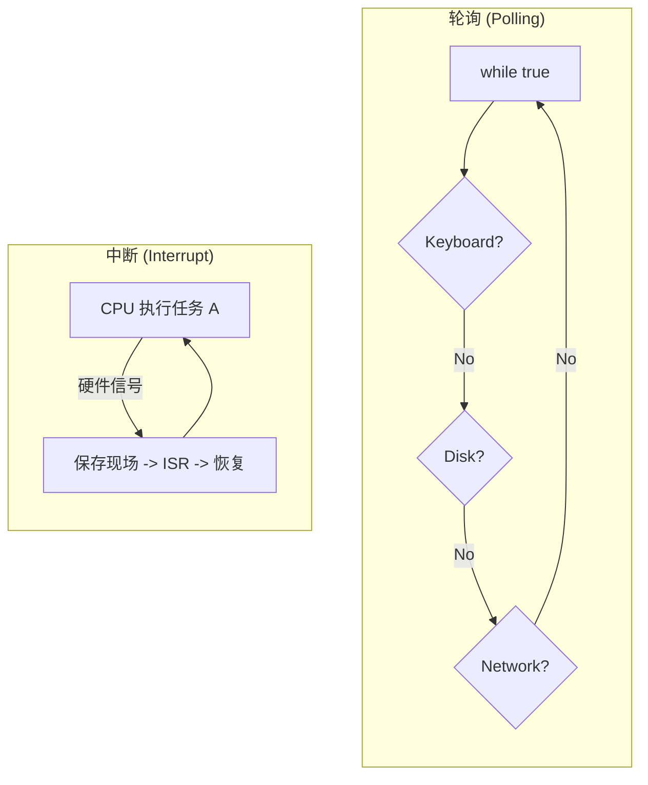

### 1.2 术语区分

不同体系结构和教材对术语定义略有差异, 以下采用 Intel 手册定义:

| 术语 | 英文 | 来源 | 同步/异步 | 特点 |
|------|------|------|-----------|------|
| 中断 | Interrupt | 外部硬件 (I/O 设备,定时器) | 异步 | 可随时发生, 与当前指令无关 |
| 异常 | Exception | CPU 内部 (指令执行期间) | 同步 | 由特定指令触发, 可重现 |

> **注意**: *OSTEP* 和部分文献将两者统称为 "Trap", 强调它们都是进入内核的受控入口.

### 1.3 广义异常分类 (Exception Classification)

根据发生源,同步性及处理后的返回行为, 可分为以下四大类:

| 类型 | 英文 | 同步/异步 | 发起方 | 返回行为 | 底层深度解析 |
|------|------|-----------|--------|----------|------------|
| **中断** | Interrupt | **异步** | 外部硬件 | 返回**下一条**指令 | 与当前执行流无关. 时钟中断是 CPU 分时的物理基础. |
| **陷阱** | Trap | 同步 | 用户指令 | 返回**下一条**指令 | 程序主动陷入内核. 如 `syscall` 或断点指令 `int 3`. |
| **故障** | Fault | 同步 | 用户指令 | 返回**当前**指令 | 遇到可修复问题, 处理后重试. 最典型的是 **缺页异常 (#PF)**. |
| **中止** | Abort | 同步 | 硬件检测 | 不返回 | 遭遇不可修复灾难. 如内存校验错误 (MCE),双重故障 (#DF). |

**1.4 软件中断 vs 硬件中断的本质**

*   **硬件中断**: 物理信号触发, 具有真正的**异步性**, 可以在任何指令边界发生.
*   **软件中断**: 指令触发 (如 Linux `raise_softirq`), 实际上是在特定的 "检查点" (如 Hard IRQ 结束时,Ksoftirqd 线程切换时) 被同步处理的, 本质上是内核的延迟任务队列.

**各类异常的处理策略**:

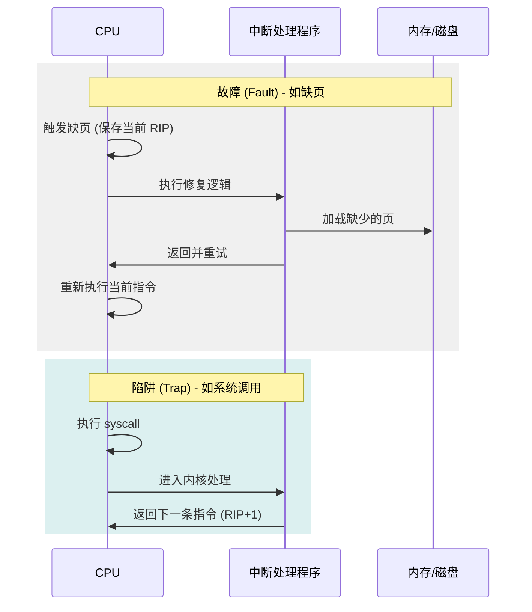

### 1.4 x86 中断向量表

Intel x86 定义 256 个中断向量 (0-255):

| 向量范围 | 用途 | 示例 |
|----------|------|------|
| 0-31 | CPU 预留异常 | #DE(0), #DB(1), #NMI(2), #BP(3), #OF(4), #BR(5), #UD(6), #NM(7), #DF(8), #PF(14), #MF(16), #AC(17), #MC(18) |
| 32-47 | 外部中断 (传统 PIC) | IRQ0-IRQ15 映射 |
| 32-255 | 外部中断 (APIC) | 用户可配置 |
| 128 (0x80) | Linux 系统调用 (传统) | `int 0x80` |

**常见异常向量详解**:

| 向量 | 名称 | 英文 | 触发条件 |
|------|------|------|----------|
| 0 | 除法错误 | Divide Error (#DE) | 除数为0或商溢出 |
| 6 | 非法操作码 | Invalid Opcode (#UD) | 执行无效或保留指令 |
| 13 | 一般保护 | General Protection (#GP) | 特权违规,段错误 |
| 14 | 缺页 | Page Fault (#PF) | 访问不存在或无权限的页 |

---

## 2. 中断控制器

### 2.1 中断控制器演进

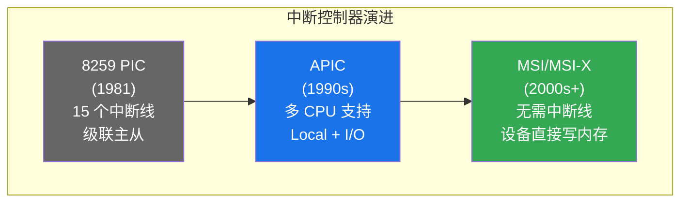

### 2.2 8259 PIC (Programmable Interrupt Controller)

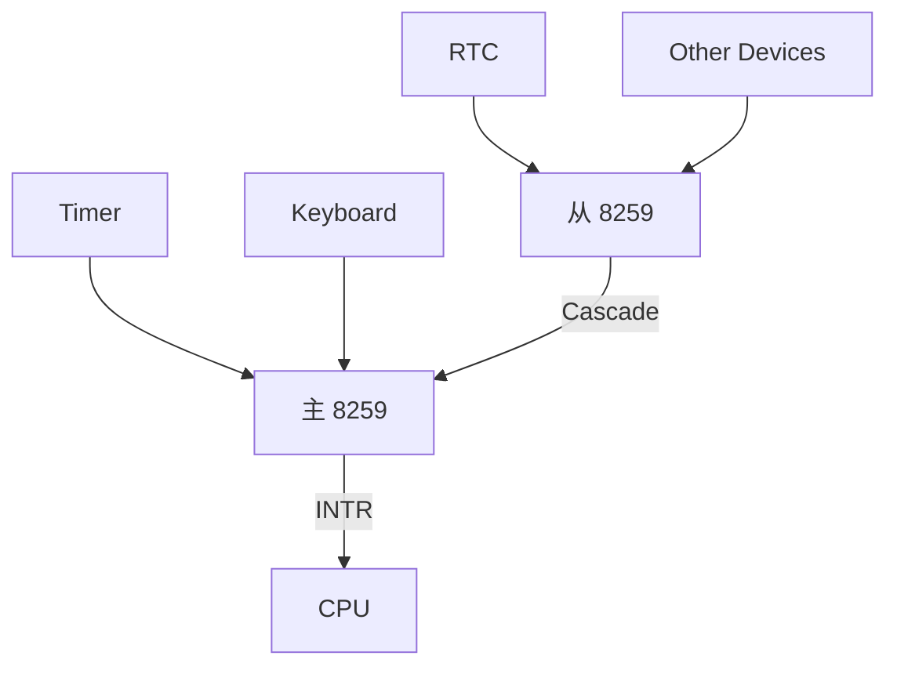

### 2.3 APIC 架构

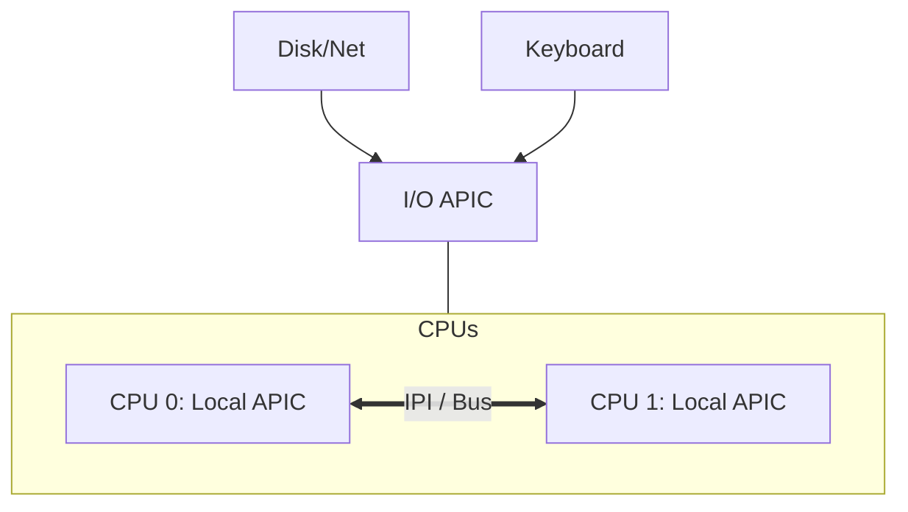

**Local APIC 功能**:
- 接收来自 I/O APIC 的中断
- 处理 IPI (Inter-Processor Interrupt)
- 提供本地定时器

**I/O APIC 功能**:
- 接收外部设备中断
- 路由到指定 CPU 的 Local APIC

### 2.4 MSI/MSI-X (Message Signaled Interrupts)

PCIe 设备可使用:

| 特性 | MSI | MSI-X |
|------|-----|-------|
| 中断数量 | 最多 32 | 最多 2048 |
| 地址空间 | 共享 | 独立 |
| 中断向量 | 连续 | 任意 |

**工作原理**: 设备直接向特定内存地址写入 Message Data, Local APIC 将其识别为中断.

### 2.5 中断亲和性 (IRQ Affinity)

```bash
# 查看中断分布
cat /proc/interrupts

# 设置 IRQ 16 只由 CPU 0 和 CPU 1 处理
echo 3 > /proc/irq/16/smp_affinity  # 二进制 11 = 0x3

# 使用 irqbalance 自动均衡
systemctl status irqbalance
```

---

## 3. 中断描述符表 (IDT)

### 3.1 IDT 结构

保护模式下, IDT 存储 256 个门描述符 (Gate Descriptor):

```c
// 64-bit IDT 门描述符 (16 字节)
struct idt_gate {
    uint16_t offset_low;      // 处理程序偏移 [15:0]
    uint16_t segment;         // 段选择子 (通常指向内核代码段)
    uint8_t  ist;             // IST 索引 (0 = 使用传统栈切换)
    uint8_t  type_attr;       // 类型 + DPL + P
    uint16_t offset_mid;      // 处理程序偏移 [31:16]
    uint32_t offset_high;     // 处理程序偏移 [63:32]
    uint32_t reserved;        // 保留
};
```

### 3.2 门类型

| 类型 | 值 | 特点 |
|------|-----|------|
| 中断门 | 0xE | 自动关闭中断 (IF=0) |
| 陷阱门 | 0xF | 不关闭中断 |
| 任务门 | 0x5 | 硬件任务切换 (现代 OS 不使用) |

### 3.3 Linux IDT 初始化

```c
// arch/x86/kernel/idt.c

// 异常处理程序注册
static const __initconst struct idt_data def_idts[] = {
    INTG(X86_TRAP_DE,       asm_exc_divide_error),      // #DE
    INTG(X86_TRAP_NMI,      asm_exc_nmi),               // NMI
    INTG(X86_TRAP_BP,       asm_exc_int3),              // #BP
    INTG(X86_TRAP_PF,       asm_exc_page_fault),        // #PF
    // ...
};

// 系统调用入口 (传统 int 0x80)
void __init idt_setup_traps(void) {
    idt_setup_from_table(idt_table, def_idts, ARRAY_SIZE(def_idts), true);
}
```

---

## 4. 中断处理流程

### 4.1 硬件自动操作 (x86-64)

当中断/异常发生时, CPU 硬件自动:

```
特权级切换情况 (Ring 3 → Ring 0):

1. 从 TSS 读取 rsp0 (内核栈指针)
2. 切换到内核栈
3. 按顺序压入:
   ┌─────────────────┐
   │       SS        │ (旧栈段)
   ├─────────────────┤
   │      RSP        │ (旧栈指针)
   ├─────────────────┤
   │     RFLAGS      │ (标志寄存器)
   ├─────────────────┤
   │       CS        │ (旧代码段)
   ├─────────────────┤
   │      RIP        │ (返回地址)
   ├─────────────────┤
   │   Error Code    │ (仅部分异常)
   └─────────────────┘
4. 从 IDT 加载新 CS:RIP
5. 如果是中断门, 清除 IF 位
```

### 4.2 中断服务例程 (ISR)

Linux 中断处理分为上半部和下半部:

```c
// 上半部 (硬中断上下文, 不可睡眠, 应尽快完成)
irqreturn_t my_interrupt_handler(int irq, void *dev_id) {
    // 1. 检查是否是本设备产生的中断
    if (!my_device_interrupt_pending())
        return IRQ_NONE;
    
    // 2. 确认中断 (清除设备中断标志)
    acknowledge_interrupt();
    
    // 3. 快速处理必要操作
    save_data_to_buffer();
    
    // 4. 调度下半部处理
    tasklet_schedule(&my_tasklet);
    
    return IRQ_HANDLED;
}
```

### 4.3 下半部机制详解

#### 4.3.1 上半部 vs 下半部

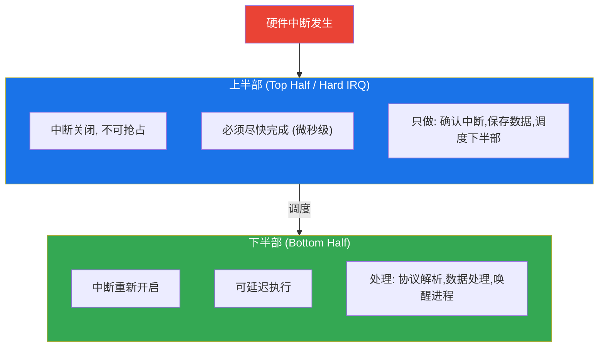

#### 4.3.2 下半部机制对比

| 机制 | 执行上下文 | 可睡眠 | 并发性 | 适用场景 |
|------|------------|--------|--------|----------|
| **softirq** | 软中断上下文 | 否 | 同一 softirq 可在多 CPU 并发 | 网络,块设备 (高性能) |
| **tasklet** | 软中断上下文 | 否 | 同一 tasklet 串行执行 | 多数驱动 (简单场景) |
| **workqueue** | 进程上下文 | **是** | 按工作队列策略 | 需要睡眠的操作 |
| **threaded IRQ** | 内核线程 | **是** | 可调度 | 慢速设备,RT 场景 |

#### 4.3.3 Softirq 代码示例

```c
// 注册 softirq (仅内核静态定义, 共 10 种)
open_softirq(NET_RX_SOFTIRQ, net_rx_action);

// 触发 softirq
raise_softirq(NET_RX_SOFTIRQ);

// softirq 处理函数
static void net_rx_action(struct softirq_action *h) {
    // 处理网络收包, 可能非常耗时
    process_backlog(...);
}
```

#### 4.3.4 Tasklet 代码示例

```c
// 定义
DECLARE_TASKLET(my_tasklet, my_tasklet_func);

// 处理函数
void my_tasklet_func(struct tasklet_struct *t) {
    // 处理数据...
}

// 在中断上半部调度
tasklet_schedule(&my_tasklet);
```

#### 4.3.5 Workqueue 代码示例

```c
// 定义工作项
DECLARE_WORK(my_work, my_work_func);

// 处理函数 (可睡眠!)
void my_work_func(struct work_struct *work) {
    mutex_lock(&my_mutex);  // OK: 可睡眠
    // 处理数据...
    mutex_unlock(&my_mutex);
}

// 调度到系统工作队列
schedule_work(&my_work);

// 调度到自定义工作队列
queue_work(my_wq, &my_work);
```

### 4.4 softirq 类型

```c
// include/linux/interrupt.h
enum {
    HI_SOFTIRQ,          // 高优先级 tasklet
    TIMER_SOFTIRQ,       // 定时器
    NET_TX_SOFTIRQ,      // 网络发送
    NET_RX_SOFTIRQ,      // 网络接收
    BLOCK_SOFTIRQ,       // 块设备
    IRQ_POLL_SOFTIRQ,    // IRQ 轮询
    TASKLET_SOFTIRQ,     // tasklet
    SCHED_SOFTIRQ,       // 调度器
    HRTIMER_SOFTIRQ,     // 高精度定时器
    RCU_SOFTIRQ,         // RCU 回调
    NR_SOFTIRQS           // softirq 数量
};
```

### 4.5 中断处理全流程深度解析

从硬件信号产生到执行完成, 整个路径跨越了硬件、CPU 固件和内核软件三个层次: 

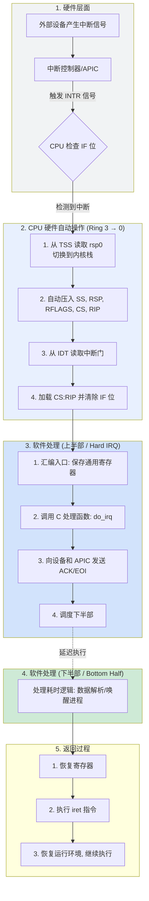


### 4.6 中断处理程序示例

**示例 1: 键盘中断处理 (简化)**

```c
// 键盘驱动的中断处理程序
irqreturn_t keyboard_interrupt(int irq, void *dev_id) {
    unsigned char scancode;
    
    // 1. 从键盘控制器读取扫描码
    scancode = inb(0x60);  // 端口 0x60
    
    // 2. 将扫描码放入缓冲区
    keyboard_buffer[kb_write_pos++] = scancode;
    kb_write_pos %= BUFFER_SIZE;
    
    // 3. 唤醒等待键盘输入的进程
    wake_up_interruptible(&keyboard_wait_queue);
    
    return IRQ_HANDLED;
}

// 驱动初始化时注册中断
request_irq(1, keyboard_interrupt, IRQF_SHARED, "keyboard", &dev_id);
```

**示例 2: 定时器中断 (调度核心)**

```c
// 定时器中断 (Linux 简化版)
void timer_interrupt_handler(void) {
    // 1. 更新系统时间
    jiffies_64++;
    update_wall_time();
    
    // 2. 检查当前进程时间片
    if (--current->time_slice <= 0) {
        current->time_slice = 0;
        set_tsk_need_resched(current);  // 标记需要调度
    }
    
    // 3. 处理定时器链表上到期的定时器
    run_local_timers();
    
    // 4. 触发调度器软中断
    raise_softirq(SCHED_SOFTIRQ);
}
```

### 4.7 中断系统示例: 网络数据包接收

**完整的网络中断处理流程**:

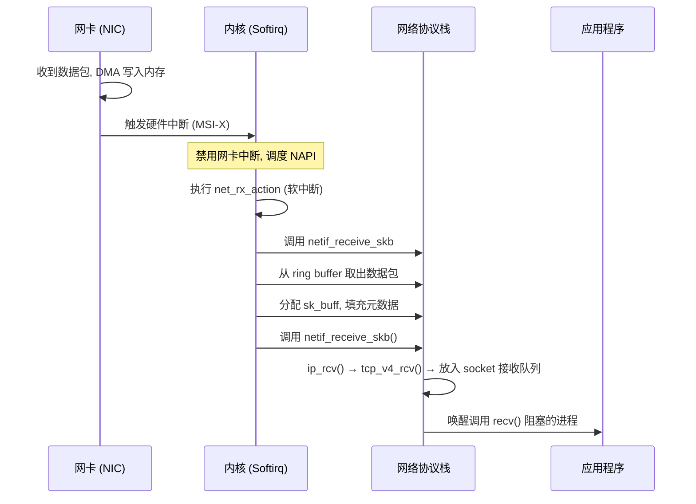

**NAPI (New API) 的优势**:

| 方面 | 传统中断 | NAPI |
|------|----------|------|
| 每包中断 | 是 | 否 (batch) |
| 高负载时 | 中断风暴 | 轮询模式 |
| CPU 利用率 | 浪费在中断处理 | 更多用于实际处理 |
| 延迟 | 低负载时更好 | 高负载时更好 |

---

## 5. 系统调用机制

### 5.1 系统调用的作用

| 需求 | 解决方案 |
|------|----------|
| 用户态无法执行特权操作 | 提供受控的内核入口点 |
| 内核需要验证参数 | 在内核侧检查用户传入参数 |
| 需要标准化接口 | POSIX 等标准定义统一 API |

### 5.2 x86-64 系统调用实现

#### 5.2.1 传统方式: `int 0x80`

```asm
# 触发软中断, 进入向量 128 的处理程序
mov eax, 1          # 系统调用号 (exit)
mov ebx, 0          # 参数1 (退出码)
int 0x80            # 陷入内核
```

**缺点**: 需要完整的中断处理流程, 开销大.

#### 5.2.2 快速方式: `syscall` / `sysret`

```asm
# x86-64 快速系统调用
mov rax, 60         # 系统调用号 (exit)
mov rdi, 0          # 参数1
syscall             # 快速陷入
```

**`syscall` 指令行为**:
1. 保存 RIP 到 RCX
2. 保存 RFLAGS 到 R11
3. 从 MSR 加载 CS/SS
4. 从 MSR_LSTAR 加载 RIP (系统调用入口)
5. 屏蔽 RFLAGS (根据 MSR_SYSCALL_MASK)

### 5.3 寄存器约定 (Linux x86-64 ABI)

| 寄存器 | 输入用途 | 输出 |
|--------|----------|------|
| RAX | 系统调用号 | 返回值 |
| RDI | 参数 1 | |
| RSI | 参数 2 | |
| RDX | 参数 3 | |
| R10 | 参数 4 (注意: 不是 RCX) | |
| R8 | 参数 5 | |
| R9 | 参数 6 | |

> **为什么不用 RCX?** `syscall` 指令会使用 RCX 保存返回地址.

### 5.4 系统调用表

```c
// arch/x86/entry/syscall_64.c
const sys_call_ptr_t sys_call_table[__NR_syscall_max+1] = {
    [0]   = __x64_sys_read,
    [1]   = __x64_sys_write,
    [2]   = __x64_sys_open,
    [3]   = __x64_sys_close,
    // ...
    [57]  = __x64_sys_fork,
    [59]  = __x64_sys_execve,
    [60]  = __x64_sys_exit,
    // ...
};
```

### 5.5 系统调用入口 (entry_SYSCALL_64)

```c
// arch/x86/entry/entry_64.S (简化)
SYM_CODE_START(entry_SYSCALL_64)
    // 1. 切换到内核栈
    movq    %rsp, PER_CPU_VAR(cpu_tss_rw + TSS_sp2)
    movq    PER_CPU_VAR(cpu_current_top_of_stack), %rsp
    
    // 2. 保存用户态寄存器
    pushq   $__USER_DS                  // SS
    pushq   PER_CPU_VAR(cpu_tss_rw + TSS_sp2)  // RSP
    pushq   %r11                        // RFLAGS
    pushq   $__USER_CS                  // CS
    pushq   %rcx                        // RIP
    
    // 3. 保存其他寄存器
    PUSH_AND_CLEAR_REGS rax=$-ENOSYS
    
    // 4. 调用实际处理函数
    movq    %rax, %rdi                  // syscall 号作为参数
    call    do_syscall_64
    
    // 5. 恢复并返回
    RESTORE_REGS
    USERGS_SYSRET64
SYM_CODE_END(entry_SYSCALL_64)
```

### 5.6 系统调用定义宏

```c
// include/linux/syscalls.h
// SYSCALL_DEFINE3 表示 3 个参数的系统调用
SYSCALL_DEFINE3(write, unsigned int, fd, const char __user *, buf,
                size_t, count)
{
    return ksys_write(fd, buf, count);
}
```

---

## 6. VDSO (Virtual Dynamic Shared Object)

### 6.1 VDSO 动机与实现

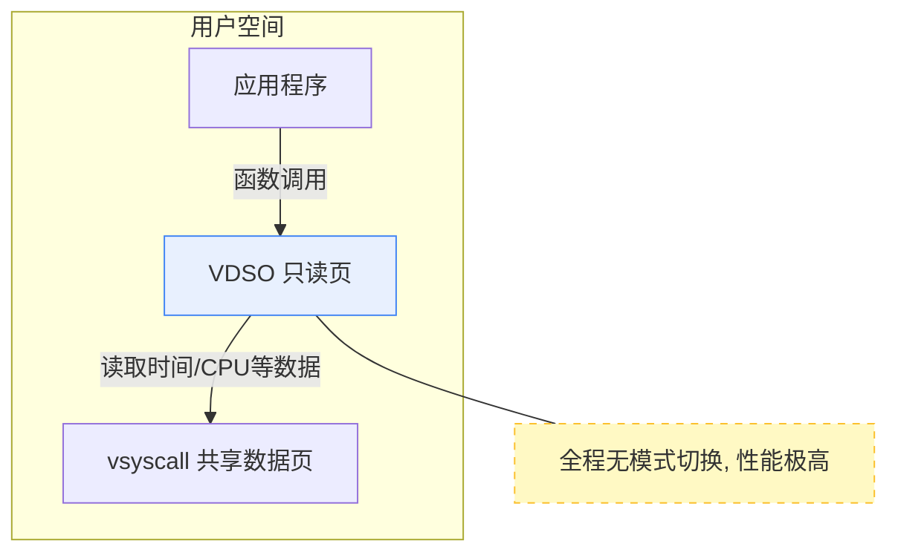

### 6.3 查看 VDSO

```bash
# 查看进程内存映射中的 vdso
cat /proc/self/maps | grep vdso
# 7ffce8f3f000-7ffce8f41000 r-xp 00000000 00:00 0  [vdso]

# 使用 ldd 查看
ldd /bin/ls | grep vdso
#   linux-vdso.so.1 (0x00007ffce8f3f000)
```

---

## 7. seccomp (Secure Computing)

### 7.1 概述

seccomp 允许进程限制自身可用的系统调用, 用于安全沙箱.

### 7.2 模式

| 模式 | 说明 |
|------|------|
| SECCOMP_MODE_STRICT | 仅允许 read, write, exit, sigreturn |
| SECCOMP_MODE_FILTER | 使用 BPF 规则过滤 |

### 7.3 BPF Filter 示例

```c
#include <linux/seccomp.h>
#include <linux/filter.h>
#include <sys/prctl.h>

struct sock_filter filter[] = {
    // 加载系统调用号
    BPF_STMT(BPF_LD | BPF_W | BPF_ABS, 
             offsetof(struct seccomp_data, nr)),
    
    // 允许 read (0)
    BPF_JUMP(BPF_JMP | BPF_JEQ | BPF_K, __NR_read, 0, 1),
    BPF_STMT(BPF_RET | BPF_K, SECCOMP_RET_ALLOW),
    
    // 允许 write (1)
    BPF_JUMP(BPF_JMP | BPF_JEQ | BPF_K, __NR_write, 0, 1),
    BPF_STMT(BPF_RET | BPF_K, SECCOMP_RET_ALLOW),
    
    // 允许 exit_group (231)
    BPF_JUMP(BPF_JMP | BPF_JEQ | BPF_K, __NR_exit_group, 0, 1),
    BPF_STMT(BPF_RET | BPF_K, SECCOMP_RET_ALLOW),
    
    // 拒绝其他所有
    BPF_STMT(BPF_RET | BPF_K, SECCOMP_RET_KILL),
};

struct sock_fprog prog = {
    .len = sizeof(filter) / sizeof(filter[0]),
    .filter = filter,
};

// 应用过滤器
prctl(PR_SET_NO_NEW_PRIVS, 1, 0, 0, 0);
prctl(PR_SET_SECCOMP, SECCOMP_MODE_FILTER, &prog);
```

### 7.4 容器中的应用

Docker 默认启用 seccomp profile, 禁用危险系统调用:

```bash
# 查看 Docker 默认 seccomp profile
docker info | grep -i seccomp

# 运行容器时禁用 seccomp (不推荐)
docker run --security-opt seccomp=unconfined ...
```

---

## 8. 实践: 追踪系统调用

### 8.1 使用 strace

```bash
# 追踪进程的系统调用
strace ls

# 统计系统调用次数
strace -c ls

# 追踪特定系统调用
strace -e trace=open,read,write ls

# 追踪网络相关
strace -e trace=network curl example.com
```

### 8.2 使用 perf

```bash
# 追踪系统调用事件
perf trace ls

# 统计系统调用延迟
perf trace -s ls

# 生成火焰图
perf record -g -a -- sleep 10
perf script | stackcollapse-perf.pl | flamegraph.pl > out.svg
```

---

---

## 9. 上下文保存与恢复: `pt_regs`

当中断或异常发生时, 寄存器状态必须被快照存储. 在 Linux x86-64 中, 这个快照由 `struct pt_regs` 表示:

```c
// arch/x86/include/asm/ptrace.h
struct pt_regs {
    /* (1) 内核入口代码手动压入 */
    unsigned long r15, r14, r13, r12;
    unsigned long rbp, rbx;
    unsigned long r11, r10, r9, r8, rax, rcx, rdx, rsi, rdi;
    unsigned long orig_rax; // 系统调用号 (仅用于系统调用)

    /* (2) 硬件在特权级切换时自动压入 */
    unsigned long rip, cs, eflags, rsp, ss;
};
```

**关键点**:
1. **自动压栈**: CPU 硬件检测到特权级变化 (Ring 3 → Ring 0) 时, 会自动从 TSS 获取内核栈指针并压入 `ss`, `rsp` 等关键寄存器.
2. **手动压栈**: 内核的汇编入口 (`entry_64.S`) 负责将其余通用寄存器压入, 最终形成完整的 `pt_regs` 结构, 供 C 语言处理函数访问.

---

## 10. eBPF: 可编程内核

**eBPF (extended Berkeley Packet Filter)** 是 Linux 近十年最重要的演进之一, 它让内核变得可编程, 且无需修改内核镜像或重启系统.

### 10.1 eBPF 核心架构

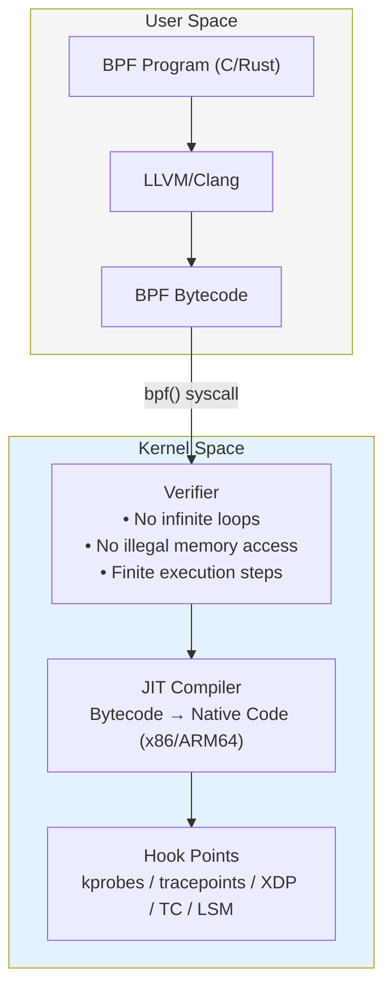

### 10.2 Hook 点类型

| Hook 类型 | 说明 | 用途 |
|-----------|------|------|
| **kprobes** | 动态追踪内核函数入口/出口 | 函数执行耗时,参数分析 |
| **uprobes** | 动态追踪用户态函数 | 应用程序调试 |
| **tracepoints** | 内核预定义的静态埋点 | 稳定的事件追踪 |
| **XDP** | 网卡驱动层, 协议栈之前 | 高性能防火墙, DDoS 防御 |
| **TC** | 流量控制层 | 网络策略,QoS |
| **LSM** | Linux Security Module | 安全策略强制 |
| **sched** | 调度器扩展 | 自定义调度策略 |

### 10.3 BPF Maps: 数据共享

由于 eBPF 程序栈空间仅 512 字节, Maps 提供了持久化存储和通信能力:

| Map 类型 | 用途 |
|----------|------|
| `BPF_MAP_TYPE_HASH` | 哈希表, 通用键值存储 |
| `BPF_MAP_TYPE_ARRAY` | 固定大小数组, 快速索引 |
| `BPF_MAP_TYPE_PERF_EVENT_ARRAY` | 向用户空间发送事件 |
| `BPF_MAP_TYPE_RINGBUF` | 高效环形缓冲区 |
| `BPF_MAP_TYPE_LRU_HASH` | 带 LRU 淘汰的哈希表 |

```c
// 定义一个 Map
struct {
    __uint(type, BPF_MAP_TYPE_HASH);
    __uint(max_entries, 10240);
    __type(key, u32);    // PID
    __type(value, u64);  // 计数器
} process_count SEC(".maps");

// 在 BPF 程序中使用
SEC("kprobe/do_sys_open")
int trace_open(struct pt_regs *ctx) {
    u32 pid = bpf_get_current_pid_tgid() >> 32;
    u64 *count = bpf_map_lookup_elem(&process_count, &pid);
    if (count)
        (*count)++;
    return 0;
}
```

### 10.4 BTF 与 CO-RE

| 技术 | 英文 | 作用 |
|------|------|------|
| BTF | BPF Type Format | 记录内核数据结构的元数据 |
| CO-RE | Compile Once – Run Everywhere | 通过 BTF 自动重定位结构偏移, 跨内核版本运行 |

```c
// 无需为每个内核版本编译
// CO-RE 自动处理 task_struct->comm 的偏移差异
char comm[16];
bpf_probe_read_kernel_str(comm, sizeof(comm), 
                          task->comm);  // 自动重定位
```

### 10.5 eBPF vs 内核模块

| 特性 | eBPF | 内核模块 (LKM) |
|------|------|----------------|
| **安全性** | 极高 (验证器审计, 沙盒) | 较低 (可能导致 Panic) |
| **更新能力** | 动态加载/卸载, 无需重启 | 复杂, 可能需重启 |
| **访问权限** | 受限 (仅通过 Helper) | 无限制 |
| **开发复杂度** | 较低 | 很高 |
| **性能** | 接近原生 (JIT) | 原生 |

### 10.6 常用工具链

| 工具 | 用途 |
|------|------|
| **BCC** | 包含大量现成的性能分析脚本 |
| **bpftrace** | 基于 DSL 的动态追踪, 适合单行脚本 |
| **libbpf** | 官方 C 库, 开发独立 eBPF 应用 |
| **Cilium** | Kubernetes 网络与安全 |
| **Tetragon** | 运行时安全监控 |

**bpftrace 示例**:

```bash
# 追踪所有文件打开操作
bpftrace -e 'tracepoint:syscalls:sys_enter_openat { 
    printf("%s %s\n", comm, str(args->filename)); 
}'

# 统计系统调用延迟分布
bpftrace -e 'tracepoint:raw_syscalls:sys_enter { @start[tid] = nsecs; }
             tracepoint:raw_syscalls:sys_exit  { 
                 @latency = hist(nsecs - @start[tid]); 
                 delete(@start[tid]); 
             }'
```

---

## 11. 高级交互技术: 动态追踪与零拷贝绕过

### 11.1 动态追踪原语 (Kprobes & Uprobes)

操作系统专家如何实现在不重新编译内核的情况下进行亚微秒级观测?其核心在于**运行时指令替换**.

| 技术 | 观测范围 | 实现机制 | 性能影响 |
|------|----------|----------|----------|
| **Kprobes** | 内核空间函数 | 将目标指令替换为 `int3` (0xCC) 陷阱指令, 触发中断并执行钩子 | 较低 (仅在触发时) |
| **Uprobes** | 用户空间函数 | 在 ELF 二进制文件中动态插入断点, 捕获用户态事件 | 视调用频率而定 |

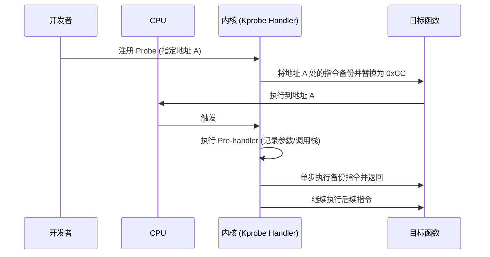

### 11.2 零拷贝绕过 (vDPA & XDP)

为了消除内核态/用户态上下文切换以及内存拷贝的开销, 现代高性能系统采用"绕过"策略: 

1.  **VDSO**: (见 §6) 共享数据页.
2.  **vDPA (vHost Data Path Acceleration)**: 在虚拟化场景下, 硬件网卡直接将数据推送到虚拟机的 VirtIO 队列中, 绕过主机内核协议栈.
3.  **XDP (eXpress Data Path)**: 在网卡驱动层直接运行 eBPF 程序, 在 `sk_buff` 分配前决定丢弃或转发数据包.

### 11.3 用户态中断 (User Interrupts - UINTR)

传统的处理器只能在内核态响应中断. Intel 推出的 **UINTR** 允许一个用户态进程直接向另一个用户态进程发送交互, 无需经过内核上下文切换.

- **核心价值**: 极少通信延迟 (Nanosecond scale), 彻底解决了高频同步中的内核损耗问题.
- **硬件支持**: CPU 直接处理中断向量分发, 内核仅负责初始化配置与生命周期管理.

---

## 参考教材

| 主题 | 推荐阅读 |
|------|----------|
| 异常分类 | *恐龙书* Ch1.2, Intel SDM Vol.3 Ch6 |
| 中断处理 | *LKD* Ch7 (Interrupts and Interrupt Handlers) |
| 下半部机制 | *LKD* Ch8 (Bottom Halves and Deferring Work) |
| 系统调用 | *OSTEP* Ch6, *LKD* Ch5 (System Calls) |
| APIC | Intel SDM Vol.3 Ch10 |

---

## 内核源码引用

| 主题 | 源码路径 | 关键函数/结构 |
|------|----------|---------------|
| IDT 初始化 | `arch/x86/kernel/idt.c` | `idt_setup_traps()`, `idt_table` |
| 中断入口 | `arch/x86/entry/entry_64.S` | `idtentry` 宏 |
| 异常处理 | `arch/x86/kernel/traps.c` | `do_trap()`, 各异常处理函数 |
| 缺页处理 | `arch/x86/mm/fault.c` | `do_page_fault()` |
| 系统调用入口 | `arch/x86/entry/entry_64.S` | `entry_SYSCALL_64` |
| 系统调用表 | `arch/x86/entry/syscall_64.c` | `sys_call_table` |
| 系统调用分发 | `arch/x86/entry/common.c` | `do_syscall_64()` |
| softirq | `kernel/softirq.c` | `do_softirq()`, `raise_softirq()` |
| tasklet | `kernel/softirq.c` | `tasklet_action()` |
| 工作队列 | `kernel/workqueue.c` | `queue_work()`, `worker_thread()` |
| VDSO | `arch/x86/entry/vdso/` | `__vdso_gettimeofday()` |
| seccomp | `kernel/seccomp.c` | `__seccomp_filter()` |
| 中断请求 | `kernel/irq/manage.c` | `request_irq()`, `free_irq()` |

**在线源码浏览**: [Bootlin Elixir](https://elixir.bootlin.com/linux/latest/source)

---

## 思考题

1. 为什么中断处理程序不能睡眠? 如果睡眠会发生什么?
2. `syscall` 指令相比 `int 0x80` 性能提升的关键在哪里?
3. softirq 和 tasklet 有什么区别? 为什么需要两种机制?
4. VDSO 如何保证用户态读取的时间数据是一致的?
5. 如何设计一个 seccomp profile 来保护 Web 服务器?
