## 概述

进程 (Process) 是操作系统进行资源分配的基本单位, 线程 (Thread) 是 CPU 调度的基本单位. 本模块深入 Linux 进程模型,`task_struct` 数据结构,进程生命周期以及 CFS 调度器实现.

---

## 关键概念速查

| 概念 | 英文 | 定义 | 关联内核源码 |
|------|------|------|--------------|
| 进程 | Process | 程序的一次执行实例, 资源分配单位 | `include/linux/sched.h` |
| 线程 | Thread | 调度执行单位, Linux 中由 task_struct 表示 | `include/linux/sched.h` |
| task_struct | - | Linux PCB 实现, 进程控制块 | `include/linux/sched.h` |
| sched_entity | - | CFS 调度实体, 包含 vruntime | `include/linux/sched.h` |
| vruntime | Virtual Runtime | 虚拟运行时间, CFS 调度核心 | `kernel/sched/fair.c` |
| CFS | Completely Fair Scheduler | Linux 默认公平调度器 | `kernel/sched/fair.c` |
| 红黑树 | Red-Black Tree | CFS 组织可运行进程的数据结构 | `lib/rbtree.c` |
| clone | - | 创建进程/线程的系统调用 | `kernel/fork.c` |
| cgroups | Control Groups | 资源限制与记账机制 | `kernel/cgroup/` |
| SCHED_DEADLINE | - | EDF 实时调度策略 | `kernel/sched/deadline.c` |

---

## 模块知识结构

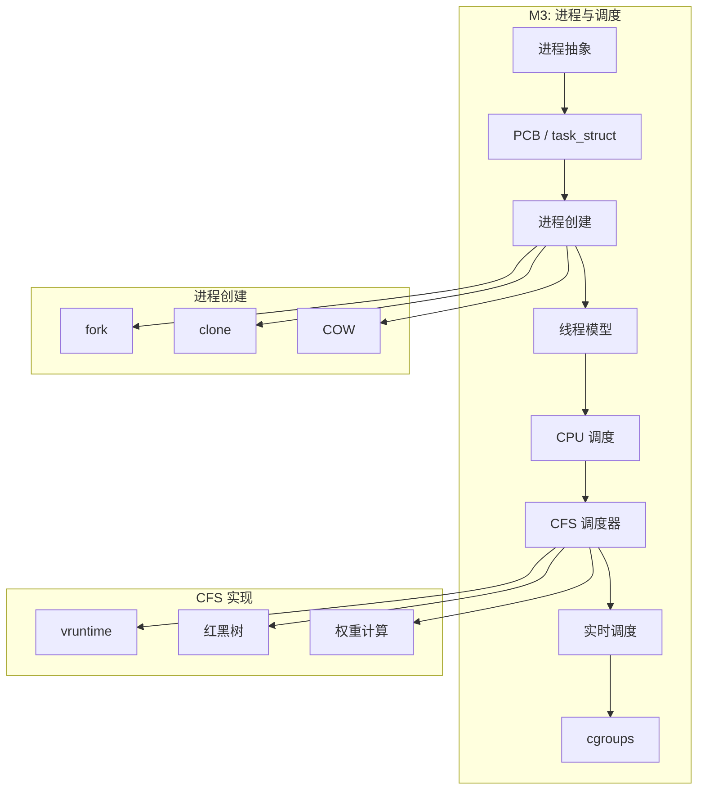

---


## 1. 进程抽象

### 1.1 进程的定义

| 视角 | 定义 |
|------|------|
| 教科书定义 | 程序的一次执行过程 |
| 资源视角 | 资源分配的基本单位 (地址空间,文件,信号) |
| 调度视角 | 可调度的执行实体 |

> *OSTEP*: "The process is the major OS abstraction of a running program."

### 1.2 进程与程序的区别

| 程序 (Program) | 进程 (Process) |
|----------------|----------------|
| 静态的代码和数据 | 动态的执行实例 |
| 存储在磁盘 | 运行在内存 |
| 可多次执行 | 有生命周期 |
| 一个程序可对应多个进程 | 一个进程只对应一个程序 |

### 1.3 进程映像 (Process Image)

进程在内存中的布局 (x86-64 Linux):

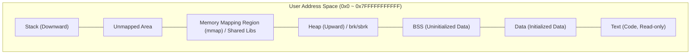

---

## 2. 进程控制块 (PCB)

### 2.1 task_struct 概述

Linux 中 PCB 的实现是 `task_struct`, 定义在 `include/linux/sched.h`, 包含数百个字段:

```c
struct task_struct {
    // === 进程状态 ===
    volatile long state;          // 进程状态 (TASK_RUNNING, TASK_INTERRUPTIBLE, ...)
    unsigned int flags;           // 进程标志 (PF_EXITING, PF_FORKNOEXEC, ...)
    
    // === 调度信息 ===
    int prio;                     // 动态优先级
    int static_prio;              // 静态优先级 (由 nice 值决定)
    int normal_prio;              // 归一化优先级
    unsigned int rt_priority;     // 实时优先级 (0-99)
    const struct sched_class *sched_class;  // 调度类
    struct sched_entity se;       // CFS 调度实体
    struct sched_rt_entity rt;    // 实时调度实体
    struct sched_dl_entity dl;    // Deadline 调度实体
    
    // === 进程关系 ===
    struct task_struct *parent;   // 父进程
    struct list_head children;    // 子进程链表
    struct list_head sibling;     // 兄弟进程链表
    struct task_struct *group_leader;  // 线程组 leader
    
    // === 进程标识 ===
    pid_t pid;                    // 进程 ID
    pid_t tgid;                   // 线程组 ID (主线程 PID)
    
    // === 内存管理 ===
    struct mm_struct *mm;         // 用户地址空间描述符
    struct mm_struct *active_mm;  // 当前活动地址空间
    
    // === 文件系统 ===
    struct fs_struct *fs;         // 文件系统信息 (cwd, root)
    struct files_struct *files;   // 打开文件描述符表
    
    // === 信号处理 ===
    struct signal_struct *signal; // 信号描述符
    struct sighand_struct *sighand;  // 信号处理程序
    sigset_t blocked;             // 被阻塞的信号
    
    // === 凭证 ===
    const struct cred *cred;      // 有效凭证 (uid, gid, ...)
    
    // === 命名空间 ===
    struct nsproxy *nsproxy;      // 命名空间代理
    
    // === 记账信息 ===
    u64 utime, stime;             // 用户态/内核态 CPU 时间
    u64 start_time;               // 进程启动时间
    
    // ... 更多字段
};
```

### 2.2 关键字段解析

#### 2.2.1 进程状态 (state)

```c
#define TASK_RUNNING            0x0000    // 可运行 (就绪或正在运行)
#define TASK_INTERRUPTIBLE      0x0001    // 可中断睡眠 (等待信号或资源)
#define TASK_UNINTERRUPTIBLE    0x0002    // 不可中断睡眠 (等待 I/O)
#define __TASK_STOPPED          0x0004    // 停止 (SIGSTOP)
#define __TASK_TRACED           0x0008    // 被调试器跟踪
#define EXIT_DEAD               0x0010    // 最终状态
#define EXIT_ZOMBIE             0x0020    // 僵尸态
#define TASK_PARKED             0x0040    // 内核线程挂起
#define TASK_IDLE               0x0402    // 空闲
```

状态转换图 (含挂起状态):

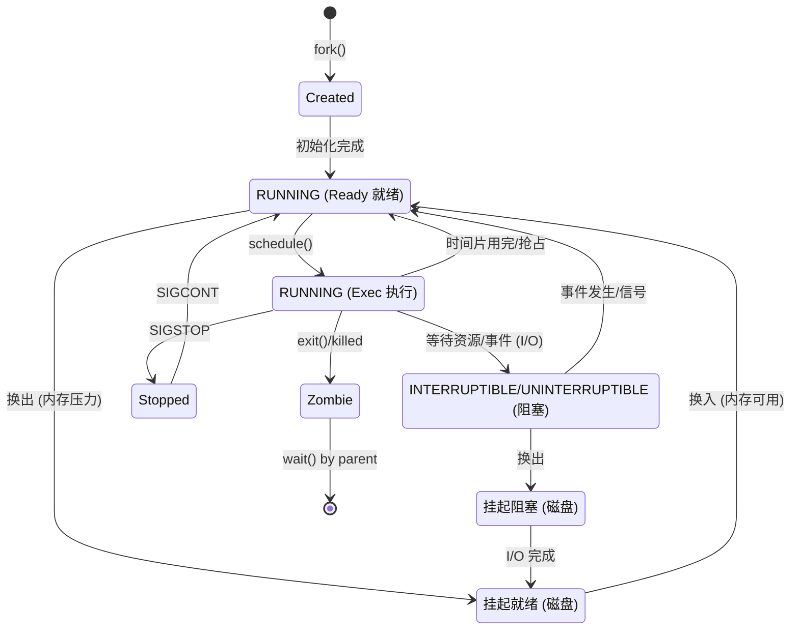

#### 2.2.2 调度相关结构

```c
struct sched_entity {
    struct load_weight load;      // 负载权重
    struct rb_node run_node;      // 红黑树节点
    unsigned int on_rq;           // 是否在运行队列
    u64 exec_start;               // 当前执行开始时间
    u64 sum_exec_runtime;         // 总执行时间
    u64 vruntime;                 // 虚拟运行时间 (CFS 核心!)
    u64 prev_sum_exec_runtime;    // 上次调度周期的总执行时间
    // ...
};
```

---

## 3. 进程创建

### 3.1 fork() 系统调用

```c
pid_t pid = fork();
if (pid == 0) {
    // 子进程
    printf("I am child, PID = %d\n", getpid());
} else if (pid > 0) {
    // 父进程
    printf("I am parent, child PID = %d\n", pid);
} else {
    // fork 失败
    perror("fork");
}
```

### 3.2 内核创建流程

Linux 内核通过 `kernel_clone()` 函数(旧版本为 `_do_fork`)实现进程创建, 其核心逻辑高度模块化: 

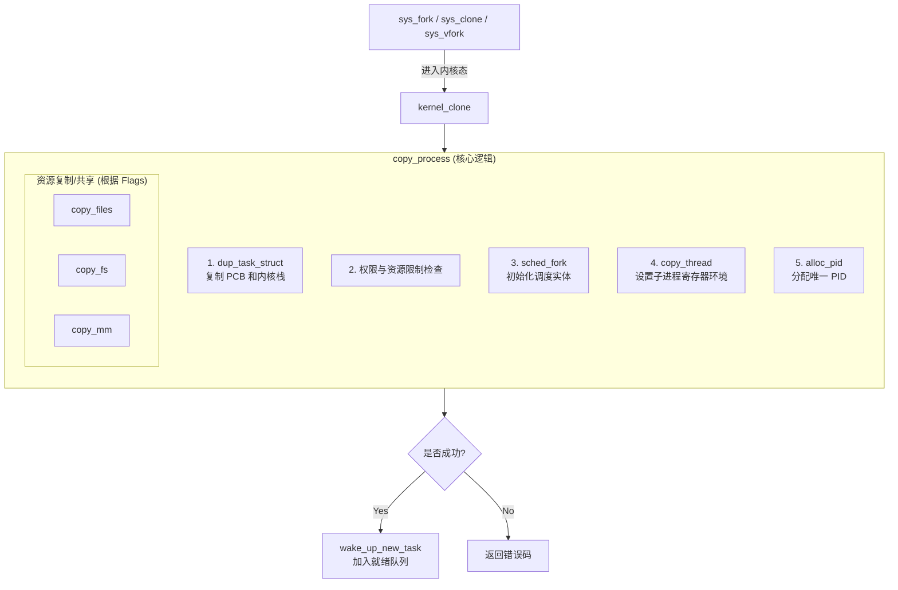

### 3.3 clone() 和共享控制

`clone()` 允许细粒度控制父子进程共享的资源:

| 标志 | 共享内容 |
|------|----------|
| `CLONE_VM` | 地址空间 (mm_struct) |
| `CLONE_FS` | 文件系统信息 (cwd, root, umask) |
| `CLONE_FILES` | 文件描述符表 |
| `CLONE_SIGHAND` | 信号处理程序 |
| `CLONE_THREAD` | 同一线程组 (共享 PID) |
| `CLONE_PARENT` | 与调用者同父进程 |
| `CLONE_NEWNS` | 新的 mount 命名空间 |
| `CLONE_NEWPID` | 新的 PID 命名空间 |
| `CLONE_NEWNET` | 新的网络命名空间 |

### 3.4 Copy-on-Write (COW) 写时复制

为了减少 `fork()` 的开销, Linux 并不立即复制内存, 而是采用延迟复制策略: 

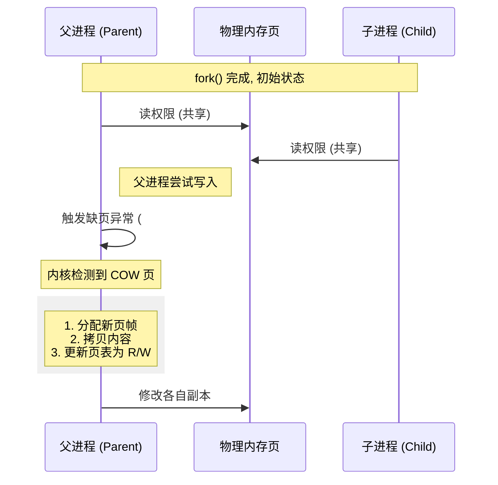

---

## 4. 线程模型

### 4.1 为什么引入线程?

**进程的局限性**:

| 问题 | 说明 |
|------|------|
| 创建开销大 | 需要分配独立地址空间, 复制页表 |
| 切换开销大 | 地址空间切换导致 TLB 刷新 |
| 通信困难 | 需要 IPC 机制 (管道,socket,共享内存) |
| 资源隔离过强 | 有时需要共享数据 |

**线程的优势**:

### 4.1 进程与线程模型对比

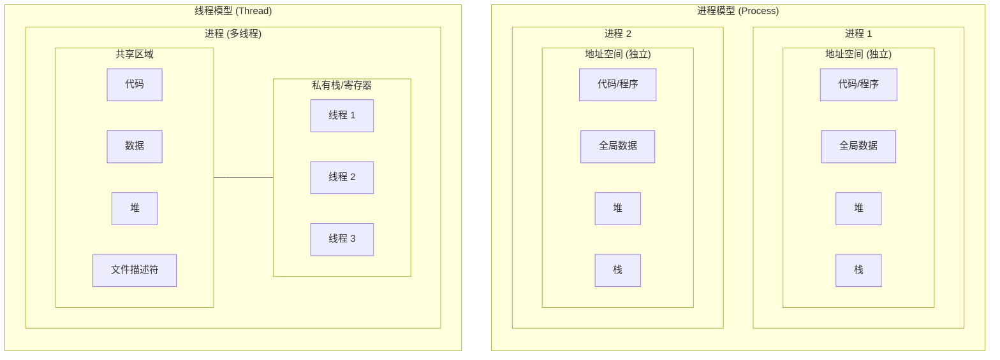

| 对比项 | 进程 | 线程 |
|--------|------|------|
| 创建时间 | ~ms 级 | ~μs 级 |
| 切换时间 | ~100μs (刷新 TLB) | ~10μs (共享地址空间) |
| 通信方式 | IPC | 直接共享内存 |
| 一个崩溃 | 不影响其他进程 | 整个进程崩溃 |

### 4.2 线程的应用场景

| 场景 | 描述 | 示例 |
|------|------|------|
| **I/O 并发** | 一个线程阻塞时其他线程继续工作 | Web 服务器,数据库 |
| **计算并行** | 利用多核 CPU 并行计算 | 视频编码,科学计算 |
| **响应性** | 后台线程处理耗时任务, UI 保持响应 | GUI 应用程序 |
| **模块化** | 不同功能由不同线程负责 | 游戏引擎 (渲染,物理,AI) |

### 4.3 Web 服务器的线程实现

**单线程服务器 (阻塞模型)**:

```c
while (true) {
    conn = accept(listen_fd);  // 阻塞等待连接
    request = read(conn);       // 阻塞读取请求
    response = process(request);
    write(conn, response);      // 阻塞写入响应
    close(conn);
}
// 问题: 一次只能服务一个客户端
```

**多线程服务器 (每连接一线程)**:

```c
void *handle_client(void *arg) {
    int conn = *(int *)arg;
    request = read(conn);
    response = process(request);
    write(conn, response);
    close(conn);
    return NULL;
}

while (true) {
    conn = accept(listen_fd);
    pthread_create(&tid, NULL, handle_client, &conn);
    pthread_detach(tid);  // 线程结束后自动清理
}
// 优点: 并发处理多个客户端
// 缺点: 线程创建开销, 大量连接时线程数爆炸
```

**线程池服务器 (推荐)**:

```c
#define POOL_SIZE 100
pthread_t workers[POOL_SIZE];
queue_t task_queue;

void *worker_thread(void *arg) {
    while (true) {
        conn = queue_pop(&task_queue);  // 阻塞等待任务
        request = read(conn);
        response = process(request);
        write(conn, response);
        close(conn);
    }
}

int main() {
    // 预创建线程池
    for (int i = 0; i < POOL_SIZE; i++)
        pthread_create(&workers[i], NULL, worker_thread, NULL);
    
    while (true) {
        conn = accept(listen_fd);
        queue_push(&task_queue, conn);  // 放入任务队列
    }
}
// 优点: 线程复用, 控制并发度
```

### 4.4 线程实现的三种方式

| 类型 | 英文 | 调度者 | 优点 | 缺点 |
|------|------|--------|------|------|
| 用户级线程 | User-Level Thread (ULT) | 用户态线程库 | 切换快 (无系统调用), 无需内核支持 | 一个阻塞则全部阻塞, 无法利用多核 |
| 内核级线程 | Kernel-Level Thread (KLT) | 内核调度器 | 真并发, 阻塞独立, 利用多核 | 切换开销大 (需要系统调用) |
| 混合模型 | M:N Model | 两级调度 | 灵活, 权衡性能 | 实现复杂 |

### 4.4 用户级线程 (ULT) 工作原理

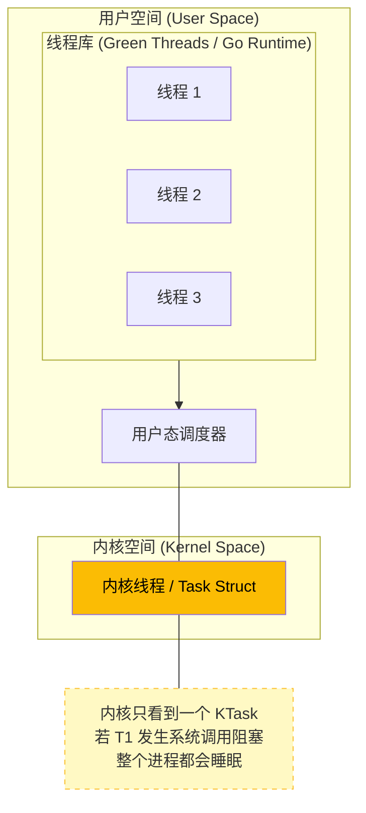

### 4.5 重要概念: 原语与可再入程序

**原语 (Primitive)**:

| 概念 | 说明 |
|------|------|
| 定义 | 由若干条机器指令组成的, 用于完成特定功能的原子操作 |
| 特点 | 执行过程中不可被中断 |
| 实现 | 关中断,原子指令 |
| 示例 | P/V 操作, 进程创建/销毁原语 |

```c
// P 操作原语伪代码
void P(semaphore *s) {
    关中断();
    s->value--;
    if (s->value < 0) {
        将当前进程加入等待队列;
        阻塞当前进程;
    }
    开中断();
}
```

**可再入程序 (Reentrant Program)**:

| 概念 | 说明 |
|------|------|
| 定义 | 可被多个进程同时调用而不会产生错误的程序 |
| 要求 | 不使用全局/静态变量, 或使用时加锁 |
| 对比 | 不可再入程序使用共享数据结构而不保护 |

```c
// 不可再入: 使用静态变量
char *strtok(char *str, const char *delim) {
    static char *last;  // 静态变量, 多线程不安全
    // ...
}

// 可再入版本: 由调用者管理状态
char *strtok_r(char *str, const char *delim, char **saveptr) {
    // saveptr 由调用者提供, 线程安全
    // ...
}
```

### 4.6 Linux 线程模型 (1\:1)

Linux 使用 1\:1 模型: 每个用户线程对应一个内核 `task_struct`.

**NPTL (Native POSIX Thread Library)** 特点:
- 基于 `clone()` 系统调用
- 线程与进程共享相同的内核表示
- TID (线程 ID) 实际上就是 `task_struct->pid`
- TGID (线程组 ID) 是主线程的 PID

```c
// 判断是否同一进程的线程
bool same_thread_group(struct task_struct *p1, struct task_struct *p2) {
    return p1->tgid == p2->tgid;
}
```

### 4.7 Pthreads API

```c
#include <pthread.h>

// 线程属性
pthread_attr_t attr;
pthread_attr_init(&attr);
pthread_attr_setdetachstate(&attr, PTHREAD_CREATE_JOINABLE);
pthread_attr_setstacksize(&attr, 2 * 1024 * 1024);  // 2MB 栈

// 创建线程
pthread_t tid;
int *arg = malloc(sizeof(int));
*arg = 42;
pthread_create(&tid, &attr, thread_func, arg);

// 等待线程结束
void *retval;
pthread_join(tid, &retval);

// 线程函数
void *thread_func(void *arg) {
    int value = *(int *)arg;
    // ... 处理
    return NULL;
}
```

---

## 5. CPU 调度基础

### 5.1 调度时机

| 时机 | 触发方式 |
|------|----------|
| 进程终止 | 调用 `exit()` 或被信号杀死 |
| 进程阻塞 | I/O 等待,锁等待,sleep |
| 时间片用尽 | 定时器中断触发 |
| 高优先级进程就绪 | 抢占当前进程 |
| 进程主动让出 | 调用 `sched_yield()` |

### 5.2 调度指标

| 指标 | 英文 | 定义 | 优化方向 |
|------|------|------|----------|
| CPU 利用率 | CPU Utilization | CPU 忙碌时间占比 | 批处理: 最大化 |
| 吞吐量 | Throughput | 单位时间完成进程数 | 批处理: 最大化 |
| 周转时间 | Turnaround Time | 从提交到完成总时间 | 批处理: 最小化 |
| 等待时间 | Waiting Time | 就绪队列等待时间 | 交互式: 最小化 |
| 响应时间 | Response Time | 从请求到首次响应 | 交互式: 最小化 |

### 5.3 经典调度算法

| 算法 | 英文 | 特点 | 问题 |
|------|------|------|------|
| FCFS | First-Come, First-Served | 简单, 非抢占 | 护航效应 |
| SJF | Shortest Job First | 最优平均等待时间 | 需预知执行时间, 饥饿 |
| SRTF | Shortest Remaining Time First | SJF 抢占版 | 同上 |
| RR | Round Robin | 公平, 抢占 | 时间片选择困难 |
| Priority | Priority Scheduling | 重要任务优先 | 饥饿 |
| MLFQ | Multi-Level Feedback Queue | 动态调整优先级 | 参数调优复杂 |

---

## 6. Linux CFS 调度器

### 6.1 设计思想

CFS (Completely Fair Scheduler) 的目标是给每个进程分配公平的 CPU 时间:

**核心概念**: `vruntime` (虚拟运行时间)
- 实际运行时间按权重归一化
- 始终调度 vruntime 最小的进程
- 高权重进程 vruntime 增长慢 → 获得更多 CPU

### 6.2 vruntime 计算

```
vruntime += delta_exec × (NICE_0_LOAD / weight)

其中:
- delta_exec: 实际执行时间 (纳秒)
- weight: 进程当前权重

### 6.3 EEVDF 调度器 (Linux 6.6+)

从 Linux 6.6 开始, EEVDF (Earliest Eligible Virtual Deadline First) 取代了 CFS 成为默认调度器. 它通过将"公平性"与"延迟控制"解耦, 解决了 CFS 在处理延迟敏感任务时的先天不足.

| 特性 | CFS | EEVDF |
|------|-----|-------|
| **理论基础** | 纯 vruntime 比较 | V-Time + Lag + Deadline |
| **调度目标** | 最大化吞吐与长期公平 | 响应截止时间保障 |
| **核心优势** | 实现简单, 吞吐量高 | 更精确的延迟控制, 消除不必要的抢占 |

**EEVDF 核心机制**:
1. **Lag (滞后)**: 进程实际获得的 CPU 时间与理论公平份额的差值 (`Lag = Shared - Actual`).
2. **Eligible (合格)**: 只有 `Lag >= 0` (即之前没跑够) 的进程才有资格被调度.
3. **Virtual Deadline (虚拟截止时间)**: 计算进程在未来的什么时候应该完成它的下一个时间片. EEVDF 始终选择当前合格且截止时间最早的任务.
```

### 6.3 nice 值与权重

```c
// kernel/sched/core.c
const int sched_prio_to_weight[40] = {
    /* -20 */ 88761, 71755, 56483, 46273, 36291,
    /* -15 */ 29154, 23254, 18705, 14949, 11916,
    /* -10 */ 9548, 7620, 6100, 4904, 3906,
    /*  -5 */ 3121, 2501, 1991, 1586, 1277,
    /*   0 */ 1024, 820,  655,  526,  423,  // nice 0 = 1024
    /*   5 */ 335,  272,  215,  172,  137,
    /*  10 */ 110,  87,   70,   56,   45,
    /*  15 */ 36,   29,   23,   18,   15,   // nice 19
};
```

**权重比例**: 相邻 nice 值的权重比约为 1.25, 即 nice 每差 1, CPU 时间差 10%.
### 6.4 红黑树组织

CFS 使用红黑树按 vruntime 排序可运行进程:

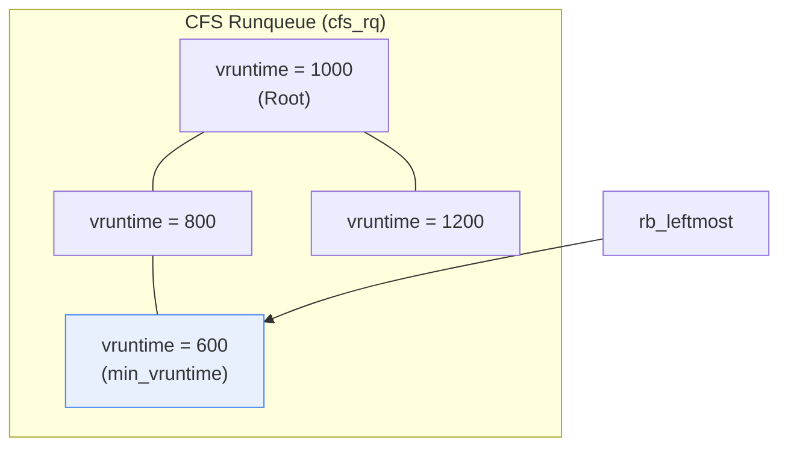

### 6.5 CFS 核心代码路径

```c
// kernel/sched/fair.c

// 选择下一个进程
static struct task_struct *pick_next_task_fair(struct rq *rq, ...) {
    struct cfs_rq *cfs_rq = &rq->cfs;
    struct sched_entity *se;
    
    // 如果没有可运行任务, 返回 NULL
    if (!cfs_rq->nr_running)
        return NULL;
    
    // 选择 vruntime 最小的实体 (红黑树最左节点)
    se = pick_next_entity(cfs_rq, NULL);
    
    return task_of(se);
}

// 更新 vruntime
static void update_curr(struct cfs_rq *cfs_rq) {
    struct sched_entity *curr = cfs_rq->curr;
    u64 now = rq_clock_task(rq_of(cfs_rq));
    u64 delta_exec;
    
    delta_exec = now - curr->exec_start;
    curr->exec_start = now;
    curr->sum_exec_runtime += delta_exec;
    
    // 计算加权后的 vruntime 增量
    curr->vruntime += calc_delta_fair(delta_exec, curr);
    
    // 更新 cfs_rq 的 min_vruntime
    update_min_vruntime(cfs_rq);
}
```

### 6.6 调度延迟与最小粒度

```c
// 调度周期 (所有进程至少运行一次的时间)
sched_latency_ns = 6ms (少于 8 个进程)
sched_latency_ns = nr_running × 0.75ms (多进程时)

// 最小运行时间粒度
sched_min_granularity_ns = 0.75ms
```

---

## 7. 实时调度

### 7.1 实时调度策略

| 策略 | 说明 | 优先级范围 |
|------|------|------------|
| SCHED_FIFO | 先进先出, 无时间片 | 1-99 |
| SCHED_RR | 轮转, 有时间片 | 1-99 |
| SCHED_DEADLINE | EDF (Earliest Deadline First) | 特殊 |

### 7.2 SCHED_DEADLINE

基于 CBS (Constant Bandwidth Server) 算法:

```c
struct sched_attr attr = {
    .size = sizeof(attr),
    .sched_policy = SCHED_DEADLINE,
    .sched_runtime  = 10000000,  // 10ms 执行时间
    .sched_deadline = 30000000,  // 30ms 截止时间
    .sched_period   = 30000000,  // 30ms 周期
};
sched_setattr(pid, &attr, 0);
```

### 7.3 调度类优先级

### 7.3 调度类优先级

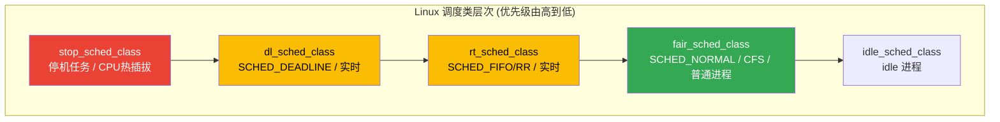

---

## 8. cgroups 与 CPU 控制

### 8.1 cgroups v2 CPU 控制器

```bash
# 创建 cgroup
mkdir /sys/fs/cgroup/mygroup

# 限制 CPU 带宽 (每 100ms 最多使用 50ms)
echo "50000 100000" > /sys/fs/cgroup/mygroup/cpu.max

# 设置 CPU 权重 (相对于其他 cgroup)
echo 100 > /sys/fs/cgroup/mygroup/cpu.weight

# 将进程加入 cgroup
echo $PID > /sys/fs/cgroup/mygroup/cgroup.procs
```

### 8.2 cpu.max 格式

```
$MAX $PERIOD

示例:
50000 100000  → 每 100ms 可使用 50ms (50%)
max 100000    → 无限制
```

---

## 9. 进程状态查看与调试

### 9.1 /proc 文件系统

```bash
# 查看进程状态
cat /proc/$PID/status

# 关键字段
State: S (sleeping)
Pid:   12345
PPid:  1234
Threads: 4
VmPeak: 1234 kB    # 虚拟内存峰值
VmRSS:  567 kB     # 常驻内存
voluntary_ctxt_switches:   100
nonvoluntary_ctxt_switches: 50
```

### 9.2 调度参数查看

```bash
# 查看进程调度策略和优先级
chrt -p $PID

# 设置实时优先级
chrt -f -p 50 $PID    # SCHED_FIFO, 优先级 50
chrt -r -p 50 $PID    # SCHED_RR, 优先级 50

# 设置 nice 值
nice -n 10 ./myprogram
renice -n -5 -p $PID
```

---

## 参考教材

| 主题 | 推荐阅读 |
|------|----------|
| 进程概念 | *OSTEP* Ch4-5, *恐龙书* Ch3 |
| 线程 | *OSTEP* Ch26-27, *恐龙书* Ch4 |
| 调度算法 | *OSTEP* Ch7-9, *恐龙书* Ch5 |
| Linux CFS | *LKD* Ch4, kernel/sched/fair.c |
| task_struct | *ULK* Ch3 |

---

## 内核源码引用

| 主题 | 源码路径 | 关键函数/结构 |
|------|----------|---------------|
| task_struct 定义 | `include/linux/sched.h` | `struct task_struct` |
| 进程创建 | `kernel/fork.c` | `kernel_clone()`, `copy_process()` |
| CFS 调度器 | `kernel/sched/fair.c` | `pick_next_task_fair()`, `update_curr()` |
| 调度实体 | `include/linux/sched.h` | `struct sched_entity` |
| 调度类 | `kernel/sched/sched.h` | `struct sched_class` |
| 实时调度 | `kernel/sched/rt.c` | `pick_next_task_rt()` |
| Deadline 调度 | `kernel/sched/deadline.c` | `pick_next_task_dl()` |
| 上下文切换 | `kernel/sched/core.c` | `context_switch()`, `__schedule()` |
| 运行队列 | `kernel/sched/sched.h` | `struct rq` |
| 权重表 | `kernel/sched/core.c` | `sched_prio_to_weight[]` |
| cgroups CPU | `kernel/sched/core.c` | `cpu_cgroup_*()` 函数 |
| PID 管理 | `kernel/pid.c` | `alloc_pid()`, `struct pid` |

**在线源码浏览**: [Bootlin Elixir](https://elixir.bootlin.com/linux/latest/source)

---

## 10. 进程间通信 (IPC)

由于进程间地址空间隔离, 必须通过内核提供的 IPC 机制交换数据.

### 10.1 IPC 机制对比

| IPC 方式 | 特性 | 适用场景 |
|----------|------|----------|
| **管道 (Pipe)** | 单向字节流 (或 FIFO 双向) | 简单生产/消费 (shell 管道) |
| **信号 (Signal)** | 异步通知原语 | 进程状态通知,终止,配置重载 |
| **共享内存** | 直接映射同一块物理内存 | **性能极致**, 需配合互斥锁 |
| **消息队列** | 结构化数据异步队列 | 解耦发送方与接收方 |
| **Socket** | 统一通信抽象 (TCP/UDP, Unix Domain) | 跨主机或本地高性能通信 |

### 10.2 共享内存详解

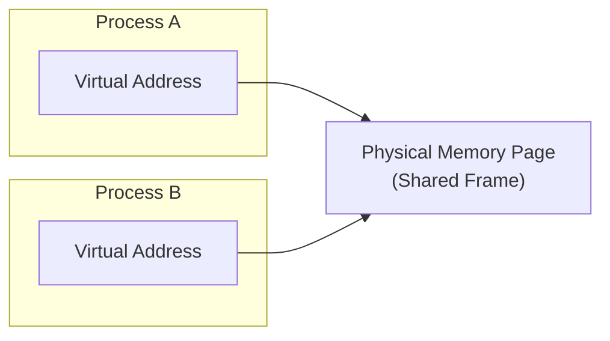

```
┌─────────────────────────────────────────────────────────────────────────┐
│  优点: 零拷贝, 速度最快                                                  │
│  缺点: 需要同步机制 (互斥锁/信号量) 保护                                  │
└─────────────────────────────────────────────────────────────────────────┘
```

---

## 11. 信号机制

信号是 Linux 中唯一的异步通信方式, 用于内核或应用向进程发送事件通知.

### 11.1 核心信号

| 信号 | 编号 | 语义 | 可捕获 |
|------|------|------|--------|
| SIGTERM | 15 | 优雅退出请求 | 是 |
| SIGKILL | 9 | 强制终结 | **否** |
| SIGINT | 2 | 终端中断 (Ctrl+C) | 是 |
| SIGHUP | 1 | 终端断开 / 配置重载 | 是 |
| SIGCHLD | 17 | 子进程状态变化 | 是 |
| SIGSEGV | 11 | 段错误 | 是 |
| SIGSTOP | 19 | 停止进程 | **否** |

### 11.2 信号处理

```c
#include <signal.h>

void handler(int sig) {
    // 只能调用 async-signal-safe 函数
    write(STDOUT_FILENO, "caught\n", 7);
}

int main() {
    struct sigaction sa = {
        .sa_handler = handler,
        .sa_flags = SA_RESTART,
    };
    sigemptyset(&sa.sa_mask);
    sigaction(SIGINT, &sa, NULL);
    // ...
}
```

> **警告**: 信号处理函数中**禁止调用**非异步信号安全函数 (如 `printf`, `malloc`), 否则可能导致死锁或堆损坏.

---


## 12. 上下文切换深度

### 12.1 切换过程

```
┌─────────────────────────────────────────────────────────────────────────┐
│                       上下文切换完整流程                                  │
├─────────────────────────────────────────────────────────────────────────┤
│                                                                         │
│  1. 保存当前进程上下文                                                   │
│     ┌──────────────────────────────────────────────────────────────┐    │
│     │  保存 CPU 寄存器 (通用寄存器, PC, SP, 标志位) 到 task_struct  │    │
│     └──────────────────────────────────────────────────────────────┘    │
│                                 ↓                                       │
│  2. 更新调度数据结构                                                     │
│     ┌──────────────────────────────────────────────────────────────┐    │
│     │  更新当前进程的 vruntime, 将其放回运行队列                       │    │
│     │  从运行队列选择下一个进程                                        │    │
│     └──────────────────────────────────────────────────────────────┘    │
│                                 ↓                                       │
│  3. 切换地址空间 (如果跨进程)                                            │
│     ┌──────────────────────────────────────────────────────────────┐    │
│     │  加载新进程的页表基地址 (CR3 寄存器)                             │    │
│     │  TLB 失效 → 大量 TLB Miss                                        │    │
│     └──────────────────────────────────────────────────────────────┘    │
│                                 ↓                                       │
│  4. 恢复新进程上下文                                                     │
│     ┌──────────────────────────────────────────────────────────────┐    │
│     │  从 task_struct 恢复寄存器, 跳转到 PC 执行                       │    │
│     └──────────────────────────────────────────────────────────────┘    │
│                                                                         │
└─────────────────────────────────────────────────────────────────────────┘
```

### 12.2 性能损耗

| 类型 | 英文 | 说明 |
|------|------|------|
| 硬成本 | Hard Cost | CPU 周期消耗 (保存/恢复寄存器) |
| 软成本 | Soft Cost | 缓存冷启动 (Cache Pollution), TLB Miss |

**监测命令**:

```bash
# 观察上下文切换
pidstat -w 1
# cswch/s: 自愿切换 (I/O 等待)
# nvcswch/s: 非自愿切换 (时间片耗尽)
```

---

## 13. 容器资源管理: Cgroups

### 13.1 Cgroups 概述

**Cgroups (Control Groups)** 是 Linux 内核用于限制, 审计和隔离进程组资源使用的机制.

| 核心功能 | 说明 |
|----------|------|
| 资源限制 | 设置内存上限, CPU 配额 |
| 优先级分配 | 确保关键组获得更多资源 |
| 统计审计 | 监控实际资源消耗 |
| 控制 | 挂起, 重启或终止进程组 |

### 13.2 Cgroup v1 vs v2

| 对比项 | v1 | v2 |
|--------|-----|-----|
| 层级结构 | 多层级并存 | 统一层级 |
| 进程归属 | 可属于多个层级 | 只能属于叶子节点 |
| eBPF 集成 | 有限 | 深度集成 |
| PSI 支持 | 无 | 原生支持 |

### 13.3 CPU 控制器

```bash
# v2 配置示例
mkdir /sys/fs/cgroup/mygroup

# 启用控制器
echo "+cpu +memory" > /sys/fs/cgroup/cgroup.subtree_control

# 设置 CPU 配额: 100ms 周期内最多使用 20ms (20%)
echo "20000 100000" > /sys/fs/cgroup/mygroup/cpu.max

# 将进程加入组
echo $$ > /sys/fs/cgroup/mygroup/cgroup.procs
```

### 13.4 Memory 控制器

| 参数 | 作用 |
|------|------|
| `memory.low` | 软保护线, 内核尽力保证 |
| `memory.high` | 节流线, 超过后限速 |
| `memory.max` | 硬上限, 超过触发 OOM |
| `memory.swap.max` | Swap 限额 |

---

## 14. 性能观测方法论

### 14.1 USE 方法

Brendan Gregg 提出的 **USE 方法**, 针对每个资源检查:

| 指标 | 英文 | 说明 |
|------|------|------|
| **U** - 使用率 | Utilization | 资源忙碌时间占比 |
| **S** - 饱和度 | Saturation | 请求排队等待的程度 |
| **E** - 错误 | Errors | 资源是否产生错误 |

### 14.2 黄金 60 秒命令

登录性能异常服务器时, 快速执行以下命令:

```bash
# 1. 基础负载
uptime                    # Load Average
dmesg -T | tail -n 50     # 内核错误/OOM

# 2. CPU 分布
vmstat 1                  # r(运行队列), b(等待I/O)
mpstat -P ALL 1           # 各 CPU 核心状态

# 3. 进程分析
pidstat 1                 # 各进程 CPU/内存
top -1                    # 按 CPU 排序

# 4. I/O 状态
iostat -xz 1              # %util, await
iotop                     # 进程级 I/O

# 5. 内存状态
free -h                   # 内存/Swap
cat /proc/meminfo | grep -E "Dirty|Writeback"

# 6. 网络状态
sar -n DEV 1              # 网卡吞吐
ss -s                     # Socket 统计
```

---

## 15. PSI: 压力阻塞信息

### 15.1 Load Average 的局限

传统 Load Average 存在以下问题:

| 问题 | 说明 |
|------|------|
| 混合信号 | 无法区分 CPU 压力还是 I/O 压力 |
| 无时间比例 | 不知道等待时间占比 |
| 延迟反馈 | 5 分钟和 15 分钟指标滞后 |

### 15.2 PSI 概念

**PSI (Pressure Stall Information)** 提供更精准的资源阻塞视图:

| 指标 | 说明 |
|------|------|
| **some** | 至少有一个任务因该资源阻塞的时间占比 |
| **full** | 所有任务都因该资源阻塞的时间占比 (CPU 没有此指标) |

### 15.3 读取 PSI

```bash
# CPU 压力 (仅 some)
cat /proc/pressure/cpu
# some avg10=0.00 avg60=0.00 avg300=0.00 total=12345

# 内存压力
cat /proc/pressure/memory
# some avg10=0.50 avg60=0.30 avg300=0.10 total=67890
# full avg10=0.00 avg60=0.00 avg300=0.00 total=1234

# I/O 压力
cat /proc/pressure/io
# some avg10=2.50 avg60=1.20 avg300=0.80 total=98765
# full avg10=0.10 avg60=0.05 avg300=0.02 total=5678
```

### 15.4 PSI 解读

- **some avg10=2.50**: 过去 10 秒内, 有 2.5% 的时间**至少有一个**非 idle 任务因等待 I/O 而受阻. 
- **full avg10=0.10**: 过去 10 秒内, 有 0.1% 的时间**所有**非 idle 任务全被 I/O 阻塞. 这意味着系统彻底卡死.

| 场景 | PSI 表现 |
|------|----------|
| CPU 瓶颈 | `cpu/some` 高 |
| 内存压力 | `memory/some` 高, 内核正在回收 |
| 严重内存不足 | `memory/full` 高, 系统抖动 |
| I/O 瓶颈 | `io/some` 高, 进程等待磁盘 |

### 15.5 Cgroup v2 中的 PSI

```bash
# 查看特定 cgroup 的压力
cat /sys/fs/cgroup/mygroup/cpu.pressure
cat /sys/fs/cgroup/mygroup/memory.pressure
cat /sys/fs/cgroup/mygroup/io.pressure
```

**Kubernetes 应用**: Kubelet 使用 PSI 进行驱逐决策, 比传统阈值更精准.

## 16. CPU 调度器与亲和性调优

针对不同负载类型, 默认的 CFS 策略可能不是最优, 内核提供了以下调优手段:

### 16.1 调度延迟与粒度 (Root 权限)

调整 `/proc/sys/kernel/` 下的参数 (需谨慎):
*   **`sched_latency_ns`**: 调度周期. 默认为 24ms. 增加此值可减少上下文切换, 提高 **Throughput (吞吐量)**, 但会牺牲桌面响应性. 适合批处理任务.
*   **`sched_min_granularity_ns`**: 最小运行时间片. 默认为 3ms. 保证进程至少运行这么久才被抢占, 防止 CPU 缓存极速抖动.

### 16.2 CPU 亲和性与隔离 (Numa Awareness)

避免进程在不同 CPU 间反复横跳 (Cache Miss) 的大杀器:
1.  **CPU Affinity (亲和性)**:
    *   **命令**: `taskset -c 0,1 python myapp.py`
    *   **作用**: 强制进程只在 Core 0 和 Core 1 上运行. 
    *   **场景**: Redis, Nginx Worker.
2.  **Core Isolation (核心隔离)**:
    *   **配置**: 启动参数 `isolcpus=2,3`.
    *   **作用**: 告诉内核调度器**永远不要**把普通进程调度到 Core 2 和 3 上. 只有显式绑定 (taskset) 的进程才能去.
    *   **场景**: HFT (高频交易), DPDK, 实时控制系统.

---

## 17. Linux 进程运维实战

### 17.1 内存指标深度解析 (VSS/RSS/PSS/USS)

在 `top` 或 `ps` 中看到的内存只是冰山一角. 准确评估内存占用需区分:

| 指标 | 全称 | 含义 | 深入解读 |
| :--- | :--- | :--- | :--- |
| **VSS** | Virtual Set Size | 虚拟耗用内存 | **虚高**. 包含所有申请但未分配的物理内存 (如 malloc 1GB 但未写入). |
| **RSS** | Resident Set Size | 驻留内存 | **常用的误导性指标**. 包含进程占用的所有物理内存, 但**重复计算了共享库**. 多个进程的 RSS 相加会远超物理内存. |
| **PSS** | Proportional Set Size | 比例驻留内存 | **最公正**. 将共享内存按比例分摊 (如 glibc 占用 2MB 被 2 个进程共享, 则各算 1MB). |
| **USS** | Unique Set Size | 独占驻留内存 | **泄露的一阶导数**. 进程独占的物理内存. 杀掉该进程能**立刻回收**的真实数值. |

### 17.2 上下文切换与 Nice 值

**上下文切换 (Context Switch)**:
*   **自愿切换 (Voluntary)**: 进程等待 IO 或锁, 主动让出 CPU.
*   **非自愿切换 (Involuntary)**: 时间片用尽或高优先级进程抢占.
*   **观测命令**: `pidstat -w 1` (`cswch/s`, `nvcswch/s`).

**Nice 值与优先级**:
*   **Nice (-20 ~ 19)**: 用户态调整权重的接口. `-20` 最高优先级 (最不 nice), `19` 最低.
*   **计算公式**: 普通进程内核优先级 `Static_Prio = 20 + Nice`.
*   **权限**: 只有 root 可以降低 Nice (提权), 普通用户只能调高 (避让).

### 17.3 Cgroup v2 核心控制器

Cgroup v2 统一了层级结构, 并引入了更人性化的配置接口:

| 控制器 | 关键文件 | 作用 & 示例 |
| :--- | :--- | :--- |
| **CPU** | `cpu.weight` | **权重**. 默认 100. 决定争抢 CPU 时的比例. |
| | `cpu.max` | **硬限额**. `20000 100000` 表示 100ms 周期内限制使用 20ms (0.2 Core). |
| **Memory** | `memory.low` | **软保护**. 内存低于此值时, 内核尽量不回收该组内存. |
| | `memory.high` | **节流线**. 超过此值进程会被降速并强制回收, 但不杀进程. |
| | `memory.max` | **OOM 线**. 硬顶. 越过即 OOM. |
| **I/O** | `io.max` | **读写限速**. `8\:0 rbps=1048576` 限制主盘读带宽 1MB/s. |

---

## 18. 线程模型深究: CLONE 标志

### 18.1 进程 vs 线程的内核视图

Linux 内核中, 进程和线程都是 `task_struct`, 区别在于资源共享程度:

```c
// 创建进程: fork()
clone(SIGCHLD);  // 不共享任何资源

// 创建线程: pthread_create()
clone(CLONE_VM | CLONE_FS | CLONE_FILES | CLONE_SIGHAND | 
      CLONE_THREAD | CLONE_SYSVSEM | SIGCHLD);
```

### 18.2 CLONE 标志详解

| 标志 | 含义 | 进程 | 线程 |
|------|------|------|------|
| `CLONE_VM` | 共享虚拟内存 | × | ✓ |
| `CLONE_FS` | 共享文件系统信息 (根目录, umask) | × | ✓ |
| `CLONE_FILES` | 共享文件描述符表 | × | ✓ |
| `CLONE_SIGHAND` | 共享信号处理程序 | × | ✓ |
| `CLONE_THREAD` | 同一线程组 (共享 PID) | × | ✓ |
| `CLONE_PARENT` | 共享父进程 | × | ✓ |
| `CLONE_NEWNS` | 新 Mount namespace | 可选 | × |
| `CLONE_NEWPID` | 新 PID namespace | 可选 | × |

### 18.3 线程共享与独立

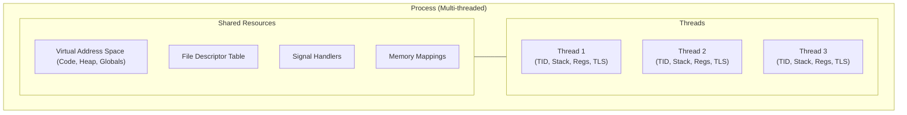

---

## 19. 进程与线程深度对比

### 19.1 核心对比表

| 对比维度 | 进程 (Process) | 线程 (Thread) |
|----------|----------------|---------------|
| **本质** | 资源分配的最小单位 | CPU 调度的最小单位 |
| **地址空间** | 独立 | 共享所属进程的地址空间 |
| **通信成本** | 高 (IPC) | 低 (共享内存, 但需同步) |
| **切换成本** | 高 (页表切换, TLB 刷新) | 低 (仅寄存器/栈切换) |
| **稳定性** | 强 (一个崩溃不影响其他) | 弱 (一个 crash 导致全挂) |
| **创建速度** | 慢 (复制 mm_struct) | 快 (共享 mm_struct) |

### 19.2 优缺点对比

**进程**:
*   ✅ **安全**: 隔离性好, 可通过 Cgroups 单独限制资源.
*   ✅ **解耦**: 适合多服务架构 (Microservices).
*   ❌ **重**: 内存占用大, 切换慢.

**线程**:
*   ✅ **快**: 极致性能, 数据共享无需拷贝.
*   ✅ **轻**: 创建销毁代价小.
*   ❌ **难**: 并发编程复杂度高 (锁, 竞争, 死锁).
*   ❌ **险**: 无隔离, 一个线程 OOM/Segfault 可能带崩整个进程.

### 19.3 选型建议

| 场景 | 推荐模型 | 原因 |
|------|----------|------|
| **Chrome 浏览器** | **多进程** | 每个 Tab 一个进程. 网页崩溃不影响浏览器; 安全沙箱. |
| **Nginx** | **多进程 + 异步 IO** | Master 管理 Worker. 稳定性高, 利用多核. |
| **Redis** | **单线程 (主)** | 避免锁竞争, 利用 CPU 缓存. (持久化用子进程). |
| **MySQL / JVM** | **多线程** | 需要频繁共享大量内存数据 (Buffer Pool, Heap). |
| **AI 训练** | **多进程 (DDP)** | Python GIL 限制, 多进程规避锁, 独立显存上下文. |

### 19.4 底层核心概念

*   **LWP (Light Weight Process)**: Linux 内核没有 "线程" 的概念, 只有 LWP. `pthread_create` 对应 `clone(CLONE_VM | ...)`.
*   **TID vs PID**:
    *   在内核中: 每个 LWP 都有唯一 `PID`.
    *   在用户态: POSIX 标准要求同一进程的所有线程 `getpid()` 返回相同值.
    *   **实现**: `task_struct` 有 `tgid` (Thread Group ID). 主线程 `PID` = `TGID`. 所有线程调用 `getpid()` 其实是返回 `tgid`.

---

## 20. 特殊进程类型与处理

### 20.1 特殊进程分类

| 类型 | 英文 | 特征 | 状态 |
|------|------|------|------|
| **僵尸进程** | Zombie | 已退出但父进程未回收 | Z |
| **孤儿进程** | Orphan | 父进程已退出 | 被 init 收养 |
| **守护进程** | Daemon | 后台运行, 无控制终端 | S/R |
| **内核线程** | Kernel Thread | 只运行在内核态 | 无 mm_struct |

### 20.2 僵尸进程详解

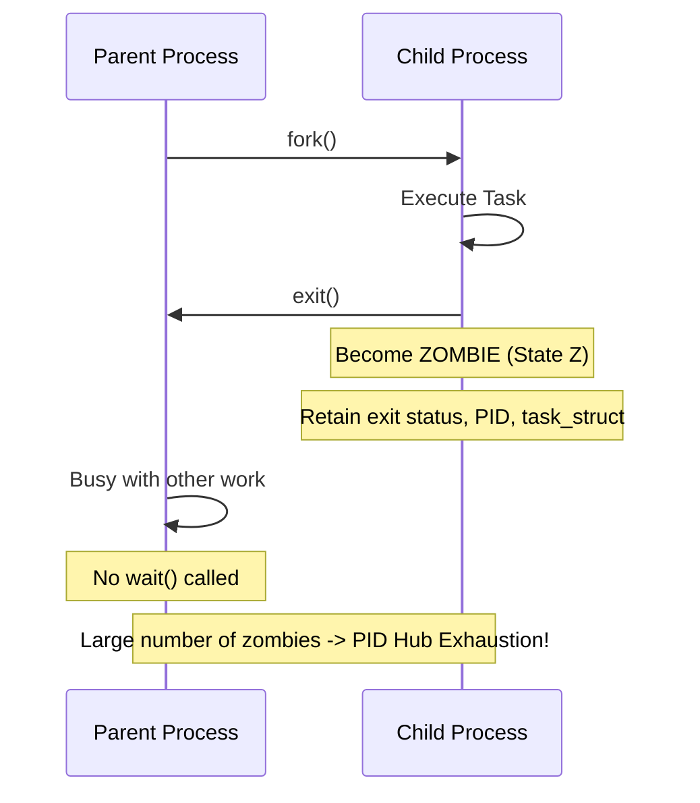

**诊断**:

```bash
# 查找僵尸进程
ps aux | grep 'Z'
ps -eo stat,ppid,pid,cmd | grep '^Z'

# 统计数量
ps aux | awk '{if($8=="Z") print}' | wc -l
```

**处理策略**:

| 方法 | 命令 | 说明 |
|------|--------|------|
| 通知父进程 | `kill -SIGCHLD <ppid>` | 触发父进程调用 wait() |
| 杀死父进程 | `kill -9 <ppid>` | 僵尸被 init 收养并清理 |
| 修复程序 | 增加 SIGCHLD 处理 | 根本解决 |

### 20.3 守护进程创建

```c
// 经典守护进程创建步骤
void daemonize() {
    // 1. 第一次 fork, 父进程退出
    if (fork() > 0) exit(0);
    
    // 2. 创建新会话, 脱离控制终端
    setsid();
    
    // 3. 第二次 fork, 确保不会重新获取终端
    if (fork() > 0) exit(0);
    
    // 4. 更改工作目录
    chdir("/");
    
    // 5. 重设文件权限掩码
    umask(0);
    
    // 6. 关闭继承的文件描述符
    close(STDIN_FILENO);
    close(STDOUT_FILENO);
    close(STDERR_FILENO);
    
    // 7. 重定向标准流到 /dev/null
    open("/dev/null", O_RDONLY);  // stdin
    open("/dev/null", O_WRONLY);  // stdout
    open("/dev/null", O_WRONLY);  // stderr
}
```

### 20.4 内核线程

| 特征 | 说明 |
|------|------|
| 创建方式 | `kthread_create()` / `kthread_run()` |
| 地址空间 | 无用户空间 (`mm_struct` 为 NULL) |
| 调度 | 与普通进程相同 |
| 示例 | `kswapd`, `ksoftirqd`, `migration` |

```bash
# 查看内核线程 (方括号表示)
ps aux | grep '\[.*\]'
# [kswapd0]  - 内存回收
# [ksoftirqd/0] - 软中断处理
# [migration/0] - CPU 迁移
```

---

## 思考题

1. 为什么 Linux 选择 1\:1 线程模型而非 M\:N 模型?
2. `fork()` 返回两次的底层机制是什么?
3. CFS 如何避免新创建进程的 vruntime 为 0 导致长时间占用 CPU?
4. SCHED_DEADLINE 相比 SCHED_FIFO 有什么优势?
5. 在容器环境中, 进程看到的 PID 为什么与宿主机不同?
