## 概述

当多个执行流 (进程/线程) 并发访问共享资源时, 必须协调它们的执行顺序以保证正确性. 本模块深入探讨从硬件原语到高级同步抽象的完整栈, 以及死锁的检测与处理.

---

## 关键概念速查

| 概念 | 英文 | 定义 | 关联内核源码 |
|:---:|------|:---:|--------------|
| 临界区 | Critical Section | 访问共享资源的代码段 | - |
| 原子操作 | Atomic Operation | 不可分割的操作序列 | `arch/x86/include/asm/atomic.h` |
| 自旋锁 | Spinlock | 忽等待的锁 | `kernel/locking/spinlock.c` |
| 信号量 | Semaphore | 计数同步原语 | `kernel/locking/semaphore.c` |
| 互斥体 | Mutex | 二元信号量, 带所有者 | `kernel/locking/mutex.c` |
| futex | Fast Userspace Mutex | 用户态/内核态混合锁 | `kernel/futex/core.c` |
| 条件变量 | Condition Variable | 管程同步原语 | pthread 库 |
| 死锁 | Deadlock | 进程循环等待的状态 | - |
| RCU | Read-Copy-Update | 读多写少的无锁高性能机制 | `kernel/rcu/` |
| lockdep | - | 内核死锁检测工具 | `kernel/locking/lockdep.c` |

---

## 模块知识结构

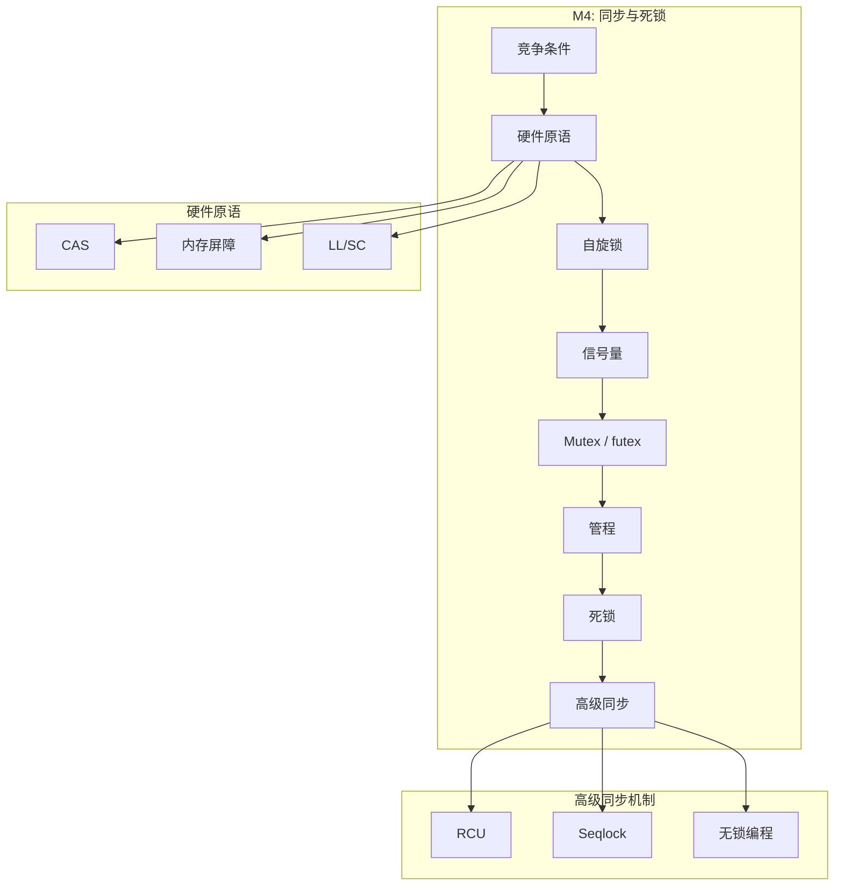

---


## 1. 并发问题基础

### 1.1 竞争条件 (Race Condition)

当程序执行结果依赖于不可控的执行顺序时, 产生竞争条件.例如, 两个线程同时执行 `counter++`: 

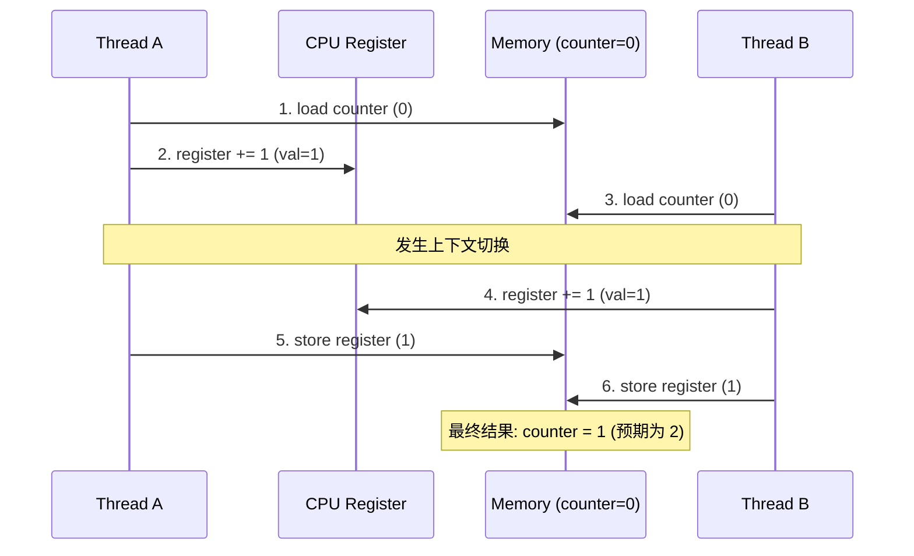

### 1.2 临界区问题

**临界区 (Critical Section)**: 访问共享资源的代码段.

临界区问题的解决方案必须满足:

| 条件 | 英文 | 说明 |
|:---:|------|:---:|
| 互斥 | Mutual Exclusion | 同一时刻仅一个进程在临界区 |
| 进入保证 | Progress | 临界区空闲时, 仅临界区外的进程参与决定谁进入 |
| 有限等待 | Bounded Waiting | 请求进入后在有限时间内获准 |

### 1.3 进程互斥的软件解法

**尝试 1: 严格轮换法 (Strict Alternation)**

```c
// 共享变量
int turn = 0;  // 谁的回合

// 进程 0
while (true) {
    while (turn != 0);  // 忙等待
    // 临界区
    turn = 1;
    // 剩余区
}

// 进程 1
while (true) {
    while (turn != 1);  // 忙等待
    // 临界区
    turn = 0;
    // 剩余区
}
```

**问题**: 违反 Progress — 进程 0 完成后即使进程 1 不需要进入临界区, 进程 0 也无法再次进入.

**尝试 2: 双标志先检查法**

```c
bool flag[2] = {false, false};

// 进程 i
while (true) {
    while (flag[j]);     // 等待对方出来
    flag[i] = true;       // 表示想进入
    // 临界区
    flag[i] = false;
    // 剩余区
}
```

**问题**: 违反 Mutual Exclusion — 两个进程可能同时通过检查.

### 1.4 Peterson 算法

Peterson 算法通过组合 `flag`(表达意愿)和 `turn`(礼让)正确解决了两进程互斥问题: 

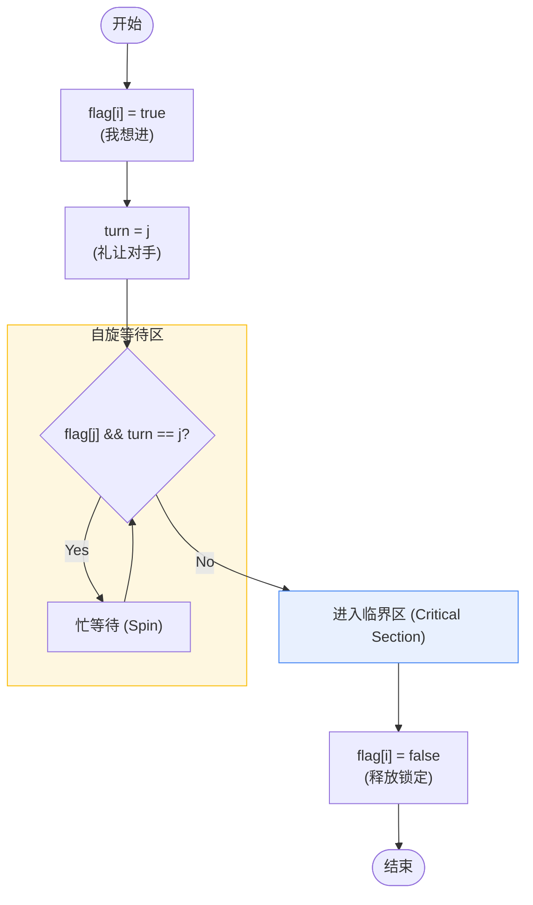

**Peterson 算法实现 (POSIX C + 内存屏障)**:

在现代多核 CPU 上, 由于**乱序执行 (Out-of-Order Execution)**, 简单的 Peterson 算法会失效. 必须显式加入内存屏障以确保内存可见性顺序:

```c
#include <stdatomic.h>

atomic_bool flag[2] = {false, false};
atomic_int turn;

void enter_critical_section(int i) {
    int j = 1 - i;
    atomic_store_explicit(&flag[i], true, memory_order_relaxed);
    atomic_store_explicit(&turn, j, memory_order_release); // 确保 flag 写入在 turn 之前
    
    // 全局屏障, 强制同步内存视图
    atomic_thread_fence(memory_order_seq_cst); 
    
    while (atomic_load_explicit(&flag[j], memory_order_acquire) && 
           atomic_load_explicit(&turn, memory_order_acquire) == j) {
        // busy wait
    }
}

void leave_critical_section(int i) {
    atomic_store_explicit(&flag[i], false, memory_order_release);
}
```

**正确性证明**:

```
假设两进程都在临界区:
- flag[0] = flag[1] = true
- turn 只能是 0 或 1 (不能同时为两个值)
- 若 turn = 0, 则进程 1 在 while 循环等待
- 若 turn = 1, 则进程 0 在 while 循环等待
矛盾! 故最多一个进程在临界区.
```

**Peterson 算法在现代 CPU 上的问题**:

由于现代 CPU 存在指令重排和缓存一致性问题, Peterson 算法可能失效:

```c
// 编译器或 CPU 可能重排这两条指令
flag[i] = true;   // (1)
turn = j;         // (2)

// 如果 (2) 在 (1) 之前执行, 互斥可能被破坏
```

**修复方法**: 使用内存屏障

```c
void enter_critical_section(int i) {
    int j = 1 - i;
    flag[i] = true;
    __sync_synchronize();  // 内存屏障
    turn = j;
    __sync_synchronize();
    while (flag[j] && turn == j);
}
```

### 1.5 进程互斥与进程同步的概念

| 概念 | 英文 | 定义 | 示例 |
|:---:|------|:---:|------|
| 进程互斥 | Mutual Exclusion | 多进程争用同一资源时的排他性访问 | 打印机,共享变量 |
| 进程同步 | Synchronization | 多进程在执行顺序上的协调 | 生产者-消费者 |


### 1.6 睡眠与唤醒机制

忙等待 (Busy Waiting / Spin) 浪费 CPU, 睡眠-唤醒机制更高效:

```c
// 生产者-消费者 (错误版本, 有 lost wakeup 问题)
#define N 100
int count = 0;

void producer() {
    while (true) {
        item = produce();
        if (count == N)
            sleep();       // 缓冲区满, 睡眠等待
        insert(item);
        count++;
        if (count == 1)
            wakeup(consumer);  // 唤醒消费者
    }
}

void consumer() {
    while (true) {
        if (count == 0)
            sleep();       // 缓冲区空, 睡眠等待
        item = remove();
        count--;
        if (count == N - 1)
            wakeup(producer);  // 唤醒生产者
        consume(item);
    }
}
```

**Lost Wakeup 问题**:

```
1. count = 0
2. 消费者检查 count == 0, 准备睡眠
3. 调度器切换到生产者
4. 生产者生产一项, count = 1
5. 生产者调用 wakeup(consumer), 但消费者还没睡
6. wakeup 信号丢失!
7. 消费者睡眠
8. 生产者继续生产直到满, 然后睡眠
9. 两者都在睡眠 → 死锁
```

**解决方案**: 使用信号量 (Semaphore)

---

## 2. 硬件同步原语

### 2.1 原子指令

| 指令 | 英文 | 架构 | 语义 |
|:---:|------|:---:|------|
| TSL/XCHG | Test and Set Lock | x86 | 原子交换 |
| CAS | Compare and Swap | x86 (`CMPXCHG`) | 原子比较并交换 |
| LL/SC | Load-Linked/Store-Conditional | ARM, MIPS, RISC-V | 链接加载/条件存储 |
| FAA | Fetch and Add | x86 (`LOCK XADD`) | 原子加法 |

### 2.2 x86 CAS 实现

```c
// CAS 语义
bool CAS(int *addr, int expected, int new_val) {
    if (*addr == expected) {
        *addr = new_val;
        return true;
    }
    return false;
}

// x86 内联汇编
static inline bool cas(volatile int *addr, int expected, int new_val) {
    char result;
    __asm__ __volatile__ (
        "lock cmpxchgl %3, %1\n\t"
        "sete %0"
        : "=q"(result), "+m"(*addr), "+a"(expected)
        : "r"(new_val)
        : "memory", "cc"
    );
    return result;
}
```

### 2.3 内存屏障 (Memory Barrier)

现代 CPU 可能重排指令或缓存写入, 需要内存屏障保证顺序:

| 类型 | x86 指令 | 作用 |
|:---:|----------|:---:|
| 编译器屏障 | `asm volatile(" ::: "memory")` | 阻止编译器重排 |
| Store Fence | `SFENCE` | 保证之前的 store 完成 |
| Load Fence | `LFENCE` | 保证之前的 load 完成 |
| Full Fence | `MFENCE` | 保证所有内存操作完成 |

```c
// Linux 内核中的屏障
smp_mb();    // 全屏障
smp_rmb();   // 读屏障
smp_wmb();   // 写屏障
```

### 2.4 缓存一致性影响

CAS 等原子操作需要跨 CPU 缓存同步:

```
CPU 0 执行 LOCK CMPXCHG:
1. 获取缓存行独占权 (MESI Exclusive/Modified)
2. 锁定总线或使用缓存锁定协议
3. 执行 CAS 操作
4. 释放锁定

其他 CPU 对该缓存行的访问被阻塞 → 性能开销
```

---

## 3. 自旋锁 (Spinlock)

### 3.1 基本自旋锁

```c
typedef struct {
    volatile int locked;
} spinlock_t;

void spin_lock(spinlock_t *lock) {
    while (__sync_lock_test_and_set(&lock->locked, 1)) {
        // 忙等待 (自旋)
        while (lock->locked) {
            __builtin_ia32_pause();  // CPU hint: 减少功耗
        }
    }
}

void spin_unlock(spinlock_t *lock) {
    __sync_lock_release(&lock->locked);
}
```

### 3.2 Ticket Lock

解决基本自旋锁的公平性问题:

```c
typedef struct {
    volatile unsigned int next;   // 下一个票号
    volatile unsigned int owner;  // 当前服务的票号
} ticket_lock_t;

void ticket_lock(ticket_lock_t *lock) {
    unsigned int my_ticket = __sync_fetch_and_add(&lock->next, 1);
    while (lock->owner != my_ticket) {
        __builtin_ia32_pause();
    }
}

void ticket_unlock(ticket_lock_t *lock) {
    lock->owner++;
}
```

### 3.3 Linux 内核自旋锁

```c
// include/linux/spinlock_types.h
typedef struct raw_spinlock {
    arch_spinlock_t raw_lock;
} raw_spinlock_t;

// 使用
spinlock_t lock;
spin_lock_init(&lock);

spin_lock(&lock);
// 临界区
spin_unlock(&lock);

### 3.4 Spinlock 公平性演进

#### 3.4.1 基础 Spinlock (不公平)

```c
// 测试并设置 (TAS)
void spin_lock(spinlock_t *lock) {
    while (test_and_set(&lock->locked))
        ;  // 自旋
}
```

**问题**: 后来者可能抢先获取锁, 导致**饥饿**.

#### 3.4.2 Ticket Lock (公平但有缓存问题)

```c
struct ticket_lock {
    atomic_t next_ticket;  // 下一个可取号码
    atomic_t now_serving;  // 当前服务号码
};

void spin_lock(struct ticket_lock *lock) {
    int my_ticket = atomic_fetch_add(&lock->next_ticket, 1);
    while (atomic_load(&lock->now_serving) != my_ticket)
        cpu_relax();  // 自旋
}
```

**问题**: 所有 CPU 自旋在同一变量 `now_serving`, 导致**缓存行震荡 (Cache Line Bouncing)**.

#### 3.4.3 MCS Lock (解决缓存震荡)

MCS Lock 通过构建进程链表, 让每个 CPU 仅在本地变量上自旋, 避免了全局变量的缓存一致性开销: 

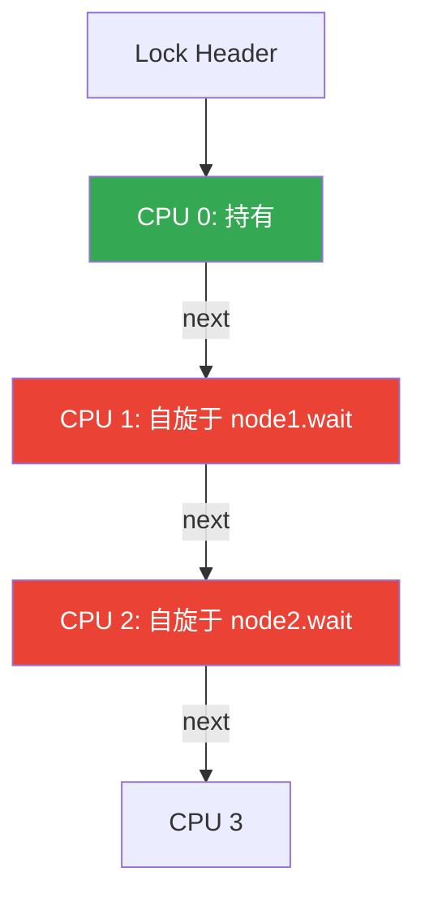

**释放逻辑**: 当 CPU 0 释放时, 直接修改 CPU 1 的本地标志位 `node1.wait = false`, 仅导致 CPU 1 的缓存失效.

#### 3.4.4 Linux qspinlock

Linux 4.2+ 采用 **qspinlock**, 结合了 Ticket Lock 和 MCS.
// 关闭本地中断的版本 (防止死锁)
spin_lock_irqsave(&lock, flags);
// 临界区
spin_unlock_irqrestore(&lock, flags);
```

**不同变体**:

| API | 作用 |
|-----|:---:|
| `spin_lock()` | 获取锁 |
| `spin_lock_irq()` | 获取锁并关闭本地中断 |
| `spin_lock_irqsave()` | 获取锁并保存/关闭中断状态 |
| `spin_lock_bh()` | 获取锁并关闭下半部 |

---

## 4. 信号量 (Semaphore)

### 4.1 信号量本质

**信号量 (Semaphore)** 是一个整型变量, 支持两个原子操作:

| 操作 | 荷兰语 | 英文 | 行为 |
|:---:|--------|:---:|------|
| P | Proberen (尝试) | wait / down | `S--`; 若 `S < 0` 则阻塞 |
| V | Verhogen (增加) | signal / up | `S++`; 若有等待者则唤醒 |

### 4.2 信号量类型

| 类型 | 初始值 | 用途 |
|:---:|--------|:---:|
| **二值信号量** | 1 | 互斥锁替代品 |
| **计数信号量** | N | 资源池管理 (如连接池) |
| **同步信号量** | 0 | 线程间同步/通知 |

### 4.3 信号量核心用途

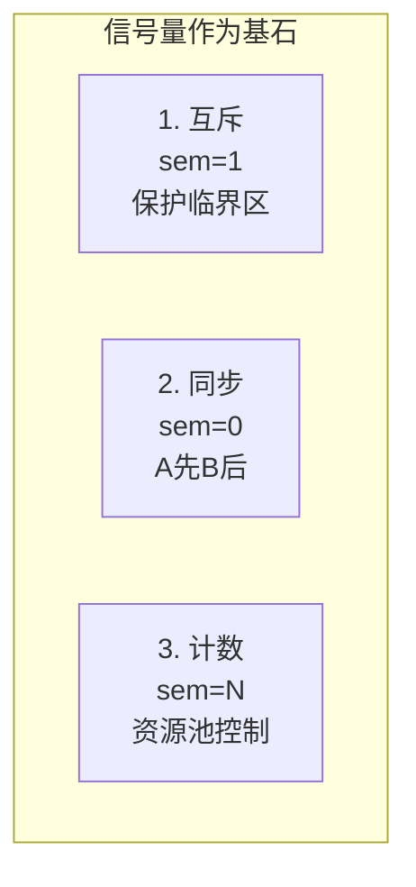

### 4.4 Dijkstra 典型实现

```c
typedef struct {
    int value;                    // 资源计数
    struct list_head wait_list;   // 等待队列
    spinlock_t lock;              // 保护信号量本身
} semaphore_t;

void P(semaphore_t *sem) {        // Wait / Down
    spin_lock(&sem->lock);
    sem->value--;
    if (sem->value < 0) {
        // 加入等待队列并睡眠
        add_to_wait_list(&sem->wait_list, current);
        spin_unlock(&sem->lock);
        schedule();               // 让出 CPU
    } else {
        spin_unlock(&sem->lock);
    }
}

void V(semaphore_t *sem) {        // Signal / Up
    spin_lock(&sem->lock);
    sem->value++;
    if (sem->value <= 0) {
        // 唤醒一个等待者
        struct task_struct *p = remove_from_wait_list(&sem->wait_list);
        wake_up_process(p);
    }
    spin_unlock(&sem->lock);
}
```

### 4.5 信号量 vs Mutex

| 对比项 | 信号量 | Mutex |
|--------|:---:|-------|
| **所有权** | 无 (任何线程可 V) | 有 (必须由持有者释放) |
| **计数** | 支持 | 仅二值 |
| **优先级继承** | 不支持 | 支持 (Linux, 解决优先级反转) |
| **适用场景** | 生产者-消费者, 资源池 | 临界区保护 |

### 4.6 信号量的深度解析: 它能干什么?

信号量不仅仅是一个 "计数器", 它是构造所有高级同步原语的基石. 根据初始值的不同, 信号量有三类核心用法:

| 用法 | 初始值 | 机制 | 示例 |
|:---:|--------|:---:|------|
| **互斥锁 (Mutex)** | 1 | P 操作获取锁, V 操作释放锁. 保证同一时间仅一个执行流进入. | 保护全局变量 `balance++` |
| **同步/前驱关系 (Sync)** | 0 | 线程 A 执行完后调用 V, 线程 B 调用 P 等待. 保证 A 先于 B 执行. | 编译过程: 先编译后链接 |
| **资源计数 (Counting)** | N | N 代表可用资源总数. P 申请资源 (N--), V 释放资源 (N++). N=0 时阻塞. | 数据库连接池,缓冲池 |

**代码实例: 生产者-消费者问题**

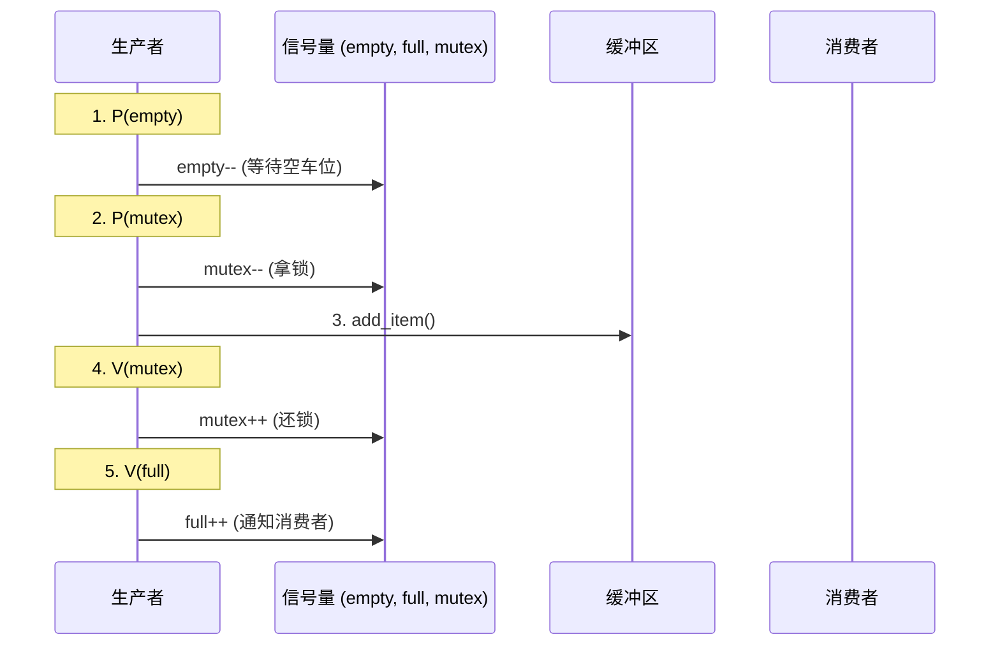

```c
semaphore empty = N;    // 缓冲区空槽位
semaphore full = 0;     // 缓冲区已填充槽位
semaphore mutex = 1;    // 互斥访问缓冲区
// ... 代码实现 ...
```

### 4.7 经典同步问题

#### 4.3.1 生产者-消费者 (Bounded Buffer)

```c
#define N 100
semaphore_t mutex = {1};      // 互斥访问缓冲区
semaphore_t empty = {N};      // 空槽位
semaphore_t full = {0};       // 满槽位

void producer() {
    while (true) {
        item = produce();
        P(&empty);            // 等待空槽
        P(&mutex);            // 进入临界区
        insert(item);
        V(&mutex);            // 离开临界区
        V(&full);             // 增加满槽
    }
}

void consumer() {
    while (true) {
        P(&full);             // 等待满槽
        P(&mutex);            // 进入临界区
        item = remove();
        V(&mutex);            // 离开临界区
        V(&empty);            // 增加空槽
        consume(item);
    }
}
```

#### 4.3.2 读者-写者问题

**读者优先**:

```c
semaphore_t mutex = {1};       // 保护 read_count
semaphore_t wrt = {1};         // 写互斥
int read_count = 0;

void reader() {
    P(&mutex);
    read_count++;
    if (read_count == 1)       // 第一个读者
        P(&wrt);               // 阻止写者
    V(&mutex);
    
    // 读操作
    
    P(&mutex);
    read_count--;
    if (read_count == 0)       // 最后一个读者
        V(&wrt);               // 允许写者
    V(&mutex);
}

void writer() {
    P(&wrt);
    // 写操作
    V(&wrt);
}
```

**问题**: 写者可能饥饿.

---

## 5. 互斥体 (Mutex) 与 futex

### 5.1 用户态 Mutex

```c
typedef struct {
    int locked;                   // 0=未锁定, 1=已锁定
    int contended;                // 是否有竞争
} mutex_t;

void mutex_lock(mutex_t *m) {
    // 快速路径: 尝试 CAS 获取锁
    if (CAS(&m->locked, 0, 1))
        return;  // 成功
    
    // 慢速路径: 进入内核等待
    m->contended = 1;
    while (!CAS(&m->locked, 0, 1)) {
        futex_wait(&m->locked, 1);  // 调用内核
    }
}

void mutex_unlock(mutex_t *m) {
    m->locked = 0;
    if (m->contended) {
        m->contended = 0;
        futex_wake(&m->locked, 1);  // 唤醒一个等待者
    }
}
```

### 5.2 futex 机制

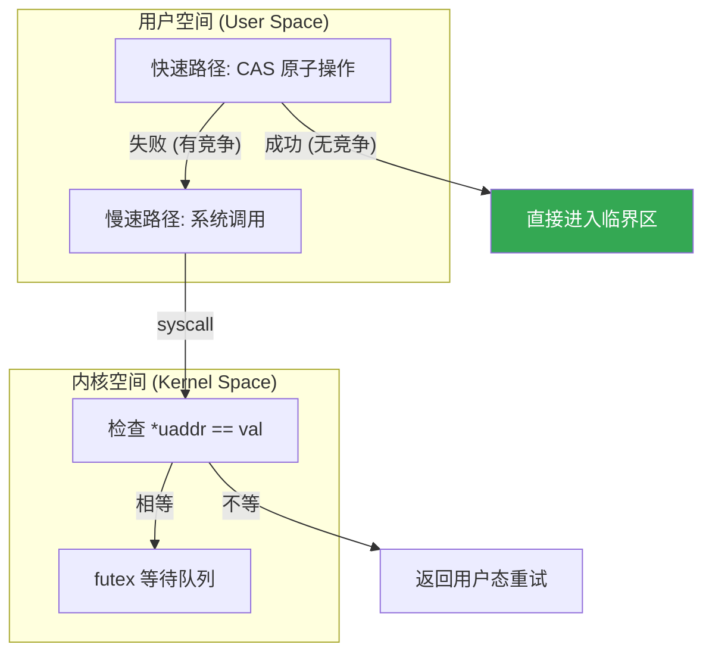

### 5.3 futex 系统调用

```c
#include <linux/futex.h>
#include <sys/syscall.h>

// 等待
syscall(SYS_futex, uaddr, FUTEX_WAIT, val, timeout, NULL, 0);
// 如果 *uaddr == val, 则睡眠

// 唤醒
syscall(SYS_futex, uaddr, FUTEX_WAKE, n, NULL, NULL, 0);
// 唤醒最多 n 个等待者
```

---

## 6. 管程 (Monitor)

### 6.1 管程结构

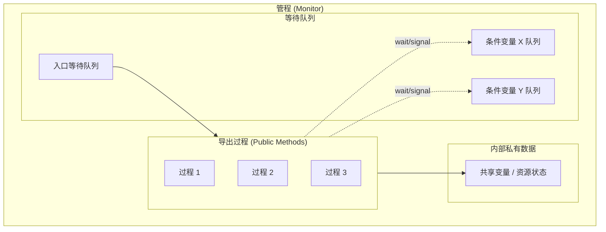

### 6.2 条件变量操作

| 操作 | 语义 |
|:---:|------|
| `wait(c)` | 释放管程锁, 阻塞在条件变量 c 上, 被唤醒后重新获取锁 |
| `signal(c)` | 唤醒一个在 c 上等待的进程 |
| `broadcast(c)` | 唤醒所有在 c 上等待的进程 |

### 6.3 Hoare vs Mesa 语义

| 语义 | signal 后行为 | 唤醒者状态 | 被唤醒者状态 |
|:---:|---------------|------------|--------------|
| Hoare | 立即切换到被唤醒者 | 阻塞 | 立即运行 |
| Mesa | 唤醒者继续运行 | 继续 | 进入就绪队列 |

**Mesa 语义要求**:

```c
// 必须使用 while, 因为条件可能在被唤醒后变化
while (!condition) {
    pthread_cond_wait(&cond, &mutex);
}
```

### 6.4 Pthread 条件变量

```c
pthread_mutex_t mutex = PTHREAD_MUTEX_INITIALIZER;
pthread_cond_t cond = PTHREAD_COND_INITIALIZER;
int ready = 0;

// 等待者
pthread_mutex_lock(&mutex);
while (!ready) {                                // 循环检查条件
    pthread_cond_wait(&cond, &mutex);           // 原子释放锁并等待
}
// 条件满足, 继续执行
pthread_mutex_unlock(&mutex);

// 通知者
pthread_mutex_lock(&mutex);
ready = 1;
pthread_cond_signal(&cond);                     // 或 pthread_cond_broadcast
pthread_mutex_unlock(&mutex);
```

---

## 7. 优先级反转

### 7.1 问题描述

```
优先级: H > M > L

1. L 获取锁 lock
2. H 尝试获取 lock, 被阻塞
3. M 抢占 L (M 优先级高于 L)
4. H 等待 M 完成后 L 才能释放锁

结果: 高优先级 H 被中优先级 M 间接阻塞
```

### 7.2 解决方案

| 方案 | 英文 | 机制 |
|:---:|------|:---:|
| 优先级继承 | Priority Inheritance | 持锁的低优先级进程临时继承等待者的优先级 |
| 优先级天花板 | Priority Ceiling | 锁有固定的天花板优先级, 持锁进程提升到该优先级 |

### 7.3 Linux rt_mutex

```c
// kernel/locking/rtmutex.c
// 实现优先级继承

// 当高优先级任务等待锁时
static int rt_mutex_adjust_prio_chain(...) {
    // 遍历等待链
    // 将锁持有者的优先级提升到等待者中最高的
    task->prio = min(task->prio, waiter->prio);
}
```

---

## 8. 死锁

### 8.1 死锁的四个必要条件

| 条件 | 英文 | 说明 |
|:---:|------|:---:|
| 互斥 | Mutual Exclusion | 资源不可共享 |
| 持有并等待 | Hold and Wait | 持有资源同时等待其他资源 |
| 非抢占 | No Preemption | 资源只能由持有者释放 |
| 循环等待 | Circular Wait | 存在等待环路 |

### 8.2 资源分配图


环路: P1 → R1 → P2 → R2 → P1
存在环路 + 单实例资源 = 死锁

### 8.3 死锁发生的四个必要条件 (Coffman 条件)

| 条件 | 英文 | 说明 |
|:---:|------|:---:|
| **互斥** | Mutual Exclusion | 资源不可共享, 一次只能一个进程使用 |
| **持有并等待** | Hold and Wait | 进程持有资源的同时等待其他资源 |
| **不可抢占** | No Preemption | 资源只能由持有者主动释放 |
| **循环等待** | Circular Wait | 存在进程的循环等待链 |

### 8.4 银行家算法 (Banker's Algorithm)

银行家算法通过判断系统是否处于**安全状态**来避免死锁.

```
Available = [3,3,2]  // 当前可用

        Max       Allocation    Need
P0    [7,5,3]      [0,1,0]    [7,4,3]
P1    [3,2,2]      [2,0,0]    [1,2,2]  ← 可满足
P2    [9,0,2]      [3,0,2]    [6,0,0]
P3    [2,2,2]      [2,1,1]    [0,1,1]  ← 可满足
P4    [4,3,3]      [0,0,2]    [4,3,1]

安全序列: <P1, P3, P4, P2, P0>
```

### 8.5 死锁检测

#### 8.5.1 资源分配图 (Resource Allocation Graph)

系统可以通过构建资源分配图来检测死锁:
- **环路判定**:
    - 单实例资源: 有环 = 死锁
    - 多实例资源: 有环 = 可能死锁

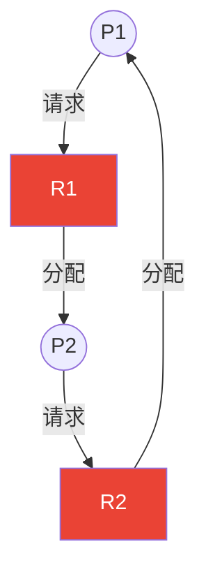

#### 8.5.2 Linux lockdep (见 §10.3)

**数据结构**:

```c
int Available[m];           // 可用资源向量
int Max[n][m];              // 最大需求矩阵
int Allocation[n][m];       // 已分配矩阵
int Need[n][m];             // 尚需矩阵 (Need = Max - Allocation)
```

**安全性算法**:

```c
bool is_safe() {
    int Work[m];
    bool Finish[n];
    
    // 初始化
    memcpy(Work, Available, sizeof(Work));
    memset(Finish, false, sizeof(Finish));
    
    int count = 0;
    while (count < n) {
        bool found = false;
        for (int i = 0; i < n; i++) {
            if (!Finish[i] && need_le_work(Need[i], Work)) {
                // 模拟进程 i 完成
                for (int j = 0; j < m; j++)
                    Work[j] += Allocation[i][j];
                Finish[i] = true;
                found = true;
                count++;
            }
        }
        if (!found) break;  // 无法继续
    }
    
    return (count == n);  // 所有进程都能完成则安全
}
```

**示例**:

```
进程   Max     Allocation   Need    Available
      A B C     A B C       A B C    A B C
P0    7 5 3     0 1 0       7 4 3    3 3 2
P1    3 2 2     2 0 0       1 2 2
P2    9 0 2     3 0 2       6 0 0
P3    2 2 2     2 1 1       0 1 1
P4    4 3 3     0 0 2       4 3 1

安全序列: `<P1, P3, P4, P0, P2>` (存在至少一个)
```

---

---

## 9. 锁机制深度对比

### 9.1 内核锁类型全览

| 锁类型 | 机制 | 可睡眠 | 适用场景 | 优点 | 缺点 |
|--------|:---:|--------|----------|:---:|------|
| **Spinlock** | 忙等待 (自旋) | 否 | 短临界区, 中断上下文 | 无上下文切换开销 | 浪费 CPU, 不可长持有 |
| **Mutex** | 睡眠等待 | 是 | 长临界区, 进程上下文 | 释放 CPU | 上下文切换开销 |
| **Semaphore** | 计数器 + 睡眠 | 是 | 资源池管理, 信号传递 | 支持多并发, 可跨进程 | 复杂度高 |
| **RWLock** | 读写分离 | 是 | 读多写少场景 | 读并发高 | 写饥饿风险 |
| **RCU** | 延迟销毁 | 读: 否 | 读极多写极少 | 读零开销 | 写复杂, 内存占用 |
| **Seqlock** | 序列号检测 | 读: 否 | 写优先场景 | 写不阻塞 | 读可能重试 |

---

## 10. Linux 内核高级同步

### 10.1 RCU (Read-Copy-Update)

适用于读多写少的场景:

```c
// 读侧 (无锁, 极低开销)
rcu_read_lock();
p = rcu_dereference(global_ptr);
// 使用 p 读取数据
rcu_read_unlock();

// 写侧
new = kmalloc(sizeof(*new), GFP_KERNEL);
*new = /* 新数据 */;
old = global_ptr;
rcu_assign_pointer(global_ptr, new);  // 原子发布新版本
synchronize_rcu();                     // 等待所有读者完成
kfree(old);                            // 安全释放旧版本
```

**Grace Period**:

```
写者发布新版本
     │
     ↓
─────┼──────────────────────────────────────────
     │     ← 正在进行的读操作 →      │
─────┼──────────────────────────────────────────
                                     │
                            Grace Period 结束
                                     │
                                     ↓
                              可以安全释放旧数据
```

### 10.2 顺序锁 (Seqlock)

读者不阻塞写者, 但可能需要重试:

```c
seqlock_t lock;

// 写者 (独占)
write_seqlock(&lock);
// 修改数据
write_sequnlock(&lock);

// 读者 (可能重试)
unsigned int seq;
do {
    seq = read_seqbegin(&lock);
    // 读取数据
} while (read_seqretry(&lock, seq));
```

### 10.3 lockdep: 运行时死锁检测

Linux 内核的运行时死锁检测工具, 通过构建锁依赖图 (DAG) 在死锁发生前预警.

#### 10.3.1 工作原理

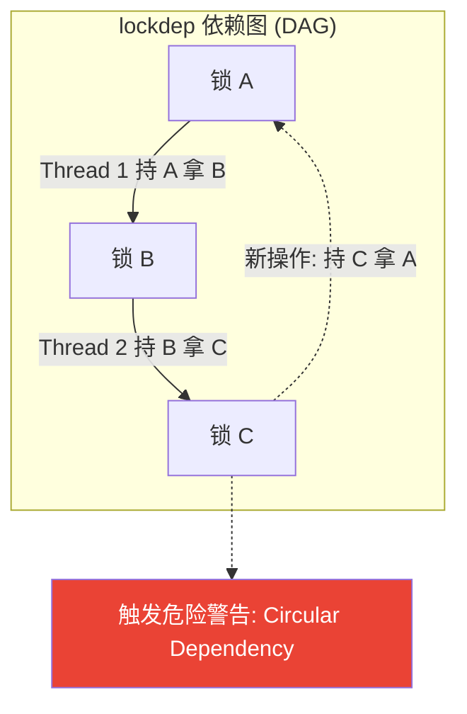

#### 10.3.2 检测类型

| 检测场景 | 说明 |
|----------|:---:|
| AB-BA 死锁 | 加锁顺序不一致 |
| 递归加锁 | 非递归锁被同一线程重复获取 |
| 中断安全违规 | 中断上下文使用可睡眠的锁 |
| Softirq 安全违规 | 持有 spinlock 时调用可能睡眠的函数 |
| 硬锁链 | hardirq→softirq→process 上下文加锁冲突 |

#### 10.3.3 启用与使用

```c
// 内核配置
CONFIG_LOCKDEP=y
CONFIG_PROVE_LOCKING=y   // 更严格的检测

// 发生警告时的输出示例:
// ======================================================
// WARNING: possible circular locking dependency detected
// ======================================================
// swapper/0/1 is trying to acquire lock:
// (&rq->lock){-.-.}
// 
// but task is already holding lock:
// (&p->pi_lock){-.-.}
// 
// which lock already depends on the new lock.
```

#### 10.3.4 锁类 (Lock Class)

lockdep 使用**锁类**而非锁实例进行追踪:

```c
// 同一锁类的不同实例
spinlock_t lock1, lock2;  // 同类

// 如果需要区分, 使用 lockdep_set_class
lockdep_set_class(&lock1, &key1);
lockdep_set_class(&lock2, &key2);
```

### 10.4 Linux Kernel Memory Model (LKMM)

LKMM 是 Linux 内核对内存访问顺序的形式化定义, 用于精确描述多处理器系统中内存操作的可见性保证.

#### 10.4.1 内存顺序问题

现代 CPU 和编译器会重排内存操作以提升性能:

```
// 源代码
x = 1;      // 写 x
r1 = y;     // 读 y

// CPU 可能执行为:
r1 = y;     // 读 y (先执行)
x = 1;      // 写 x (后执行)
```

#### 10.4.2 LKMM 内存屏障

| 屏障类型 | API | 作用 |
|----------|-----|:---:|
| **通用屏障** | `smp_mb()` | 阻止之前/之后的读写穿越 |
| **写屏障** | `smp_wmb()` | 阻止写操作重排 |
| **读屏障** | `smp_rmb()` | 阻止读操作重排 |
| **依赖屏障** | `smp_read_barrier_depends()` | 数据依赖 (现代 CPU 自动保证) |
| **完全屏障** | `mb()` | 包括 I/O 设备可见性 |

#### 10.4.3 Acquire-Release 语义

```c
// 生产者 (Producer)
store_value = new_data;
smp_store_release(&flag, 1);  // 所有之前的写操作对消费者可见

// 消费者 (Consumer)
if (smp_load_acquire(&flag)) {    // 如果看到 flag=1
    use(store_value);              // 保证能看到 new_data
}
```

**核心规则**:
- `smp_store_release()` 之前的写操作对配对的 `smp_load_acquire()` 之后的读可见
- 形成 **happens-before** 关系

#### 10.4.4 LKMM 与 C11 对比

| 语义 | LKMM API | C11 memory_order |
|:---:|----------|------------------|
| Relaxed | `READ_ONCE()` / `WRITE_ONCE()` | `relaxed` |
| Acquire | `smp_load_acquire()` | `acquire` |
| Release | `smp_store_release()` | `release` |
| Seq-Cst | `smp_mb()` 前后 | `seq_cst` |

#### 10.4.5 herd7 形式化验证

LKMM 使用 herd7 工具验证并发算法正确性:

```
// litmus 测试文件示例 (MP - Message Passing)
C MP+porelease+poacquire

{
  x = 0; y = 0;
}

P0(int *x, int *y) {
  WRITE_ONCE(*x, 1);
  smp_store_release(y, 1);
}

P1(int *x, int *y) {
  int r0;
  int r1;
  r0 = smp_load_acquire(y);
  r1 = READ_ONCE(*x);
}

exists (1:r0=1 /\ 1:r1=0)  // 预期: 不可能
```

> **参考**: `tools/memory-model/Documentation/` 和 `Documentation/memory-barriers.txt`

---

## 11. 无锁编程基础

### 11.1 原子变量

```c
#include <stdatomic.h>

atomic_int counter = ATOMIC_VAR_INIT(0);

atomic_fetch_add(&counter, 1);  // 原子加
atomic_load(&counter);          // 原子读
atomic_store(&counter, 0);      // 原子写
```

### 11.2 无锁栈示例

```c
struct node {
    void *data;
    struct node *next;
};

struct lockfree_stack {
    _Atomic(struct node *) head;
};

void push(struct lockfree_stack *s, void *data) {
    struct node *new_node = malloc(sizeof(*new_node));
    new_node->data = data;
    
    struct node *old_head;
    do {
        old_head = atomic_load(&s->head);
        new_node->next = old_head;
    } while (!atomic_compare_exchange_weak(&s->head, &old_head, new_node));
}

void *pop(struct lockfree_stack *s) {
    struct node *old_head;
    do {
        old_head = atomic_load(&s->head);
        if (old_head == NULL) return NULL;
    } while (!atomic_compare_exchange_weak(&s->head, &old_head, old_head->next));
    
    void *data = old_head->data;
    free(old_head);
    return data;
}
```

---

## 参考教材

| 主题 | 推荐阅读 |
|:---:|----------|
| 临界区与软件方案 | *OSTEP* Ch28, *恐龙书* Ch6 |
| 信号量 | *OSTEP* Ch31, *恐龙书* Ch6.5-6.7 |
| 管程 | *恐龙书* Ch6.7, *Tanenbaum* Ch2.3 |
| 死锁 | *OSTEP* Ch32, *恐龙书* Ch8 |
| Linux 内核同步 | *LKD* Ch9-10 |
| RCU | *ULK* Ch5.7, RCU documentation |

---

## 内核源码引用

| 主题 | 源码路径 | 关键函数/结构 |
|:---:|----------|---------------|
| 原子操作 | `arch/x86/include/asm/atomic.h` | `atomic_add()`, `atomic_cmpxchg()` |
| 自旋锁 | `kernel/locking/spinlock.c` | `spin_lock()`, `spin_unlock()` |
| 自旋锁类型 | `include/linux/spinlock_types.h` | `spinlock_t`, `raw_spinlock_t` |
| 信号量 | `kernel/locking/semaphore.c` | `down()`, `up()` |
| Mutex | `kernel/locking/mutex.c` | `mutex_lock()`, `mutex_unlock()` |
| futex | `kernel/futex/core.c` | `do_futex()`, `futex_wait()` |
| 读写锁 | `kernel/locking/rwsem.c` | `down_read()`, `down_write()` |
| RT Mutex | `kernel/locking/rtmutex.c` | `rt_mutex_lock()` |
| RCU 核心 | `kernel/rcu/tree.c` | `rcu_read_lock()`, `synchronize_rcu()` |
| Seqlock | `include/linux/seqlock.h` | `read_seqbegin()`, `write_seqlock()` |
| lockdep | `kernel/locking/lockdep.c` | `lock_acquire()`, `lock_release()` |
| 等待队列 | `include/linux/wait.h` | `wait_queue_head_t`, `wake_up()` |

**在线源码浏览**: [Bootlin Elixir](https://elixir.bootlin.com/linux/latest/source)

---

## 12. 哲学家就餐问题

### 12.1 问题描述

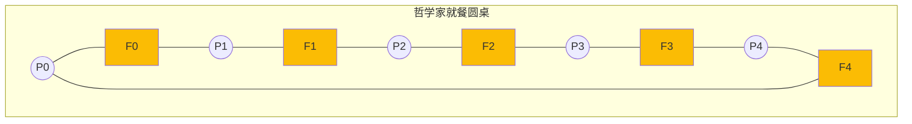
**规则**: 哲学家需要拿起左右两把叉子才能进餐.所有人都先拿左手叉子会导致**死锁**.

### 15.2 简单解法 (可能死锁)

```c
semaphore fork[5];  // 初始值均为 1

void philosopher(int i) {
    while (true) {
        think();
        P(&fork[i]);           // 拿起左边的叉子
        P(&fork[(i+1) % 5]);   // 拿起右边的叉子
        eat();
        V(&fork[(i+1) % 5]);   // 放下右边的叉子
        V(&fork[i]);           // 放下左边的叉子
    }
}
```

**死锁场景**: 所有哲学家同时拿起左边的叉子, 然后都在等待右边的叉子.

### 15.3 解决方案

**方案 1: 限制就餐人数**

```c
semaphore fork[5];   // 初始值均为 1
semaphore room = 4;  // 最多 4 人同时就餐

void philosopher(int i) {
    while (true) {
        think();
        P(&room);              // 进入餐厅
        P(&fork[i]);
        P(&fork[(i+1) % 5]);
        eat();
        V(&fork[(i+1) % 5]);
        V(&fork[i]);
        V(&room);              // 离开餐厅
    }
}
```

**方案 2: 奇偶有序**

```c
void philosopher(int i) {
    while (true) {
        think();
        if (i % 2 == 0) {
            P(&fork[i]);           // 偶数哲学家先拿左边
            P(&fork[(i+1) % 5]);
        } else {
            P(&fork[(i+1) % 5]);   // 奇数哲学家先拿右边
            P(&fork[i]);
        }
        eat();
        V(&fork[(i+1) % 5]);
        V(&fork[i]);
    }
}
```

**方案 3: 使用管程**

```c
monitor dining_philosophers {
    enum {THINKING, HUNGRY, EATING} state[5];
    condition self[5];
    
    void pickup(int i) {
        state[i] = HUNGRY;
        test(i);
        if (state[i] != EATING)
            self[i].wait();
    }
    
    void putdown(int i) {
        state[i] = THINKING;
        test((i + 4) % 5);  // 测试左邻居
        test((i + 1) % 5);  // 测试右邻居
    }
    
    void test(int i) {
        if (state[(i+4) % 5] != EATING &&
            state[i] == HUNGRY &&
            state[(i+1) % 5] != EATING) {
            state[i] = EATING;
            self[i].signal();
        }
    }
}
```

### 15.4 各方案对比

| 方案 | 优点 | 缺点 |
|:---:|------|:---:|
| 限制人数 | 简单有效 | 降低并发度 |
| 奇偶有序 | 无需额外信号量 | 逻辑不对称 |
| 管程 | 清晰, 不会死锁 | 实现复杂 |

---

## 思考题

1. 为什么 Peterson 算法在现代 CPU 上可能失效? 如何修复?
2. futex 如何避免 "lost wakeup" 问题?
3. Mesa 语义下为什么条件等待必须用 `while` 而非 `if`?
4. 银行家算法在实际系统中为何很少使用?
5. RCU 的 Grace Period 是如何确定结束的?
6. 设计一个避免优先级反转的实时调度场景.
