## 概述

内存管理是操作系统的核心职能之一, 负责物理/虚拟内存的抽象,地址转换,内存分配与回收. 本模块深入 x86-64 多级页表,Linux 内存子系统,NUMA 架构以及 OOM 机制.

---

## 关键概念速查

| 概念 | 英文 | 定义 | 关联内核源码 |
| :--- | :--- | :--- | :--- |
| 页 | Page | 虚拟地址空间的固定块 (4KB) | `include/linux/mm_types.h` |
| 页帧 | Page Frame | 物理内存的固定块 | `struct page` |
| 页表 | Page Table | 虚拟页到物理页的映射 | `arch/x86/include/asm/pgtable.h` |
| TLB | Translation Lookaside Buffer | 页表硬件缓存 | - |
| 缺页异常 | Page Fault | 访问未映射页面触发的异常 | `arch/x86/mm/fault.c` |
| VMA | Virtual Memory Area | 进程地址空间的连续区域 | `include/linux/mm_types.h` |
| 伙伴系统 | Buddy System | 物理页分配算法 | `mm/page_alloc.c` |
| Slab | - | 内核对象缓存分配器 | `mm/slub.c` |
| RMAP | Reverse Mapping | 从物理页找所有映射的 PTE | `mm/rmap.c` |
| OOM | Out Of Memory | 内存耗尽处理机制 | `mm/oom_kill.c` |

---

## 模块知识结构

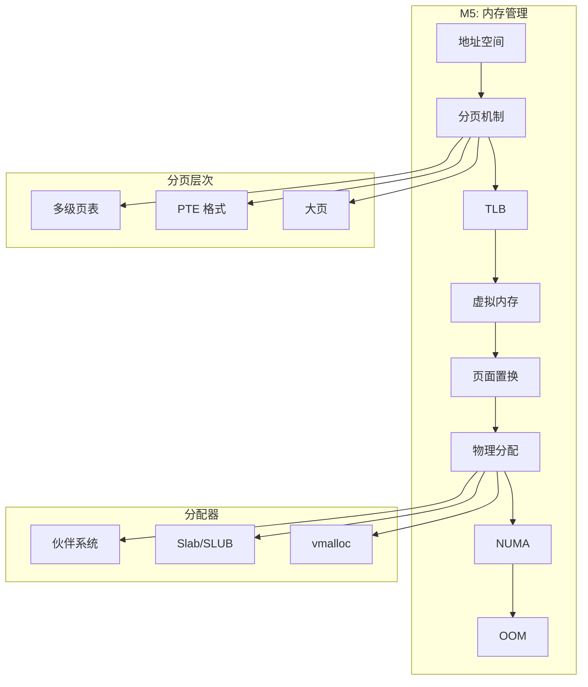

---


## 1. 地址空间抽象

### 1.1 地址转换流程

内存管理单元 (MMU) 负责将程序使用的虚拟地址转换为内存芯片的物理地址: 

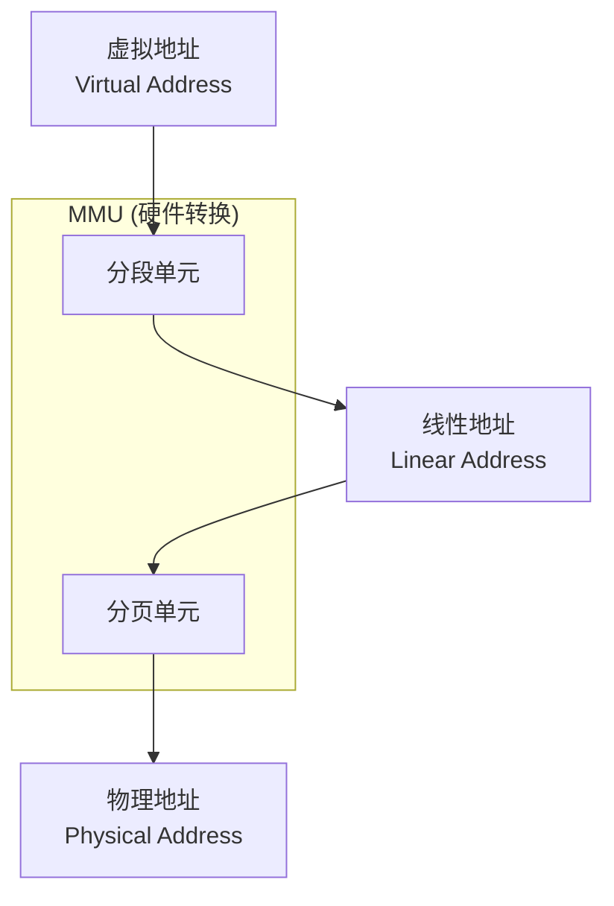

> **注**: 在 x86-64 的 64 位模式下, 段机制被弱化 (Base=0, Limit=Max), 此时 **虚拟地址 ≈ 线性地址**.

### 1.1 地址类型

| 地址类型 | 英文 | 说明 |
|----------|------|------|
| 虚拟地址 | Virtual Address | 程序使用的地址 |
| 线性地址 | Linear Address | 经过分段后的地址 (x86 分页前) |
| 物理地址 | Physical Address | 内存芯片的实际地址 |

> 在 x86-64 中, 段机制被弱化, 虚拟地址 ≈ 线性地址.

### 1.2 x86-64 规范地址

x86-64 虽然有 64 位地址空间, 但仅使用 48 位 (或 57 位, 启用 5 级页表时):

```
48-bit 规范地址:
┌───────────────────────────────────────────────────────────────┐
│  0x0000000000000000 ~ 0x00007FFFFFFFFFFF  用户空间 (低 128TB)  │
├───────────────────────────────────────────────────────────────┤
│  0x0000800000000000 ~ 0xFFFF7FFFFFFFFFFF  非规范区域 (禁止)     │
├───────────────────────────────────────────────────────────────┤
│  0xFFFF800000000000 ~ 0xFFFFFFFFFFFFFFFF  内核空间 (高 128TB)  │
└───────────────────────────────────────────────────────────────┘
```

### 1.3 Linux 进程地址空间布局

每个进程都认为自己拥有完整的地址空间, 内核通过 VMA (Virtual Memory Area) 管理这些区域: 

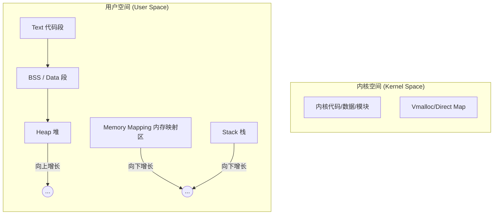

---

## 2. 物理内存管理方案

### 2.1 存储模型基本概念

**程序的存储需求**:

| 需求 | 说明 |
|------|------|
| 加载 | 程序需要装入内存才能执行 |
| 地址绑定 | 符号地址转换为物理地址 |
| 保护 | 进程间内存隔离 |
| 共享 | 进程间共享代码或数据 |
| 扩展 | 动态分配/释放内存 |

**地址绑定时机**:

| 时机 | 说明 | 特点 |
|------|------|------|
| 编译时 | 编译器生成绝对地址 | 必须知道加载位置, 不灵活 |
| 加载时 | 加载器进行重定位 | 可重定位代码, 加载后固定 |
| 运行时 | MMU 动态转换 | 最灵活, 现代系统使用 |

### 2.2 可变分区管理方案 (连续分配)

将内存分为操作系统区和用户区, 用户区按需划分:

```
┌─────────────────────────────────────────────────────────────────┐
│                     操作系统 (低地址)                            │
├─────────────────────────────────────────────────────────────────┤
│  进程 A: 100KB                                                  │
├─────────────────────────────────────────────────────────────────┤
│  空闲: 50KB                                                     │
├─────────────────────────────────────────────────────────────────┤
│  进程 B: 200KB                                                  │
├─────────────────────────────────────────────────────────────────┤
│  空闲: 150KB                                                    │
├─────────────────────────────────────────────────────────────────┤
│  进程 C: 80KB                                                   │
├─────────────────────────────────────────────────────────────────┤
│  空闲: 大量                                                      │
└─────────────────────────────────────────────────────────────────┘
```

**分配算法**:

| 算法 | 英文 | 策略 | 特点 |
|------|------|------|------|
| 首次适应 | First Fit | 从头搜索, 找到第一个足够大的空闲块 | 快速, 但低地址碎片化 |
| 最佳适应 | Best Fit | 找到最小的足够大的空闲块 | 留下大块, 但产生大量小碎片 |
| 最差适应 | Worst Fit | 找到最大的空闲块 | 减少小碎片, 但大块很快用完 |
| 下次适应 | Next Fit | 从上次分配位置开始搜索 | 分布更均匀 |

**内存碎片与紧缩 (Compaction)**:

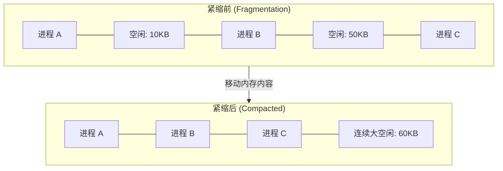

### 2.3 页式管理方案的引入

为了解决可变分区的外部碎片问题, 引入分页:

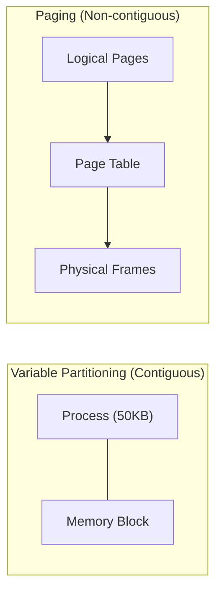
优势:
- 消除外部碎片
- 只有页内部碎片 (平均半页)
- 支持虚拟内存

### 2.4 分页 vs 分段 (Expert Level)

虽然现代 x86-64 主要使用分页, 但理解两者的本质区别是操作系统的基本功:

| 维度 | 分页 (Paging) | 分段 (Segmentation) |
| :--- | :--- | :--- |
| **逻辑意义** | 页是物理单位, 对程序员透明 | 段是逻辑单位 (如代码段,数据段) |
| **大小** | 固定大小 (如 4KB), 由硬件决定 | 长度不固定, 取决于程序需要 |
| **碎片** | 只有内碎片 (页内), 无外碎片 | 产生外碎片 (段之间), 需紧缩 |
| **目的** | 提高内存利用率, 实现非连续分配 | 模块化, 方便共享与保护 (权限隔离) |
| **地址位数** | 一维地址 (只要一个偏移) | 二维地址 (段名 + 段内位移) |

### 2.5 反置页表 (Inverted Page Table)

针对 64 位超大地址空间, 传统页表层级过深 (4/5 级). 反置页表反其道而行之:
- **核心**: 每一个物理页帧在表中仅对应一个条目, 而不是每个虚拟页对应一个.
- **结构**: `<ProcessID, PageNumber>` -> `FrameNumber`.
- **由于搜索慢, 通常配合哈希表使用.**
- **优点**: 页表大小固定, 不随进程数和地址空间增大而膨胀. (常见于 PowerPC, Itanium 架构).
```

---

## 3. 分页机制

### 2.1 基本概念

| 概念 | 英文 | 说明 |
|------|------|------|
| 页 | Page (Virtual Page) | 虚拟地址空间的固定大小块 |
| 页帧 | Page Frame (Physical Page) | 物理内存的固定大小块 |
| 页表 | Page Table | 虚拟页 → 物理页帧的映射表 |
| PTE | Page Table Entry | 页表项, 包含映射和权限信息 |

### 2.2 页大小

| 大小 | 名称 | 使用场景 |
|------|------|----------|
| 4KB | 普通页 | 默认, 细粒度控制 |
| 2MB | 大页 (Huge Page) | 减少 TLB miss, 数据库 |
| 1GB | 巨页 (Giant Page) | 大内存应用 |

### 2.3 地址转换 (4级页表 Walk)

x86-64 采用多级页表(如 PML4)来减少稀疏地址空间的页表大小: 

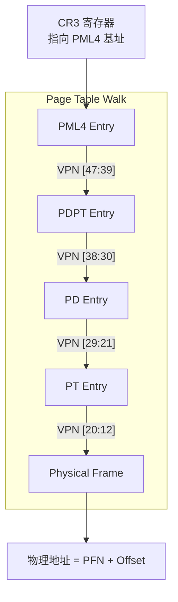

### 2.4 x86-64 PTE 格式

```
64-bit PTE:
┌─────────────────────────────────────────────────────────────────────┐
│ 63  │ 62-52  │ 51-12           │ 11-8 │ 7 │ 6 │ 5 │ 4 │ 3 │ 2 │ 1 │ 0 │
│ NX  │ 可用    │ 物理页帧号 (PFN) │ AVL  │ PS│ D │ A │PCD│PWT│U/S│R/W│ P │
└─────────────────────────────────────────────────────────────────────┘

标志位:
P (Present)      : 页是否在内存中
R/W (Read/Write) : 0=只读, 1=可读写
U/S (User/Supervisor) : 0=仅内核, 1=用户可访问
PWT (Page Write-Through) : 写穿透缓存
PCD (Page Cache Disable) : 禁用缓存
A (Accessed)     : 已被访问 (用于页面置换)
D (Dirty)        : 已被写入 (用于写回)
PS (Page Size)   : 在 PD 中表示 2MB 大页
NX (No Execute)  : 禁止执行 (需 CPU 支持)
```

### 2.5 Linux 页表数据结构

```c
// arch/x86/include/asm/pgtable_types.h

typedef struct { unsigned long pte; } pte_t;    // Page Table Entry
typedef struct { unsigned long pmd; } pmd_t;    // Page Middle Directory
typedef struct { unsigned long pud; } pud_t;    // Page Upper Directory
typedef struct { unsigned long p4d; } p4d_t;    // Page 4-level Directory
typedef struct { unsigned long pgd; } pgd_t;    // Page Global Directory

// 页表遍历宏
pgd = pgd_offset(mm, addr);
p4d = p4d_offset(pgd, addr);
pud = pud_offset(p4d, addr);
pmd = pmd_offset(pud, addr);
pte = pte_offset_map(pmd, addr);
```

### 2.6 5 级页表 (LA57)

支持 57-bit 地址空间 (128PB):

```
启用条件:
- CPU 支持 (CPUID.7.0:ECX.LA57 = 1)
- 内核配置 CONFIG_X86_5LEVEL=y
- 引导参数 (默认启用)

层级: PML5 → PML4 → PDPT → PD → PT
每级 9-bit 索引, Offset 12-bit
```

---

## 3. TLB (Translation Lookaside Buffer)

### 3.1 TLB 原理

TLB 是 MMU 内部的高速缓冲, 存储了最近使用的 VPN -> PFN 映射: 

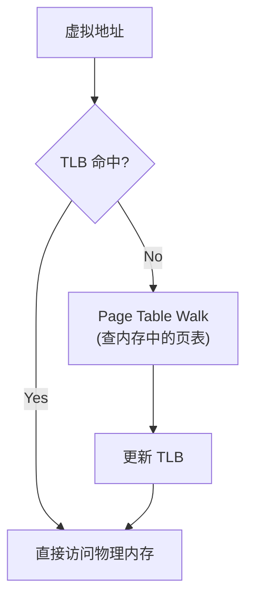

### 3.2 TLB 结构

| 类型 | 覆盖范围 | 条目数 |
|------|----------|--------|
| L1 ITLB | 指令地址 | ~64 (4KB), ~8 (大页) |
| L1 DTLB | 数据地址 | ~64 (4KB), ~32 (大页) |
| L2 STLB | 统一 | ~1536 |

### 3.3 TLB 管理

**TLB Shootdown**:

当修改页表时, 需要使相关 CPU 的 TLB 失效:

```c
// 单页失效
invlpg(addr);

// 全局刷新
// x86: 重新加载 CR3

// 跨 CPU 失效 (IPI)
flush_tlb_mm(mm);
flush_tlb_range(vma, start, end);
flush_tlb_page(vma, addr);
```

**PCID (Process Context ID)**:

避免进程切换时刷新整个 TLB:

```
TLB 条目包含 PCID 标签
切换进程时更换 PCID 而非刷新 TLB
不同 PCID 的条目可共存
```

---

## 4. 虚拟内存

### 4.1 按需分页 (Demand Paging)

页面在首次访问时才加载:

### 4.1 按需分页 (Demand Paging)

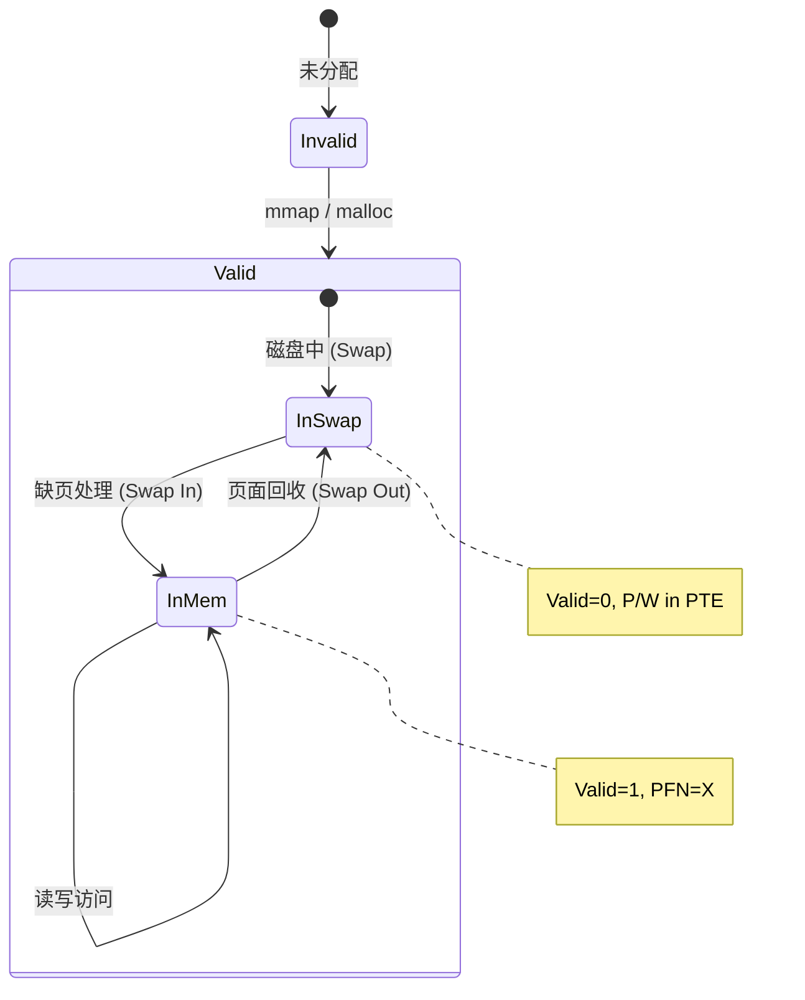

### 4.2 缺页异常处理

```c
// arch/x86/mm/fault.c
dotraplinkage void do_page_fault(struct pt_regs *regs, 
                                  unsigned long error_code,
                                  unsigned long address)
{
    struct vm_area_struct *vma;
    struct mm_struct *mm = current->mm;
    
    // 1. 检查是否在内核态发生
    if (unlikely(fault_in_kernel_space(address)))
        return do_kern_addr_fault(regs, error_code, address);
    
    // 2. 查找 VMA
    vma = find_vma(mm, address);
    if (unlikely(!vma)) {
        // 非法访问
        return bad_area_nosemaphore(regs, error_code, address);
    }
    
    // 3. 处理缺页
    fault = handle_mm_fault(vma, address, flags, regs);
    
    // 4. 根据结果处理
    if (fault & VM_FAULT_OOM)
        pagefault_out_of_memory();
}
```

### 4.3 缺页类型

| 类型 | 英文 | 原因 | 处理 |
|------|------|------|------|
| 主缺页 | Major Fault | 页面在磁盘 | 从文件/交换区读入 |
| 次缺页 | Minor Fault | 页面已在内存 | 仅建立映射 (如 COW) |
| 无效访问 | - | 非法地址或权限不足 | SIGSEGV |

### 4.4 Copy-on-Write (COW)

```c
// mm/memory.c
static vm_fault_t do_wp_page(struct vm_fault *vmf)
{
    struct page *old_page = vmf->page;
    
    // 检查是否是唯一引用
    if (reuse_swap_page(old_page, ...)) {
        // 可以直接复用
        wp_page_reuse(vmf);
        return VM_FAULT_WRITE;
    }
    
    // 需要复制
    new_page = alloc_page_vma(GFP_HIGHUSER_MOVABLE, ...);
    cow_user_page(new_page, old_page, vmf->address, vma);
    
    // 更新页表指向新页
    set_pte_at_notify(mm, vmf->address, vmf->pte, entry);
    
    return VM_FAULT_WRITE;
}
```

---

## 5. 页面置换

### 5.1 经典算法

| 算法 | 英文 | 原理 | 特点 |
|------|------|------|------|
| OPT | Optimal | 替换最久未来不用的页 | 理论最优, 不可实现 |
| FIFO | First-In-First-Out | 替换最早进入的页 | 简单, Belady 异常 |
| LRU | Least Recently Used | 替换最久未使用的页 | 接近 OPT |
| Clock | Second Chance | LRU 近似, 使用访问位 | 实用 |

### 5.2 Linux LRU 链表

Linux 使用双链表组织页面:

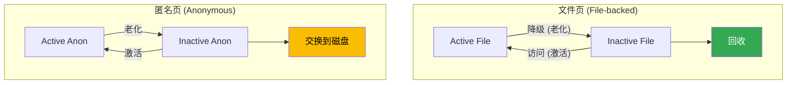
匿名页 (Anonymous Page): 进程的堆,栈,mmap 私有映射
文件页 (File-backed Page): 文件内容的缓存

### 5.3 页面回收 (kswapd)

```c
// mm/vmscan.c
static unsigned long shrink_page_list(struct list_head *page_list, ...)
{
    while (!list_empty(page_list)) {
        page = lru_to_page(page_list);
        
        // 检查页面是否可回收
        if (PageWriteback(page))
            continue;  // 正在写回
        
        if (PageDirty(page)) {
            // 脏页需要先写回
            pageout(page, mapping);
            continue;
        }
        
        // 尝试解除映射
        if (page_mapped(page)) {
            if (!try_to_unmap(page, ttu_flags))
                continue;  // 仍有引用
        }
        
        // 回收页面
        __remove_mapping(mapping, page);
        free_page(page);
    }
}
```

### 5.4 工作集与抖动

**工作集 (Working Set)**: 进程在时间窗口内访问的页面集合.

```
如果分配的内存 < 工作集大小:
  → 频繁缺页 (Page Fault)
  → 大量 I/O (swap)
  → CPU 利用率下降
  → 这就是抖动 (Thrashing)
```

---

## 6. 物理内存分配

### 6.1 伙伴系统 (Buddy System)

管理连续物理页帧:

```
Order: 页数
0:     1 页   (4KB)
1:     2 页   (8KB)
2:     4 页   (16KB)
...
10:    1024 页 (4MB)

分配 5 页:
1. 没有 order-2 (4页) 可用的
2. 分裂 order-3 (8页) 为两个 order-2
3. 返回一个 order-3 (8页) [有内部碎片]

释放时:
1. 检查伙伴块是否空闲
2. 是则合并为更大的块
```

**内存碎片回避 (Anti-Fragmentation)**:
现代内核不仅分 Order, 还分 **MIGRATE_TYPE** (迁移类型) 来尽量避免 "不可移动页" 割裂大块内存:
*   **UNMOVABLE**: 内核分配 (如 `kmalloc`). 无法移动, 容易造成永久碎片.
*   **MOVABLE**: 用户态内存. 可以随意规整 (Compaction).
*   **RECLAIMABLE**: 缓存页. 内存不足时可直接丢弃.
*   **策略**: 内核尽量把不可移动页聚在一起, 防止它们像钉子一样钉满整个内存空间.

### 6.2 查看伙伴信息

```bash
cat /proc/buddyinfo
# Node 0, zone   Normal   1289  790  568  371  200  143   51   12    8    2   38
#                          ^    ^    ^    ^    ^    ^    ^    ^    ^    ^    ^
# Order:                  0    1    2    3    4    5    6    7    8    9   10
```

#### 6.3.1 Slab / SLUB 分配器架构

Slab 通过维护不同状态的对象桶(Cache), 实现极致的小对象分配性能: 

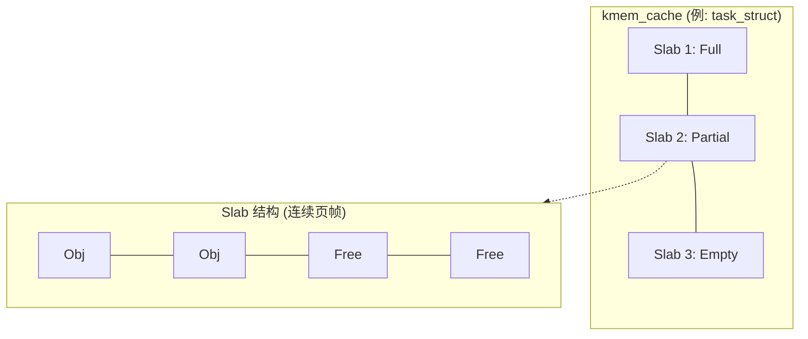

**核心优势**:
- **消除内部碎片**: 按需切分.
- **对象缓存**: 预先调用构造函数, 减少初始化开销.
- **CPU 本地化**: 每个 CPU 拥有自己的 slab, 减少锁竞争.

**API**:

```c
// 创建 cache
struct kmem_cache *my_cache = kmem_cache_create(
    "my_struct",                   // 名称
    sizeof(struct my_struct),      // 对象大小
    0,                             // 对齐
    SLAB_HWCACHE_ALIGN,            // 标志
    NULL                            // 构造函数
);

// 分配对象
struct my_struct *obj = kmem_cache_alloc(my_cache, GFP_KERNEL);

// 释放对象
kmem_cache_free(my_cache, obj);

// 销毁 cache
kmem_cache_destroy(my_cache);
```

---

## 7. 反向映射 (RMAP)

### 7.1 问题

页面回收时需要找到所有映射该物理页的 PTE:

```
                    物理页
                       │
        ┌──────────────┼──────────────┐
        │              │              │
  进程 A 的 PTE   进程 B 的 PTE   进程 C 的 PTE
  (地址 0x1000)  (地址 0x5000)  (地址 0x9000)

如何从物理页找到这些 PTE?
```

### 7.2 Linux 实现

```c
// include/linux/rmap.h

// 匿名页: anon_vma 链表
struct anon_vma {
    struct rb_root rb_root;  // 红黑树存储 VMA
};

// 文件页: address_space 的优先搜索树
struct address_space {
    struct radix_tree_root page_tree;
    struct rb_root i_mmap;  // VMA 树
};

// 遍历所有映射
int try_to_unmap(struct page *page, ...) {
    if (PageAnon(page))
        rmap_walk_anon(page, rwc);    // 匿名页
    else
        rmap_walk_file(page, rwc);    // 文件页
}
```

---

## 8. NUMA 架构

### 8.1 UMA vs NUMA

### 8.1 UMA vs NUMA

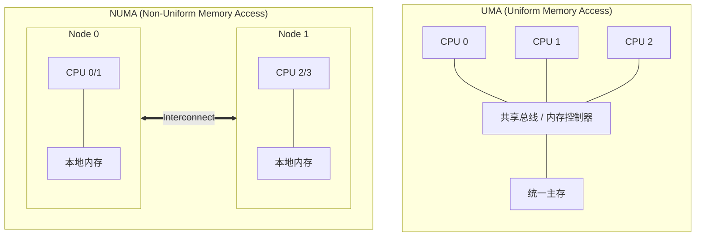

### 8.2 NUMA 策略

```bash
# 查看 NUMA 拓扑
numactl --hardware

# 绑定进程到指定节点
numactl --membind=0 --cpunodebind=0 ./myprogram

# 查看内存分布
numastat
```

### 8.3 内核 NUMA 感知

```c
// 内存分配标志
GFP_KERNEL      // 可能从任意节点分配
__GFP_THISNODE  // 仅从当前节点分配
GFP_KERNEL | __GFP_THISNODE // 本地优先

// per-CPU 变量自动本地分配
DEFINE_PER_CPU(struct data, mydata);
```

---

## 9. OOM Killer

### 9.1 触发条件

### 9.1 触发流程

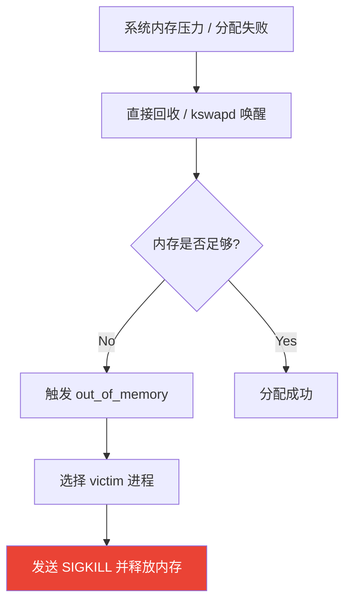

### 9.2 受害者选择

```c
// mm/oom_kill.c
unsigned long oom_badness(struct task_struct *p, ...) {
    // 基础分数 = 进程内存使用量 (RSS + swap)
    points = mm->rss + mm->swap_usage;
    
    // 根据 oom_score_adj 调整
    // oom_score_adj: -1000 ~ 1000
    // -1000: 禁止杀死
    // 0: 默认
    // 1000: 优先杀死
    
    adj = (long)p->signal->oom_score_adj;
    if (adj == OOM_SCORE_ADJ_MIN)  // -1000
        return 0;  // 不杀
    
    points += points * adj / 1000;
    
    return points;
}
```

### 9.3 调整 OOM 分数

```bash
# 查看进程的 oom_score
cat /proc/$PID/oom_score

# 设置 oom_score_adj (-1000 到 1000)
echo -500 > /proc/$PID/oom_score_adj

# 禁止被杀死 (谨慎使用)
echo -1000 > /proc/$PID/oom_score_adj
```

---

## 10. 内存压缩

### 10.1 zram

将交换区存储在压缩的内存中:

```
传统 swap:
内存页 → 写入磁盘 (慢)

zram:
内存页 → 压缩 → 存储在内存 (快)
```

```bash
# 创建 zram 设备
modprobe zram num_devices=1
echo lz4 > /sys/block/zram0/comp_algorithm
echo 4G > /sys/block/zram0/disksize
mkswap /dev/zram0
swapon /dev/zram0
```

### 10.2 zswap

内存中的交换缓存, 延迟写入实际交换设备:

```bash
# 启用
echo 1 > /sys/module/zswap/parameters/enabled
echo lz4 > /sys/module/zswap/parameters/compressor
echo z3fold > /sys/module/zswap/parameters/zpool
```

---

## 16. 进程内存指标: VSS/RSS/PSS/USS

### 16.1 四大指标定义

| 指标 | 英文 | 定义 | 特点 |
|------|------|------|------|
| **VSS** | Virtual Set Size | 虚拟地址总量 | 包含未分配物理内存的部分, 无实际参考价值 |
| **RSS** | Resident Set Size | 驻留内存总量 | 包含共享库, 多进程相加会超过物理内存 |
| **PSS** | Proportional Set Size | 按比例分摊的驻留内存 | 最核心指标, 共享页按使用者数平摊 |
| **USS** | Unique Set Size | 独占驻留内存 | 杀进程后能立刻回收的内存 |

### 16.2 图解

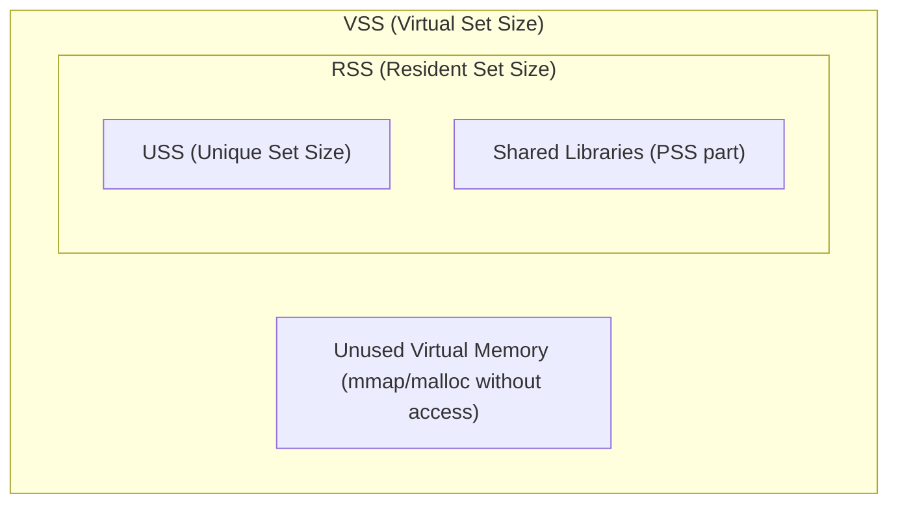

### 16.3 查看方法

```bash
# 查看进程的 smaps (详细)
cat /proc/$(pidof myapp)/smaps | grep -E "^(Rss|Pss|Private)"

# 使用 smem 工具
smem -p
#  PID User     Command        Swap      USS      PSS      RSS
# 1234 root     nginx           0    12288    15360    32768
```

### 16.4 free 命令误读

```bash
$ free -h
              total        used        free      shared  buff/cache   available
Mem:          7.7G        1.5G        3.2G        120M        3.0G        5.9G
```

**常见误解**: "free 只有 3.2G, 内存快满了!"

**正确理解**:
- `buff/cache` 3.0G 是可回收的缓存
- `available` 5.9G 才是真正可用的内存
- Linux 哲学: **"Empty memory is wasted memory"**

---

## 17. 内存回收路径

### 17.1 kswapd 异步回收

```
┌─────────────────────────────────────────────────────────────────────────┐
│                     kswapd 异步回收流程                                   │
├─────────────────────────────────────────────────────────────────────────┤
│                                                                         │
│  内存分配请求                                                            │
│       ↓                                                                 │
│  检查 Zone 水位                                                          │
│       ↓                                                                 │
│  ┌─────────────────────────────────────────────────────────────────┐   │
│  │                                                                  │   │
│  │  high ──────────────────────────────────────────────────────     │   │
│  │           (安全区域)                                             │   │
│  │  low  ─────────────────────────────── ← kswapd 开始工作          │   │
│  │           (kswapd 工作区)                                        │   │
│  │  min  ─────────────────────────────── ← Direct Reclaim 触发      │   │
│  │           (紧急区域)                                             │   │
│  │  0    ──────────────────────────────────────────────────────     │   │
│  │                                                                  │   │
│  └─────────────────────────────────────────────────────────────────┘   │
│                                                                         │
│  kswapd 特点:                                                          │
│  - 后台内核线程                                                          │
│  - 异步执行, 不阻塞用户进程                                               │
│  - 每个 NUMA node 一个 kswapd                                            │
│                                                                         │
└─────────────────────────────────────────────────────────────────────────┘
```

### 17.2 Direct Reclaim 同步回收

当内存降至 `min` 水位时, 分配请求**同步阻塞**:

```
内存分配 (alloc_pages)
       ↓
检查可用内存
       ↓ (不足)
┌──────────────────────────────────────────────────────────────────┐
│  Direct Reclaim (同步阻塞)                                        │
│                                                                   │
│  1. 当前进程被迫参与回收                                           │
│  2. 扫描 LRU 链表寻找可回收页                                       │
│  3. 写回脏页 / 交换匿名页                                          │
│  4. 直到分配成功或触发 OOM                                         │
│                                                                   │
│  ★ 这是应用延迟抖动的主要原因!                                     │
└──────────────────────────────────────────────────────────────────┘
       ↓
分配成功 或 OOM Kill
```

### 17.3 调优参数

```bash
# 查看水位
cat /proc/zoneinfo | grep -E "Node|zone|min|low|high"

# 调整 min_free_kbytes (增加 min 水位)
sysctl vm.min_free_kbytes=262144  # 256MB

# 调整脏页触发阈值
sysctl vm.dirty_background_ratio=5   # kswapd 开始刷脏页
sysctl vm.dirty_ratio=10             # 进程阻塞刷脏页
```

---

## 18. Page Cache 与 Buffer Cache

### 18.1 历史与现状

| 时期 | 架构 |
|------|------|
| Linux 2.2 及之前 | Page Cache 和 Buffer Cache 独立, 双重缓存 |
| Linux 2.4+ | 统一架构, Buffer Cache 成为 Page Cache 的一部分 |

### 18.2 现代定义

| 概念 | 面向对象 | free 中对应 |
|------|----------|-------------|
| **Page Cache** | 文件内容 (read/write) | cached |
| **Buffer Cache** | 块设备元数据 (inode, 目录项, 裸设备) | buffers |

### 18.3 Writeback 调优

```bash
# 脏页相关参数
vm.dirty_background_ratio=5   # 脏页占比超 5% 时后台刷盘
vm.dirty_ratio=10             # 脏页占比超 10% 时阻塞写入
vm.dirty_expire_centisecs=3000  # 脏页存活 30 秒后必须刷盘
vm.dirty_writeback_centisecs=500  # 每 5 秒唤醒一次刷盘线程
```

**调优建议**:

| 场景 | 策略 |
|------|------|
| 数据库 | 降低 dirty_ratio, 减少突发刷盘 |
| 日志写入 | 增加 dirty_expire, 减少刷盘频率 |
| 低内存 | 降低各阈值, 防止 OOM |

---

## 19. 分页 vs 分段深度对比

| 对比维度 | 分页 (Paging) | 分段 (Segmentation) |
|----------|---------------|---------------------|
| **划分依据** | 固定大小 (4KB) | 逻辑意义 (代码/数据/栈) |
| **对程序员** | 透明 | 可见 (段名/段内偏移) |
| **地址表示** | 页号 + 页内偏移 | 段号 + 段内偏移 |
| **外部碎片** | **无** | 有 (动态分配) |
| **内部碎片** | 有 (最后一页) | **无** |
| **共享** | 页粒度 (可能过大) | **段粒度** (自然边界) |
| **保护** | 页级权限 | **段级权限** (逻辑隔离) |
| **现代使用** | **主流** (Linux, Windows) | 基本淘汰 (x86-64 强制平坦) |

### 19.1 段页式 (Segmentation with Paging)

x86 平坦模型下段的残留:

```
逻辑地址 (段选择子:偏移)
       ↓ 段基地址 = 0 (平坦模型)
线性地址 = 偏移
       ↓ 分页机制
物理地址
```

---

## 20. 反置页表 (Inverted Page Table)

### 20.1 传统页表问题

64 位地址空间下传统页表的空间开销:

```
48-bit 虚拟地址 → 2^36 个 4KB 页
每个 PTE 8 字节 → 512GB 页表空间 (理论上限)

即使多级页表, 大地址空间仍然浪费
```

### 20.2 反置页表原理

```
┌─────────────────────────────────────────────────────────────────────────┐
│                     反置页表 (Inverted Page Table)                       │
├─────────────────────────────────────────────────────────────────────────┤
│                                                                         │
│  传统页表: 每个进程一个, 按虚拟页号索引                                    │
│  ┌───────────────────────────────────────────────────────────┐          │
│  │  VPN 0 → PFN 5                                            │          │
│  │  VPN 1 → PFN 8                                            │          │
│  │  ...                                                      │          │
│  │  VPN 2^36 → ???  (大多数无效)                              │          │
│  └───────────────────────────────────────────────────────────┘          │
│                                                                         │
│  反置页表: 全局一个, 按物理页帧号索引                                      │
│  ┌───────────────────────────────────────────────────────────┐          │
│  │  PFN 0 → (PID, VPN)                                       │          │
│  │  PFN 1 → (PID, VPN)                                       │          │
│  │  ...                                                      │          │
│  │  PFN N → (PID, VPN)    N = 物理内存页数                    │          │
│  └───────────────────────────────────────────────────────────┘          │
│                                                                         │
│  优势: 表项数 = 物理页数 (远小于虚拟页数)                                  │
│  缺点: 需要哈希查找, TLB Miss 开销大                                      │
│                                                                         │
└─────────────────────────────────────────────────────────────────────────┘
```

### 20.3 使用场景

| 架构 | 实现 |
|------|------|
| IBM PowerPC | 哈希页表 (HPT) |
| Itanium (IA-64) | VHPT |
| ARM | 部分变体支持 |

---

## 参考教材

| 主题 | 推荐阅读 |
|------|----------|
| 分页基础 | *OSTEP* Ch18-19, *恐龙书* Ch9 |
| 多级页表 | *OSTEP* Ch20, Intel SDM Vol.3 Ch4 |
| 页面置换 | *OSTEP* Ch21-22, *恐龙书* Ch10 |
| Linux 内存 | *LKD* Ch12, *ULK* Ch8 |
| NUMA | *ULK* Ch8.4, kernel documentation |

---

## 内核源码引用

| 主题 | 源码路径 | 关键函数/结构 |
|------|----------|---------------|
| 页描述符 | `include/linux/mm_types.h` | `struct page` |
| VMA | `include/linux/mm_types.h` | `struct vm_area_struct` |
| mm_struct | `include/linux/mm_types.h` | `struct mm_struct` |
| 页表类型 | `arch/x86/include/asm/pgtable_types.h` | `pte_t`, `pmd_t`, `pud_t`, `pgd_t` |
| 缺页处理 | `arch/x86/mm/fault.c` | `do_page_fault()`, `handle_mm_fault()` |
| 伙伴分配 | `mm/page_alloc.c` | `__alloc_pages()`, `free_pages()` |
| Slab 分配 | `mm/slub.c` | `kmem_cache_alloc()`, `kmem_cache_free()` |
| vmalloc | `mm/vmalloc.c` | `vmalloc()`, `vfree()` |
| 页面回收 | `mm/vmscan.c` | `shrink_page_list()`, `kswapd()` |
| LRU 管理 | `mm/vmscan.c` | `lru_add()`, `activate_page()` |
| RMAP | `mm/rmap.c` | `try_to_unmap()`, `page_add_anon_rmap()` |
| OOM Killer | `mm/oom_kill.c` | `out_of_memory()`, `oom_badness()` |
| NUMA | `mm/mempolicy.c` | `set_mempolicy()`, `mbind()` |
| mmap | `mm/mmap.c` | `do_mmap()`, `vm_area_alloc()` |

**在线源码浏览**: [Bootlin Elixir](https://elixir.bootlin.com/linux/latest/source)

---

## 10. LRU 内存回收机制

### 10.1 五大 LRU 链表

内核在每个 Memory Node 下维护 5 组双向链表:

| 链表 | 说明 |
|------|------|
| **Inactive Anon** | 长期未访问的匿名页 (Heap/Stack), 优先交换 |
| **Active Anon** | 最近高频访问的匿名页 |
| **Inactive File** | 长期未访问的文件缓存, 优先丢弃 |
| **Active File** | 热点文件数据, 受保护 |
| **Unevictable** | `mlock()` 锁定的页, 不参与回收 |

### 10.2 晋升与降级

```
┌─────────────────────────────────────────────────────────────────────────┐
│                      LRU 二阶段判断机制                                   │
├─────────────────────────────────────────────────────────────────────────┤
│                                                                         │
│                    新页进入                                              │
│                       ↓                                                 │
│              ┌───────────────┐                                          │
│              │  Inactive     │                                          │
│              │  List         │                                          │
│              └───────┬───────┘                                          │
│                      │ 第二次访问                                        │
│                      ↓ (PG_referenced)                                  │
│              ┌───────────────┐                                          │
│              │  Active       │ ←──── 晋升 (Promotion)                   │
│              │  List         │                                          │
│              └───────┬───────┘                                          │
│                      │ 内存压力                                          │
│                      ↓ (引用位清零)                                       │
│              ┌───────────────┐                                          │
│              │  Inactive     │ ←──── 降级 (Demotion)                    │
│              │  List 尾部    │                                          │
│              └───────┬───────┘                                          │
│                      │                                                  │
│                      ↓                                                  │
│                   回收                                                   │
│                                                                         │
└─────────────────────────────────────────────────────────────────────────┘
```

### 10.3 MGLRU (Multi-Gen LRU)

从内核 v6.1 开始引入的现代 LRU 实现:

| 特性 | 传统 LRU | MGLRU |
|------|----------|-------|
| 页面分类 | Active/Inactive | 多代 (Generations) |
| 扫描开销 | 较高 | 显著降低 |
| 年龄采样 | 粗粒度 | 精细化 |
| 性能提升 | - | 高压力下提升 ~40% |

### 10.4 Swappiness 参数

`vm.swappiness` (0-200) 控制匿名页与文件页的回收倾向:

| 值 | 行为 |
|----|------|
| 0 | 尽量不使用 Swap (仅在必要时) |
| 10 | 数据库服务器推荐 |
| 60 | 默认值 |
| 100 | 均衡考虑匿名页和文件页 |
| 200 | 极度倾向使用 Swap |

---

## 11. OOM Killer

### 11.1 触发条件

当所有回收手段失效时, `out_of_memory()` 被调用:

```
内存分配失败
       ↓
尝试 kswapd 异步回收
       ↓ (失败)
尝试 Direct Reclaim 同步回收
       ↓ (失败)
尝试 Compaction 内存整理
       ↓ (失败)
触发 OOM Killer
       ↓
选择并杀死 "最坏" 进程
```

### 11.2 选择算法

```
oom_score = (进程 RSS + Swap 使用) / 系统总内存 × 10
```

**保护机制**:
- `oom_score_adj = -1000`: 进程被豁免
- `oom_score_adj = 1000`: 优先被杀

```bash
# 保护关键服务
echo -1000 > /proc/$(pidof mysqld)/oom_score_adj
```

---

### 12.1 NUMA 架构概念

在大型服务器中, 内存不再是统一访问的, 而是分布在不同的插槽(Socket)中: 

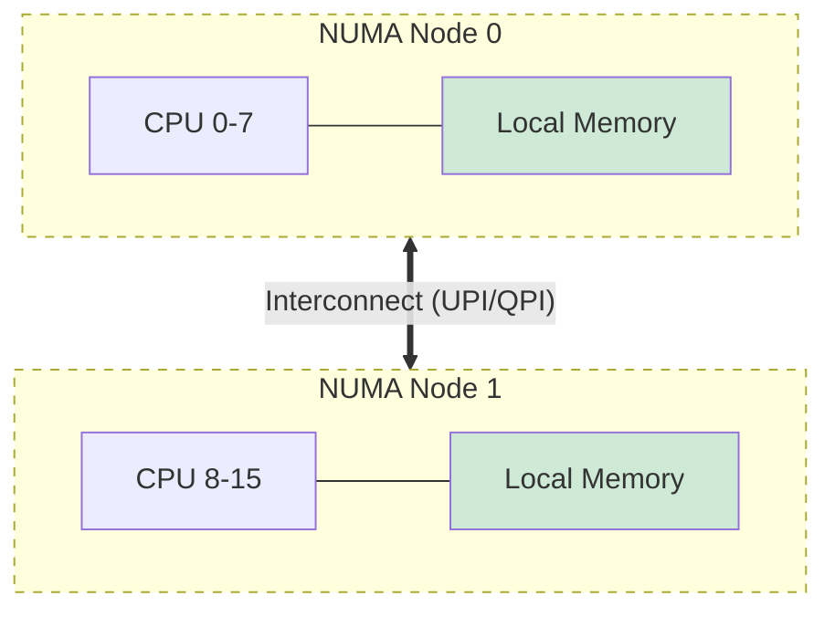

- **Local Access**: CPU 0 访问本地 Node 0 内存, 延迟极低(~80ns).
- **Remote Access**: CPU 0 访问 Node 1 内存, 需跨越互联总线, 延迟显著增加(~150ns+).

### 12.2 NUMA 调优

```bash
# 查看 NUMA 拓扑
numactl -H

# 绑定进程到特定节点
numactl --cpunodebind=0 --membind=0 ./myapp

# 查看 NUMA 统计
numastat
# numa_hit: 本地分配成功
# numa_miss: 被迫使用远程内存
```

---

## 13. HugePages 大页内存

### 13.1 TLB 问题

| 问题 | 说明 |
|------|------|
| 标准页 | 4KB, 64GB 内存需要 1600 万页表项 |
| TLB 容量 | 有限 (数百到数千条目) |
| TLB Miss | 需要多级页表遍历 (Page Walk), 延迟高 |

### 13.2 HugePages 优势

| 页大小 | 64GB 内存页表项数 | TLB 效率 |
|--------|-------------------|----------|
| 4KB | 16,777,216 | 低 |
| 2MB | 32,768 | 高 (512x 减少) |
| 1GB | 64 | 极高 |

### 13.3 配置方式

**静态 HugePages** (推荐数据库):

```bash
# 预留 1024 个 2MB 大页
echo 1024 > /sys/kernel/mm/hugepages/hugepages-2048kB/nr_hugepages

# 内核参数
hugepages=1024
```

**透明大页 (THP)**:

```bash
# 查看状态
cat /sys/kernel/mm/transparent_hugepage/enabled
# [always] madvise never

# 对某些工作负载可能引发延迟抖动
echo madvise > /sys/kernel/mm/transparent_hugepage/enabled
```

---

## 14. KSM 内存合并

**KSM (Kernel Samepage Merging)**: 扫描并合并内容相同的物理页.

```
┌─────────────────────────────────────────────────────────────────────────┐
│                         KSM 工作原理                                     │
├─────────────────────────────────────────────────────────────────────────┤
│                                                                         │
│  虚拟机 A        虚拟机 B        虚拟机 C                                 │
│  ┌─────────┐    ┌─────────┐    ┌─────────┐                             │
│  │ 内核页面 │    │ 内核页面 │    │ 内核页面 │                             │
│  │ (相同)  │    │ (相同)  │    │ (相同)  │                             │
│  └────┬────┘    └────┬────┘    └────┬────┘                             │
│       │              │              │                                   │
│       └──────────────┴──────────────┘                                   │
│                      │                                                  │
│                      ↓ KSM 合并                                         │
│              ┌───────────────┐                                          │
│              │  单一物理页   │                                          │
│              │  (COW 保护)   │                                          │
│              └───────────────┘                                          │
│                                                                         │
│  优势: 虚拟化场景下显著节省内存                                           │
│  代价: CPU 开销 (扫描和比较)                                             │
└─────────────────────────────────────────────────────────────────────────┘
```

---

---

## 15. 内存回收与压缩技术

当可用内存下降到水位线 (Watermark) 以下时, 内核启动回收:

### 15.1 kswapd vs 直接回收 (Direct Reclaim)

| 模式 | 触发点 | 执行方式 | 底层深度解析 |
| :--- | :--- | :--- | :--- |
| **kswapd** | 内存低于 `WMARK_LOW` | 异步内核线程 | **预警机制**. 在后台默默工作, 尽量不阻塞用户进程. |
| **直接回收** | 内存低于 `WMARK_MIN` | 同步执行 | **最后防线**. 分配请求会被强制挂起, 必须先释放出足够内存. 会导致进程瞬间延时 (Latency Spike). |

### 15.2 内存压缩 (Zswap / Zram)

为了减少缓慢的磁盘 Swap I/O, 现代 Linux 引入了压缩技术:

1. **Zswap**: 作为一个压缩缓存, 当页面准备被置换到 Swap 分区时, 先尝试压缩并存放在物理内存的动态池中.
2. **Zram**: 创建一个基于内存的分区并格式化为 Swap. 将数据暂存在压缩的主存中, 显著提升低内存在线性能.

### 15.3 LRU 双链表与 MGLRU

**经典 LRU**:
内核通过 `Active` 和 `Inactive` 两个链表管理内存页.
- **晋升**: 页面首次访问进 Inactive, 第二次访问才进 Active. 防止一次性大文件读取 (`grep`/`find`) 冲刷掉热数据.

**MGLRU (Multi-Gen LRU)** (Kernel v6.1+):
- **痛点**: 传统 LRU 在大内存下扫描开销巨大且反馈滞后.
- **机制**: 将页面分为多个 "代 (Generations)". 仅扫描最老的一代, 极大减少 CPU 消耗. 实测在高负载下提升性能 40%+.

### 15.4 Swappiness 的数学本质

`vm.swappiness` (0-200) 不是简单的 "换出概率", 而是 `Anon_Cost` 与 `File_Cost` 的比率调节器.
- **公式概念**: `Scan_Balance = Swappiness / 200`.
- **策略**:
    - **Database**: 设为 `0-10`. 宁愿丢弃 Page Cache (文件页) 也要保住 SGA (匿名页).
    - **Desktop/K8s Node**: 设为 `60`. 平衡响应速度.
    - **Laptop**: 设为 `60-100`. 积极利用 Swap 休眠.

### 15.5 OOM Killer 决策链

当回收宣告失败, `out_of_memory()` 登场:
1.  **打分**: `Score = (RSS + Swap) / Total_Memory * 1000`.
2.  **调整**: 用户可通过 `/proc/[pid]/oom_score_adj` (-1000 ~ 1000) 干预.
    - `-1000`: 免死金牌 (如 `sshd`, `systemd`).
    - `+1000`: 优先献祭.
3.  **处决**: 杀掉分最高的进程, 释放内存.

### 15.6 关键内存调优参数 (Advanced)

除了 swappiness, 内核还透出了两个通过平衡 "空间" 与 "时间" 的关键旋钮:

1.  **`vm.min_free_kbytes`** (安全气囊):
    *   **含义**: 强制保留的空闲内存底线. 内核分配原子内存 (如网络中断的 `sk_buff`) 时必须从这里拿.
    *   **调优**: 
        *   **默认值**: 往往过小 (如 64MB).
        *   **建议值**: 在高并发网络网关/分布式存储上, 调大到 **1GB-2GB**. 防止突发流量导致网络中断处理即刻失败 (Nano-second packet drop).
2.  **`vm.vfs_cache_pressure`** (Inode vs Data):
    *   **含义**: 控制回收 dentry/inode 缓存的倾向. 默认 100.
    *   **调优**: 
        *   **> 100**: 积极回收 Inode. 适合存在大量一次性小文件的场景 (如 Web 服务器).
        *   **< 100**: 倾向于保留 Inode. 适合文件结构深度遍历的场景 (如 `find`, `ls -R`).

---

## 16. 零拷贝技术

### 15.1 传统 I/O 问题

```
传统 read() + send():
┌──────┐    ①    ┌──────┐    ②    ┌──────┐    ③    ┌──────┐    ④    ┌──────┐
│ 磁盘  │ ───→  │Page  │ ───→  │用户  │ ───→  │Socket│ ───→  │ 网卡  │
│      │ DMA   │Cache │ CPU   │Buffer│ CPU   │Buffer│ DMA   │      │
└──────┘        └──────┘        └──────┘        └──────┘        └──────┘

问题: 4 次拷贝, 4 次上下文切换
```

### 15.2 零拷贝技术

| 技术 | 拷贝次数 | 说明 |
|------|----------|------|
| `mmap + write` | 3 次 | 减少一次用户态拷贝 |
| `sendfile` | 2 次 (仅 DMA) | 纯内核态, **零 CPU 拷贝** |
| `splice/tee` | 0 次 | 仅移动映射, 不移动数据 |
| `MSG_ZEROCOPY` | 0 次 | 网络发送免拷贝 |

```c
// sendfile 示例
sendfile(socket_fd, file_fd, NULL, file_size);
// 数据直接从 Page Cache 到网卡缓冲区
```

## 18. 高级内存抽象: Folios 与 Userfaultfd

### 18.1 Linux Folios (复合页抽象)

内核曾长期困扰于 `struct page` 过于细碎 (4KB) 导致的开销. **Folios** 是 Linux 5.16+ 引入的新抽象, 允许内核将多个连续物理页作为一个单元处理.

- **优势**: 减少元数据开销, 显著降低内核页缓存遍历的 CPU 周期 (iTLB miss 优化).
- **多尺寸 THP (mTHP)**: 结合 Folios, 内核现在可以按需申请各种尺寸的大页, 而不仅仅是固定的 2MB.

### 18.2 用户态缺页处理 (Userfaultfd)

传统 Page Fault 由内核完全控制. **Userfaultfd** 将控制权交还给用户态程序.

- **工作流**: 
    1. 用户程序在某一内存段注册 UFFD.
    2. 当发生缺页时, 内核挂起该线程并向 UFFD 队列发送事件.
    3. 用户态 Handler (监控进程) 填入内容并通知内核恢复执行.
- **应用场景**: 虚拟机热迁移 (Live Migration), 数据库延迟加载 (Lazy Loading).

---

## 17. 现代内存演进: 分级存储与安全

### 17.1 分级存储与 CXL (Compute Express Link)

随着 DRAM 容量成本的增加, 现代 OS 正向**分级存储 (Tiered Memory)** 演进.

| 层级 | 介质 | 访问时延 | 管理机制 |
|------|------|----------|----------|
| **Tier 0** | HBM (高带宽内存) | < 100ns | 内核作为热页缓存 |
| **Tier 1** | Local DRAM | ~100ns | 默认内存节点 |
| **Tier 2** | Remote DRAM (CXL) | ~200-400ns | 通过池化扩展容量 |
| **Tier 3** | 持久内存 (PMEM) | ~500ns+ | 使用 DAX 直连映射 |

**内核策略**: Linux 使用 `memory tiering` 机制, 结合 **MGLRU** 将不活跃的 Page 自动降级 (Promotion/Demotion) 到慢速节点.

### 17.2 内核空间安全加固

1.  **KASLR (Kernel Address Space Layout Randomization)**:
    - 每次启动时, 内核代码段和模块会被加载到不同的随机地址.
    - 破坏攻击者利用硬编码偏移量进行 ROP (Return Oriented Programming) 攻击.
2.  **CET (Control-flow Enforcement Technology)**:
    - 硬件辅助的**影子栈 (Shadow Stack)**, 防止函数返回地址被篡改.
3.  **KPTI (Kernel Page-Table Isolation)**:
    - 隔离内核与用户态页表, 彻底防御 **Meltdown** 漏洞.

---

## 思考题

1. 为什么 x86-64 只使用 48-bit (或 57-bit) 地址而非完整 64-bit?
2. TLB shootdown 为什么开销可能很大? 有什么优化方案?
3. 为什么 Linux 将 LRU 链表分为 active 和 inactive?
4. 反向映射解决了什么问题? 没有 RMAP 会怎样?
5. 在 NUMA 系统中, 为什么内存亲和性很重要?
6. OOM Killer 可能杀错进程, 如何降低关键服务被杀的风险?
