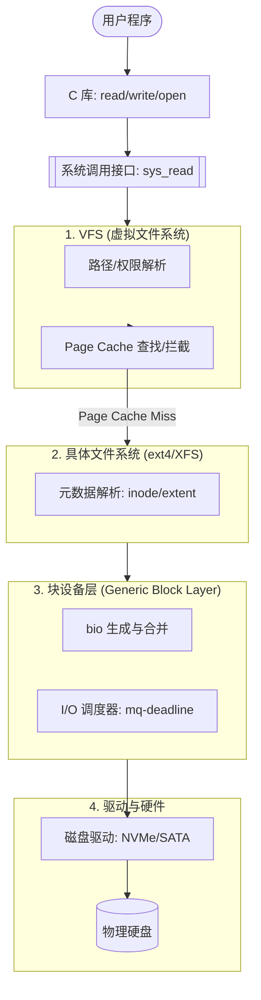

## 概述

文件系统是操作系统对持久化存储的抽象, 向上提供统一的数据访问接口, 向下管理磁盘块分配与数据布局. I/O 子系统负责管理各类外设访问. 本模块深入 VFS 抽象层,ext4 文件系统,块层设计以及现代异步 I/O 接口.

---

## 关键概念速查

| 概念 | 英文 | 定义 | 关联内核源码 |
|------|------|------|--------------|
| VFS | Virtual File System | 文件系统抽象层, 统一接口 | `fs/` |
| inode | Index Node | 文件元数据结构 | `include/linux/fs.h` |
| dentry | Directory Entry | 目录项缓存, 路径解析加速 | `include/linux/dcache.h` |
| super_block | - | 文件系统元数据 | `include/linux/fs.h` |
| file | - | 打开的文件对象 | `include/linux/fs.h` |
| 页缓存 | Page Cache | 文件数据内存缓存 | `mm/filemap.c` |
| bio | Block I/O | 块 I/O 请求结构 | `include/linux/bio.h` |
| io_uring | - | 现代高性能异步 I/O 接口 | `io_uring/` |
| ext4 | Fourth Extended FS | Linux 默认文件系统 | `fs/ext4/` |
| NVMe | NVM Express | 现代 SSD 接口协议 | `drivers/nvme/` |

---

## 模块知识结构


---


## 1. 文件系统概念

### 1.1 文件抽象

| 视角 | 定义 |
|------|------|
| 用户视角 | 有名字的数据集合 |
| 逻辑视角 | 字节序列或记录集合 |
| 物理视角 | 磁盘块的集合 |

> UNIX 哲学: "Everything is a file" — 普通文件,目录,设备,套接字都通过文件接口访问.

### 1.2 文件类型

| 类型 | 标识 | 说明 |
|------|------|------|
| 普通文件 | `-` | 数据文件 |
| 目录 | `d` | 包含目录项 |
| 符号链接 | `l` | 指向另一个路径 |
| 块设备 | `b` | 随机访问设备 (磁盘) |
| 字符设备 | `c` | 流式设备 (终端) |
| 命名管道 | `p` | FIFO |
| 套接字 | `s` | 本地通信 |

### 1.3 文件操作的内核路径

从用户态发起 `read()` 到驱动程序执行, 数据流经的完整路径如下: 



---

## 2. VFS (Virtual File System)

### 2.1 VFS 的桥梁作用

VFS 定义了统一的文件接口, 屏蔽了磁盘、网络、伪文件系统(proc/sysfs)之间的差异: 


### 2.2 VFS 四大核心对象

#### 2.2.1 超级块 (super_block)

```c
struct super_block {
    struct list_head    s_list;         // 全局超级块链表
    dev_t               s_dev;          // 设备标识
    unsigned long       s_blocksize;    // 块大小
    unsigned long       s_magic;        // 魔数 (文件系统标识)
    struct dentry      *s_root;         // 根目录项
    struct file_system_type *s_type;    // 文件系统类型
    const struct super_operations *s_op; // 操作函数表
    // ...
    void               *s_fs_info;      // 文件系统私有数据
};

struct super_operations {
    struct inode *(*alloc_inode)(struct super_block *sb);
    void (*destroy_inode)(struct inode *);
    void (*dirty_inode)(struct inode *, int flags);
    int (*write_inode)(struct inode *, struct writeback_control *);
    void (*put_super)(struct super_block *);
    int (*sync_fs)(struct super_block *sb, int wait);
    int (*statfs)(struct dentry *, struct kstatfs *);
    // ...
};
```

#### 2.2.2 inode

```c
struct inode {
    umode_t             i_mode;         // 文件类型和权限
    unsigned short      i_opflags;      
    kuid_t              i_uid;          // 所有者 UID
    kgid_t              i_gid;          // 所有者 GID
    unsigned int        i_flags;
    
    const struct inode_operations *i_op;     // inode 操作
    struct super_block *i_sb;                 // 所属超级块
    struct address_space *i_mapping;          // 关联的页缓存
    
    unsigned long       i_ino;          // inode 号
    union {
        const unsigned int i_nlink;     // 硬链接数
        unsigned int __i_nlink;
    };
    dev_t               i_rdev;         // 设备号 (设备文件)
    loff_t              i_size;         // 文件大小
    struct timespec64   i_atime;        // 访问时间
    struct timespec64   i_mtime;        // 修改时间
    struct timespec64   i_ctime;        // 状态改变时间
    
    const struct file_operations *i_fop;  // 文件操作
    struct address_space i_data;          // 页缓存
    // ...
};

struct inode_operations {
    struct dentry * (*lookup)(struct inode *, struct dentry *, unsigned int);
    int (*create)(struct inode *, struct dentry *, umode_t, bool);
    int (*link)(struct dentry *, struct inode *, struct dentry *);
    int (*unlink)(struct inode *, struct dentry *);
    int (*symlink)(struct inode *, struct dentry *, const char *);
    int (*mkdir)(struct inode *, struct dentry *, umode_t);
    int (*rmdir)(struct inode *, struct dentry *);
    int (*rename)(struct inode *, struct dentry *,
                  struct inode *, struct dentry *, unsigned int);
    // ...
};
```

#### 2.2.3 dentry (目录项)

```c
struct dentry {
    unsigned int d_flags;
    seqcount_spinlock_t d_seq;
    struct hlist_bl_node d_hash;        // 哈希表节点
    struct dentry *d_parent;            // 父目录项
    struct qstr d_name;                 // 文件名
    struct inode *d_inode;              // 关联的 inode
    unsigned char d_iname[DNAME_INLINE_LEN];  // 短名称内联存储
    
    const struct dentry_operations *d_op;
    struct super_block *d_sb;           // 所属超级块
    void *d_fsdata;                     // 文件系统私有数据
    
    struct list_head d_child;           // 子目录项链表
    struct list_head d_subdirs;         // 子目录
};
```

**dentry 缓存 (dcache)**: 加速路径名解析, 避免重复磁盘访问.

### 2.3 链接技术深度对比: 硬链接 vs 软链接

| 维度 | 硬链接 (Hard Link) | 符号链接 (Symbolic Link / Soft Link) |
| :--- | :--- | :--- |
| **内核原理** | 多个 dentry 指向**同一个 inode** | 一个新的文件 (inode), 内容是被指向文件的**路径字符串** |
| **inode 编号** | 相同 | 不同 |
| **跨文件系统** | 不支持 | 支持 |
| **目录连接** | 内核严禁 (防止循环和死锁) | 支持 |
| **源文件删除** | 无影响 (只要仍有链接指向 inode) | 失效 (变为 "死链接") |
| **存储开销** | 仅增加一个 dentry 条目 | 需要占用一个 inode 和少量磁盘块 |

### 2.4 文件系统一致性保证 (Consistency)

数据写入磁盘时遭遇断电, 如何防止文件系统损毁? 现代 FS 有两种核心方案:

1. **日志记录 (Journaling)**:
   - **方式**: 在写入真正数据前, 先在专用的 `Journal` 区记录操作意图.
   - **典型**: ext4, XFS.
   - **故障恢复**: 重启时扫描日志, 完成未竟的操作 (Redo) 或回滚 (Undo).
2. **写时复制 (Copy-on-Write)**:
   - **方式**: 从不原地修改数据, 而是将修改后的块写入新位置, 最后原子地更新根指针.
   - **典型**: Btrfs, ZFS.
   - **优点**: 天然支持快照 (Snapshot), 无需复杂的日志重放.

#### 2.2.4 file (打开的文件)

```c
struct file {
    struct path         f_path;         // 文件路径 (vfsmount + dentry)
    struct inode       *f_inode;        // 快速访问 inode
    const struct file_operations *f_op; // 文件操作
    spinlock_t          f_lock;
    atomic_long_t       f_count;        // 引用计数
    unsigned int        f_flags;        // 打开标志 (O_RDONLY, O_NONBLOCK, ...)
    fmode_t             f_mode;         // 访问模式
    loff_t              f_pos;          // 当前读写位置
    struct address_space *f_mapping;    // 页缓存
    void               *private_data;   // 驱动私有数据
};

struct file_operations {
    loff_t (*llseek)(struct file *, loff_t, int);
    ssize_t (*read)(struct file *, char __user *, size_t, loff_t *);
    ssize_t (*write)(struct file *, const char __user *, size_t, loff_t *);
    ssize_t (*read_iter)(struct kiocb *, struct iov_iter *);
    ssize_t (*write_iter)(struct kiocb *, struct iov_iter *);
    int (*mmap)(struct file *, struct vm_area_struct *);
    int (*open)(struct inode *, struct file *);
    int (*release)(struct inode *, struct file *);
    int (*fsync)(struct file *, loff_t, loff_t, int datasync);
    // ...
};
```

### 2.3 路径解析

```c
// fs/namei.c
// 从根目录开始逐级解析路径

path_lookupat():
    1. 从 "/" 或 "." 开始
    2. 分割路径为组件
    3. 对每个组件:
       a) 查 dentry 缓存
       b) 未命中则调用 lookup() 从磁盘读取
       c) 检查权限
       d) 处理符号链接
    4. 返回最终的 dentry
```

---

## 3. ext4 文件系统

### 3.1 ext4 磁盘布局


### 3.2 ext4 inode 结构

```c
struct ext4_inode {
    __le16  i_mode;         // 文件类型和权限
    __le16  i_uid;          // 所有者 UID (低 16 位)
    __le32  i_size_lo;      // 文件大小 (低 32 位)
    __le32  i_atime;        // 访问时间
    __le32  i_ctime;        // inode 修改时间
    __le32  i_mtime;        // 数据修改时间
    __le32  i_dtime;        // 删除时间
    __le16  i_gid;          // 组 GID (低 16 位)
    __le16  i_links_count;  // 硬链接数
    __le32  i_blocks_lo;    // 块数 (低 32 位)
    __le32  i_flags;        // 文件标志
    // ...
    __le32  i_block[EXT4_N_BLOCKS];  // 块指针或 extent 树
    // ...
};
```

### 3.3 Extent Tree

ext4 使用 extent 替代传统的间接块:

```
传统间接块 (ext2/ext3):
inode → [直接块指针 ×12]
      → [一次间接块] → [数据块]
      → [二次间接块] → [一次间接] → [数据块]
      → [三次间接块] → ...

ext4 Extent:
inode → [Extent Header]
      → [Extent Entry 1]: {起始逻辑块, 长度, 物理块}
      → [Extent Entry 2]: ...
      → [Extent Index] → [叶子节点] → [Extent Entries]

Extent 优势:
1. 大文件连续分配, 减少元数据
2. 更快的大文件访问
3. 减少碎片
```

```c
struct ext4_extent {
    __le32  ee_block;      // 起始逻辑块号
    __le16  ee_len;        // extent 长度 (块数)
    __le16  ee_start_hi;   // 物理块号高位
    __le32  ee_start_lo;   // 物理块号低位
};
```

### 3.4 日志 (Journaling)

ext4 使用 JBD2 (Journaling Block Device 2) 实现日志:

```
写入流程:
1. 开始事务
2. 写入日志区 (元数据 / 数据)
3. 提交事务 (commit)
4. 写入实际位置
5. 删除日志记录

### 3.3 一致性与崩溃恢复策略

文件系统必须保证在断电或崩溃后数据的一致性.现代系统采用以下三种核心策略: 

| 策略 | 核心机制 | 核心优势 | 代表系统 |
|------|----------|----------|----------|
| **Journaling** | 先在预写日志 (WAL) 记录操作, 成功后修改数据 | 恢复极快, 在线一致性 | Ext4, XFS |
| **CoW (Copy-on-Write)** | 不覆盖旧块, 写入新块并修改树指针 | 无损快照, 数据始终一致 | Btrfs, ZFS |
| **Soft Updates** | 严格控制元数据写入顺序 | 与 UFS 性能相近, 无需日志开销 | FreeBSD UFS |

**Ext4 日志模式对比**:

| 模式 | 日志内容 | 性能 | 安全性 |
|------|----------|------|--------|
| `journal` | 元数据 + 数据 | 最慢 | 最高 |
| `ordered` | 仅元数据 (先写数据后写元数据) | 中等 | 中等 (默认) |
| `writeback` | 仅元数据 (无顺序保证) | 最快 | 最低 |

---

## 4. 链接与目录操作

Linux 文件系统支持两种链接机制, 分别解决不同的引用需求.

### 4.1 硬链接 vs 符号链接


---

## 5. 块层 (Block Layer)

### 5.1 I/O 请求流转过程


### 5.2 struct bio

```c
struct bio {
    struct bio         *bi_next;        // 链表
    struct block_device *bi_bdev;       // 目标块设备
    unsigned int        bi_opf;         // 操作类型和标志
    unsigned short      bi_vcnt;        // bio_vec 数量
    unsigned short      bi_max_vecs;    // 最大 bio_vec 数量
    atomic_t            bi_cnt;         // 引用计数
    
    struct bvec_iter    bi_iter;        // 当前迭代位置
    
    bio_end_io_t       *bi_end_io;      // 完成回调
    void               *bi_private;     // 私有数据
    
    struct bio_vec     *bi_io_vec;      // 页面数组
};

struct bio_vec {
    struct page    *bv_page;            // 页面
    unsigned int    bv_len;             // 长度
    unsigned int    bv_offset;          // 页内偏移
};
```

### 5.3 I/O 调度器

| 调度器 | 特点 | 适用场景 |
|--------|------|----------|
| none | 无调度, 直接下发 | NVMe, SSD |
| mq-deadline | 保证延迟截止时间 | 通用 (默认) |
| bfq | 公平带宽分配 | 多媒体, 交互式 |
| kyber | 低延迟优化 | 低延迟需求 |

```bash
# 查看当前调度器
cat /sys/block/sda/queue/scheduler

# 设置调度器
echo mq-deadline > /sys/block/sda/queue/scheduler
```

---

## 6. 页缓存 (Page Cache)

### 6.1 页缓存 (Page Cache) 读写策略


### 6.3 相关参数

```bash
# 查看脏页阈值
cat /proc/sys/vm/dirty_ratio         # 触发同步写的阈值 (%)
cat /proc/sys/vm/dirty_background_ratio  # 触发后台写回的阈值 (%)
cat /proc/sys/vm/dirty_expire_centisecs  # 脏页过期时间 (厘秒)

# 查看页缓存状态
cat /proc/meminfo | grep -E "Cached|Dirty|Writeback"
```

---

## 7. io_uring

### 7.1 传统 I/O 的问题

```
同步 I/O:       read() ─── 阻塞等待 ───→ 返回
线程池异步:     创建线程 → read() 阻塞 → 回调
AIO (libaio):  仅支持 O_DIRECT, 接口复杂
```

### 7.2 io_uring 架构


★ 关键特性:
- 零拷贝提交/完成 (通过共享内存)
- 批量提交减少系统调用
- 轮询模式避免中断开销
```

### 7.3 io_uring 使用示例

```c
#include <liburing.h>

struct io_uring ring;
io_uring_queue_init(32, &ring, 0);  // 32 个条目

// 准备读操作
struct io_uring_sqe *sqe = io_uring_get_sqe(&ring);
io_uring_prep_read(sqe, fd, buf, size, offset);
sqe->user_data = (unsigned long)my_context;

// 提交
io_uring_submit(&ring);

// 等待完成
struct io_uring_cqe *cqe;
io_uring_wait_cqe(&ring, &cqe);

// 处理结果
int result = cqe->res;
void *ctx = (void *)cqe->user_data;

// 标记已处理
io_uring_cqe_seen(&ring, cqe);

// 清理
io_uring_queue_exit(&ring);
```

### 7.4 支持的操作

| 类别 | 操作 |
|------|------|
| 文件 I/O | read, write, readv, writev, fsync |
| 网络 | accept, connect, send, recv, sendmsg, recvmsg |
| 文件操作 | openat, close, statx, unlink, rename |
| 其他 | timeout, poll, nop |

---

## 8. 设备驱动

### 8.1 字符设备驱动框架

```c
#include <linux/cdev.h>
#include <linux/fs.h>

static struct cdev my_cdev;
static dev_t dev_num;

static int my_open(struct inode *inode, struct file *file) {
    // 打开设备时调用
    return 0;
}

static ssize_t my_read(struct file *file, char __user *buf, 
                       size_t count, loff_t *ppos) {
    // 读取设备
    if (copy_to_user(buf, kernel_buf, count))
        return -EFAULT;
    return count;
}

static ssize_t my_write(struct file *file, const char __user *buf,
                        size_t count, loff_t *ppos) {
    // 写入设备
    if (copy_from_user(kernel_buf, buf, count))
        return -EFAULT;
    return count;
}

static const struct file_operations my_fops = {
    .owner = THIS_MODULE,
    .open = my_open,
    .read = my_read,
    .write = my_write,
};

static int __init my_init(void) {
    // 分配设备号
    alloc_chrdev_region(&dev_num, 0, 1, "mydev");
    
    // 初始化 cdev
    cdev_init(&my_cdev, &my_fops);
    cdev_add(&my_cdev, dev_num, 1);
    
    return 0;
}

static void __exit my_exit(void) {
    cdev_del(&my_cdev);
    unregister_chrdev_region(dev_num, 1);
}

module_init(my_init);
module_exit(my_exit);
```

### 8.2 块设备与 NVMe

NVMe 采用多队列架构:


优势:
- 每 CPU 独立队列, 无锁竞争
- 并行提交/完成
- 中断可绑定到特定 CPU
```

---

## 9. 磁盘调度算法

### 9.1 经典算法 (HDD)

| 算法 | 英文 | 策略 | 特点 |
|------|------|------|------|
| FCFS | First-Come First-Served | 按请求顺序 | 简单, 寻道距离大 |
| SSTF | Shortest Seek Time First | 最短寻道优先 | 吞吐高, 可能饥饿 |
| SCAN | Elevator | 单向扫描到端后反向 | 公平, 避免饥饿 |
| C-SCAN | Circular SCAN | 单向扫描, 直接返回起点 | 更均匀的等待时间 |
| LOOK | - | SCAN 但不到端点 | 实际采用 |

### 9.2 SSD 不需要传统调度

```
SSD 特点:
- 无机械部件, 随机访问延迟与顺序访问相近
- 不需要考虑寻道时间
- 调度器设为 "none" 或 "mq-deadline"

建议:
- NVMe: scheduler = none
- SATA SSD: scheduler = mq-deadline
- HDD: scheduler = bfq 或 mq-deadline
```

---

## 10. 缓冲技术

### 10.1 缓冲层次


### 10.2 绕过缓存: O_DIRECT

```c
// 直接 I/O, 绕过页缓存
int fd = open("/data/file", O_RDWR | O_DIRECT);

// 要求:
// 1. 地址对齐 (通常 512 字节)
// 2. 长度对齐
// 3. 偏移对齐

// 适用场景:
// - 数据库 (自己管理缓存)
// - 大文件顺序读写
```

---

## 11. I/O 设备管理

### 11.1 设备管理的目标与任务

| 目标 | 说明 |
|------|------|
| **设备独立性** | 用户程序无需关心具体设备类型 |
| **高效率** | 尽量减少 CPU 等待 I/O 的时间 |
| **方便性** | 提供统一,简单的接口 |
| **可扩展性** | 支持动态添加新设备 |

### 11.2 I/O 设备分类

| 分类方式 | 类型 | 示例 |
|----------|------|------|
| 使用方式 | **块设备** (Block Device) | 磁盘, SSD, USB 存储 |
| | **字符设备** (Character Device) | 键盘, 鼠标, 终端 |
| | **网络设备** (Network Device) | 网卡 |
| 传输速率 | 低速设备 | 键盘 (~100 B/s) |
| | 中速设备 | 打印机 (~100 KB/s) |
| | 高速设备 | 磁盘 (~GB/s), 网卡 (~Gbps) |
| 共享性 | 独占设备 | 打印机 |
| | 共享设备 | 磁盘 |

### 11.3 I/O 控制方式

| 方式 | 英文 | 特点 | CPU 利用率 |
|------|------|------|------------|
| 程序直接控制 | Programmed I/O | CPU 循环测试设备状态 | 极低 |
| 中断驱动 | Interrupt-Driven I/O | 设备就绪时中断 CPU | 中等 |
| DMA | Direct Memory Access | 专用硬件传输数据 | 高 |
| 通道 | Channel I/O | 专用 I/O 处理器 | 最高 |

**DMA 工作原理**:


### 11.4 I/O 软件层次


### 11.5 设备驱动程序

**驱动程序的功能**:

| 功能 | 说明 |
|------|------|
| 初始化设备 | 设置控制器寄存器, 分配资源 |
| 接受 I/O 请求 | 将上层请求转换为设备操作 |
| 控制设备 | 发送命令, 读写数据 |
| 处理中断 | 响应设备中断, 完成 I/O |
| 错误处理 | 重试, 报告错误 |

**Linux 驱动模型**:

```c
// 字符设备驱动框架
static struct file_operations my_fops = {
    .owner = THIS_MODULE,
    .open = my_open,     // 打开设备
    .release = my_release,// 关闭设备  
    .read = my_read,     // 读数据
    .write = my_write,   // 写数据
    .ioctl = my_ioctl,   // 控制命令
};

// 块设备驱动框架
static struct block_device_operations my_block_ops = {
    .owner = THIS_MODULE,
    .open = my_open,
    .release = my_release,
    .submit_bio = my_submit_bio, // 提交 I/O 请求
};
```

### 11.6 I/O 端口与内存映射

| 方式 | 英文 | 特点 | 指令 (x86) |
|------|------|------|------------|
| I/O 端口 | Port-mapped I/O | 独立地址空间 | `in`, `out` |
| 内存映射 | Memory-mapped I/O | 统一地址空间 | `mov` |

```c
// I/O 端口访问 (x86)
unsigned char data = inb(0x60);   // 从端口 0x60 读取
outb(0x03, 0x3F8);                // 向端口 0x3F8 写入

// 内存映射 I/O (Linux)
void __iomem *regs = ioremap(phys_addr, size);
writel(value, regs + OFFSET);
value = readl(regs + OFFSET);
iounmap(regs);
```

### 11.7 设备分配策略

| 策略 | 说明 | 适用设备 |
|------|------|----------|
| 独占分配 | 设备整个使用期间专属一个进程 | 打印机 |
| 共享分配 | 多进程交替使用 | 磁盘 |
| 虚拟分配 | SPOOLing 技术 | 打印机 (虚拟化) |

**SPOOLing (Simultaneous Peripheral Operations On-Line)**:

```
┌─────────────────────────────────────────────────────────────────────┐
│  进程 1: printf() ──┐                                               │
│  进程 2: printf() ──┼──→ 输出井 (磁盘缓冲区) ──→ 输出进程 ──→ 打印机  │
│  进程 3: printf() ──┘                                               │
│                                                                     │
│  效果: 慢速独占设备变成高速共享设备                                   │
└─────────────────────────────────────────────────────────────────────┘
```

---

## 12. 文件系统一致性保证

### 12.1 一致性问题

文件系统操作涉及多个元数据更新, 若中途崩溃:

```
创建文件需要:
1. 分配 inode
2. 初始化 inode
3. 更新目录项
4. 更新位图

若在步骤 2-3 之间崩溃 → inode 泄漏
若在步骤 3-4 之间崩溃 → 位图与实际不一致
```

### 12.2 一致性机制对比

| 机制 | 英文 | 原理 | 优点 | 缺点 |
|------|------|------|------|------|
| **FSCK** | File System Check | 崩溃后全盘扫描修复 | 简单 | 大容量极慢 (数小时) |
| **日志** | Journaling | 先写日志再写数据 | 恢复快 (~秒级) | 写放大 |
| **CoW** | Copy-on-Write | 原子替换根指针 | 无日志, 快照免费 | 碎片化 |

### 12.3 日志文件系统 (ext4)


**日志模式**:

| 模式 | 日志内容 | 性能 | 安全性 |
|------|----------|------|--------|
| **journal** | 元数据 + 数据 | 最慢 | 最高 |
| **ordered** | 仅元数据 (数据先写) | 中等 | **默认** |
| **writeback** | 仅元数据 | 最快 | 可能数据不一致 |

### 12.4 CoW 文件系统 (Btrfs, ZFS)


---

## 13. io_uring 高级特性

### 13.1 SQPOLL 模式

**SQPOLL (Submission Queue Polling)**: 内核线程持续轮询 SQ, 实现**零系统调用**:


### 13.2 启用 SQPOLL

```c
struct io_uring ring;
struct io_uring_params params = {
    .flags = IORING_SETUP_SQPOLL,
    .sq_thread_idle = 2000, // 空闲 2 秒后休眠
};

io_uring_queue_init_params(32, &ring, &params);

// 提交请求 (无需 syscall!)
struct io_uring_sqe *sqe = io_uring_get_sqe(&ring);
io_uring_prep_read(sqe, fd, buf, size, 0);
io_uring_submit(&ring);  // 仅更新 SQ tail, 无 syscall
```

### 13.3 io_uring vs 传统异步 I/O

| 特性 | io_uring | epoll | POSIX AIO |
|------|----------|-------|-----------|
| 系统调用 | 0 (SQPOLL) | 每次唤醒 | 每次 submit |
| 内核拷贝 | 零拷贝 (共享内存) | 需拷贝事件 | 需拷贝 |
| 多操作类型 | read/write/accept/... | 仅 fd 就绪 | 仅 read/write |
| 批量提交 | 原生支持 | 不支持 | 有限 |
| 文件类型 | 所有 | 需 non-blocking | 部分 |

---

---

## 14. 零拷贝技术深度对比 (Zero Copy)

零拷贝的目标是最大限度减少数据在 "内核 Page Cache" 与 "用户态 Buffer" 以及 "网络栈" 之间的无谓拷贝.

| 方案 | 系统调用 | 拷贝次数 (CPU/DMA) | 底层深度解析 |
| :--- | :--- | :--- | :--- |
| **传统读写** | `read()` + `write()` | 4 次 (2 CPU + 2 DMA) | 这种方法由于用户态的中转, 性能最差. |
| **mmap** | `mmap()` + `write()` | 3 次 (1 CPU + 2 DMA) | 共享内存. 避免了 Page Cache 到用户空间的拷贝, 但仍需拷贝到 Socket Buffer. |
| **sendfile** | `sendfile()` | 2 次 (0 CPU + 2 DMA) | **真正意义上的零拷贝**. 配合网卡 SG-DMA, 数据直接从 Page Cache 发往网卡. (仅限文件到网卡) |
| **splice** | `splice()` | 0 次 (管道中转) | 通过管道符在两个文件描述符间移动数据, 避免态间切换. 可用于两个文件间拷贝. |

---

## 15. I/O 栈调优策略

面对不同的存储介质, "一刀切" 的默认配置往往是性能瓶颈.

### 15.1 预读 (Readahead)

内核通过预判顺序流来提前读取数据到 Cache.
- **参数**: `blockdev --setra [sectors] /dev/sda`
- **调优**:
    - **Sequntial Workload (流媒体/日志)**: 调大到 4096 (2MB) 甚至更高, 减少小 IO 次数.
    - **Random Workload (数据库)**: 数据库通常有自己的 buffer pool 预读逻辑, 系统预读过大反而造成 Cache Pollution. 建议设为 128 (64KB) 或更小.

### 15.2 队列深度 (Queue Depth)

设备能够并发处理的 I/O 请求数.
- **HDD**: 机械臂物理限制, 队列过深只会增加 Latency. 保持默认或减小.
- **NVMe**: 现代 SSD 内部并发极大. 调大 `/sys/block/nvme0n1/queue/nr_requests` (如 1024), 充分喂饱 SSD 控制器.

---

## 16. 块层与 I/O 调度器

为了优化物理磁盘 (尤其是 HDD) 的寻道开销, 内核对 I/O 请求进行合并与排序:

### 16.1 经典算法对比

| 调度器 | 英文 | 策略 | 适用场景 |
| :--- | :--- | :--- | :--- |
| **Deadline** | Deadline Scheduler | 为读写请求设置截止时间, 读优先 | **通用首选**. 避免请求被无限推迟. |
| **BFQ** | Budget Fair Queueing | 基于权重的比例公平分配带宽 | **桌面系统**. 改善多任务下的交互体验. |
| **Kyber** | Kyber Scheduler | 基于目标延迟 (Latency-based) | **NVMe/SSD**. 处理现代固态硬盘的高吞吐,低延时场景. |

---

## 17. Copy-on-Write 文件系统: Btrfs 与 ZFS

现代 CoW 文件系统通过原子指针替换实现数据一致性, 无需传统日志.

### 17.1 CoW 核心原理


**关键机制**:
- 数据永不原地覆盖, 写入新位置后原子更新父指针
- 旧数据自然保留, 快照几乎零开销
- 文件系统永远保持一致状态, 无需 fsck

### 17.2 Btrfs vs ZFS 对比

| 特性 | Btrfs | ZFS |
|------|-------|-----|
| **起源** | Oracle/Linux (2007) | Sun/Solaris (2005) |
| **许可证** | GPL | CDDL (OpenZFS: 双授权) |
| **主线集成** | Linux 内核原生 | 通过 DKMS/kmod |
| **RAID 实现** | 原生 (RAID0/1/5/6/10) | RAID-Z (Z1/Z2/Z3) |
| **最大卷大小** | 16 EiB | 256 ZiB |
| **校验和** | CRC32/xxhash | Fletcher-4/SHA-256 |
| **压缩** | zlib/lzo/zstd | lz4/zstd/gzip |
| **去重** | 实时 (CPU 密集) | 块级 (需大量 RAM) |
| **自愈** | 镜像/RAID 模式 | 自动修复损坏块 |

### 17.3 Btrfs 子卷与快照

```bash
# 创建子卷
btrfs subvolume create /mnt/data/subvol1

# 创建只读快照 (瞬间完成)
btrfs subvolume snapshot -r /mnt/data/subvol1 /mnt/data/snap1

# 创建可写快照 (用于测试)
btrfs subvolume snapshot /mnt/data/subvol1 /mnt/data/test_snap

# 发送增量备份
btrfs send -p /mnt/data/snap1 /mnt/data/snap2 | btrfs receive /backup/
```

### 17.4 ZFS ARC 与 L2ARC


**ZFS 性能调优**:

```bash
# 查看 ARC 统计
arc_summary

# 设置 ARC 最大内存
echo "options zfs zfs_arc_max=8589934592" >> /etc/modprobe.d/zfs.conf

# 添加 L2ARC 设备
zpool add tank cache /dev/nvme0n1
```

---

## 18. NVMe 多队列架构

传统 SATA 使用单队列 (Queue Depth=32), 无法发挥 SSD 并行能力. NVMe 引入多队列架构:

### 18.1 架构对比


| 特性 | SATA/AHCI | NVMe |
|------|-----------|------|
| **队列数** | 1 | 最多 65535 |
| **队列深度** | 32 | 每队列 65536 |
| **命令数** | 32 | 理论 4+ 亿 |
| **延迟** | ~6ms (寻道) | ~10-20μs |
| **IOPS** | ~100K | ~1M+ |
| **接口** | 6 Gbps | PCIe 4.0: 64 Gbps |

### 18.2 NVMe 命令提交流程


### 18.3 Linux blk-mq 整合

```c
// Linux 多队列块层 (blk-mq)
// 为每个 CPU 创建独立软件队列, 直接映射到 NVMe 硬件队列

struct blk_mq_tag_set {
    unsigned int        nr_hw_queues;   // 硬件队列数 (= NVMe 队列)
    unsigned int        queue_depth;    // 每队列深度
    struct blk_mq_ops   *ops;           // 操作回调
};

// 查看设备队列配置
// ls /sys/block/nvme0n1/mq/
// 每个目录代表一个硬件队列
```

**调优建议**:

```bash
# 设置 NVMe 使用 none 调度器 (无需排序)
echo none > /sys/block/nvme0n1/queue/scheduler

# 调整队列深度
echo 256 > /sys/block/nvme0n1/queue/nr_requests
```

---

## 参考教材

| 主题 | 推荐阅读 |
|------|----------|
| 文件系统概念 | *OSTEP* Ch39-40, *恐龙书* Ch11-12 |
| VFS | *LKD* Ch13, *ULK* Ch12 |
| ext4 | kernel documentation, *ULK* Ch18 |
| 块层 | *LKD* Ch14 |
| I/O 系统 | *恐龙书* Ch13 |
| io_uring | kernel documentation, liburing examples |

---

## 内核源码引用

| 主题 | 源码路径 | 关键函数/结构 |
|------|----------|---------------|
| VFS 核心 | `include/linux/fs.h` | `struct inode`, `struct file` |
| super_block | `include/linux/fs.h` | `struct super_block`, `struct super_operations` |
| dentry | `include/linux/dcache.h` | `struct dentry`, `d_lookup()` |
| 路径解析 | `fs/namei.c` | `path_lookupat()`, `link_path_walk()` |
| ext4 | `fs/ext4/` | `ext4_inode`, `ext4_extent` |
| 日志 (JBD2) | `fs/jbd2/` | `jbd2_journal_commit_transaction()` |
| 页缓存 | `mm/filemap.c` | `filemap_read()`, `filemap_write_and_wait()` |
| bio | `include/linux/bio.h` | `struct bio`, `submit_bio()` |
| 块设备 | `block/blk-core.c` | `blk_mq_submit_bio()` |
| I/O 调度 | `block/mq-deadline.c` | `dd_dispatch_request()` |
| io_uring | `io_uring/` | `io_uring_setup()`, `io_uring_enter()` |
| NVMe 驱动 | `drivers/nvme/host/` | `nvme_queue_rq()` |
| 字符设备 | `fs/char_dev.c` | `cdev_add()`, `register_chrdev()` |

**在线源码浏览**: [Bootlin Elixir](https://elixir.bootlin.com/linux/latest/source)

---

## 思考题

1. 为什么 inode 中不存储文件名?
2. dentry 缓存如何提高路径解析性能?
3. ext4 的 extent 相比间接块有什么优势?
4. 为什么 ordered 日志模式是 ext4 默认模式?
5. io_uring 相比 epoll 有什么优势?
6. NVMe 的多队列架构如何提高并发性能?
