## 概述

现代操作系统不仅直接运行在硬件上, 更多时候作为客户机 (Guest) 运行在 Hypervisor 之上, 或作为宿主机 (Host) 管理容器. 本模块深入硬件辅助虚拟化技术 (VT-x/EPT), I/O 虚拟化协议 (VirtIO) 以及容器底层的隔离机制.

---

## 模块知识结构

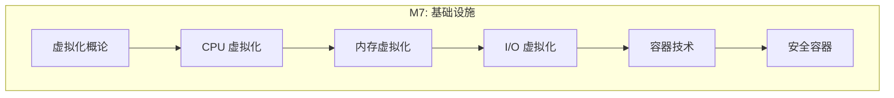

---

## 1. 虚拟化基础架构

### 1.1 Hypervisor 类型

| 类型 | 架构 | 特点 | 代表实现 |
|:---:|------|:---:|----------|
| **Type-1 (Bare-metal)** | 直接运行在硬件上 | 高性能, 高隔离 | Xen, VMware ESXi, Hyper-V |
| **Type-2 (Hosted)** | 运行在 OS 之上 | 开发方便, 效率较低 | VirtualBox, VMware Workstation |
| **KVM (Hybrid)** | 作为内核模块 | Linux 既是 OS 又是 Hypervisor | Linux KVM |

### 1.2 虚拟化的核心挑战

操作系统设计时假设独占硬件资源, 虚拟化需要解决以下问题:

| 挑战 | 问题描述 | 解决方案 |
|:---:|----------|----------|
| **特权指令** | Guest 执行 Ring 0 指令会影响宿主机 | 硬件辅助 (VT-x) 或二进制翻译 |
| **地址空间** | Guest 物理地址与真实物理地址不同 | 影子页表或 EPT |
| **设备访问** | Guest 直接访问硬件会冲突 | 设备模拟或直通 (SR-IOV) |
| **中断传递** | 物理中断需要路由到正确的 Guest | 虚拟中断控制器 (vAPIC) |

### 1.3 Popek-Goldberg 虚拟化定理

1973 年提出的形式化虚拟化理论:

*   **等价性**: 虚拟机行为与物理机等价 (除资源和时序外)
*   **资源控制**: VMM 完全控制虚拟化资源
*   **高效性**: 大部分指令直接在硬件执行

**x86 的挑战**: 某些敏感指令 (如 `POPF`) 在非特权模式下不触发陷阱, 违反了经典虚拟化条件. VT-x 通过引入新的 CPU 模式解决这一问题.

---

## 2. CPU 虚拟化: VT-x / VMX

Intel VT-x (AMD 对应 AMD-V) 引入了 **VMX (Virtual Machine Extensions)** 指令集, 从硬件层面支持虚拟化.

### 2.1 VMX 运行模式

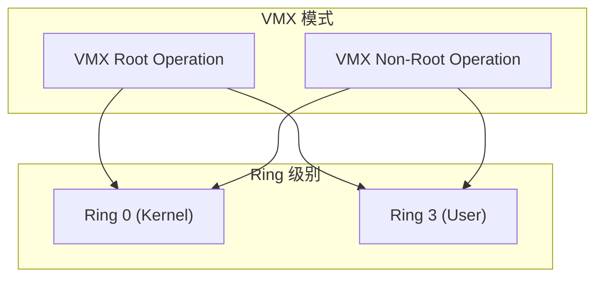

*   **VMX Root Operation**: 宿主机 (Host/KVM) 运行模式, 拥有完整特权
*   **VMX Non-Root Operation**: 客户机 (Guest) 运行模式, 特权指令触发 VM Exit

两种模式各自包含完整的 Ring 0-3, 因此 Guest 内核可以正常运行在 Guest 的 Ring 0, 而不需要修改代码.

### 2.2 VMX 生命周期

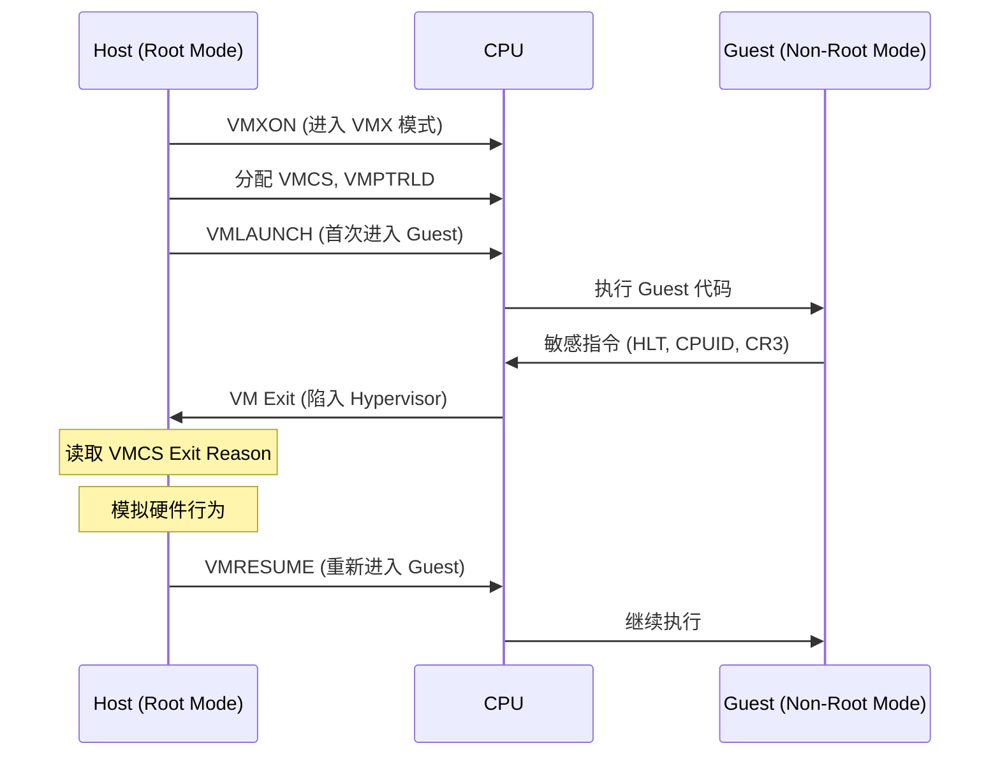

### 2.3 VMCS (Virtual Machine Control Structure)

VMCS 是每个 vCPU 的核心数据结构, 大小为 4KB, 包含六个逻辑区域:

| 区域 | 内容 | 作用 |
|:---:|------|:---:|
| **Guest-State Area** | 所有通用寄存器, 段寄存器, CR0/CR3/CR4, EFLAGS, RIP | VM Entry 时加载, VM Exit 时保存 |
| **Host-State Area** | 仅保存切换所需的最小状态 | VM Exit 时加载 |
| **VM-Execution Control** | 控制哪些事件触发 VM Exit | 如: CR 访问拦截, I/O 拦截 |
| **VM-Exit Control** | 控制 VM Exit 时的行为 | 如: 是否保存 IA32_PAT |
| **VM-Entry Control** | 控制 VM Entry 时的行为 | 如: 是否加载 IA32_EFER |
| **VM-Exit Information** | Exit 原因和附加信息 | 只读, 供 Hypervisor 分析 |

#### VMCS 关键字段

```c
// Guest 状态
VMCS_GUEST_RIP           // 指令指针
VMCS_GUEST_RSP           // 栈指针
VMCS_GUEST_CR3           // 页表基址
VMCS_GUEST_INTERRUPTIBILITY  // 中断状态

// 执行控制
VMCS_PIN_BASED_CONTROLS  // NMI, 外部中断
VMCS_CPU_BASED_CONTROLS  // I/O, MSR, CPUID
VMCS_EXCEPTION_BITMAP    // 哪些异常触发 Exit

// Exit 信息
VMCS_EXIT_REASON         // 退出原因代码
VMCS_EXIT_QUALIFICATION  // 附加信息 (如 I/O 端口号)
VMCS_GUEST_LINEAR_ADDR   // 引发 Exit 的线性地址
```

### 2.4 VM Exit 分类

| 类型 | 触发条件 | 示例 |
|:---:|----------|:---:|
| **无条件 Exit** | 某些指令总是触发 | `CPUID`, `INVD`, `VMCALL` |
| **条件 Exit** | 由 VMCS 控制位决定 | CR 访问, I/O, MSR, 中断 |
| **异常 Exit** | Exception Bitmap 中的位置 1 | #PF, #GP (按需配置) |

#### VM Exit 开销

VM Exit 是虚拟化最大的性能开销来源, 典型开销:

| 阶段 | 周期数 (估算) |
|:---:|---------------|
| 保存 Guest 状态到 VMCS | ~200-400 cycles |
| 加载 Host 状态 | ~300-500 cycles |
| TLB 刷新 (无 VPID) | ~1000+ cycles |
| Hypervisor 处理逻辑 | 变化很大 |
| 总计 | ~2000-10000 cycles |

**优化策略**:
1. 减少不必要的 Exit (调整 VMCS 控制位)
2. 启用 VPID 避免 TLB 全刷新
3. 合并多个操作减少 Exit 次数

### 2.5 嵌套虚拟化 (Nested Virtualization)

在虚拟机内运行虚拟机 (如 KVM on KVM), 需要 **VMCS Shadowing**:

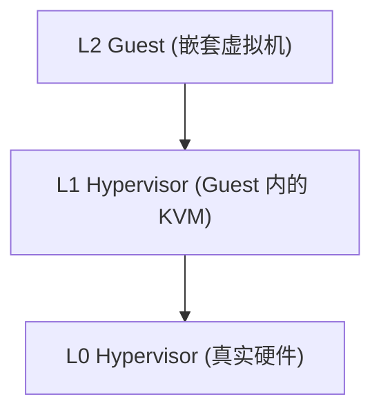

*   L1 的 VMCS 操作被 L0 拦截和模拟
*   Intel VMCS Shadowing 允许 L1 部分直接操作硬件 VMCS

### 2.6 KVM 内核源码深入分析

KVM (Kernel-based Virtual Machine) 是 Linux 内核中的 Type-1 Hypervisor 实现. 理解其核心代码路径是掌握虚拟化原理的关键.

#### 核心数据结构

```c
// arch/x86/include/asm/kvm_host.h

struct kvm {
    struct mm_struct *mm;                // 宿主机地址空间
    struct kvm_memslots __rcu *memslots[KVM_ADDRESS_SPACE_NUM];
    struct kvm_vcpu *vcpus[KVM_MAX_VCPUS]; // vCPU 数组
    atomic_t online_vcpus;
    
    struct kvm_io_bus __rcu *buses[KVM_NR_BUSES];  // I/O 总线模拟
    struct kvm_vm_stat stat;             // 统计信息
    struct kvm_arch arch;                // 架构相关 (EPT, APIC 等)
    
    refcount_t users_count;
    struct mutex lock;
    spinlock_t mmu_lock;                 // 保护 EPT/影子页表
    // ...
};

struct kvm_vcpu {
    struct kvm *kvm;                     // 所属 VM
    int vcpu_id;
    int cpu;                             // 当前运行的物理 CPU
    
    struct kvm_run *run;                 // 与用户空间共享的内存
    struct kvm_vcpu_arch arch;           // 架构状态 (寄存器, VMCS 等)
    
    struct task_struct *task;            // 对应的 QEMU 线程
    bool preempted;
    bool ready;
    
    struct kvm_dirty_ring dirty_ring;    // 脏页追踪
    // ...
};
```

#### vCPU 运行核心路径

```c
// virt/kvm/kvm_main.c
// 用户空间通过 ioctl(KVM_RUN) 触发

static long kvm_vcpu_ioctl(struct file *filp, unsigned int ioctl, ...)
{
    switch (ioctl) {
    case KVM_RUN:
        r = kvm_arch_vcpu_ioctl_run(vcpu);  // 进入架构相关代码
        break;
    // ...
    }
}

// arch/x86/kvm/x86.c
int kvm_arch_vcpu_ioctl_run(struct kvm_vcpu *vcpu)
{
    vcpu_load(vcpu);                     // 1. 加载 vCPU 上下文
    
    for (;;) {
        if (kvm_vcpu_running(vcpu)) {
            r = vcpu_run(vcpu);          // 2. 核心运行循环
        } else {
            r = vcpu_block(vcpu);        // vCPU 处于 HLT 等待
        }
        
        if (r <= 0) break;               // 需要返回用户空间
        
        if (signal_pending(current)) {   // 3. 处理信号
            r = -EINTR;
            vcpu->run->exit_reason = KVM_EXIT_INTR;
            break;
        }
    }
    
    vcpu_put(vcpu);
    return r;
}
```

#### VM Entry/Exit 核心流程

```c
// arch/x86/kvm/vmx/vmx.c
// Intel VMX 实现的核心入口

static int vmx_vcpu_run(struct kvm_vcpu *vcpu)
{
    struct vcpu_vmx *vmx = to_vmx(vcpu);
    
    // 1. 准备 VMCS
    vmx_vcpu_load_vmcs(vcpu, cpu);
    
    // 2. 同步 Guest 状态到 VMCS
    vmx_sync_dirty_debug_regs(vcpu);
    vmx_load_guest_msr(vmx);
    
    // 3. 执行 VM Entry
    vmx->exit_reason.full = __vmx_vcpu_run(vmx, ...);  // 汇编入口
    
    // 4. VM Exit 后回到这里
    vmx_vcpu_enter_exit(vcpu, vmx);
    
    // 5. 读取 Exit 原因并处理
    if (vmx->exit_reason.basic == EXIT_REASON_EXCEPTION_NMI)
        kvm_set_exception(vcpu, ...);
    
    return vmx_complete_atomic_exit(vcpu);
}

// arch/x86/kvm/vmx/vmenter.S (关键汇编)
SYM_FUNC_START(__vmx_vcpu_run)
    // 保存 Host 通用寄存器
    push    %rbp
    push    %rbx
    push    %r12-r15
    
    // 加载 Guest 通用寄存器
    mov     VCPU_RBX(%rdi), %rbx
    mov     VCPU_RCX(%rdi), %rcx
    // ... 其他寄存器
    
    // 执行 VMLAUNCH 或 VMRESUME
    vmlaunch  // 或 vmresume
    
    // --- Guest 在此执行 ---
    // VM Exit 后返回到这里
    
    // 保存 Guest 寄存器到 VMCS
    mov     %rbx, VCPU_RBX(%rdi)
    // ...
    
    // 恢复 Host 寄存器
    pop     %r15-%r12
    ret
SYM_FUNC_END(__vmx_vcpu_run)
```

#### VM Exit 处理分发

```c
// arch/x86/kvm/vmx/vmx.c

static int (*kvm_vmx_exit_handlers[])(struct kvm_vcpu *) = {
    [EXIT_REASON_EXCEPTION_NMI]     = handle_exception_nmi,
    [EXIT_REASON_EXTERNAL_INTERRUPT]= handle_external_interrupt,
    [EXIT_REASON_CPUID]             = kvm_emulate_cpuid,
    [EXIT_REASON_HLT]               = kvm_emulate_halt,
    [EXIT_REASON_IO_INSTRUCTION]    = handle_io,
    [EXIT_REASON_CR_ACCESS]         = handle_cr,
    [EXIT_REASON_MSR_READ]          = kvm_emulate_rdmsr,
    [EXIT_REASON_MSR_WRITE]         = kvm_emulate_wrmsr,
    [EXIT_REASON_EPT_VIOLATION]     = handle_ept_violation,
    [EXIT_REASON_EPT_MISCONFIG]     = handle_ept_misconfig,
    [EXIT_REASON_VMCALL]            = kvm_emulate_hypercall,
    // ... 更多处理函数
};

static int __vmx_handle_exit(struct kvm_vcpu *vcpu, fastpath_t exit_fastpath)
{
    struct vcpu_vmx *vmx = to_vmx(vcpu);
    u32 exit_reason = vmx->exit_reason.basic;
    
    // Fast path: 某些 Exit 可快速处理
    if (exit_reason < kvm_vmx_max_exit_handlers &&
        kvm_vmx_exit_handlers[exit_reason])
        return kvm_vmx_exit_handlers[exit_reason](vcpu);
    
    // Unknown exit - 返回用户空间
    vcpu->run->exit_reason = KVM_EXIT_UNKNOWN;
    return 0;
}
```

#### EPT Violation 处理

```c
// arch/x86/kvm/vmx/vmx.c

static int handle_ept_violation(struct kvm_vcpu *vcpu)
{
    gpa_t gpa = vmcs_read64(GUEST_PHYSICAL_ADDRESS);
    u64 error_code = vmcs_read64(EXIT_QUALIFICATION);
    
    // 判断违规类型
    bool is_write = error_code & EPT_VIOLATION_WRITE;
    bool is_fetch = error_code & EPT_VIOLATION_INSTR_FETCH;
    
    // 调用通用 page fault 处理
    return kvm_mmu_page_fault(vcpu, gpa, error_code, NULL, 0);
}

// arch/x86/kvm/mmu/mmu.c
int kvm_mmu_page_fault(struct kvm_vcpu *vcpu, gpa_t gpa, u64 error_code, ...)
{
    // 1. 检查是否 MMIO 区域
    if (is_mmio_fault)
        return handle_mmio_page_fault(vcpu, gpa, ...);
    
    // 2. 分配 EPT 页表并建立映射
    r = kvm_mmu_do_page_fault(vcpu, gpa, error_code, ...);
    
    // 3. 成功则重新进入 Guest
    return r;
}
```

#### KVM 性能统计

```bash
# 查看 vCPU 统计信息
cat /sys/kernel/debug/kvm/*/vcpu0/stat

# 关键指标含义
exits        # VM Exit 总次数
halt_exits   # HLT 指令触发的 Exit
io_exits     # I/O 指令触发的 Exit
mmio_exits   # MMIO 访问触发的 Exit
irq_exits    # 中断注入触发的 Exit
fpu_reload   # FPU 状态重载次数
```


---

### 2.7 多架构虚拟化支持 (Multi-Architecture Support)

虽然 KVM 的核心逻辑是通用的, 但底层硬件交互在不同架构上差异巨大.

#### 2.7.1 AMD SVM (Secure Virtual Machine)

与 Intel VMX 不同, AMD 使用 **VMCB (Virtual Machine Control Block)** 单页结构, 且指令集更精简 (`VMRUN`).

**VMCB 结构**:
```c
// arch/x86/include/asm/svm.h

struct vmcb_control_area {
    u32 intercept_cr;        // CR 读写拦截
    u32 intercept_dr;        // DR 读写拦截
    u32 intercept_exceptions;// 异常拦截
    u64 tsc_offset;          // TSC 偏移
    u8  tlb_control;         // TLB 刷新控制
    // ...
};

struct vmcb_save_area {
    struct vmcb_seg es, cs, ss, ds; // 段寄存器
    u64 rip, rsp, rax;              // 通用寄存器
    u64 cr0, cr2, cr3, cr4;         // 控制寄存器
    // ...
};

struct vmcb {
    struct vmcb_control_area control;
    struct vmcb_save_area save;
};
```

**AMD vCPU 运行循环 (`svm_vcpu_run`)**:
```c
// arch/x86/kvm/svm/svm.c

static void svm_vcpu_run(struct kvm_vcpu *vcpu)
{
    struct vcpu_svm *svm = to_svm(vcpu);
    
    // 1. 将 Guest 状态写入 VMCB
    svm->vmcb->save.rip = vcpu->arch.regs[VCPU_REGS_RIP];
    
    // 2. 汇编入口: 核心指令 clgi; vmload; vmrun; vmsave; stgi
    __svm_vcpu_run(svm->vmcb_pa, svm->host_save_user_msrs);
    
    // 3. 从 VMCB 读取 Guest 状态
    vcpu->arch.regs[VCPU_REGS_RIP] = svm->vmcb->save.rip;
    
    // 4. 处理 Exit
    handle_exit(vcpu);
}
```

#### 2.7.2 ARM64 Virtualization (EL2)

ARMv8 引入了 **Exception Levels (EL)**, 其中 **EL2** 是专门的 Hypervisor 模式. Linux KVM 在 ARM 上通常使用 **VHE (Virtualization Host Extensions)** 模式, 允许 Host 内核直接运行在 EL2.

**关键系统寄存器**:
- `HCR_EL2` (Hypervisor Configuration Register): 控制虚拟化行为, trap 配置.
- `VTTBR_EL2` (Virtualization Translation Table Base Register): 指向 Stage 2 页表 (类似 EPT).

**ARM vCPU 进入流程**:
```c
// arch/arm64/kvm/hyp/vhe/switch.c

static void __kvm_vcpu_run_vhe(struct kvm_vcpu *vcpu)
{
    struct kvm_cpu_context *host_ctxt;
    struct kvm_cpu_context *guest_ctxt;
    
    host_ctxt = &this_cpu_ptr(&kvm_host_data)->host_ctxt;
    guest_ctxt = &vcpu->arch.ctxt;
    
    // 1. 保存 Host 寄存器 (Callee-saved)
    sysreg_save_host_state_vhe(host_ctxt);
    
    // 2. 加载 Guest 寄存器 & 配置 HCR_EL2
    sysreg_restore_guest_state_vhe(guest_ctxt);
    __activate_traps(vcpu);
    
    // 3. 进入 Guest (ERET 到 EL1)
    // ARM 使用异常返回 (ERET) 指令降级到 Guest
    __guest_enter(vcpu);
    
    // --- Guest 执行 ---
    
    // 4. Guest 退出 (Trap 到 EL2)
    __guest_exit(vcpu);
    
    // 5. 恢复 Host 状态
    sysreg_save_guest_state_vhe(guest_ctxt);
    sysreg_restore_host_state_vhe(host_ctxt);
}
```

**对比 Intel VT-x**:
| 特性 | Intel VT-x | ARMv8 (VHE) |
| :--- | :--- | :--- |
| **模式** | VMX Root / Non-Root | EL2 (Host) / EL1 (Guest) |
| **切换** | VMLAUNCH / VMEXIT | ERET / Exception |
| **内存** | EPT (Extended Page Tables) | Stage 2 Translation |
| **I/O** | PIO / MMIO Trap | MMIO Trap (System Register) |


## 3. 内存虚拟化: EPT / NPT

### 3.1 地址转换层次

虚拟化引入了三级地址空间:

| 地址类型 | 缩写 | 含义 |
|----------|:---:|------|
| Guest Virtual Address | GVA | Guest 进程使用的虚拟地址 |
| Guest Physical Address | GPA | Guest 内核看到的 "物理" 地址 |
| Host Physical Address | HPA | 真正的物理内存地址 |

### 3.2 影子页表 vs EPT

| 方案 | 工作原理 | 优点 | 缺点 |
|:---:|----------|:---:|------|
| **影子页表** | Hypervisor 维护 GVA→HPA 的直接映射 | 无需硬件支持 | 每次 Guest 修改页表需同步, 开销大 |
| **EPT/NPT** | 硬件自动完成 GPA→HPA 转换 | 对 Guest 透明, 无需同步 | 页表 Walk 次数增加 |

### 3.3 EPT 页表结构

EPT 采用与普通页表相同的四级结构:

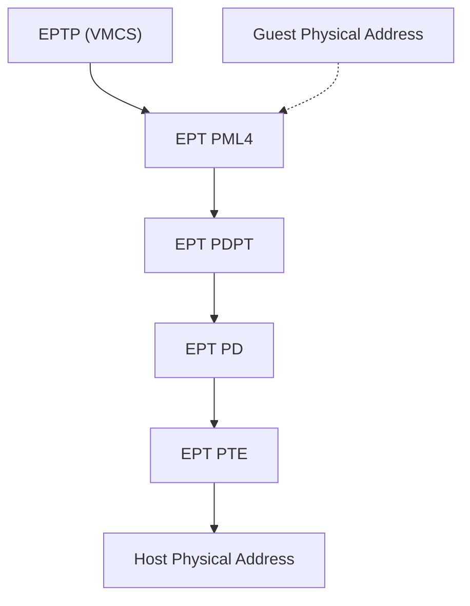

#### EPT Entry 格式(64-bit)

```
Bit 0: Read access
Bit 1: Write access  
Bit 2: Execute access (可配置 User/Supervisor)
Bit 7: Large page (2MB/1GB)
Bit 8: Accessed (硬件置位)
Bit 9: Dirty (硬件置位, 需启用)
Bits 12-51: 下一级页表物理地址 / 最终 HPA
```

### 3.4 EPT Violation vs EPT Misconfiguration

| 类型 | 触发条件 | 处理方式 |
|:---:|----------|----------|
| **EPT Violation** | 访问权限不足 | 分配内存, 更新 EPT, 注入异常 |
| **EPT Misconfiguration** | EPT Entry 配置错误 | 严重错误, 通常导致 Guest 崩溃 |

### 3.5 大页支持

EPT 支持 2MB 和 1GB 大页, 减少页表级数:

| 页大小 | EPT 级数 | TLB 条目覆盖 |
|--------|----------|--------------|
| 4KB | 4 级 | 4KB |
| 2MB | 3 级 | 2MB |
| 1GB | 2 级 | 1GB |

**注意**: Guest 内部使用大页与 EPT 使用大页是独立的. 最佳情况是两者都使用大页.

### 3.6 TLB 管理: VPID 与 PCID

| 技术 | 作用 | 配置 |
|:---:|------|:---:|
| **VPID** | 为每个 vCPU 分配 ID, 避免 VM 切换时刷新 TLB | VMCS Execution Control |
| **PCID** | 为每个进程分配 ID, 避免上下文切换刷新 TLB | CR4.PCIDE 位 |

VPID 是虚拟化性能的关键优化, 典型配置:
```
Control.VPID = 1  // 启用
VMCS.VPID = <unique_id>  // 每个 vCPU 唯一
```

---

## 4. I/O 虚拟化

### 4.1 I/O 虚拟化方案对比

| 方案 | 原理 | 性能 | 隔离性 |
|:---:|------|:---:|--------|
| **全模拟** | QEMU 软件模拟设备 | 最低 | 最高 |
| **半虚拟化 (VirtIO)** | Guest 知道自己在虚拟环境, 使用优化协议 | 较高 | 高 |
| **设备直通 (Passthrough)** | Guest 直接控制物理设备 | 接近裸机 | 设备独占 |
| **SR-IOV** | 硬件支持的虚拟功能 (VF) 直通 | 接近裸机 | 硬件隔离 |

### 4.2 VirtIO 架构

VirtIO 是 OASIS 标准化的半虚拟化协议, 已成为 Linux 虚拟化的事实标准.

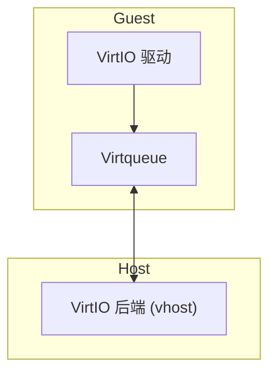

#### VirtIO 设备类型

| 设备 | 用途 | 后端 |
|:---:|------|:---:|
| virtio-net | 网络 | TAP, vhost-net, DPDK |
| virtio-blk | 块存储 | 文件, LVM, Ceph |
| virtio-scsi | SCSI 存储 | 支持多 LUN |
| virtio-fs | 文件系统共享 | virtiofsd (DAX) |
| virtio-gpu | 图形加速 | 3D 加速 |
| virtio-balloon | 内存调整 | 动态内存回收 |

### 4.3 Virtqueue 数据结构

每个 Virtqueue 由三部分组成:

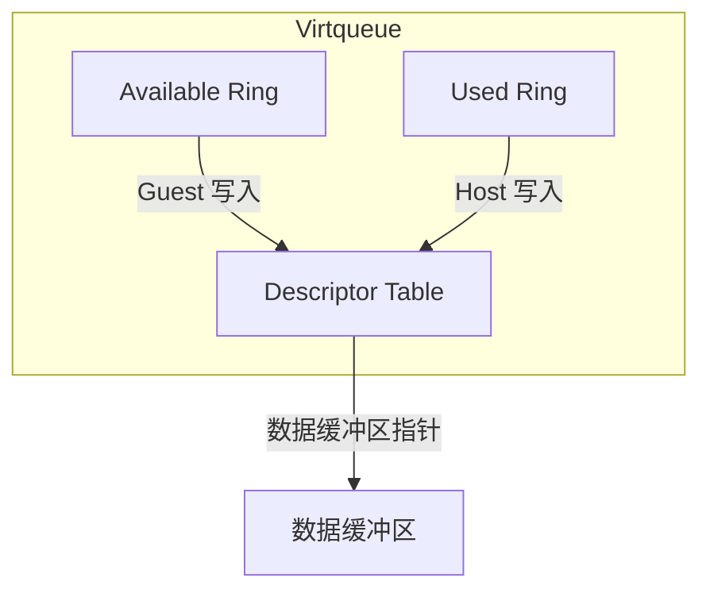

#### Descriptor Table Entry

```c
struct vring_desc {
    __le64 addr;    // 缓冲区物理地址 (GPA)
    __le32 len;     // 缓冲区长度
    __le16 flags;   // VRING_DESC_F_NEXT, _WRITE, _INDIRECT
    __le16 next;    // 链表中下一个描述符索引
};
```

#### Available Ring (Guest → Host)

```c
struct vring_avail {
    __le16 flags;           // 是否禁用通知
    __le16 idx;             // 下一个可用位置
    __le16 ring[QSIZE];     // 描述符链头索引
    __le16 used_event;      // 事件通知阈值 (可选)
};
```

#### Used Ring (Host → Guest)

```c
struct vring_used {
    __le16 flags;
    __le16 idx;
    struct vring_used_elem ring[QSIZE];
    __le16 avail_event;
};

struct vring_used_elem {
    __le32 id;     // 描述符链头索引
    __le32 len;    // 写入的字节数
};
```

### 4.4 VirtIO 通知机制

| 方向 | 机制 | 说明 |
|:---:|------|:---:|
| Guest → Host | virtio_notify() | 写 PCI BAR 或 eventfd |
| Host → Guest | 中断注入 | 通过 irqfd 或 VMCS 中断窗口 |

**vhost-net 优化**: 将 VirtIO 后端移入内核, 避免用户态/内核态切换.

### 4.5 IOMMU (VT-d / AMD-Vi)

IOMMU 允许设备 DMA 时使用虚拟地址, 实现:

1. **设备隔离**: 防止设备越界访问
2. **地址重映射**: 设备看到的地址与物理地址分离
3. **中断重映射**: 防止设备伪造中断

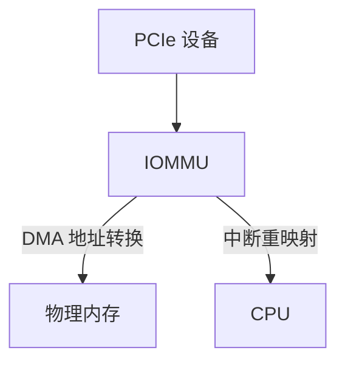

### 4.6 SR-IOV (Single Root I/O Virtualization)

SR-IOV 允许单个物理设备表现为多个虚拟设备:

| 概念 | 说明 |
|:---:|------|
| **PF (Physical Function)** | 物理设备, 拥有完整功能 |
| **VF (Virtual Function)** | 轻量级虚拟设备, 可直通给 Guest |

```bash
# 启用 VF
echo 4 > /sys/class/net/eth0/device/sriov_numvfs

# 查看 VF
lspci | grep "Virtual Function"
```

---

## 5. 容器底层机制

容器不是虚拟机, 而是操作系统提供的进程隔离机制.

### 5.1 容器 vs 虚拟机

| 特性 | 虚拟机 | 容器 |
|:---:|--------|:---:|
| 隔离级别 | 硬件级 (独立内核) | 进程级 (共享内核) |
| 启动时间 | 秒 ~ 分钟 | 毫秒 ~ 秒 |
| 资源开销 | 高 (独立 OS 实例) | 低 (共享内核) |
| 安全边界 | 强 | 较弱 (依赖内核) |

### 5.2 Linux Namespaces

Namespace 提供进程视图隔离:

| Namespace | 系统调用标志 | 隔离对象 | 引入版本 |
|-----------|--------------|----------|----------|
| **Mount** | `CLONE_NEWNS` | 挂载点 | 2.4.19 |
| **UTS** | `CLONE_NEWUTS` | 主机名, 域名 | 2.6.19 |
| **IPC** | `CLONE_NEWIPC` | IPC 对象 | 2.6.19 |
| **PID** | `CLONE_NEWPID` | 进程 ID | 2.6.24 |
| **Network** | `CLONE_NEWNET` | 网络设备, 协议栈 | 2.6.29 |
| **User** | `CLONE_NEWUSER` | UID/GID 映射 | 3.8 |
| **Cgroup** | `CLONE_NEWCGROUP` | Cgroup 根目录 | 4.6 |
| **Time** | `CLONE_NEWTIME` | 时钟 | 5.6 |

#### Namespace 操作

```c
// 创建新 namespace
int fd = clone(child_fn, stack, CLONE_NEWPID | CLONE_NEWNS, NULL);

// 加入已有 namespace
int ns_fd = open("/proc/1234/ns/pid", O_RDONLY);
setns(ns_fd, CLONE_NEWPID);

// 取消共享当前 namespace
unshare(CLONE_NEWNET);
```

### 5.3 Cgroups v2

Cgroups 提供资源限制和统计:

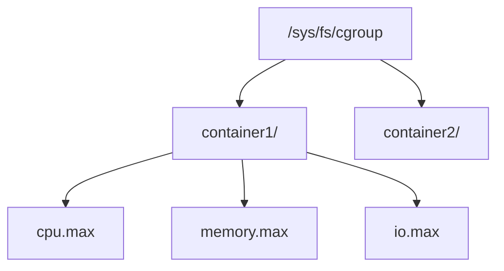

#### 核心控制器

| 控制器 | 接口文件 | 功能 |
|--------|----------|:---:|
| **cpu** | `cpu.max`, `cpu.weight` | CPU 时间配额 |
| **memory** | `memory.max`, `memory.high` | 内存限制, OOM 控制 |
| **io** | `io.max`, `io.weight` | 块 I/O 带宽 |
| **pids** | `pids.max` | 进程数限制 |
| **cpuset** | `cpuset.cpus`, `cpuset.mems` | CPU/NUMA 绑定 |

#### 配置示例

```bash
# 创建 cgroup
mkdir /sys/fs/cgroup/container1

# 限制 CPU 为 20% (20ms/100ms)
echo "20000 100000" > /sys/fs/cgroup/container1/cpu.max

# 限制内存为 512MB
echo "536870912" > /sys/fs/cgroup/container1/memory.max

# 添加进程
echo $PID > /sys/fs/cgroup/container1/cgroup.procs
```

### 5.4 OverlayFS (联合文件系统)

容器镜像使用分层存储:

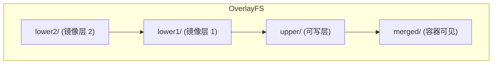

```bash
# 挂载 OverlayFS
mount -t overlay overlay \
    -o lowerdir=/images/layer1:/images/layer2,\
       upperdir=/container/upper,\
       workdir=/container/work \
    /container/merged
```

### 5.5 OCI 规范与 runc

**OCI (Open Container Initiative)** 定义了容器标准:

| 规范 | 内容 |
|:---:|------|
| **Runtime Spec** | 容器生命周期, 配置格式 |
| **Image Spec** | 镜像格式, 分发协议 |
| **Distribution Spec** | Registry API |

#### config.json 核心结构

```json
{
    "ociVersion": "1.0.0",
    "process": {
        "args": ["/bin/sh"],
        "env": ["PATH=/usr/bin"],
        "cwd": "/"
    },
    "root": {
        "path": "rootfs",
        "readonly": false
    },
    "linux": {
        "namespaces": [
            {"type": "pid"},
            {"type": "network"},
            {"type": "mount"}
        ],
        "resources": {
            "memory": {"limit": 536870912}
        }
    }
}
```

### 5.6 容器运行时架构

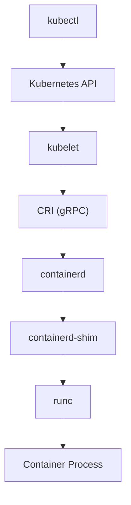

| 组件 | 职责 |
|:---:|------|
| **containerd** | 镜像管理, 容器生命周期 |
| **containerd-shim** | 托管容器进程, 允许 containerd 重启 |
| **runc** | 创建 namespace/cgroup, 执行容器进程 |

---

## 6. 安全容器

### 6.1 传统容器的安全问题

共享内核带来的风险:

| 风险 | 描述 |
|:---:|------|
| **内核漏洞** | 容器可利用内核漏洞逃逸 |
| **系统调用攻击面** | 所有 syscall 对容器可用 |
| **/proc, /sys 泄露** | 敏感信息可能暴露 |

### 6.2 Kata Containers

Kata Containers 为每个容器启动轻量级虚拟机:

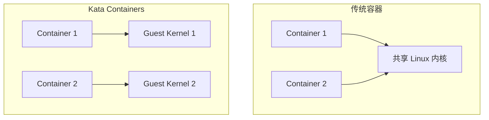

#### 关键技术

| 技术 | 作用 |
|:---:|------|
| **轻量级 VMM** | Firecracker, Cloud-Hypervisor |
| **共享文件系统** | virtio-fs + DAX (零拷贝) |
| **最小化 Guest 内核** | 裁剪内核, 快速启动 |

### 6.3 Firecracker MicroVM

Amazon 开发的专用 VMM:

| 特性 | 数值 |
|:---:|------|
| 内存开销 | ~5MB |
| 启动时间 | ~125ms |
| 代码行数 | ~50K (Rust) |
| 设备支持 | 仅 virtio-net, virtio-blk, serial |

```bash
# 创建 MicroVM
curl --unix-socket /tmp/firecracker.socket -X PUT \
    -d '{"vcpu_count": 2, "mem_size_mib": 1024}' \
    http://localhost/machine-config
```

### 6.4 gVisor (用户态内核)

Google 开发的用户态内核实现:

*   拦截容器系统调用
*   在用户态重新实现 Linux 内核功能
*   减少对宿主机内核的依赖

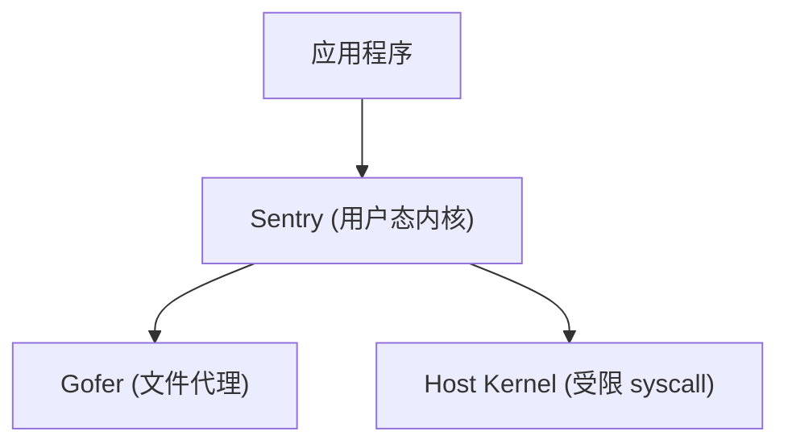

### 6.5 安全容器运行时综合对比

| 特性 | runc (标准) | Kata Containers | Firecracker | gVisor |
|:---:|-------------|-----------------|-------------|--------|
| **隔离机制** | Namespace + Cgroup | 轻量级 VM | MicroVM | 用户态内核 |
| **内核共享** | 共享宿主机内核 | 独立 Guest 内核 | 独立 Guest 内核 | Sentry (用户态) |
| **启动时间** | ~50ms | ~150-300ms | ~125ms | ~150ms |
| **内存开销** | ~5MB | ~30-50MB | ~5MB | ~20MB |
| **性能损耗** | 基准 | 5-15% | 1-5% | 10-30% |
| **Syscall 攻击面** | 全部暴露 | VM 边界隔离 | VM 边界隔离 | 受限重实现 |
| **兼容性** | 完全兼容 | 良好 | 受限设备 | 部分兼容 |
| **适用场景** | 可信工作负载 | 多租户, CI/CD | Serverless | 不可信代码 |
| **主要用户** | Docker 默认 | OpenStack Zun | AWS Lambda | Google Cloud Run Sandbox |

> **选型建议**: 
> - 追求**最强隔离**: Kata Containers
> - 追求**最快启动**: Firecracker
> - 追求**最小攻击面**: gVisor
> - 追求**最佳兼容性**: 标准 runc + Seccomp

---

### 6.6 机密计算 (Confidential Computing)

机密计算通过硬件加密保护运行时数据, 防止云提供商和宿主机管理员访问敏感信息.

#### 6.6.1 技术对比

| 技术 | 厂商 | 加密范围 | 信任边界 |
|:---:|------|----------|----------|
| **AMD SEV** | AMD | VM 内存加密 | 仅 Guest 可见明文 |
| **AMD SEV-ES** | AMD | + 寄存器状态加密 | 防止 VMM 读取 CPU 状态 |
| **AMD SEV-SNP** | AMD | + 完整性保护 | 防止恶意修改 Guest 内存 |
| **Intel TDX** | Intel | TD (Trust Domain) 隔离 | 硬件隔离的可信执行环境 |
| **Intel SGX** | Intel | 飞地 (Enclave) 内存加密 | 仅应用级保护 |

#### 6.6.2 AMD SEV-SNP 架构

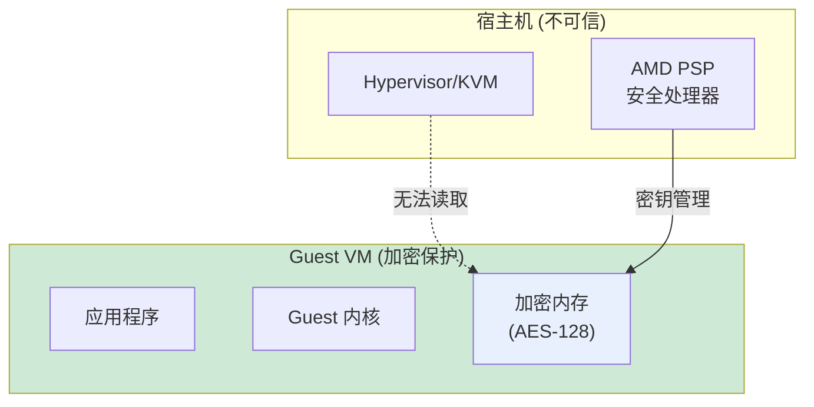

#### 6.6.3 Intel TDX 架构

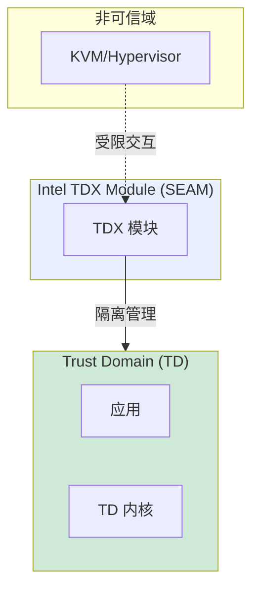

#### 6.6.4 启用配置

```bash
# AMD SEV (KVM)
# 检查 SEV 支持
dmesg | grep -i sev

# 启动 SEV 虚拟机
qemu-system-x86_64 \
    -machine q35,confidential-guest-support=sev0 \
    -object sev-guest,id=sev0,policy=0x1

# Intel TDX (需要 TDX 内核)
# 检查 TDX 支持
cat /sys/module/kvm_intel/parameters/tdx

# 启动 TDX 虚拟机
qemu-system-x86_64 \
    -machine q35,confidential-guest-support=tdx \
    -object tdx-guest,id=tdx
```

#### 6.6.5 远程证明 (Remote Attestation)

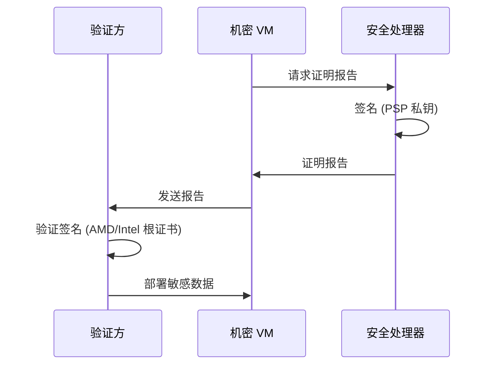

---

## 7. 高级虚拟化主题

### 7.1 vCPU 亲和性与 NUMA

```bash
# 绑定 vCPU 到物理 CPU
virsh vcpupin vm1 0 2
virsh vcpupin vm1 1 3

# 配置 NUMA 拓扑
<numatune>
    <memory mode="strict" nodeset="0"/>
</numatune>
```

### 7.2 内存气球 (Ballooning)

动态调整 Guest 内存:

1. Host 请求 Guest 释放内存
2. Guest 通过 virtio-balloon 驱动 "膨胀" 气球
3. Guest 内部分配内存给气球, 从可用内存中移除
4. Host 回收这些物理页

### 7.3 实时迁移 (Live Migration)

实时迁移允许在不中断服务的情况下将虚拟机从一台物理主机迁移到另一台.

#### 7.3.1 Pre-copy 算法 (主流)

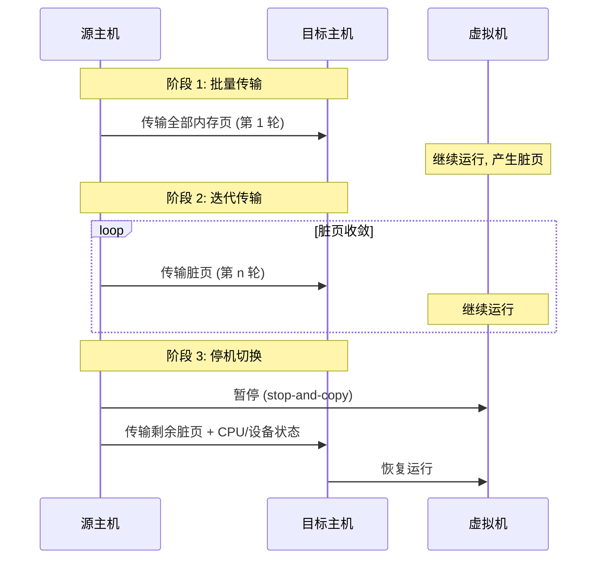

**收敛条件**:
- 脏页数量 < 阈值 (如 50 页)
- 迭代次数达到上限 (如 30 轮)
- 脏页速率降至可接受水平

#### 7.3.2 Post-copy 算法

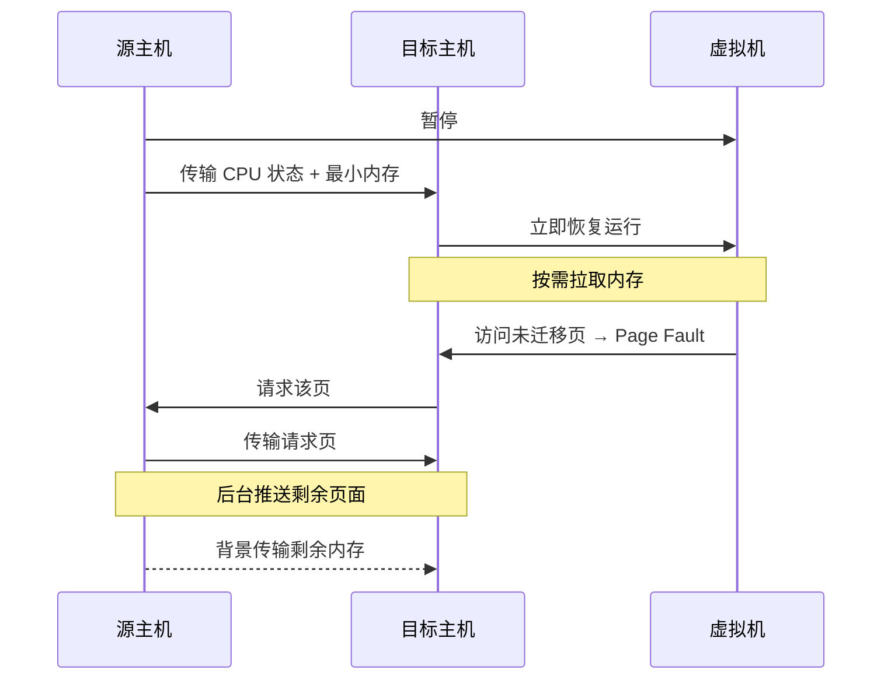

**对比**:

| 特性 | Pre-copy | Post-copy |
|:---:|----------|-----------|
| **停机时间** | 较长 (等待收敛) | 极短 (立即切换) |
| **总迁移时间** | 可能很长 (高脏页率) | 固定 (内存大小/带宽) |
| **容错性** | 高 (源端保留完整副本) | 低 (切换后依赖源端) |
| **适用场景** | 一般工作负载 | 写密集型工作负载 |

#### 7.3.3 优化技术

| 技术 | 原理 | 效果 |
|:---:|------|:---:|
| **XBZRLE** | 压缩脏页增量 (异或编码) | 减少 40-70% 传输量 |
| **Multifd** | 多线程并行传输 | 提升 3-5 倍带宽利用率 |
| **Auto-converge** | 限制 vCPU 降低脏页率 | 强制收敛 |
| **RDMA** | 绕过内核直接内存访问 | 降低延迟至 μs 级 |

```bash
# QEMU Live Migration 示例
virsh migrate --live --verbose vm1 qemu+ssh://dst-host/system

# 启用压缩
virsh migrate-setmaxdowntime vm1 100  # 最大停机 100ms
virsh migrate-setspeed vm1 1000       # 限速 1000 MiB/s

# 监控迁移进度
virsh domjobinfo vm1
```

---

## 内核源码引用

| 主题 | 源码路径 | 关键函数/结构 |
|:---:|----------|---------------|
| KVM 核心 | `virt/kvm/kvm_main.c` | `kvm_vcpu_ioctl()`, `kvm_vm_ioctl()` |
| VMX 驱动 | `arch/x86/kvm/vmx/vmx.c` | `vmx_vcpu_run()`, `vmx_handle_exit()` |
| VMCS 操作 | `arch/x86/kvm/vmx/vmcs.h` | `vmcs_read32()`, `vmcs_write32()` |
| EPT 逻辑 | `arch/x86/kvm/mmu/mmu.c` | `kvm_mmu_page_fault()`, `ept_page_fault()` |
| VirtIO 核心 | `drivers/virtio/virtio.c` | `register_virtio_driver()` |
| VirtIO Ring | `drivers/virtio/virtio_ring.c` | `vring_new_virtqueue()` |
| Namespace | `kernel/nsproxy.c` | `copy_namespaces()`, `create_new_namespaces()` |
| Cgroups v2 | `kernel/cgroup/cgroup.c` | `cgroup_attach_task()` |
| OverlayFS | `fs/overlayfs/` | `ovl_fill_super()` |

---

## 思考题

1. VM Exit 为什么昂贵? 频繁切换会导致什么性能问题?
2. EPT 相比影子页表 (Shadow Page Tables) 最大的优势是什么?
3. 为什么容器不需要像虚拟机那样加载整个内核镜像?
4. 在 VirtIO 中, 为什么 Guest 和 Host 之间需要内存屏障?
5. 如果在容器内 root 用户逃逸到宿主机, 关键原因通常出在哪里?
6. VPID 如何减少 VM 切换时的 TLB 刷新开销?
7. SR-IOV 的 VF 与 PF 在功能上有什么区别?
8. Kata Containers 如何平衡虚拟机隔离性和容器启动速度?

---

## 实验建议

1. **KVM 实验**: 使用 `kvmtool` 创建最小化虚拟机, 观察 VM Exit 原因
2. **EPT 分析**: 通过 `perf kvm stat` 分析 EPT violation 频率
3. **VirtIO 调试**: 使用 `virtio_net` 驱动源码理解 Virtqueue 工作流程
4. **容器剖析**: 使用 `unshare` 命令手动创建各类 Namespace
5. **Cgroups 限制**: 设置 CPU 配额, 使用 `stress` 工具验证限制效果
