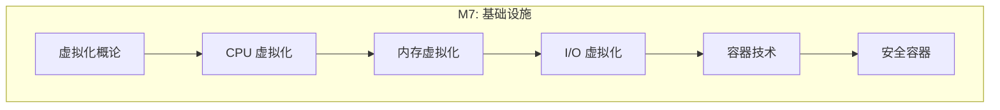
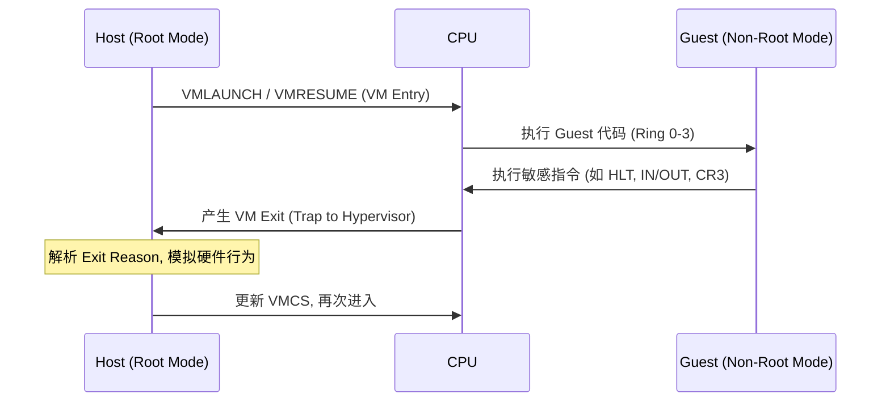
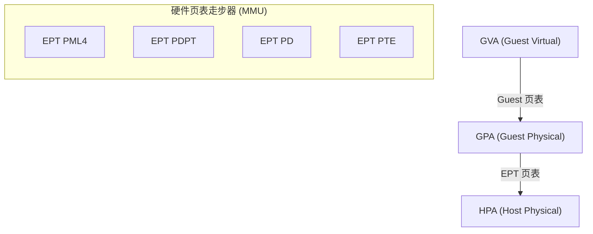

## 概述

现代操作系统不仅直接运行在硬件上，更多时候作为客户机（Guest）运行在 Hypervisor 之上，或作为宿主机（Host）管理容器。本模块深入硬件辅助虚拟化技术（VT-x/EPT）、I/O 虚拟化协议（VirtIO）以及容器底层的隔离机制。

---

## 模块知识结构



---

## 1. 虚拟化基础架构

### 1.1 Hypervisor 类型

| 类型 | 架构 | 特点 | 代表实现 |
|------|------|------|----------|
| **Type-1 (Bare-metal)** | 直接运行在硬件上 | 高性能, 高隔离 | Xen, VMware ESXi |
| **Type-2 (Hosted)** | 运行在 OS 之上 | 开发方便, 效率较低 | VirtualBox, VMware Workstation |
| **KVM (Hybrid)** | 作为内核模块 | **Linux 既是 OS 又是 Hypervisor** | Linux KVM |

---

## 2. CPU 虚拟化 (VT-x / VMX)

为了在不修改 Guest OS 源码的情况下运行 Ring 0 指令，Intel 引入了 **VMX (Virtual Machine Extensions)** 模式。

### 2.1 VMX 运行模式

- **VMX Root Operation**: 宿主机 (Host/KVM) 运行模式，拥有完整特权。
- **VMX Non-Root Operation**: 客户机 (Guest) 运行模式，特权指令触发 **VM Exit**。

### 2.2 VM Exit 与 VM Entry



**VMCS (Virtual Machine Control Structure)**: 存储 Guest/Host 寄存器状态的内存块, 是虚拟机切换的上下文核心。

---

## 3. 内存虚拟化 (EPT)

传统两级地址转换（GVA -> GPA -> HPA）效率极低。Intel **EPT (Extended Page Tables)** 实现了硬件级的嵌套页表走步。



---

## 4. I/O 虚拟化 (VirtIO)

**VirtIO** 是半虚拟化 (Para-virtualization) 的标准协议, 通过共享内存环实现极致 I/O 性能。

### 4.1 Virtqueue 机制

- **Available Ring**: Guest 放入请求。
- **Used Ring**: Host 完成请求。

### 4.2 IOMMU 与硬件直通 (SR-IOV)

通过 **IOMMU (VT-d)**，Guest 可以直接控制物理网卡或磁盘，将地址转换交给硬件，性能接近裸机。

---

## 5. 容器底层机制

容器不是虚拟机, 而是 OS 提供的进程视图隔离。

### 5.1 六大命名空间 (Namespaces)

| Namespace | 隔离对象 |
|------|----------|
| **PID** | 进程 ID, 容器内 PID 1 映射到宿主机真实 PID |
| **NET** | 网络设备, 协议栈, 端口 |
| **IPC** | 信号量, 消息队列 |
| **Mount** | 挂载点, 文件系统视图 |
| **UTS** | 主机名和域名 |
| **User** | 用户与组 ID (UID/GID) |

### 5.2 资源限制 (Cgroups v2)

Linux 通过 `/sys/fs/cgroup` 目录结构化管理资源。

```bash
# 限制容器只能跑 20% CPU
echo "20000 100000" > /sys/fs/cgroup/container1/cpu.max
```

---

## 6. 安全容器: Kata Containers

传统容器共享内核, 安全边界薄弱. **Kata Containers** 为每个容器启动一个轻量级微虚拟机 (MicroVM), 实现了:
1. **VM 级的隔离性** (独立内核).
2. **容器级的速度** (使用 DAX/VirtIO 物理页共享).

---

## 内核源码引用

| 主题 | 源码路径 | 关键函数/结构 |
|------|----------|---------------|
| KVM 核心 | `virt/kvm/kvm_main.c` | `kvm_vcpu_ioctl()` |
| VMX 驱动 | `arch/x86/kvm/vmx/vmx.c` | `vmx_vcpu_run()` |
| EPT 逻辑 | `arch/x86/kvm/mmu/mmu.c` | `ept_page_fault()` |
| VirtIO 队列 | `drivers/virtio/virtio_ring.c` | `vring_new_virtqueue()` |
| Namespace | `kernel/nsproxy.c` | `copy_namespaces()` |

---

## 思考题

1. VM Exit 为什么昂贵? 频繁切换会导致什么性能问题?
2. EPT 相比影子页表 (Shadow Page Tables) 最大的优势是什么?
3. 为什么容器不需要像虚拟机那样加载整个内核镜像?
4. 在 VirtIO 中, 为什么 Guest 和 Host 之间需要内存屏障?
5. 如果在容器内 root 用户逃逸到宿主机, 关键原因通常出在哪里?
