## 项目概述

本知识库是一次从底层硬件逻辑到高层抽象机制的"重筑工程", 旨在构建系统化, 可追溯到源码级别的操作系统知识体系.

---

## 参考教材体系

| 层次 | 教材 | 定位 |
|------|------|------|
| **理论基础** | *Operating System Concepts* (Silberschatz) | 通用原理, 算法分析 |
| **理论基础** | *Modern Operating Systems* (Tanenbaum) | 架构思辨, 微内核视角 |
| **理论基础** | *OSTEP* (Arpaci-Dusseau) | 虚拟化/并发/持久化三大主题 |
| **内核实现** | *Linux Kernel Development* (Love) | 内核子系统实战入门 |
| **内核实现** | *Understanding the Linux Kernel* (Bovet & Cesati) | 源码级深度剖析 |

---

## 知识模块总览

```mermaid
flowchart TB
    subgraph OS["操作系统知识图谱"]
        M1["M1 系统架构<br/>CPU 模式 / 启动流程 / 演化史 / 内核结构"]
        M2["M2 交互边界<br/>中断处理 / 异常嵌入 / 系统调用 / 动态追踪 / eBPF"]
        M3["M3 进程调度<br/>PCB (task_struct) / CFS / 线程模型 / Cgroups v2"]
        M4["M4 同步机制<br/>qspinlock / 屏障 / 死锁 / RCU / futex"]
        M5["M5 存储治理<br/>多级页表 / 伙伴系统 / NUMA / CXL / 分级存储"]
        M6["M6 持久化抽象<br/>VFS 对象 / ext4 Extent / io_uring / 异步 IO"]
        M7["M7 基础设施<br/>硬件虚拟化 / VT-x / VirtIO / 容器运行时"]
        
        M1 --> M2 --> M3 --> M4 --> M5 --> M6 --> M7
    end
    
    style M1 fill:#1a73e8,color:#fff
    style M2 fill:#34a853,color:#fff
    style M3 fill:#fbbc04,color:#000
    style M4 fill:#ea4335,color:#fff
    style M5 fill:#9c27b0,color:#fff
    style M6 fill:#00acc1,color:#fff
    style M7 fill:#607d8b,color:#fff
```



---

## 模块详细大纲

### M1: 处理器架构与系统自举

[进入模块详情](./M1_Architecture.mdx)

| 主题 | 知识点 | 底层深度内容 |
|------|--------|----------|
| **操作系统定义** | 资源管理器 / 扩展机器 | OSTEP 三大抽象: 虚拟化, 并发, 持久化 |
| **系统演化** | UNIX 演化树 / 分时技术 | CTSS, MULTICS 到 Linux 的架构嬗变 |
| **内核架构** | 单体 / 微内核 / 混合 / 外核 | LKM 动态加载机制与 Unikernel 趋势 |
| **CPU 保护模式** | Ring 0-3 / GDT / TSS | 特权级切换时的硬件上下文保存机制 |
| **ARM 异常级别** | EL0 / EL1 / EL2 / EL3 | TrustZone 安全架构与虚拟化扩展 |
| **系统启动流程** | BIOS / UEFI → Bootloader → Kernel | `start_kernel()` 初始化序列与模式切换机制 |
| **安全执行环境** | TEE / TrustZone / SGX | 硬件级安全隔离与受信执行环境 |

---

### M2: 交互边界与内核接口

[进入模块详情](./M2_Interrupts_Syscalls.mdx)

| 主题 | 知识点 | 底层深度内容 |
|------|--------|----------|
| **异常分类** | Interrupt / Trap / Fault / Abort | 同步 vs 异步, 异常栈切换与逻辑陷阱 |
| **中断架构** | Local APIC / I/O APIC / MSI-X | 中断亲和性 (Irq Affinity) 与硬件隔离 |
| **中断流转** | 上半部 / 下半部 (NAPI) | 中断上下文禁忌与软中断 (softirq) 调度 |
| **系统边界** | `syscall` / VDSO / vDPA | 模式切换损耗与零拷贝绕过技术 |
| **动态追踪** | Kprobes / Uprobes / eBPF | 运行时指令替换技术与无损观测 |

---

### M3: 任务调度与执行流抽象

[进入模块详情](./M3_Processes_Scheduling.mdx)

| 主题 | 知识点 | 底层深度内容 |
|------|--------|----------|
| **进程抽象** | 进程映像 / PCB | `task_struct` 核心字段与状态转换机 |
| **执行流控制** | fork / clone / vfork / exec | 写时复制 (COW) 机制与共享资源控制标志 |
| **线程模型** | LWP / 线程池 / 用户线程 | N\:1, 1\:1, M\:N 模型对比与内核线程实现 |
| **EEVDF 调度器** | 虚拟截止时间 / 延迟控制 | Linux 6.6+ 核心调度器原理与 CFS 差异 |
| **能效与异构调度** | EAS / big.LITTLE / Tickless | 移动端性能功耗平衡与全动态 Tick 机制 |
| **资源隔离** | Cgroups v2 / Namespaces | CPU 份额限制, PSI 压力指标与容器化基础 |

---

### M4: 同步互斥与死锁

[进入模块详情](./M4_Synchronization.mdx)

| 主题 | 知识点 | 底层深度内容 |
|------|--------|----------|
| **硬件原语** | TAS / CAS / LL-SC / Barrier | 内存屏障 (smp_mb) 与缓存一致性影响 |
| **自旋锁演进** | Ticket / MCS / qspinlock | 解决大规模多核下的缓存震荡问题 |
| **高级同步** | Semaphores / Mutex / futex | 睡眠唤醒机制, 内核等待队列与优先级继承 |
| **无锁并发** | RCU (Read-Copy-Update) | 读端零开销, 宽限期 (Grace Period) 与回收 |
| **死锁治理** | Coffman 条件 / Banker 算法 | lockdep 静态依赖检测与动态图分析 |

---

### M5: 存储层次抽象与内存治理

[进入模块详情](./M5_Memory_Management.mdx)

| 主题 | 知识点 | 底层深度内容 |
|------|--------|----------|
| **虚拟地址抽象** | 多级页表 / 5-level Paging | CR3 切换开销与 TLB Shootdown 机制 |
| **物理分配器** | Buddy / SLUB / Per-CPU | 缓存着色 (Cache Coloring) 与内存回收 |
| **内存压缩/交换** | zram / zswap / MGLRU | Google 多代 LRU 算法与性能收益分析 |
| **分级存储治理** | Tiered Memory / CXL / Folios | Linux Folios 抽象与跨节点内存迁移优化 |
| **内存回收与治理** | MGLRU / PSI / Userfaultfd | 压力指标监控与用户态缺页异常处理机制 |
| **内核安全机制** | KASLR / CET / KPTI | 防御侧信道攻击与控制流完整性加固 |

---

### M6: 持久化抽象与异步 I/O 架构

[进入模块详情](./M6_Filesystem_IO.mdx)

| 主题 | 知识点 | 底层深度内容 |
|------|--------|----------|
| **VFS 统一封装** | dentry cache / inode 索引 | 路径查找冲突与 RCU 路径检索优化 |
| **文件系统实现** | ext4 / XFS / DAX | Extent Tree 结构与持行内存储存绕过 |
| **高性能 I/O** | io_uring / Zero-Copy | Completion Queue 机制与内存环同步 |
| **块层演变** | Multi-queue (blk-mq) | 解决 NVMe 下的单队列锁竞争瓶颈 |
| **一致性保障** | Journaling / CoW / FSCK | 原子提交机制与崩溃恢复一致性链条 |

---

### M7: 硬件虚拟化与基础设施

[进入模块详情](./M7_Virtualization_Cloud.mdx)

| 主题 | 知识点 | 底层深度内容 |
|------|--------|----------|
| **CPU 虚拟化** | VT-x / VMX / VMCS | 根模式切换与二段式异常拦截 (VM Exit) |
| **内存虚拟化** | EPT (Extended Page Table) | 影子页表 vs 硬件辅助地址转换 |
| **I/O 虚拟化** | VirtIO / IOMMU / SR-IOV | 半虚拟化后端协议与网卡穿透直连 |
| **容器底层** | Namespace / Cgroups / Rootfs | 视图隔离,资源限制与联合文件系统 (OverlayFS) |
| **运行时架构** | containerd / Kata Container | 跨特权级隔离与安全容器 MicroVM 演进 |

---

## 学习路径建议

```
阶段 1: 基础构建 (2-3 周)
├── M1 处理器架构 - 理解 CPU 运行模式, 启动自举与 TEE
└── M2 交互边界 - 掌握中断陷阱, 动态追踪与系统接口

阶段 2: 核心机制 (4-6 周)
├── M3 任务调度 - EEVDF 调度算法, 执行流抽象与 Cgroups
├── M4 同步机制 - 并发语义, 硬件原语 RCU 与屏障
└── M5 存储治理 - 分级存储, Folios 抽象与物理分配

阶段 3: 持久化与 I/O (2-3 周)
├── M6 持久化抽象 - VFS 架构, ext4 与 io_uring 实战
└── M7 基础设施 - 硬件虚拟化, 容器底层机制与 SR-IOV

阶段 4: 实践进阶 (持续)
├── 内核源码阅读 (结合 LXR 或 Bootlin Elixir)
├── 编写内核模块与 eBPF 控制台工具
└── 性能调优 (perf, ftrace, bpftrace)
```

---

## 文档约定

| 项目 | 说明 |
|------|------|
| 语言 | 中文正文, 专业术语附英文原文 |
| 标点 | 全文使用英文标点符号 |
| 代码 | 关键函数/结构体使用 `等宽字体` |
| 引用 | 教材引用格式: *斜体书名* + 章节号 |
| 流程图 | 使用 Mermaid 绘制 |

---
