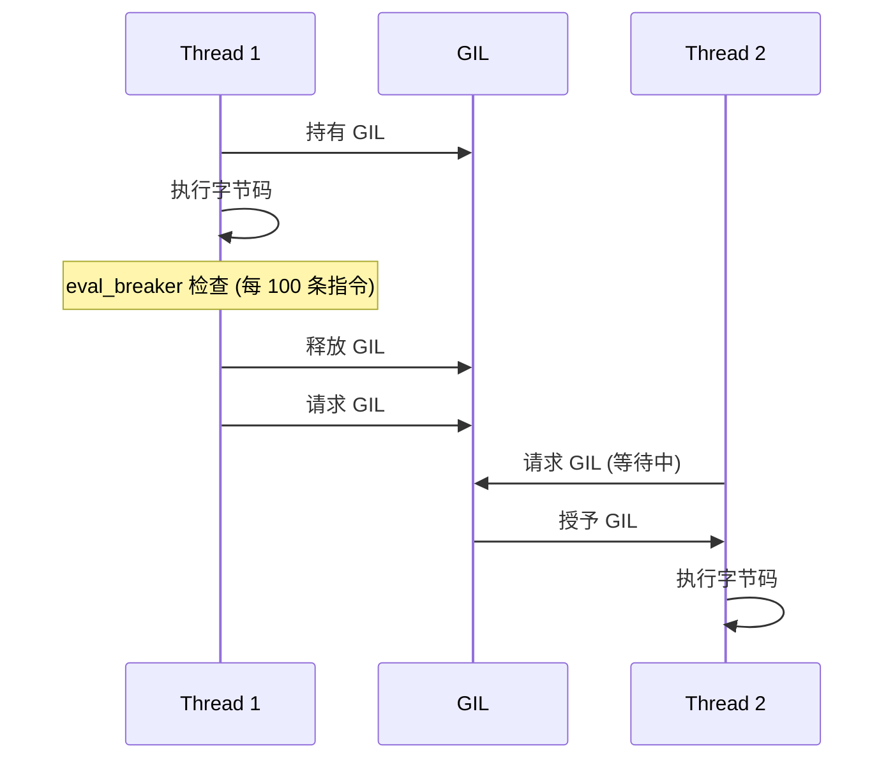
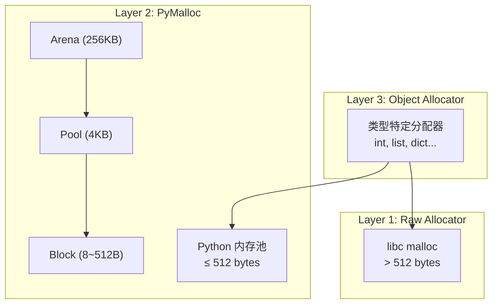

## 1. GIL (全局解释器锁)

### 1.1 什么是 GIL

GIL (Global Interpreter Lock) 是 CPython 解释器的一个**互斥锁**, 保护对 Python 对象的访问, 防止多个线程同时执行 Python 字节码.

```
线程 1 ──┐
         ├──► GIL ──► Python 解释器
线程 2 ──┘
```

**结果**: 同一时刻只有一个线程在执行 Python 代码.

### 1.2 为什么需要 GIL

CPython 使用**引用计数**管理内存:

```python
a = []      # refcount = 1
b = a       # refcount = 2
del a       # refcount = 1
del b       # refcount = 0, 对象被释放
```

如果没有 GIL, 多线程同时修改引用计数会导致:
- 竞态条件
- 内存泄漏
- 释放后访问

GIL 是最简单的解决方案, 但牺牲了多线程并行能力.

### 1.3 GIL 切换机制

GIL 不是永久持有的, 会在以下时机释放:

```python
import sys

# 查看/设置切换间隔 (默认 5ms)
print(sys.getswitchinterval())  # 0.005
sys.setswitchinterval(0.01)     # 设为 10ms
```

**切换触发条件:**

| 条件 | 描述 |
| :--- | :--- |
| **时间片到期** | 每 5ms (可配置) 检查是否释放 |
| **I/O 操作** | 文件读写, 网络请求时主动释放 |
| **C 扩展调用** | `Py_BEGIN_ALLOW_THREADS` 宏显式释放 |
| **`time.sleep()`** | 主动让出 GIL |

```python
# I/O 操作时释放 GIL
with open("file.txt") as f:
    # GIL 释放, 其他线程可以运行
    content = f.read()
```

### 1.4 GIL 释放的内部流程



*   **eval_breaker**: 解释器内部标志, 每执行约 100 条字节码检查一次.
*   **drop_gil / take_gil**: 内部 C 函数, 使用 `pthread_mutex` 实现.

### 1.5 GIL 的影响

| 任务类型 | 多线程效果 |
| :--- | :--- |
| **I/O 密集型** | 有效 (GIL 释放) |
| **CPU 密集型** | 无效 (GIL 竞争) |

### 1.6 绕过 GIL

```python
# 方案 1: multiprocessing (多进程)
from multiprocessing import Pool

def cpu_task(x):
    return x ** 2

with Pool(4) as p:
    results = p.map(cpu_task, range(1000000))

# 方案 2: C 扩展 (NumPy, Cython)
import numpy as np
result = np.dot(matrix1, matrix2)  # 在 C 中执行, 释放 GIL
```

---

## 2. 内存管理

### 2.1 内存分配器层级

CPython 使用**三层内存分配器**优化小对象分配:



### 2.2 Arena, Pool, Block 结构

| 层级 | 大小 | 描述 |
| :--- | :--- | :--- |
| **Arena** | 256KB | 从 OS 申请的内存块 |
| **Pool** | 4KB (一个页) | 存放相同大小 Block 的容器 |
| **Block** | 8~512B (16种) | 实际分配给对象的内存 |

**Block 大小类 (Size Class):**

```python
# Block 大小以 8 字节对齐
# Size Class 0:   8 bytes
# Size Class 1:  16 bytes
# Size Class 2:  24 bytes
# ...
# Size Class 63: 512 bytes

# 申请 28 字节 → 分配 32 字节 (Size Class 3)
```

### 2.3 PyObject 结构

Python 中一切皆对象, 所有对象都基于 `PyObject`:

```c
// CPython 源码
typedef struct _object {
    Py_ssize_t ob_refcnt;    // 引用计数
    PyTypeObject *ob_type;   // 类型指针
} PyObject;

// 可变大小对象
typedef struct {
    PyObject ob_base;
    Py_ssize_t ob_size;      // 元素数量
} PyVarObject;
```

**对象头大小:**

| 平台 | PyObject | PyVarObject |
| :--- | :--- | :--- |
| 64-bit | 16 bytes | 24 bytes |
| 32-bit | 8 bytes | 12 bytes |

```c
// CPython 源码
typedef struct _object {
    Py_ssize_t ob_refcnt;    // 引用计数
    PyTypeObject *ob_type;   // 类型指针
} PyObject;
```

### 2.4 引用计数

**增加引用**:
- 赋值
- 函数参数传递
- 添加到容器

**减少引用**:
- 变量离开作用域
- `del` 语句
- 从容器移除

```python
import sys

a = [1, 2, 3]
print(sys.getrefcount(a))  # 2 (a + getrefcount 参数)

b = a
print(sys.getrefcount(a))  # 3

del b
print(sys.getrefcount(a))  # 2
```

### 2.5 分代垃圾回收

引用计数无法处理**循环引用**:

```python
a = []
b = []
a.append(b)  # a -> b
b.append(a)  # b -> a

del a, b
# 引用计数仍为 1, 但对象不可达
```

**分代 GC 解决循环引用**:

| 代 | 阈值 | 包含对象 |
|----|------|----------|
| 0 | 700 | 新创建的对象 |
| 1 | 10 | 存活过一次 GC |
| 2 | 10 | 存活过两次 GC |

```python
import gc

# 查看阈值
print(gc.get_threshold())  # (700, 10, 10)

# 手动触发 GC
gc.collect()

# 禁用 GC (谨慎)
gc.disable()
```

### 2.6 内存分配器

CPython 使用**内存池**优化小对象分配:

```
+-------------------+
|    操作系统       |
+-------------------+
        ↑
+-------------------+
|  Python 内存池    | ← 小对象 (≤ 512 bytes)
|  (pymalloc)       |
+-------------------+
        ↑
+-------------------+
|  对象分配器       | ← 具体类型 (int, list, ...)
+-------------------+
```

### 2.7 对象缓存机制

CPython 对常用对象使用缓存优化:

- **小整数缓存**: -5 到 256, 详见 [Week 01 - 5.1 数值类型](./W01#51-数值类型)
- **字符串驻留 (String Interning)**: 标识符和短字符串

```python
# 字符串驻留
a = "hello"
b = "hello"
print(a is b)  # True (驻留)

a = "hello world"
b = "hello world"
print(a is b)  # False (可能不驻留)

# 手动驻留
import sys
a = sys.intern("hello world")
b = sys.intern("hello world")
print(a is b)  # True
```

---

## 3. 对象模型

### 3.1 类型即对象

Python 中类型本身也是对象:

```python
print(type(42))        # <class 'int'>
print(type(int))       # <class 'type'>
print(type(type))      # <class 'type'>

print(isinstance(int, type))    # True
print(isinstance(type, type))   # True
```

### 3.2 `__new__` vs `__init__`

```python
class MyClass:
    def __new__(cls, *args, **kwargs):
        """创建实例 (返回实例)"""
        print("__new__ called")
        instance = super().__new__(cls)
        return instance
    
    def __init__(self, value):
        """初始化实例"""
        print("__init__ called")
        self.value = value

obj = MyClass(10)
# __new__ called
# __init__ called
```

### 3.3 `__slots__` 优化

```python
class PointWithDict:
    def __init__(self, x, y):
        self.x = x
        self.y = y

class PointWithSlots:
    __slots__ = ["x", "y"]
    
    def __init__(self, x, y):
        self.x = x
        self.y = y

import sys

p1 = PointWithDict(1, 2)
p2 = PointWithSlots(1, 2)

print(sys.getsizeof(p1.__dict__))  # 64+ bytes
# p2 没有 __dict__, 更节省内存

# 不能动态添加属性
# p2.z = 3  # AttributeError
```

---

## 4. 字节码

### 4.1 编译过程

```
源代码 (.py) → 字节码 (.pyc) → 虚拟机执行
```

### 4.2 查看字节码

```python
import dis

def add(a, b):
    return a + b

dis.dis(add)
```

输出:

```
  2           0 LOAD_FAST                0 (a)
              2 LOAD_FAST                1 (b)
              4 BINARY_ADD
              6 RETURN_VALUE
```

### 4.3 常见字节码指令

| 指令 | 描述 |
|------|------|
| `LOAD_FAST` | 加载局部变量 |
| `LOAD_GLOBAL` | 加载全局变量 |
| `STORE_FAST` | 存储局部变量 |
| `BINARY_ADD` | 加法 |
| `CALL_FUNCTION` | 函数调用 |
| `RETURN_VALUE` | 返回值 |

### 4.4 代码对象

```python
def example():
    x = 1
    return x + 2

code = example.__code__

print(code.co_varnames)    # ('x',)
print(code.co_consts)      # (None, 1, 2)
print(code.co_code)        # 字节码 (bytes)
print(code.co_stacksize)   # 栈大小
```

---

## 5. 弱引用

### 5.1 什么是弱引用

弱引用不增加对象的引用计数:

```python
import weakref

class MyClass:
    pass

obj = MyClass()
weak_ref = weakref.ref(obj)

print(weak_ref())  # <__main__.MyClass object at ...>

del obj
print(weak_ref())  # None (对象已被回收)
```

### 5.2 WeakValueDictionary

```python
import weakref

class CachedItem:
    def __init__(self, value):
        self.value = value

cache = weakref.WeakValueDictionary()

def get_item(key):
    if key not in cache:
        cache[key] = CachedItem(key * 2)
    return cache[key]

item = get_item(10)
print(cache[10].value)  # 20

del item
# cache[10] 也被移除 (对象被回收)
```

### 5.3 finalize

在对象被回收时执行回调:

```python
import weakref

class Resource:
    def __init__(self, name):
        self.name = name

def cleanup(name):
    print(f"Cleaning up {name}")

r = Resource("MyResource")
weakref.finalize(r, cleanup, r.name)

del r
# Cleaning up MyResource
```

---

## 6. 性能优化

### 6.1 profile 分析

```python
import cProfile

def slow_function():
    total = 0
    for i in range(1000000):
        total += i
    return total

cProfile.run("slow_function()")
```

### 6.2 timeit 计时

```python
import timeit

# 比较列表推导式 vs 循环
list_comp = timeit.timeit("[x**2 for x in range(1000)]", number=1000)
loop = timeit.timeit("""
result = []
for x in range(1000):
    result.append(x**2)
""", number=1000)

print(f"列表推导式: {list_comp:.4f}s")
print(f"循环: {loop:.4f}s")
```

### 6.3 常见优化技巧

**1. 使用局部变量**

```python
# 慢
def slow():
    for i in range(1000000):
        len([1, 2, 3])  # 每次查找全局 len

# 快
def fast():
    local_len = len  # 局部变量
    for i in range(1000000):
        local_len([1, 2, 3])
```

**2. 使用生成器**

```python
# 占用大量内存
def squares_list(n):
    return [x**2 for x in range(n)]

# 惰性生成
def squares_gen(n):
    for x in range(n):
        yield x**2
```

**3. 使用内置函数**

```python
# 慢
total = 0
for x in numbers:
    total += x

# 快
total = sum(numbers)
```

**4. 使用 `__slots__`**

减少内存占用, 加快属性访问.

### 6.4 tracemalloc (内存追踪)

追踪内存分配, 定位内存泄漏:

```python
import tracemalloc

# 开始追踪
tracemalloc.start()

# 执行可能泄漏的代码
data = [list(range(1000)) for _ in range(1000)]

# 获取快照
snapshot = tracemalloc.take_snapshot()

# 显示 Top 10 内存分配位置
top_stats = snapshot.statistics("lineno")
for stat in top_stats[:10]:
    print(stat)

# 比较两个快照 (检测增量)
snapshot1 = tracemalloc.take_snapshot()
# ... 执行更多代码 ...
snapshot2 = tracemalloc.take_snapshot()

diff = snapshot2.compare_to(snapshot1, "lineno")
for stat in diff[:5]:
    print(stat)

# 停止追踪
tracemalloc.stop()
```

**实用示例: 内存泄漏检测装饰器**

```python
import tracemalloc
from functools import wraps

def memory_profile(func):
    @wraps(func)
    def wrapper(*args, **kwargs):
        tracemalloc.start()
        result = func(*args, **kwargs)
        current, peak = tracemalloc.get_traced_memory()
        tracemalloc.stop()
        print(f"{func.__name__}: current={current/1024:.1f}KB, peak={peak/1024:.1f}KB")
        return result
    return wrapper

@memory_profile
def process_data():
    return [x**2 for x in range(100000)]
```

---

## 7. 练习

### 7.1 内存分析

编写脚本分析某个大型数据结构的内存占用.

### 7.2 循环引用检测

创建循环引用并使用 gc 模块检测.

### 7.3 性能优化

给定一段慢代码, 使用 profiling 找出瓶颈并优化.

---

## 8. 思考题

1. GIL 是 Python 的特性还是 CPython 的特性?
2. 为什么 I/O 密集型任务多线程有效?
3. `__slots__` 有什么限制?
4. 如何检测内存泄漏?
5. 为什么小整数被缓存?

---

## 9. 本周小结

- **GIL**: 互斥锁, 保护引用计数, 限制多线程.
- **内存管理**: 引用计数 + 分代 GC.
- **对象模型**: PyObject, `__new__`, `__slots__`.
- **字节码**: dis 模块, 指令分析.
- **弱引用**: 不增加引用计数.
- **性能优化**: profile, timeit, 优化技巧.

---

> 理解 CPython 内部机制, 是写出高效 Python 代码的基础.
