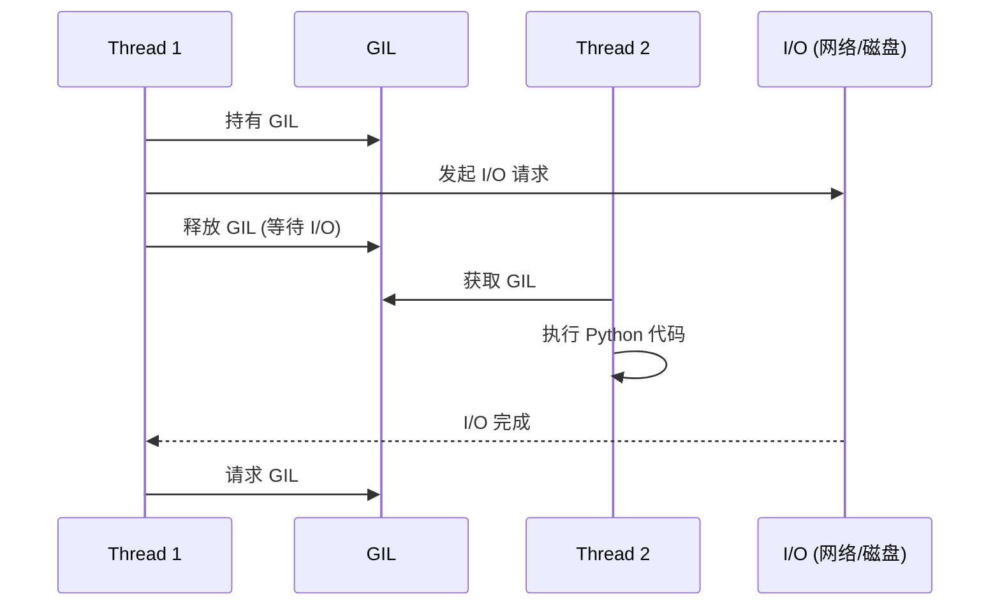

## 1. 并发 vs 并行

### 1.1 概念区分

- **并发 (Concurrency)**: 同时处理多个任务 (交替执行)
- **并行 (Parallelism)**: 同时执行多个任务 (真正同时)

```
并发 (单核):
Task A: ─────────►
Task B:     ─────────►
        时间 →

并行 (多核):
Task A: ─────────►
Task B: ─────────►
        时间 →
```

### 1.2 Python 并发方式

| 方式 | 并行 | 适用场景 | GIL 影响 |
| :--- | :--- | :--- | :--- |
| threading | 否 | I/O 密集型 | 受限 |
| multiprocessing | 是 | CPU 密集型 | 绕过 |
| asyncio | 否 | I/O 密集型 | 受限 |

### 1.3 GIL 与 I/O 密集型任务

为什么多线程对 I/O 密集型任务有效?



*   **关键**: I/O 操作时 GIL 被释放, 其他线程可以执行.
*   **典型场景**: HTTP 请求, 数据库查询, 文件读写.

---

## 2. 多线程 (threading)

### 2.1 创建线程

```python
import threading
import time

def worker(name):
    print(f"{name} started")
    time.sleep(2)
    print(f"{name} finished")

# 方法 1: Thread 对象
t = threading.Thread(target=worker, args=("Thread-1",))
t.start()
t.join()  # 等待线程结束

# 方法 2: 继承 Thread
class MyThread(threading.Thread):
    def __init__(self, name):
        super().__init__()
        self.name = name
    
    def run(self):
        print(f"{self.name} running")
```

### 2.2 多线程执行

```python
import threading

threads = []
for i in range(5):
    t = threading.Thread(target=worker, args=(f"Thread-{i}",))
    threads.append(t)
    t.start()

for t in threads:
    t.join()
```

### 2.3 线程同步 (Lock)

```python
import threading

counter = 0
lock = threading.Lock()

def increment():
    global counter
    for _ in range(100000):
        with lock:  # 获取锁
            counter += 1

threads = [threading.Thread(target=increment) for _ in range(5)]
for t in threads:
    t.start()
for t in threads:
    t.join()

print(counter)  # 500000 (正确)
```

### 2.4 线程安全队列

```python
import threading
import queue

q = queue.Queue()

def producer():
    for i in range(10):
        q.put(i)
        print(f"Produced: {i}")

def consumer():
    while True:
        item = q.get()
        if item is None:
            break
        print(f"Consumed: {item}")
        q.task_done()

t1 = threading.Thread(target=producer)
t2 = threading.Thread(target=consumer)

t1.start()
t2.start()
t1.join()
q.put(None)  # 停止信号
t2.join()
```

---

## 3. 多进程 (multiprocessing)

### 3.1 创建进程

```python
from multiprocessing import Process

def worker(name):
    print(f"{name} started")
    return f"{name} done"

p = Process(target=worker, args=("Process-1",))
p.start()
p.join()
```

### 3.2 进程池

```python
from multiprocessing import Pool

def square(x):
    return x ** 2

if __name__ == "__main__":
    with Pool(4) as pool:
        # map: 同步执行
        results = pool.map(square, range(10))
        print(results)  # [0, 1, 4, 9, 16, 25, 36, 49, 64, 81]
        
        # apply_async: 异步执行
        result = pool.apply_async(square, (10,))
        print(result.get())  # 100
```

### 3.3 进程间通信

```python
from multiprocessing import Process, Queue

def producer(q):
    for i in range(5):
        q.put(i)

def consumer(q):
    while True:
        item = q.get()
        if item is None:
            break
        print(f"Got: {item}")

if __name__ == "__main__":
    q = Queue()
    
    p1 = Process(target=producer, args=(q,))
    p2 = Process(target=consumer, args=(q,))
    
    p1.start()
    p2.start()
    p1.join()
    q.put(None)
    p2.join()
```

### 3.4 共享内存

```python
from multiprocessing import Process, Value, Array

def worker(counter, arr):
    counter.value += 1
    arr[0] = 100

if __name__ == "__main__":
    counter = Value("i", 0)  # 整数
    arr = Array("d", [1.0, 2.0, 3.0])  # 浮点数组
    
    p = Process(target=worker, args=(counter, arr))
    p.start()
    p.join()
    
    print(counter.value)  # 1
    print(arr[:])         # [100.0, 2.0, 3.0]
```

---

## 4. concurrent.futures

### 4.1 ThreadPoolExecutor

```python
from concurrent.futures import ThreadPoolExecutor
import time

def task(n):
    time.sleep(1)
    return n * n

with ThreadPoolExecutor(max_workers=4) as executor:
    # submit: 提交单个任务
    future = executor.submit(task, 5)
    print(future.result())  # 25
    
    # map: 批量任务
    results = list(executor.map(task, range(5)))
    print(results)  # [0, 1, 4, 9, 16]
```

### 4.2 ProcessPoolExecutor

```python
from concurrent.futures import ProcessPoolExecutor

def cpu_task(n):
    return sum(i * i for i in range(n))

if __name__ == "__main__":
    with ProcessPoolExecutor(max_workers=4) as executor:
        futures = [executor.submit(cpu_task, 1000000) for _ in range(4)]
        
        for future in futures:
            print(future.result())
```

### 4.3 as_completed

```python
from concurrent.futures import ThreadPoolExecutor, as_completed

def task(n):
    import time
    time.sleep(n)
    return n

with ThreadPoolExecutor() as executor:
    futures = {executor.submit(task, n): n for n in [3, 1, 2]}
    
    for future in as_completed(futures):
        n = futures[future]
        print(f"Task {n} completed with result: {future.result()}")
# 按完成顺序输出
```

---

## 5. asyncio 异步编程

### 5.1 基本概念

- **协程 (Coroutine)**: 可暂停和恢复的函数
- **事件循环 (Event Loop)**: 调度协程执行
- **await**: 暂停协程, 等待结果

### 5.2 基本语法

```python
import asyncio

async def hello():
    print("Hello")
    await asyncio.sleep(1)  # 非阻塞暂停
    print("World")

# 运行协程
asyncio.run(hello())
```

### 5.3 并发执行

```python
import asyncio

async def task(name, delay):
    print(f"{name} started")
    await asyncio.sleep(delay)
    print(f"{name} finished")
    return f"{name} result"

async def main():
    # 方法 1: gather (等待所有)
    results = await asyncio.gather(
        task("A", 2),
        task("B", 1),
        task("C", 3),
    )
    print(results)
    
    # 方法 2: create_task (立即调度)
    task1 = asyncio.create_task(task("A", 2))
    task2 = asyncio.create_task(task("B", 1))
    
    result1 = await task1
    result2 = await task2

asyncio.run(main())
```

### 5.4 asyncio.wait

```python
import asyncio

async def task(n):
    await asyncio.sleep(n)
    return n

async def main():
    tasks = [asyncio.create_task(task(n)) for n in [2, 1, 3]]
    
    # 等待第一个完成
    done, pending = await asyncio.wait(
        tasks, 
        return_when=asyncio.FIRST_COMPLETED
    )
    
    for t in done:
        print(f"Completed: {t.result()}")
    
    # 取消剩余任务
    for t in pending:
        t.cancel()

asyncio.run(main())
```

### 5.5 异步上下文管理器

```python
import asyncio

class AsyncResource:
    async def __aenter__(self):
        print("Acquiring resource")
        await asyncio.sleep(1)
        return self
    
    async def __aexit__(self, *args):
        print("Releasing resource")
        await asyncio.sleep(1)

async def main():
    async with AsyncResource() as r:
        print("Using resource")

asyncio.run(main())
```

### 5.6 异步迭代器

```python
class AsyncRange:
    def __init__(self, n):
        self.n = n
        self.i = 0
    
    def __aiter__(self):
        return self
    
    async def __anext__(self):
        if self.i >= self.n:
            raise StopAsyncIteration
        await asyncio.sleep(0.1)
        self.i += 1
        return self.i - 1

async def main():
    async for i in AsyncRange(5):
        print(i)

asyncio.run(main())
```

### 5.7 asyncio.Semaphore

限制并发数量, 防止资源耗尽:

```python
import asyncio
import aiohttp

async def fetch(session, url, semaphore):
    async with semaphore:  # 限制并发
        async with session.get(url) as response:
            return await response.text()

async def main():
    # 最多同时 10 个请求
    semaphore = asyncio.Semaphore(10)
    
    urls = [f"https://httpbin.org/get?id={i}" for i in range(100)]
    
    async with aiohttp.ClientSession() as session:
        tasks = [fetch(session, url, semaphore) for url in urls]
        results = await asyncio.gather(*tasks)

asyncio.run(main())
```

**BoundedSemaphore**: 防止释放次数超过获取次数.

```python
# 普通 Semaphore 可以超量释放
sem = asyncio.Semaphore(1)
sem.release()  # 允许 (value 变为 2)

# BoundedSemaphore 防止此类错误
bounded_sem = asyncio.BoundedSemaphore(1)
# bounded_sem.release()  # ValueError: BoundedSemaphore released too many times
```

### 5.8 asyncio.Queue

异步生产者-消费者模式:

```python
import asyncio

async def producer(queue, n):
    for i in range(n):
        await asyncio.sleep(0.1)
        await queue.put(i)
        print(f"Produced: {i}")
    await queue.put(None)  # 停止信号

async def consumer(queue):
    while True:
        item = await queue.get()
        if item is None:
            break
        print(f"Consumed: {item}")
        queue.task_done()

async def main():
    queue = asyncio.Queue(maxsize=10)  # 有界队列
    
    producer_task = asyncio.create_task(producer(queue, 20))
    consumer_task = asyncio.create_task(consumer(queue))
    
    await producer_task
    await consumer_task

asyncio.run(main())
```

**优先级队列**:

```python
import asyncio

async def main():
    pq = asyncio.PriorityQueue()
    
    await pq.put((2, "medium"))
    await pq.put((1, "high"))
    await pq.put((3, "low"))
    
    while not pq.empty():
        priority, item = await pq.get()
        print(f"{priority}: {item}")
    # 1: high
    # 2: medium
    # 3: low

asyncio.run(main())
```

### 5.9 asyncio.TaskGroup (Python 3.11+)

结构化并发, 任务失败时自动取消其他任务:

```python
import asyncio

async def fetch(url):
    await asyncio.sleep(1)
    if "error" in url:
        raise ValueError(f"Error fetching {url}")
    return f"Result from {url}"

async def main():
    async with asyncio.TaskGroup() as tg:
        task1 = tg.create_task(fetch("https://example.com"))
        task2 = tg.create_task(fetch("https://other.com"))
        task3 = tg.create_task(fetch("https://third.com"))
    
    # 所有任务完成后才执行到这里
    print(task1.result())
    print(task2.result())
    print(task3.result())

# 与 gather 的区别
# 1. TaskGroup: 任一失败则取消其他并抛出 ExceptionGroup
# 2. gather(return_exceptions=True): 收集所有结果包括异常

# 处理 ExceptionGroup
async def safe_main():
    try:
        async with asyncio.TaskGroup() as tg:
            tg.create_task(fetch("https://error.com"))
            tg.create_task(fetch("https://ok.com"))
    except* ValueError as eg:
        for exc in eg.exceptions:
            print(f"Caught: {exc}")

asyncio.run(main())
```

---

## 6. 异步 I/O 库

### 6.1 aiohttp (HTTP 客户端)

```python
import aiohttp
import asyncio

async def fetch(url):
    async with aiohttp.ClientSession() as session:
        async with session.get(url) as response:
            return await response.text()

async def main():
    urls = [
        "https://httpbin.org/get",
        "https://httpbin.org/ip",
    ]
    
    tasks = [fetch(url) for url in urls]
    results = await asyncio.gather(*tasks)
    
    for url, result in zip(urls, results):
        print(f"{url}: {len(result)} bytes")

asyncio.run(main())
```

### 6.2 aiofiles (文件 I/O)

```python
import aiofiles
import asyncio

async def read_file(path):
    async with aiofiles.open(path, "r") as f:
        return await f.read()

async def write_file(path, content):
    async with aiofiles.open(path, "w") as f:
        await f.write(content)

asyncio.run(write_file("test.txt", "Hello, async!"))
```

---

## 7. 选择并发模式

| 场景 | 推荐方式 | 原因 |
|------|----------|------|
| 大量 HTTP 请求 | asyncio + aiohttp | I/O 密集, 高并发 |
| 数值计算 | multiprocessing | 绕过 GIL |
| 少量阻塞 I/O | threading | 简单 |
| 混合任务 | 组合使用 | 按需选择 |

---

## 8. 练习

### 8.1 并发下载

使用 asyncio 并发下载多个网页.

### 8.2 CPU 密集计算

使用 multiprocessing 并行计算质数.

### 8.3 生产者消费者

实现一个多线程的生产者消费者模型.

---

## 9. 思考题

1. GIL 对多线程有什么影响?
2. 什么时候用线程, 什么时候用进程?
3. asyncio 和多线程有什么区别?
4. 如何取消正在运行的协程?
5. 进程间共享数据有什么风险?

---

## 10. 本周小结

- **threading**: 多线程, I/O 密集型.
- **multiprocessing**: 多进程, CPU 密集型.
- **concurrent.futures**: 高级接口.
- **asyncio**: 协程, 事件循环.
- **异步库**: aiohttp, aiofiles.

---

> 选择正确的并发模式是性能优化的关键. 理解 GIL 的限制, 才能做出正确选择.
