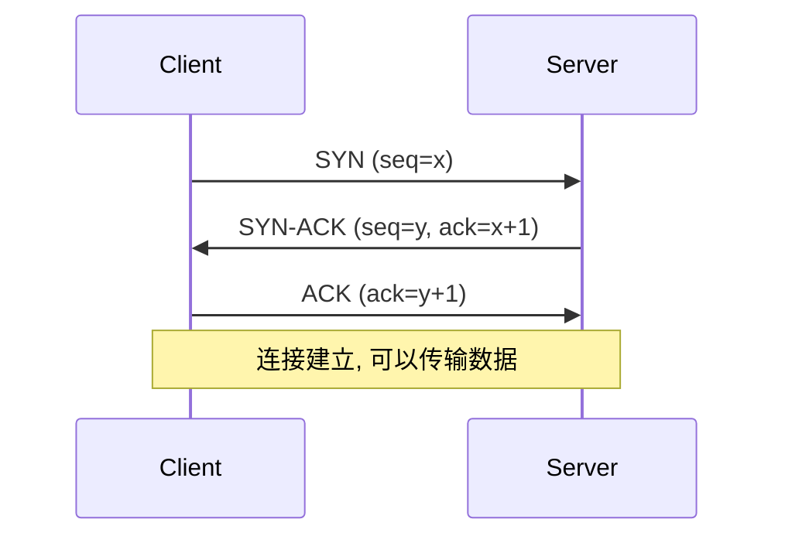
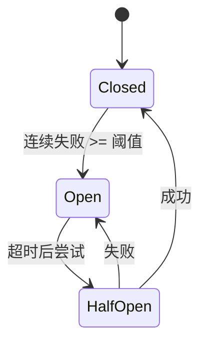

## 1. Socket 基础

### 1.1 什么是 Socket

Socket 是网络通信的端点, 提供进程间通信的接口.

```
Client                          Server
+--------+    TCP/UDP    +--------+
| Socket | <-----------> | Socket |
+--------+               +--------+
```

### 1.2 TCP 连接三次握手



*   **SYN**: 同步序列号, 发起连接.
*   **ACK**: 确认收到对方的 SYN.
*   **握手开销**: 1.5 RTT (Round-Trip Time), 这是连接池存在的原因.

### 1.3 TCP Server

```python
import socket

# 创建 TCP socket
server = socket.socket(socket.AF_INET, socket.SOCK_STREAM)
server.setsockopt(socket.SOL_SOCKET, socket.SO_REUSEADDR, 1)

# 绑定地址
server.bind(("0.0.0.0", 8080))

# 监听
server.listen(5)
print("Server listening on port 8080")

while True:
    # 接受连接
    client, addr = server.accept()
    print(f"Connection from {addr}")
    
    # 接收数据
    data = client.recv(1024)
    print(f"Received: {data.decode()}")
    
    # 发送响应
    client.send(b"Hello from server!")
    
    # 关闭连接
    client.close()
```

### 1.4 TCP Client

```python
import socket

client = socket.socket(socket.AF_INET, socket.SOCK_STREAM)
client.connect(("localhost", 8080))

# 发送数据
client.send(b"Hello from client!")

# 接收响应
response = client.recv(1024)
print(f"Received: {response.decode()}")

client.close()
```

### 1.5 UDP

```python
# UDP Server
import socket

server = socket.socket(socket.AF_INET, socket.SOCK_DGRAM)
server.bind(("0.0.0.0", 8080))

while True:
    data, addr = server.recvfrom(1024)
    print(f"Received from {addr}: {data.decode()}")
    server.sendto(b"Response", addr)
```

```python
# UDP Client
import socket

client = socket.socket(socket.AF_INET, socket.SOCK_DGRAM)
client.sendto(b"Hello", ("localhost", 8080))

response, _ = client.recvfrom(1024)
print(response.decode())
```

---

## 2. HTTP 协议

### 2.1 请求结构

```
GET /path HTTP/1.1
Host: example.com
User-Agent: Python/3.12
Accept: application/json

[请求体]
```

### 2.2 响应结构

```
HTTP/1.1 200 OK
Content-Type: application/json
Content-Length: 123

{"key": "value"}
```

### 2.3 常用状态码

| 状态码 | 含义 |
|--------|------|
| 200 | OK |
| 201 | Created |
| 204 | No Content |
| 301 | Moved Permanently |
| 302 | Found (临时重定向) |
| 400 | Bad Request |
| 401 | Unauthorized |
| 403 | Forbidden |
| 404 | Not Found |
| 500 | Internal Server Error |
| 503 | Service Unavailable |

---

## 3. requests 库

### 3.1 基本请求

```python
import requests

# GET
response = requests.get("https://httpbin.org/get")
print(response.status_code)
print(response.text)
print(response.json())

# POST
response = requests.post(
    "https://httpbin.org/post",
    json={"name": "Alice", "age": 30}
)

# 其他方法
requests.put(url, data=...)
requests.delete(url)
requests.patch(url, data=...)
```

### 3.2 请求参数

```python
# URL 参数
response = requests.get(
    "https://httpbin.org/get",
    params={"key": "value", "page": 1}
)
# URL: https://httpbin.org/get?key=value&page=1

# 请求头
response = requests.get(
    url,
    headers={
        "User-Agent": "MyApp/1.0",
        "Authorization": "Bearer token123"
    }
)

# 请求体
response = requests.post(
    url,
    data={"form_key": "value"},  # form-urlencoded
    json={"json_key": "value"},  # JSON
)
```

### 3.3 响应处理

```python
response = requests.get(url)

# 状态
response.status_code  # 200
response.ok          # True (status < 400)
response.reason      # "OK"

# 头部
response.headers["Content-Type"]

# 内容
response.text        # 文本
response.json()      # JSON
response.content     # 二进制

# 编码
response.encoding = "utf-8"
```

### 3.4 Session 会话

```python
# 复用 TCP 连接, 保持 cookies
session = requests.Session()

# 设置默认头
session.headers.update({"Authorization": "Bearer token"})

# 登录
session.post(login_url, data=credentials)

# 后续请求自动带 cookies
response = session.get(protected_url)

# 关闭
session.close()
```

### 3.5 超时与重试

```python
# 超时
response = requests.get(url, timeout=10)  # 秒
response = requests.get(url, timeout=(3, 10))  # (connect, read)

# 重试 (urllib3)
from requests.adapters import HTTPAdapter
from urllib3.util.retry import Retry

session = requests.Session()

retry = Retry(
    total=3,
    backoff_factor=0.5,
    status_forcelist=[500, 502, 503]
)

adapter = HTTPAdapter(max_retries=retry)
session.mount("https://", adapter)
session.mount("http://", adapter)
```

### 3.6 指数退避 (Exponential Backoff)

重试间隔应指数增长, 避免对故障服务造成更大压力:

```
等待时间 = base * (2 ^ retry_count) + random_jitter

重试 1: 1s + jitter
重试 2: 2s + jitter
重试 3: 4s + jitter
重试 4: 8s + jitter (通常设置上限)
```

**使用 tenacity 库:**

```python
from tenacity import retry, stop_after_attempt, wait_exponential, retry_if_exception_type
import requests

@retry(
    stop=stop_after_attempt(5),
    wait=wait_exponential(multiplier=1, min=1, max=60),
    retry=retry_if_exception_type(requests.exceptions.RequestException)
)
def fetch_with_retry(url):
    response = requests.get(url, timeout=10)
    response.raise_for_status()
    return response.json()
```

### 3.7 熔断器模式 (Circuit Breaker)

当服务持续失败时, 停止发送请求, 避免雪崩:



**使用 pybreaker 库:**

```python
import pybreaker
import requests

breaker = pybreaker.CircuitBreaker(
    fail_max=5,           # 连续失败 5 次后熔断
    reset_timeout=30,     # 30 秒后尝试恢复
)

@breaker
def call_external_api(url):
    response = requests.get(url, timeout=5)
    response.raise_for_status()
    return response.json()

try:
    result = call_external_api("https://api.example.com/data")
except pybreaker.CircuitBreakerError:
    # 熔断器打开, 服务不可用
    return fallback_response()
```

### 3.8 连接池

`requests.Session` 底层使用 `urllib3.PoolManager`:

```python
# Session 默认连接池配置
from requests.adapters import HTTPAdapter

session = requests.Session()

# 自定义连接池大小
adapter = HTTPAdapter(
    pool_connections=10,   # 连接池数量 (每个 host)
    pool_maxsize=20,       # 每个连接池最大连接数
    max_retries=3
)
session.mount("https://", adapter)
```

### 3.9 ssl 模块与证书验证

生产环境必须理解的 HTTPS 安全配置:

```python
import ssl
import requests

# 默认行为: 验证证书
response = requests.get("https://example.com")  # 自动验证

# 禁用验证 (不推荐)
response = requests.get("https://example.com", verify=False)

# 使用自定义 CA 证书
response = requests.get("https://example.com", verify="/path/to/ca-bundle.crt")

# 客户端证书认证 (mTLS)
response = requests.get(
    "https://example.com",
    cert=("/path/to/client.crt", "/path/to/client.key")
)

# 创建自定义 SSL 上下文
context = ssl.create_default_context()
context.check_hostname = True
context.verify_mode = ssl.CERT_REQUIRED
context.load_cert_chain("/path/to/cert.pem", "/path/to/key.pem")
```

### 3.10 httpx (现代 HTTP 客户端)

支持 HTTP/2 和原生 async 的现代替代品:

```python
import httpx

# 同步 API (类似 requests)
response = httpx.get("https://httpbin.org/get")
print(response.json())

# 异步 API
async def main():
    async with httpx.AsyncClient() as client:
        response = await client.get("https://httpbin.org/get")
        return response.json()

# HTTP/2 支持
client = httpx.Client(http2=True)
response = client.get("https://http2.pro/api/v1")

# 超时配置
timeout = httpx.Timeout(10.0, connect=5.0)
client = httpx.Client(timeout=timeout)

# 连接池 (AsyncClient)
async with httpx.AsyncClient(
    limits=httpx.Limits(max_keepalive_connections=5, max_connections=10)
) as client:
    responses = await asyncio.gather(*[
        client.get(f"https://httpbin.org/get?id={i}")
        for i in range(10)
    ])
```

---

## 4. REST API 设计

### 4.1 RESTful 原则

| 原则 | 描述 |
|------|------|
| **资源导向** | URL 表示资源, 动词用 HTTP 方法 |
| **无状态** | 每个请求包含所有必要信息 |
| **统一接口** | 标准 HTTP 方法 |

### 4.2 URL 设计

```
GET    /users          # 获取用户列表
GET    /users/123      # 获取用户 123
POST   /users          # 创建用户
PUT    /users/123      # 更新用户 123
PATCH  /users/123      # 部分更新
DELETE /users/123      # 删除用户
```

### 4.3 调用示例

```python
import requests

base_url = "https://api.example.com"

# 获取列表
users = requests.get(f"{base_url}/users").json()

# 获取单个
user = requests.get(f"{base_url}/users/123").json()

# 创建
new_user = requests.post(
    f"{base_url}/users",
    json={"name": "Alice", "email": "alice@example.com"}
).json()

# 更新
updated = requests.put(
    f"{base_url}/users/123",
    json={"name": "Alice Updated", "email": "alice@example.com"}
).json()

# 删除
requests.delete(f"{base_url}/users/123")
```

---

## 5. 认证

### 5.1 Basic Auth

```python
from requests.auth import HTTPBasicAuth

response = requests.get(
    url,
    auth=HTTPBasicAuth("username", "password")
)

# 或简写
response = requests.get(url, auth=("username", "password"))
```

### 5.2 Bearer Token

```python
response = requests.get(
    url,
    headers={"Authorization": "Bearer your_token_here"}
)
```

### 5.3 API Key

```python
# 在 Header
response = requests.get(
    url,
    headers={"X-API-Key": "your_api_key"}
)

# 在 URL 参数
response = requests.get(
    url,
    params={"api_key": "your_api_key"}
)
```

### 5.4 OAuth 2.0

```python
from requests_oauthlib import OAuth2Session

client_id = "your_client_id"
client_secret = "your_client_secret"
token_url = "https://provider.com/oauth/token"

# 获取 token
oauth = OAuth2Session(client_id)
token = oauth.fetch_token(
    token_url,
    client_secret=client_secret,
    authorization_response=callback_url
)

# 使用 token 请求
response = oauth.get("https://api.example.com/resource")
```

---

## 6. 错误处理

### 6.1 异常类型

```python
import requests

try:
    response = requests.get(url, timeout=10)
    response.raise_for_status()  # 状态码 >= 400 时抛出
except requests.exceptions.ConnectionError:
    print("连接失败")
except requests.exceptions.Timeout:
    print("请求超时")
except requests.exceptions.HTTPError as e:
    print(f"HTTP 错误: {e.response.status_code}")
except requests.exceptions.RequestException as e:
    print(f"请求错误: {e}")
```

### 6.2 健壮的请求函数

```python
import requests
from typing import Optional, Any

def api_request(
    method: str,
    url: str,
    **kwargs
) -> Optional[dict]:
    """健壮的 API 请求"""
    try:
        response = requests.request(
            method,
            url,
            timeout=kwargs.pop("timeout", 30),
            **kwargs
        )
        response.raise_for_status()
        return response.json()
    except requests.exceptions.RequestException as e:
        print(f"API Error: {e}")
        return None
```

---

## 7. JSON 处理

### 7.1 解析与序列化

```python
import json

# Python -> JSON
data = {"name": "Alice", "age": 30}
json_str = json.dumps(data)
json_str = json.dumps(data, indent=2, ensure_ascii=False)

# JSON -> Python
obj = json.loads(json_str)
```

### 7.2 处理日期

```python
import json
from datetime import datetime

def json_encoder(obj):
    if isinstance(obj, datetime):
        return obj.isoformat()
    raise TypeError(f"Object {obj} is not JSON serializable")

data = {"timestamp": datetime.now()}
json_str = json.dumps(data, default=json_encoder)
```

### 7.3 JSON Schema 验证

```python
from jsonschema import validate, ValidationError

schema = {
    "type": "object",
    "properties": {
        "name": {"type": "string"},
        "age": {"type": "integer", "minimum": 0}
    },
    "required": ["name"]
}

data = {"name": "Alice", "age": 30}

try:
    validate(data, schema)
except ValidationError as e:
    print(f"Validation error: {e.message}")
```

---

## 8. 练习

### 8.1 天气 API 客户端

编写一个程序, 调用天气 API 获取指定城市的天气.

### 8.2 简单 HTTP 服务器

使用 socket 实现一个简单的 HTTP 服务器.

### 8.3 API 封装

为某个公开 API (如 GitHub) 编写 Python 封装库.

---

## 9. 思考题

1. TCP 和 UDP 的区别是什么?
2. 为什么要使用 Session?
3. 如何处理 API 限流?
4. RESTful 和 RPC 有什么区别?
5. 什么时候用 GET, 什么时候用 POST?

---

## 10. 本周小结

- **Socket**: TCP/UDP 底层通信.
- **HTTP**: 请求/响应结构, 状态码.
- **requests**: GET, POST, Session, 超时.
- **REST API**: 资源导向, 统一接口.
- **认证**: Basic, Bearer, API Key, OAuth.
- **错误处理**: 异常捕获, raise_for_status.

---

> 网络编程是自动化和数据采集的基础. 掌握 requests 库, 可以轻松与任何 HTTP 服务交互.
