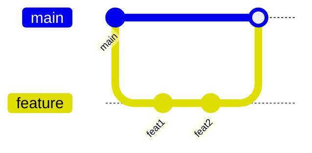
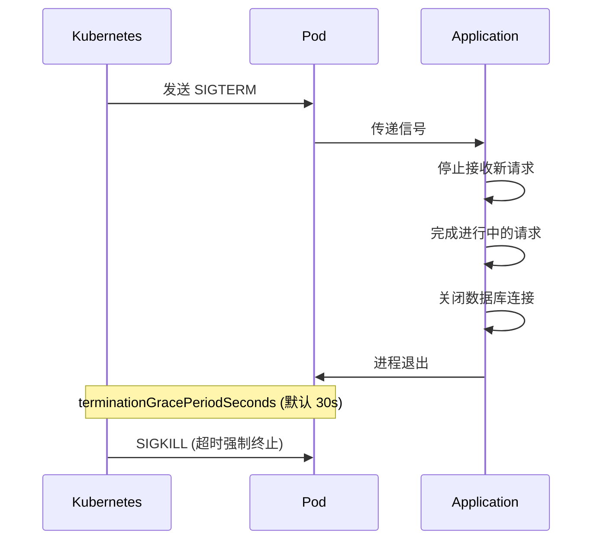

## 1. Git 工作流

### 1.1 基本操作

```bash
# 初始化
git init
git clone https://github.com/user/repo.git

# 日常操作
git add .
git commit -m "feat: add new feature"
git push origin main

# 分支
git checkout -b feature/new-feature
git merge feature/new-feature
git branch -d feature/new-feature
```

### 1.2 Commit 规范

```
<type>(<scope>): <subject>

<body>

<footer>
```

| Type | 描述 |
|------|------|
| feat | 新功能 |
| fix | Bug 修复 |
| docs | 文档 |
| style | 格式 (不影响代码) |
| refactor | 重构 |
| test | 测试 |
| chore | 构建/工具 |

### 1.3 GitHub Flow



1. 从 main 创建分支
2. 提交代码
3. 创建 Pull Request
4. Code Review
5. CI 通过后合并
6. 删除分支

---

## 2. GitHub Actions

### 2.1 基本结构

```yaml
# .github/workflows/ci.yml
name: CI

on:
  push:
    branches: [main]
  pull_request:
    branches: [main]

jobs:
  test:
    runs-on: ubuntu-latest
    
    steps:
      - uses: actions/checkout@v4
      
      - name: Set up Python
        uses: actions/setup-python@v5
        with:
          python-version: "3.12"
      
      - name: Install dependencies
        run: |
          pip install -r requirements.txt
      
      - name: Run tests
        run: pytest
```

### 2.2 矩阵测试

```yaml
jobs:
  test:
    runs-on: ubuntu-latest
    strategy:
      matrix:
        python-version: ["3.10", "3.11", "3.12"]
    
    steps:
      - uses: actions/checkout@v4
      
      - name: Set up Python ${{ matrix.python-version }}
        uses: actions/setup-python@v5
        with:
          python-version: ${{ matrix.python-version }}
```

### 2.3 缓存依赖

```yaml
- name: Cache pip
  uses: actions/cache@v4
  with:
    path: ~/.cache/pip
    key: ${{ runner.os }}-pip-${{ hashFiles('requirements.txt') }}
    restore-keys: |
      ${{ runner.os }}-pip-
```

### 2.4 发布到 PyPI

```yaml
jobs:
  publish:
    runs-on: ubuntu-latest
    if: startsWith(github.ref, 'refs/tags/')
    
    steps:
      - uses: actions/checkout@v4
      
      - name: Build
        run: python -m build
      
      - name: Publish
        uses: pypa/gh-action-pypi-publish@release/v1
        with:
          password: ${{ secrets.PYPI_API_TOKEN }}
```

---

## 3. Docker 容器化

### 3.1 Dockerfile

```dockerfile
FROM python:3.12-slim

WORKDIR /app

COPY requirements.txt .
RUN pip install --no-cache-dir -r requirements.txt

COPY . .

EXPOSE 8000

CMD ["python", "main.py"]
```

### 3.2 多阶段构建

```dockerfile
# 构建阶段
FROM python:3.12-slim as builder

WORKDIR /app
COPY requirements.txt .
RUN pip install --user -r requirements.txt

# 运行阶段
FROM python:3.12-slim

WORKDIR /app
COPY --from=builder /root/.local /root/.local
COPY . .

ENV PATH=/root/.local/bin:$PATH

CMD ["python", "main.py"]
```

### 3.3 Docker Compose

```yaml
# docker-compose.yml
version: "3.8"

services:
  app:
    build: .
    ports:
      - "8000:8000"
    environment:
      - DATABASE_URL=postgresql://db:5432/app
    depends_on:
      - db
  
  db:
    image: postgres:15
    environment:
      POSTGRES_PASSWORD: password
      POSTGRES_DB: app
    volumes:
      - db_data:/var/lib/postgresql/data

volumes:
  db_data:
```

---

## 4. 监控与可观测性

### 4.1 Prometheus 四大指标类型

| 类型 | 描述 | 典型用途 |
| :--- | :--- | :--- |
| **Counter** | 只增不减的累计值 | 请求总数, 错误总数 |
| **Gauge** | 可增可减的瞬时值 | 当前连接数, 内存使用 |
| **Histogram** | 采样分布 (桶) | 请求延迟分位数 |
| **Summary** | 客户端计算分位数 | 精确分位数 (不推荐) |

```python
from prometheus_client import Counter, Gauge, Histogram, start_http_server

# Counter: 只能增加
REQUEST_COUNT = Counter(
    "http_requests_total",
    "Total HTTP requests",
    ["method", "endpoint", "status"]
)

# Gauge: 可增可减
ACTIVE_CONNECTIONS = Gauge(
    "active_connections",
    "Current active connections"
)

# Histogram: 自动计算分位数
REQUEST_LATENCY = Histogram(
    "http_request_duration_seconds",
    "HTTP request latency",
    ["method", "endpoint"],
    buckets=[0.01, 0.05, 0.1, 0.25, 0.5, 1.0, 2.5, 5.0, 10.0]
)

# 使用
REQUEST_COUNT.labels(method="GET", endpoint="/api", status="200").inc()
ACTIVE_CONNECTIONS.inc()
ACTIVE_CONNECTIONS.dec()

with REQUEST_LATENCY.labels(method="GET", endpoint="/api").time():
    process_request()
```

### 4.2 标签 Cardinality 控制

**高 Cardinality 问题**: 标签值过多会导致指标爆炸.

| 标签值类型 | Cardinality | 建议 |
| :--- | :--- | :--- |
| HTTP Method | 低 (GET, POST...) | 安全 |
| Status Code | 低 (200, 404...) | 安全 |
| User ID | 高 (无限) | **避免** |
| Request Path | 高 (/user/123) | **参数化** |

```python
# 错误: 高 Cardinality
REQUEST_COUNT.labels(user_id=user_id)  # 每个用户一个时间序列

# 正确: 参数化路径
from urllib.parse import urlparse

def normalize_path(path):
    # /users/123 -> /users/{id}
    return re.sub(r'/\d+', '/{id}', path)

REQUEST_COUNT.labels(endpoint=normalize_path(path))
```

### 4.3 结构化日志

```python
import structlog

structlog.configure(
    processors=[
        structlog.processors.TimeStamper(fmt="iso"),
        structlog.processors.add_log_level,
        structlog.processors.StackInfoRenderer(),
        structlog.processors.JSONRenderer(),
    ]
)

logger = structlog.get_logger()

# 带上下文的日志
logger.info("user_login", user_id=123, ip="192.168.1.1")
# {"event": "user_login", "user_id": 123, "ip": "192.168.1.1", "level": "info", "timestamp": "..."}

# 绑定上下文
log = logger.bind(request_id="abc-123")
log.info("processing")  # 自动包含 request_id
```

### 4.4 Sentry 错误追踪

```python
import sentry_sdk

sentry_sdk.init(
    dsn="https://xxx@sentry.io/123",
    traces_sample_rate=0.1,  # 采样 10% 的事务
    environment="production",
)

# 自动捕获未处理异常
# 手动捕获
try:
    risky_operation()
except Exception as e:
    sentry_sdk.capture_exception(e)

# 添加上下文
with sentry_sdk.configure_scope() as scope:
    scope.set_user({"id": user_id, "email": email})
    scope.set_tag("feature", "checkout")
```

### 4.5 健康检查

```python
from flask import Flask, jsonify

app = Flask(__name__)

@app.route("/healthz")
def health_check():
    """Kubernetes 就绪探针"""
    checks = {
        "database": check_database(),
        "cache": check_cache(),
    }
    
    all_healthy = all(checks.values())
    status = 200 if all_healthy else 503
    
    return jsonify({"status": "healthy" if all_healthy else "unhealthy", "checks": checks}), status

@app.route("/livez")
def liveness_check():
    """Kubernetes 存活探针"""
    return jsonify({"status": "alive"})
```

---

## 5. 优雅关闭

### 5.1 信号处理

```python
import signal
import sys
import threading

class GracefulShutdown:
    def __init__(self):
        self.shutdown = threading.Event()
        signal.signal(signal.SIGTERM, self.handle_signal)
        signal.signal(signal.SIGINT, self.handle_signal)
    
    def handle_signal(self, signum, frame):
        print(f"Received signal {signum}, shutting down...")
        self.shutdown.set()

shutdown_handler = GracefulShutdown()

while not shutdown_handler.shutdown.is_set():
    # 处理任务
    process_task()

# 清理资源
cleanup()
print("Shutdown complete")
```

### 5.2 Kubernetes 优雅关闭



**关键配置:**

```yaml
# Kubernetes Pod spec
spec:
  terminationGracePeriodSeconds: 60
  containers:
  - name: app
    lifecycle:
      preStop:
        exec:
          command: ["/bin/sh", "-c", "sleep 5"]  # 等待负载均衡器更新
```

### 5.3 HTTP Server 优雅关闭

```python
from http.server import HTTPServer
import threading

server = HTTPServer(("", 8000), MyHandler)
server_thread = threading.Thread(target=server.serve_forever)
server_thread.start()

# 优雅关闭
shutdown_handler.shutdown.wait()
server.shutdown()  # 等待正在处理的请求完成
server_thread.join()

---

## 6. Python SRE 工具生态

### 6.1 Ansible

```yaml
# playbook.yml
- hosts: webservers
  tasks:
    - name: Install nginx
      apt:
        name: nginx
        state: present
    
    - name: Start nginx
      service:
        name: nginx
        state: started
```

```python
# 使用 Python API
import ansible_runner

r = ansible_runner.run(playbook="playbook.yml")
print(r.status)
```

### 6.2 Fabric

```python
from fabric import task, Connection

@task
def deploy(c, branch="main"):
    with c.cd("/var/www/app"):
        c.run(f"git pull origin {branch}")
        c.run("pip install -r requirements.txt")
        c.run("systemctl restart app")
```

### 6.3 常用 SRE 库

| 库 | 用途 |
|---|------|
| Paramiko | SSH 连接 |
| Fabric | 远程执行 |
| Ansible | 配置管理 |
| psutil | 系统监控 |
| prometheus_client | 指标暴露 |
| structlog | 结构化日志 |
| sentry-sdk | 错误追踪 |
| tenacity | 重试逻辑 |

### 6.4 systemd 服务管理

Linux 服务部署标准方式, 与 Docker 互补:

**服务单元文件:**

```ini
# /etc/systemd/system/myapp.service
[Unit]
Description=My Python Application
After=network.target

[Service]
Type=simple
User=appuser
Group=appuser
WorkingDirectory=/opt/myapp
Environment=PYTHONUNBUFFERED=1
ExecStart=/opt/myapp/venv/bin/python app.py
ExecReload=/bin/kill -HUP $MAINPID
Restart=always
RestartSec=5

# 资源限制
MemoryMax=512M
CPUQuota=50%

# 安全加固
NoNewPrivileges=true
PrivateTmp=true
ProtectSystem=strict
ReadWritePaths=/opt/myapp/data

[Install]
WantedBy=multi-user.target
```

**常用命令:**

```bash
# 服务管理
systemctl start myapp
systemctl stop myapp
systemctl restart myapp
systemctl reload myapp

# 状态查看
systemctl status myapp
journalctl -u myapp -f  # 实时日志
journalctl -u myapp --since "1 hour ago"

# 开机启动
systemctl enable myapp
systemctl disable myapp
```

### 6.5 OpenTelemetry 分布式追踪

可观测性三支柱 (Traces, Metrics, Logs) 统一框架:

```python
from opentelemetry import trace
from opentelemetry.sdk.trace import TracerProvider
from opentelemetry.sdk.trace.export import BatchSpanProcessor
from opentelemetry.exporter.otlp.proto.grpc.trace_exporter import OTLPSpanExporter
from opentelemetry.instrumentation.requests import RequestsInstrumentor

# 初始化
provider = TracerProvider()
processor = BatchSpanProcessor(OTLPSpanExporter(endpoint="http://jaeger:4317"))
provider.add_span_processor(processor)
trace.set_tracer_provider(provider)

# 自动注入
RequestsInstrumentor().instrument()

# 手动追踪
tracer = trace.get_tracer(__name__)

def process_order(order_id):
    with tracer.start_as_current_span("process_order") as span:
        span.set_attribute("order.id", order_id)
        
        with tracer.start_as_current_span("validate"):
            validate_order(order_id)
        
        with tracer.start_as_current_span("charge"):
            charge_payment(order_id)
        
        span.add_event("order_completed")
```

**自动注入支持:**

| 库 | 安装包 |
| :--- | :--- |
| requests | `opentelemetry-instrumentation-requests` |
| Flask | `opentelemetry-instrumentation-flask` |
| FastAPI | `opentelemetry-instrumentation-fastapi` |
| SQLAlchemy | `opentelemetry-instrumentation-sqlalchemy` |
| Redis | `opentelemetry-instrumentation-redis` |

---

## 7. 实战项目: 系统健康检查工具

### 7.1 需求

- 检查多台服务器的健康状态
- 支持 HTTP、TCP、ICMP 检查
- 输出 Prometheus 格式指标
- CLI 工具支持

### 7.2 项目结构

```
health_checker/
├── health_checker/
│   ├── __init__.py
│   ├── checks.py
│   ├── metrics.py
│   └── cli.py
├── tests/
│   └── test_checks.py
├── pyproject.toml
├── Dockerfile
└── .github/workflows/ci.yml
```

### 7.3 核心代码

```python
# health_checker/checks.py
import socket
import requests
from dataclasses import dataclass

@dataclass
class CheckResult:
    name: str
    healthy: bool
    latency_ms: float
    error: str | None = None

def http_check(url: str, timeout: float = 5.0) -> CheckResult:
    try:
        response = requests.get(url, timeout=timeout)
        return CheckResult(
            name=f"http:{url}",
            healthy=response.ok,
            latency_ms=response.elapsed.total_seconds() * 1000
        )
    except Exception as e:
        return CheckResult(name=f"http:{url}", healthy=False, latency_ms=0, error=str(e))

def tcp_check(host: str, port: int, timeout: float = 5.0) -> CheckResult:
    try:
        sock = socket.socket(socket.AF_INET, socket.SOCK_STREAM)
        sock.settimeout(timeout)
        start = time.time()
        sock.connect((host, port))
        latency = (time.time() - start) * 1000
        sock.close()
        return CheckResult(name=f"tcp:{host}:{port}", healthy=True, latency_ms=latency)
    except Exception as e:
        return CheckResult(name=f"tcp:{host}:{port}", healthy=False, latency_ms=0, error=str(e))
```

```python
# health_checker/cli.py
import typer
from .checks import http_check, tcp_check

app = typer.Typer()

@app.command()
def check(
    urls: list[str] = typer.Option([], "--url", "-u"),
    tcp_targets: list[str] = typer.Option([], "--tcp", "-t"),
):
    """运行健康检查"""
    for url in urls:
        result = http_check(url)
        status = "✓" if result.healthy else "✗"
        typer.echo(f"{status} {result.name}: {result.latency_ms:.2f}ms")
    
    for target in tcp_targets:
        host, port = target.split(":")
        result = tcp_check(host, int(port))
        status = "✓" if result.healthy else "✗"
        typer.echo(f"{status} {result.name}: {result.latency_ms:.2f}ms")

if __name__ == "__main__":
    app()
```

---

## 8. 练习

### 8.1 完善健康检查工具

添加 ICMP 检查和配置文件支持.

### 8.2 CI/CD 管道

为项目配置完整的 GitHub Actions 工作流.

### 8.3 Docker 部署

将项目容器化并发布到 Docker Hub.

---

## 9. 思考题

1. GitHub Flow 和 Git Flow 有什么区别?
2. 多阶段构建有什么优势?
3. 如何设计有效的健康检查?
4. 结构化日志和文本日志有什么区别?
5. 优雅关闭为什么重要?

---

## 10. 本周小结

- **Git**: Commit 规范, GitHub Flow.
- **GitHub Actions**: CI/CD 自动化.
- **Docker**: 容器化, 多阶段构建, Compose.
- **监控**: Prometheus 指标, 结构化日志.
- **可靠性**: 健康检查, 优雅关闭.
- **SRE 工具**: Ansible, Fabric, 生态库.

---

## 课程总结

通过 12 周的学习, 你已经掌握了:

1. **Python 基础**: 类型系统, 控制流, 函数, OOP
2. **核心机制**: GIL, 内存管理, 异常处理
3. **系统编程**: 文件 I/O, 并发, 网络
4. **自动化**: 正则, SSH, CLI 工具
5. **工程实践**: 测试, 类型提示, 代码质量
6. **SRE 技能**: Git, CI/CD, Docker, 监控

---

> 学习编程是一场持续的旅程. 这 12 周只是开始, 真正的成长来自于实践和解决真实问题.
