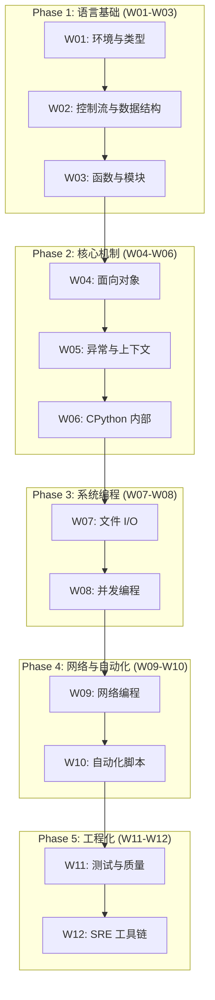

本学习计划面向没有任何 Python 经验的初学者, 通过 12 周的系统学习, 从语言基础逐步深入到 CPython 内部机制, 最终掌握 Git, CI/CD, 容器化和监控等 SRE 核心技能.

---

## 学习路径概览



---

## Phase 1: 语言基础 (Week 1-3)

### Week 01: Python 简介与开发环境

- Python 设计哲学与应用场景
- CPython vs PyPy vs MicroPython
- pyenv, venv, pip 环境管理
- 变量与动态类型系统
- 基本数据类型 (int, float, str, bool, None)
- 运算符与输入输出

### Week 02: 控制流与数据结构

- 条件语句 (if/elif/else, match)
- 循环 (for/while, break/continue/else)
- 列表、元组、字典、集合
- 列表推导式与生成器表达式
- 迭代器协议

### Week 03: 函数与模块系统

- 函数定义与参数 (*args, **kwargs)
- 作用域 (LEGB 规则)
- 闭包与装饰器
- 模块与包
- import 机制深度解析

---

## Phase 2: 核心机制 (Week 4-6)

### Week 04: 面向对象编程

- 类与实例, self 机制
- 继承与多态
- MRO (C3 线性化)
- 特殊方法 (__str__, __eq__, __getitem__)
- @property 与描述符
- dataclass

### Week 05: 异常处理与上下文管理

- try/except/else/finally
- 异常层次结构
- 自定义异常
- 上下文管理器 (__enter__, __exit__)
- contextlib 模块

### Week 06: CPython 内部机制

- GIL (全局解释器锁) 原理
- 内存管理 (引用计数, 分代 GC)
- 对象模型 (PyObject)
- 字节码与 dis 模块
- __slots__ 优化
- 弱引用

---

## Phase 3: 系统编程 (Week 7-8)

### Week 07: 文件 I/O 与系统交互

- 文件读写 (文本/二进制)
- pathlib 模块
- subprocess 进程调用
- argparse 命令行参数
- logging 日志系统
- 配置文件 (JSON, YAML, TOML)

### Week 08: 并发编程

- threading vs multiprocessing
- GIL 对多线程的影响
- concurrent.futures
- asyncio 异步编程
- async/await 语法
- aiohttp, aiofiles

---

## Phase 4: 网络与自动化 (Week 9-10)

### Week 09: 网络编程

- socket 基础 (TCP/UDP)
- HTTP 协议
- requests 库
- REST API 调用与设计
- 认证 (Basic, Bearer, OAuth)
- 错误处理与重试

### Week 10: 自动化与脚本开发

- 正则表达式 (re 模块)
- 文本处理与 CSV
- Paramiko (SSH 自动化)
- Fabric 远程执行
- 定时任务 (schedule, APScheduler)
- CLI 工具开发 (click, typer)

---

## Phase 5: 工程化与 SRE (Week 11-12)

### Week 11: 测试与代码质量

- pytest 框架与 fixtures
- Mock 与 patch
- 覆盖率分析 (pytest-cov)
- 类型提示与 mypy
- 代码风格 (black, ruff, isort)
- pre-commit hooks

### Week 12: Git, CI/CD 与 SRE 工具链

- Git 工作流 (GitHub Flow)
- GitHub Actions 配置
- Docker 容器化
- Prometheus 监控指标
- 结构化日志 (structlog)
- 健康检查与优雅关闭
- Python SRE 生态 (Ansible, Fabric)
- 实战项目: 系统健康检查工具

---

## 学习资源

| 资源 | 类型 | 阶段 |
|------|------|------|
| [Python 官方文档](https://docs.python.org/3/) | 文档 | 全阶段 |
| [Real Python](https://realpython.com/) | 教程 | 入门-进阶 |
| [Fluent Python](https://www.oreilly.com/library/view/fluent-python-2nd/9781492056348/) | 书籍 | 进阶 |
| [pytest 文档](https://docs.pytest.org/) | 文档 | 测试 |
| [GitHub Actions 文档](https://docs.github.com/en/actions) | 文档 | CI/CD |

---

## Python 版本特性演进

学习时需注意各版本特性的引入时间.

| 版本 | 发布 | 关键特性 |
| :--- | :--- | :--- |
| 3.8 | 2019.10 | 海象运算符 `:=`, 仅位置参数 `/`, f-string `=` 调试 |
| 3.9 | 2020.10 | 字典合并 `\|`, 内置泛型 `list[str]` |
| 3.10 | 2021.10 | `match` 语句, 更好的错误信息 |
| 3.11 | 2022.10 | 性能提升 25%, `ExceptionGroup`, `TaskGroup`, `tomllib` |
| 3.12 | 2023.10 | f-string 增强, `type` 语句, 泛型简化 |
| 3.13 | 2024.10 | 实验性 GIL-free 模式, JIT 编译器 |
| 3.14 | 2025.10 | 模板字符串 `t"..."`, 注解作用域变化 |

### Python 3.8

**海象运算符 `:=`**

```python
# 在表达式中赋值
while (line := input()) != "quit":
    print(line)

# 列表推导式中避免重复计算
results = [y for x in data if (y := expensive(x)) > threshold]
```

**仅位置参数 `/`**

```python
def greet(name, /, greeting="Hello"):
    return f"{greeting}, {name}!"

greet("Alice")  # OK
# greet(name="Alice")  # TypeError
```

**f-string `=` 调试**

```python
x = 42
print(f"{x=}")  # x=42
```

### Python 3.9

**字典合并 `|`**

```python
d1 = {"a": 1}
d2 = {"b": 2}
d3 = d1 | d2  # {'a': 1, 'b': 2}
d1 |= d2      # 就地更新
```

**内置泛型**

```python
def process(items: list[str]) -> dict[str, int]:
    pass
```

### Python 3.10

**match 语句**

```python
def http_status(status):
    match status:
        case 200: return "OK"
        case 404: return "Not Found"
        case 500 | 502: return "Server Error"
        case _: return "Unknown"
```

### Python 3.11

**性能提升 25%**, 主要改进: Specializing Adaptive Interpreter, 更快启动, 异常处理零开销.

**ExceptionGroup**

```python
raise ExceptionGroup("errors", [ValueError(), TypeError()])

try:
    ...
except* ValueError as eg:
    print(eg.exceptions)
```

**asyncio.TaskGroup**

```python
async with asyncio.TaskGroup() as tg:
    tg.create_task(coro1())
    tg.create_task(coro2())
```

**tomllib** (内置 TOML 解析)

```python
import tomllib
with open("config.toml", "rb") as f:
    config = tomllib.load(f)
```

### Python 3.12

**`type` 语句**

```python
type UserId = int
type Point = tuple[float, float]
```

**泛型简化**

```python
class Stack[T]:
    def push(self, item: T) -> None: ...

def first[T](items: list[T]) -> T:
    return items[0]
```

### Python 3.13

**实验性 GIL-free 模式**

```bash
python3.13t  # free-threaded 构建
```

```python
import sys
print(sys._is_gil_enabled())  # False (如禁用)
```

**JIT 编译器** (实验性, `--enable-experimental-jit`)

### Python 3.14

**模板字符串 (t-string)**

```python
name = "Alice"
template = t"Hello, {name}!"  # Template 对象

# 用于防注入、国际化、自定义格式化
```

**注解作用域变化**

```python
class Node:
    def __init__(self, child: Node | None = None):  # 无需引号
        self.child = child
```

### 版本选择建议

| 场景 | 推荐版本 |
| :--- | :--- |
| 新项目 | 3.12+ |
| 生产环境 | 3.11 或 3.12 |
| 需要 GIL-free | 3.13+ (实验性) |

### 版本兼容性检查

```python
import sys
if sys.version_info < (3, 10):
    raise RuntimeError("Python 3.10+ required")

# 条件使用新特性
if sys.version_info >= (3, 11):
    import tomllib
else:
    import tomli as tomllib
```

---

> Python 的设计哲学是"优雅、明确、简单". 从第一行代码开始, 就要养成 Pythonic 的编码习惯.
