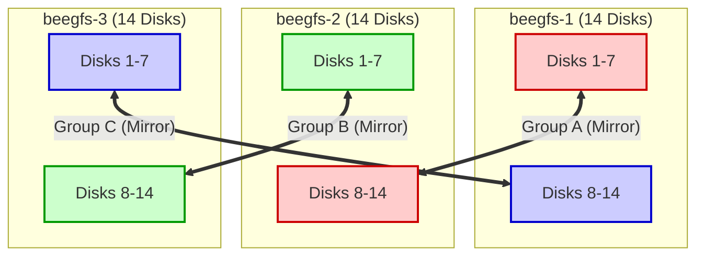
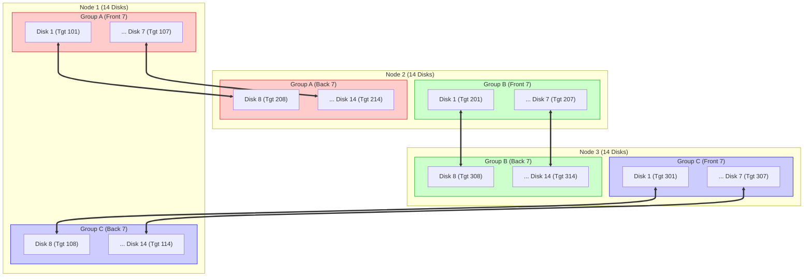
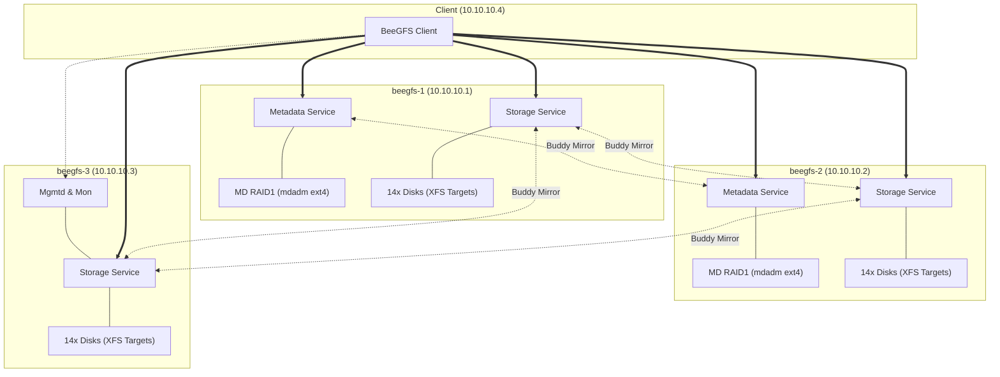
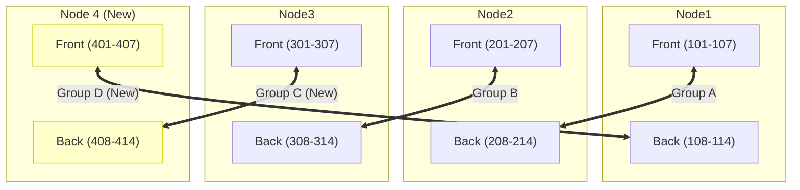
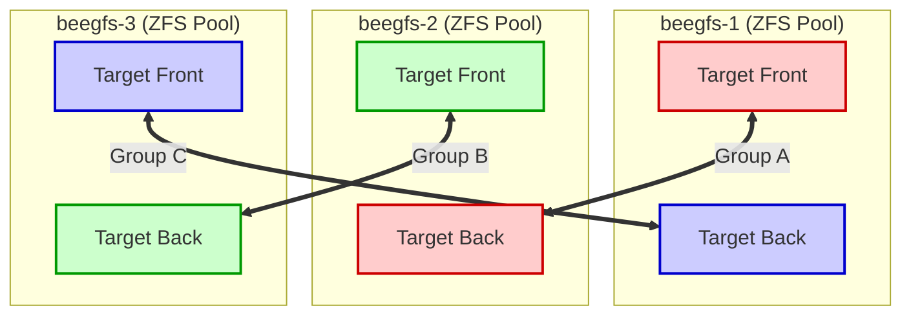
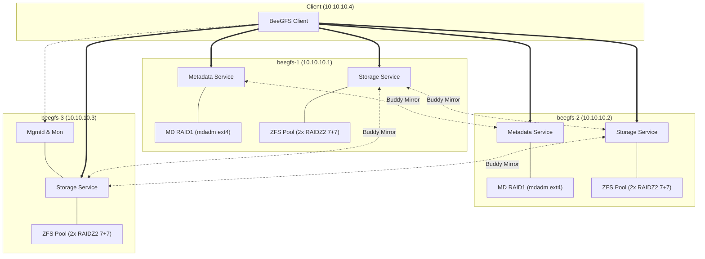
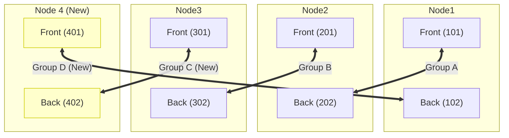
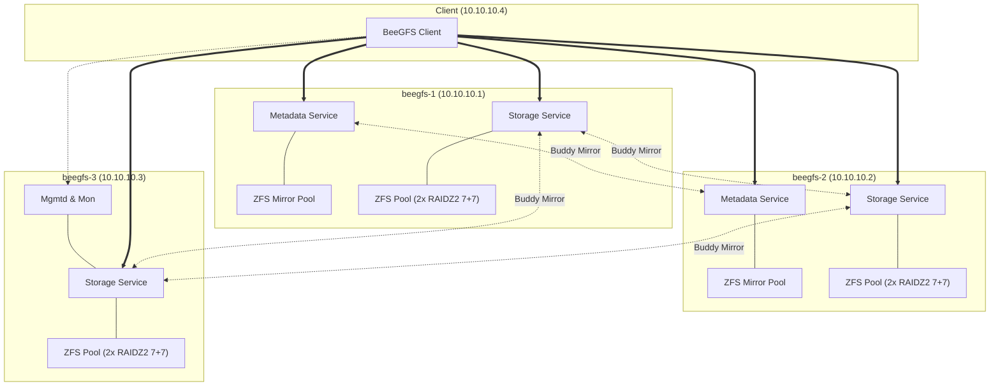

# BeeGFS存储架构设计

测试环境限制:
1. 测试环境基于pve虚拟化
2. 通过virtio虚拟出来的网卡有性能瓶颈

```
# iperf3 --client 10.10.10.1 --port 10000
Connecting to host 10.10.10.1, port 10000
[ 5] local 10.10.10.2 port 58022 connected to 10.10.10.1 port 10000
[ ID] Interval      Transfer   Bitrate     Retr Cwnd
[ 5]  0.00-1.00  sec 2.28 GBytes 19.6 Gbits/sec  0  2.75 MBytes
[ 5]  1.00-2.00  sec 1.91 GBytes 16.4 Gbits/sec  0  2.75 MBytes
[ 5]  2.00-3.00  sec 2.39 GBytes 20.5 Gbits/sec  0  2.93 MBytes
[ 5]  3.00-4.00  sec 2.38 GBytes 20.5 Gbits/sec  0  2.93 MBytes
[ 5]  4.00-5.00  sec 1.88 GBytes 16.2 Gbits/sec  0  2.93 MBytes
[ 5]  5.00-6.00  sec 2.03 GBytes 17.4 Gbits/sec  0  3.78 MBytes
[ 5]  6.00-7.00  sec 2.32 GBytes 19.9 Gbits/sec  0  3.78 MBytes
[ 5]  7.00-8.00  sec 2.28 GBytes 19.6 Gbits/sec  0  3.78 MBytes
[ 5]  8.00-9.00  sec 2.33 GBytes 20.0 Gbits/sec  0  3.78 MBytes
[ 5]  9.00-10.00 sec 2.34 GBytes 20.1 Gbits/sec  0  3.78 MBytes
- - - - - - - - - - - - - - - - - - - - - - - - -
[ ID] Interval      Transfer   Bitrate     Retr
[ 5]  0.00-10.00 sec 22.1 GBytes 19.0 Gbits/sec  0       sender
[ 5]  0.00-10.04 sec 22.1 GBytes 18.9 Gbits/sec         receiver

iperf Done.
```

## 物理环境
- 三台物理服务器, 每台规格 (16CPU, 50G Memory), 每台服务器有14块硬盘(NVME)用作存储, 有2块硬盘(NVME)考虑作为metadata, 操作系统RockyLinux9(操作系统需要的硬盘不需考虑)
- beegfs-1 和 beegfs-2 的metadata硬盘组建 buddy mirror
- 客户端, 规格(16CPU, 32G Memory), 操作系统RockyLinux8
```
beegfs-1 10.10.10.1     metadata, storage
beegfs-2 10.10.10.2     metadata, storage
beegfs-3 10.10.10.3     storage, mgmtd, mon
beegfs-client 10.10.10.4  client
```

## 命名规则
- 对于metadata服务, 其buddy mirror镜像groupid从1001开始
- 对于storage服务, 其buddy mirror镜像groupid从1开始
- 对于targetid, 比如101表示第一台storage服务的第一个磁盘, 201表示第二台storage服务的第一个磁盘


## 方案一
- metadata: 2块硬盘本地通过mdadm组建raid1, 格式化为ext4
- storage: 14块硬盘使用xfs格式化(每块硬盘一个tgn). 
  - **Buddy Mirror 策略 (三角交叉镜像)**: 为了实现单台服务器故障容错并保证负载均衡, 采用三角交叉分组方式:
    - **Group A**: Node1 前7块盘 (101-107) &lt;-&gt; Node2 后7块盘 (208-214)
    - **Group B**: Node2 前7块盘 (201-207) &lt;-&gt; Node3 后7块盘 (308-314)
    - **Group C**: Node3 前7块盘 (301-307) &lt;-&gt; Node1 后7块盘 (108-114)
  - 这种方式下, 任意一台服务器宕机(如Node1), 其数据由Node2(承载Group A)和Node3(承载Group C)共同分担, 避免单点过载.
  而且, 便于理解, 每台服务器左侧的7块盘是primary, 右侧的7块盘是secondary. 同时也方便扩容.


### Storage Buddy Mirroring Flow (Triangle Topology)



### Disk-Level Mirroring Detail



### 实施步骤 (Implementation Steps)

#### TLS
生成TLS证书时候需要注意 
```bash
# cat san.cnf
[ req ]
default_bits    = 2048
distinguished_name = req_distinguished_name
req_extensions   = req_ext
x509_extensions  = v3_ca # The extensions to add to the self signed cert
prompt	= no

[ req_distinguished_name ]
CN = beegfs-mgmt

[ req_ext ]
subjectAltName = @alt_names

[ v3_ca ]
subjectAltName = @alt_names

[ alt_names ]
DNS.1  = beegfs-mgmt
IP.1  = 10.10.10.3
openssl req -new -x509 -nodes -days 10000 -keyout /etc/beegfs/key.pem -out /etc/beegfs/cert.pem -config san.cnf

# -nodes 表示不加密私钥(服务启动不需要输密码)
```
#### Conn-Auth
所有节点使用同一个shared secret
```
cat /etc/beegfs/conn.auth
n6rBpcXVdpdA
```
#### Management service
```
/opt/beegfs/sbin/beegfs-mgmtd --init

--db-file <PATH>
Managements database file location. [default: /var/lib/beegfs/mgmtd.sqlite]
--config-file <PATH>
Loads additional configuration from the given file. [default = "/etc/beegfs/beegfs-mgmtd.toml"]

# 配置文件
grep -Ev "^$|\s*#" /etc/beegfs/beegfs-mgmtd.toml
ipv6-disable = true
 connection-limit = 24
 quota-enable = true
 quota-enforce = true
 quota-update-interval = 90
```

#### Metadata service
```bash
mdadm --create --verbose /dev/md0 --level=1 --raid-devices=2 /dev/vdb /dev/vdc
mdadm --detail /dev/md0
mkfs.ext4 -i 2048 -I 512 -J size=400 -Odir_index,large_dir,filetype /dev/md0
```

**Before metadata or storage mirroring can be enabled, buddy groups need to be defined**

配置 Metadata Buddy Mirror
在 Node1 和 Node2 上配置 Metadata 服务, 并开启 Buddy Mirror.

1. **准备 Metadata 存储**:
  -  **Node1**: 2块盘组建 RAID1 (mdadm), 挂载到 `/data/beegfs/meta`.
  -  **Node2**: 2块盘组建 RAID1 (mdadm), 挂载到 `/data/beegfs/meta`.

2. **初始化 Metadata 服务**:
  ```bash
  # Node1 (Meta ID 1)
  beegfs-setup-meta -p /data/beegfs/meta -s 1 -m 10.10.10.3
  
  # Node2 (Meta ID 2)
  beegfs-setup-meta -p /data/beegfs/meta -s 2 -m 10.10.10.3
  ```

3. **开启 Mirroring 功能**:
  在 `beegfs-mgmtd.conf` 中设置:
  ```ini
  storeMetaMirror = true
  ```
  重启 mgmtd 服务: `systemctl restart beegfs-mgmtd`

4. **创建 Metadata 镜像组**:
  使用 `beegfs-ctl` 将 Meta ID 1 和 Meta ID 2 结对:
  ```bash
  beegfs-ctl --addmirrorgroup --nodetype=meta --groupid=100 --primary=1 --secondary=2
  ```

#### Storage service

为实现上述三角交叉镜像 (Group A, B, C), 需要使用 `beegfs-ctl` 手动定义镜像组. 
假设 Target ID 分配如下:
- **Node1**: 101-114
- **Node2**: 201-214
- **Node3**: 301-314

 1. 定义 Group A (Node1 Front &lt;-&gt; Node2 Back)
将 Node1 的前7个 Target (101-107) 与 Node2 的后7个 Target (208-214) 结对:
```bash
beegfs-ctl --addmirrorgroup --groupid=1 --primary=101 --secondary=208
beegfs-ctl --addmirrorgroup --groupid=2 --primary=102 --secondary=209
# ... (依次执行 103-210 ... 106-213)
beegfs-ctl --addmirrorgroup --groupid=7 --primary=107 --secondary=214
```

#### 2. 定义 Group B (Node2 Front &lt;-&gt; Node3 Back)
将 Node2 的前7个 Target (201-207) 与 Node3 的后7个 Target (308-314) 结对:
```bash
beegfs-ctl --addmirrorgroup --groupid=8 --primary=201 --secondary=308
beegfs-ctl --addmirrorgroup --groupid=9 --primary=202 --secondary=309
# ... (依次执行 203-310 ... 206-313)
beegfs-ctl --addmirrorgroup --groupid=14 --primary=207 --secondary=314
```

#### 3. 定义 Group C (Node3 Front &lt;-&gt; Node1 Back)
将 Node3 的前7个 Target (301-307) 与 Node1 的后7个 Target (108-114) 结对:
```bash
beegfs-ctl --addmirrorgroup --groupid=15 --primary=301 --secondary=108
beegfs-ctl --addmirrorgroup --groupid=16 --primary=302 --secondary=109
# ... (依次执行 303-110 ... 306-113)
beegfs-ctl --addmirrorgroup --groupid=21 --primary=307 --secondary=114
```

### 架构图




### 扩容方案: 添加 Node4 (Expansion to 4 Nodes)

当需要扩容一台新服务器 (Node4) 时, 我们需要打破原有的三角循环 (Node1-Node2-Node3-Node1), 将 Node4 插入其中形成四角循环 (Square Topology).

**目标拓扑 (Ring/Square)**:
- **Group A** (保持不变): Node1 Front (101-107) &lt;-&gt; Node2 Back (208-214)
- **Group B** (保持不变): Node2 Front (201-207) &lt;-&gt; Node3 Back (308-314)
- **Group C** (修改): Node3 Front (301-307) &lt;-&gt; **Node4 Back (408-414)**
- **Group D** (新增): **Node4 Front (401-407)** &lt;-&gt; Node1 Back (108-114)

#### 1. 准备 Node4
假设 Node4 IP 为 10.10.10.5, 拥有14块盘, Target ID 规划为 401-414.
- **Node4 Front**: 401-407
- **Node4 Back**: 408-414

初始化 Node4 的 Storage Targets (略).

#### 2. 移除旧的 Group C (Node3 Front &lt;-&gt; Node1 Back)
首先需要移除 Node3 前7块盘与 Node1 后7块盘的镜像关系.
注意: 移除镜像组后, 对应的数据会失去冗余保护, 直到新镜像建立并同步完成.

```bash
# 查找 Group C 的 Group ID (假设为 15-21)
beegfs-ctl --removemirrorgroup --groupid=15
beegfs-ctl --removemirrorgroup --groupid=16
# ... (依次移除 303-110 ... 306-113)
beegfs-ctl --removemirrorgroup --groupid=21
```

#### 3. 建立新的 Group C (Node3 Front &lt;-&gt; Node4 Back)
将 Node3 的前7个 Target (301-307) 与 **Node4 的后7个 Target (408-414)** 结对.

```bash
beegfs-ctl --addmirrorgroup --groupid=15 --primary=301 --secondary=408
beegfs-ctl --addmirrorgroup --groupid=16 --primary=302 --secondary=409
# ...
beegfs-ctl --addmirrorgroup --groupid=21 --primary=307 --secondary=414
```

#### 4. 建立 Group D (Node4 Front &lt;-&gt; Node1 Back)
将 **Node4 的前7个 Target (401-407)** 与 Node1 的后7个 Target (108-114) 结对.

```bash
beegfs-ctl --addmirrorgroup --groupid=22 --primary=401 --secondary=108
beegfs-ctl --addmirrorgroup --groupid=23 --primary=402 --secondary=109
# ...
beegfs-ctl --addmirrorgroup --groupid=28 --primary=407 --secondary=114
```

#### 扩容后架构图 (4-Node Ring)



## 方案二
- metadata: 2块硬盘本地通过mdadm组建raid1, 格式化为ext4
- storage: 14块硬盘组建zfs (7+7, zfs raidz2).
  - **Buddy Mirror 策略 (逻辑Target三角镜像)**: 由于只有3台服务器, 若每台只提供1个Target, 无法组成闭环镜像. 因此需要**在ZFS Pool上创建2个不同的Dataset作为2个独立的BeeGFS Target (Front & Back)**.
  - **拓扑结构**:
    - **Group A**: Node1-Target Front &lt;-&gt; Node2-Target Back
    - **Group B**: Node2-Target Front &lt;-&gt; Node3-Target Back
    - **Group C**: Node3-Target Front &lt;-&gt; Node1-Target Back
  - 这种配置下, 任意一台服务器宕机, 剩余两台服务器均持有完整数据副本.


### Storage Buddy Mirroring Flow (Triangle Topology)




### 实施步骤 (Implementation Steps)

#### 0. 配置 Metadata Buddy Mirror
在 Node1 和 Node2 上配置 Metadata 服务, 并开启 Buddy Mirror.

1. **准备 Metadata 存储**:
  -  **Node1**: 2块盘组建 RAID1 (mdadm), 挂载到 `/beegfs/meta`.
  -  **Node2**: 2块盘组建 RAID1 (mdadm), 挂载到 `/beegfs/meta`.

2. **初始化 Metadata 服务**:
  ```bash
  # Node1 (Meta ID 1)
  beegfs-setup-meta -p /beegfs/meta -s 1 -m 1
  
  # Node2 (Meta ID 2)
  beegfs-setup-meta -p /beegfs/meta -s 2 -m 2
  ```

3. **开启 Mirroring 功能**:
  在 `beegfs-mgmtd.conf` 中设置:
  ```ini
  storeMetaMirror = true
  ```
  重启 mgmtd 服务: `systemctl restart beegfs-mgmtd`

4. **创建 Metadata 镜像组**:
  使用 `beegfs-ctl` 将 Meta ID 1 和 Meta ID 2 结对:
  ```bash
  beegfs-ctl --addmirrorgroup --nodetype=meta --groupid=100 --primary=1 --secondary=2
  ```

#### 1. 准备 ZFS Datasets (每台服务器)
在每台服务器的 ZFS Pool (假设名为 `tank`) 上创建两个 Dataset:
```bash
# On Node1, Node2, Node3
zfs create tank/target_front
zfs create tank/target_back
```

#### 2. 初始化 BeeGFS Targets
使用 `beegfs-setup-storage` 初始化这两个目录为独立的 Target. 
(注意: 需要分配不同的 Target ID, 建议规划如下: Node1[101,102], Node2[201,202], Node3[301,302])
- **Front Target IDs**: 101, 201, 301
- **Back Target IDs**: 102, 202, 302

```bash
# Node1
beegfs-setup-storage -p /tank/target_front -s 1 -i 101 ...
beegfs-setup-storage -p /tank/target_back -s 1 -i 102 ...

# Node2
beegfs-setup-storage -p /tank/target_front -s 2 -i 201 ...
beegfs-setup-storage -p /tank/target_back -s 2 -i 202 ...

# Node3
beegfs-setup-storage -p /tank/target_front -s 3 -i 301 ...
beegfs-setup-storage -p /tank/target_back -s 3 -i 302 ...
```

#### 3. 创建镜像组 (Triangle)
使用 `beegfs-ctl` 建立交叉镜像 (Front &lt;-&gt; Back):

```bash
# Group A: Node1-Front (101) &lt;-&gt; Node2-Back (202)
beegfs-ctl --addmirrorgroup --groupid=1 --primary=101 --secondary=202

# Group B: Node2-Front (201) &lt;-&gt; Node3-Back (302)
beegfs-ctl --addmirrorgroup --groupid=2 --primary=201 --secondary=302

# Group C: Node3-Front (301) &lt;-&gt; Node1-Back (102)
beegfs-ctl --addmirrorgroup --groupid=3 --primary=301 --secondary=102
```

### 架构图




### 扩容方案: 添加 Node4 (Expansion to 4 Nodes)

与方案一类似, 扩容时需要打破原有的三角循环, 将 Node4 插入其中形成四角循环.

**目标拓扑 (Ring/Square)**:
- **Group A** (保持不变): Node1 Front &lt;-&gt; Node2 Back
- **Group B** (保持不变): Node2 Front &lt;-&gt; Node3 Back
- **Group C** (修改): Node3 Front &lt;-&gt; **Node4 Back**
- **Group D** (新增): **Node4 Front** &lt;-&gt; Node1 Back

#### 1. 准备 Node4
假设 Node4 IP 为 10.10.10.5, 配置 ZFS Pool `tank`.
- 创建 Datasets: `tank/target_front`, `tank/target_back`
- 初始化 Targets: Front (401), Back (402)

#### 2. 移除旧的 Group C (Node3 Front &lt;-&gt; Node1 Back)
```bash
# 查找 Group C 的 Group ID (假设为 3)
beegfs-ctl --removemirrorgroup --groupid=3
```

#### 3. 建立新的 Group C (Node3 Front &lt;-&gt; Node4 Back)
将 Node3 的 Front Target (301) 与 **Node4 的 Back Target (402)** 结对.

```bash
beegfs-ctl --addmirrorgroup --groupid=3 --primary=301 --secondary=402
```

#### 4. 建立 Group D (Node4 Front &lt;-&gt; Node1 Back)
将 **Node4 的 Front Target (401)** 与 Node1 的 Back Target (102) 结对.

```bash
beegfs-ctl --addmirrorgroup --groupid=4 --primary=401 --secondary=102
```

#### 扩容后架构图 (4-Node Ring)



## 方案三
- metadata: 2块硬盘本地组建zfs raid1
- storage: 14块硬盘组建zfs(7+7, zfs raidz2).
  - **Buddy Mirror 策略 (逻辑Target三角镜像)**: 与方案二相同, 需要**在ZFS Pool上创建2个不同的Dataset作为2个独立的BeeGFS Target (Front & Back)**.
  - **拓扑结构**:
    - **Group A**: Node1-Target Front &lt;-&gt; Node2-Target Back
    - **Group B**: Node2-Target Front &lt;-&gt; Node3-Target Back
    - **Group C**: Node3-Target Front &lt;-&gt; Node1-Target Back
  - 这种配置下, 任意一台服务器宕机, 剩余两台服务器均持有完整数据副本.


### Storage Buddy Mirroring Flow (Triangle Topology)


### 实施步骤 (Implementation Steps)


#### 0. 准备 Metadata (ZFS Mirror + BeeGFS Buddy Mirror)
在 Node1 和 Node2 上使用 ZFS Mirror 承载 Metadata, 并开启 BeeGFS Buddy Mirror.

1. **创建 ZFS Metadata Pool**:
  在 Node1 和 Node2 上, 使用2块专用硬盘组建 ZFS Mirror Pool (假设盘符为 /dev/sdX, /dev/sdY):
  ```bash
  # On Node1 & Node2
  zpool create -f beegfs_meta mirror /dev/sdX /dev/sdY
  zfs create beegfs_meta/meta
  ```

2. **初始化 Metadata Service**:
  ```bash
  # On Node1 (Meta ID 1)
  beegfs-setup-meta -p /beegfs_meta/meta -s 1 -m 1
  
  # On Node2 (Meta ID 2)
  beegfs-setup-meta -p /beegfs_meta/meta -s 2 -m 2
  ```

3. **开启 Mirroring 功能**:
  在 `beegfs-mgmtd.conf` 中设置:
  ```ini
  storeMetaMirror = true
  ```
  重启 mgmtd 服务: `systemctl restart beegfs-mgmtd`

4. **创建 Metadata 镜像组**:
  使用 `beegfs-ctl` 将 Meta ID 1 和 Meta ID 2 结对:
  ```bash
  beegfs-ctl --addmirrorgroup --nodetype=meta --groupid=100 --primary=1 --secondary=2
  ```

#### 1. 准备 ZFS Datasets (每台服务器)
在每台服务器的 ZFS Pool (假设名为 `tank`) 上创建两个 Dataset:
```bash
# On Node1, Node2, Node3
zfs create tank/target_front
zfs create tank/target_back
```

#### 2. 初始化 BeeGFS Targets
使用 `beegfs-setup-storage` 初始化这两个目录为独立的 Target. 
(注意: 需要分配不同的 Target ID, 建议规划如下: Node1[101,102], Node2[201,202], Node3[301,302])
- **Front Target IDs**: 101, 201, 301
- **Back Target IDs**: 102, 202, 302

```bash
# Node1
beegfs-setup-storage -p /tank/target_front -s 1 -i 101 ...
beegfs-setup-storage -p /tank/target_back -s 1 -i 102 ...

# Node2
beegfs-setup-storage -p /tank/target_front -s 2 -i 201 ...
beegfs-setup-storage -p /tank/target_back -s 2 -i 202 ...

# Node3
beegfs-setup-storage -p /tank/target_front -s 3 -i 301 ...
beegfs-setup-storage -p /tank/target_back -s 3 -i 302 ...
```

#### 3. 创建镜像组 (Triangle)
使用 `beegfs-ctl` 建立交叉镜像 (Front &lt;-&gt; Back):

```bash
# Group A: Node1-Front (101) &lt;-&gt; Node2-Back (202)
beegfs-ctl --addmirrorgroup --groupid=1 --primary=101 --secondary=202

# Group B: Node2-Front (201) &lt;-&gt; Node3-Back (302)
beegfs-ctl --addmirrorgroup --groupid=2 --primary=201 --secondary=302

# Group C: Node3-Front (301) &lt;-&gt; Node1-Back (102)
beegfs-ctl --addmirrorgroup --groupid=3 --primary=301 --secondary=102
```

### 架构图




### 扩容方案: 添加 Node4 (Expansion to 4 Nodes)

与方案二完全相同, 扩容时需要打破原有的三角循环, 将 Node4 插入其中形成四角循环.

**目标拓扑 (Ring/Square)**:
- **Group A** (保持不变): Node1 Front &lt;-&gt; Node2 Back
- **Group B** (保持不变): Node2 Front &lt;-&gt; Node3 Back
- **Group C** (修改): Node3 Front &lt;-&gt; **Node4 Back**
- **Group D** (新增): **Node4 Front** &lt;-&gt; Node1 Back

#### 1. 准备 Node4
假设 Node4 IP 为 10.10.10.5, 配置 ZFS Pool `tank`.
- 创建 Datasets: `tank/target_front`, `tank/target_back`
- 初始化 Targets: Front (401), Back (402)

#### 2. 移除旧的 Group C (Node3 Front &lt;-&gt; Node1 Back)
```bash
# 查找 Group C 的 Group ID (假设为 3)
beegfs-ctl --removemirrorgroup --groupid=3
```

#### 3. 建立新的 Group C (Node3 Front &lt;-&gt; Node4 Back)
将 Node3 的 Front Target (301) 与 **Node4 的 Back Target (402)** 结对.

```bash
beegfs-ctl --addmirrorgroup --groupid=3 --primary=301 --secondary=402
```

#### 4. 建立 Group D (Node4 Front &lt;-&gt; Node1 Back)
将 **Node4 的 Front Target (401)** 与 Node1 的 Back Target (102) 结对.

```bash
beegfs-ctl --addmirrorgroup --groupid=4 --primary=401 --secondary=102
```

#### 扩容后架构图 (4-Node Ring)


## Kernel Tuning
### Metadata Node Tuning
```bash
vm.dirty_background_ratio = 5
vm.dirty_ratio = 10
vm.swappiness = 2
vm.zone_reclaim_mode = 1
vm.vfs_cache_pressure = 50
vm.min_free_kbytes = 6291456

kernel.mm.transparent_hugepage = always
kernel.mm.transparent_hugepage_defrag = always


```

### Storage Node Tuning

### Client Tuning

### Network Tuning

### ZFS Tuning


## Hive Index